# Rocks

---

## Rocks

## Click on image to enlarge

---

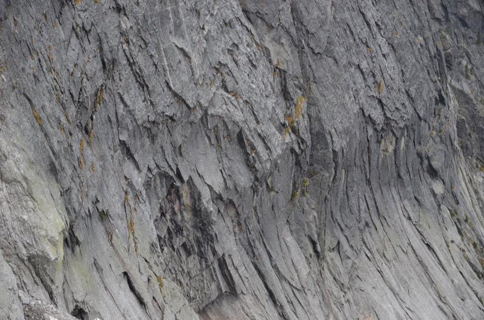{: data-src=" data-title="ROCK FACE OF NORTH TWIN, A.S. IMAGE BY CHRIS H." }

"

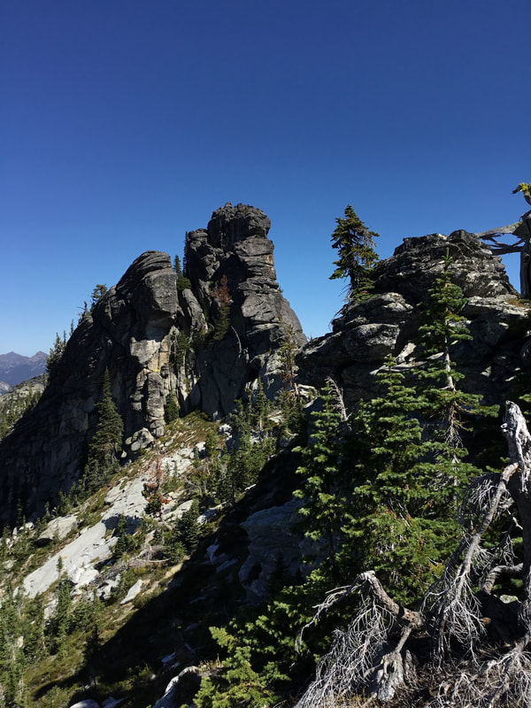{: data-src=" data-title="ODD ROCKS ALONG THE WIGWAMS TRAIL AMERICAN SELKIRKS" }

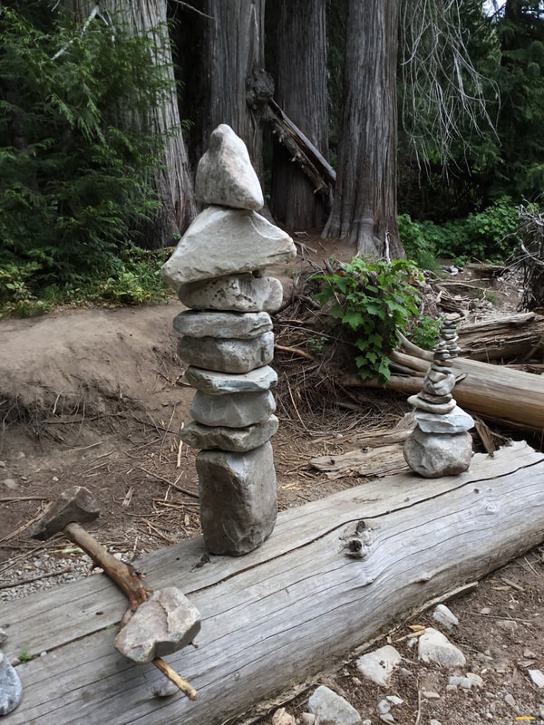"

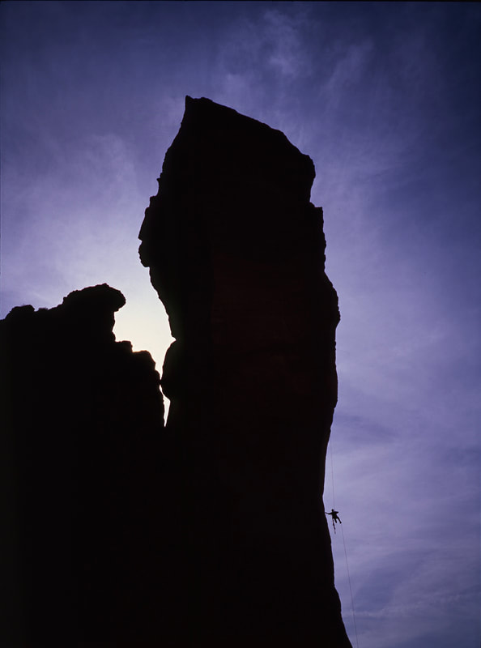{: data-src=" data-title="THIS IS MONKEY FACE IN THE SMITH ROCKS CLIMBING AREA, OREGON" }

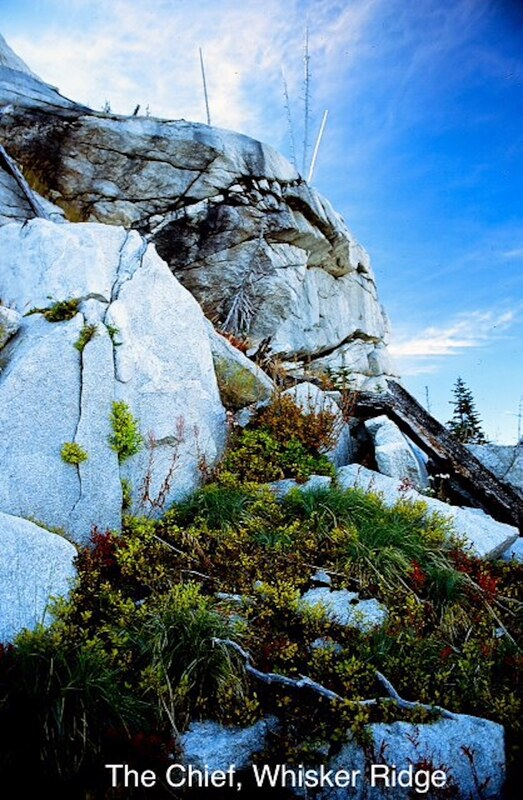"

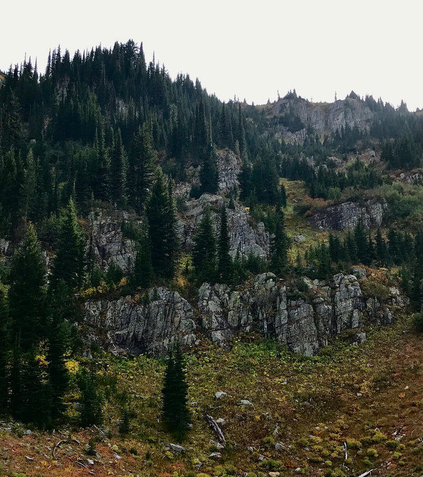{: data-src="assets/images/12262021350p_orig.jpeg" data-title="EAST-WEST WILLOW RIDGE NORTH OF STEVENS PEAK, FROM THE UPPER SANCTUARY. AT LONE LAKE" }

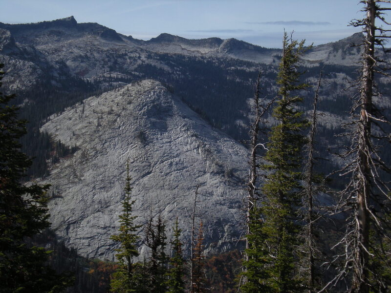"

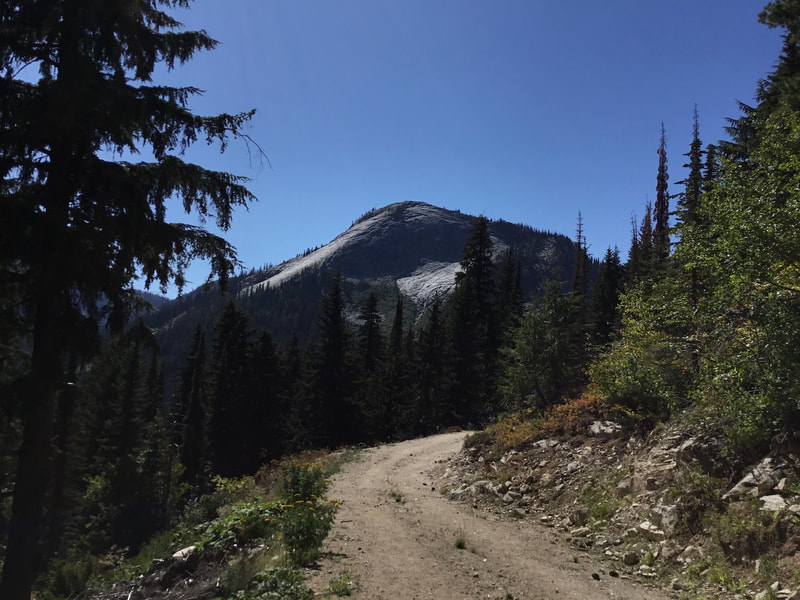{: data-src=" data-title="THIS IS THE MYRTLE'S TURTLE DOME ABOVE UPPER TWO MOUTH LAKE.  A.S." }

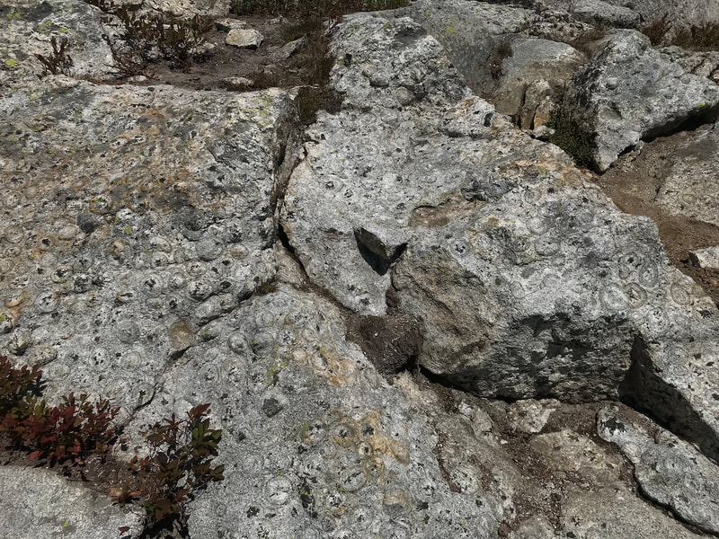"

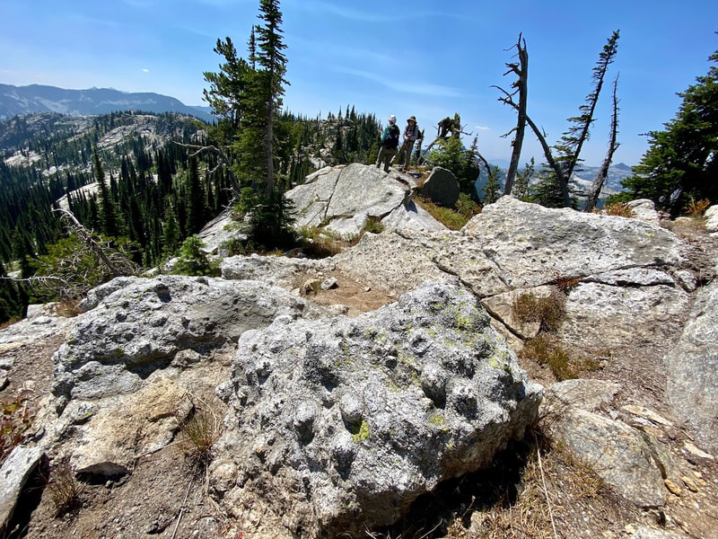{: data-src=" data-title="GNARLED GRANITE ROCK ALONG THE TRAIL ABOVE BALL LAKES.   A.S." }

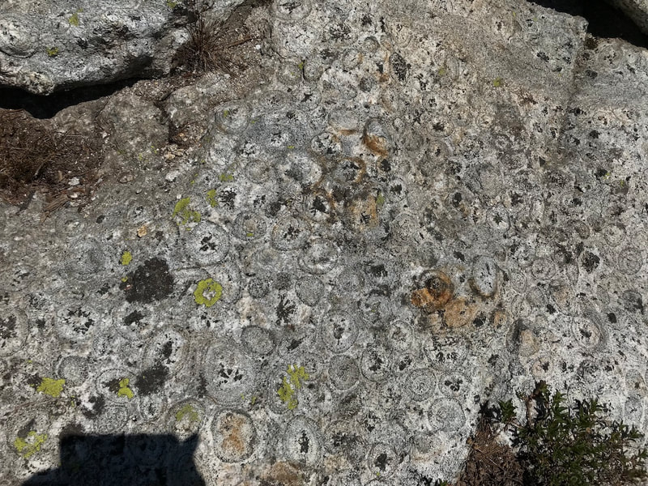"

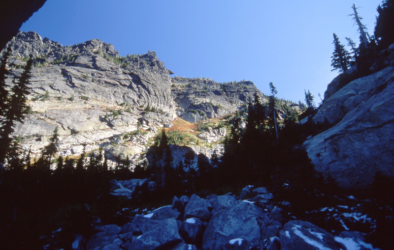{: data-src=" data-title="BENT ROCKS, HUNT LAKE, AMERICAN SELKIRKS" }

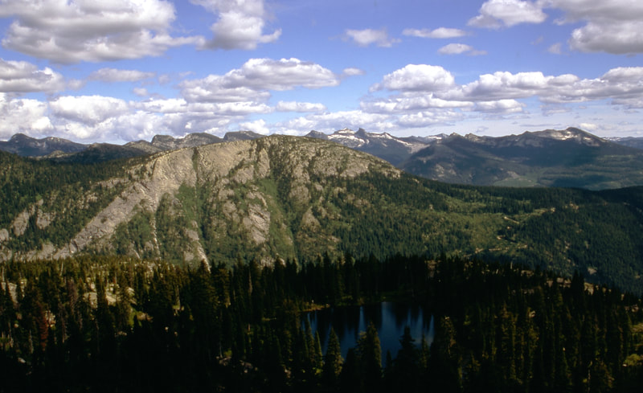"

"

"
AND BEEHIVE LAKE (R)  A. SELKIRKS")

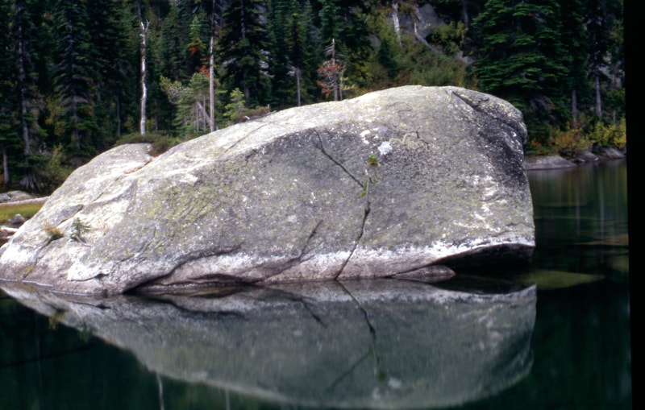"

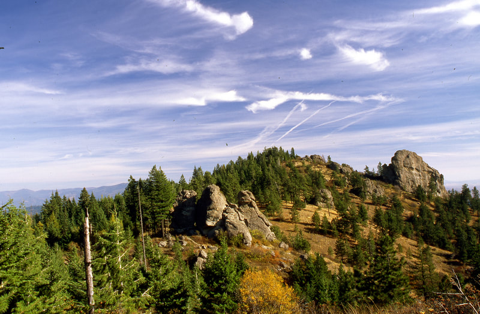{: data-src=" data-title="BIG ROCK AT THE DISHMAN HILLS CONSERVANCY THE BLACK DOTS IN THE SKY ARE RAVENS" }

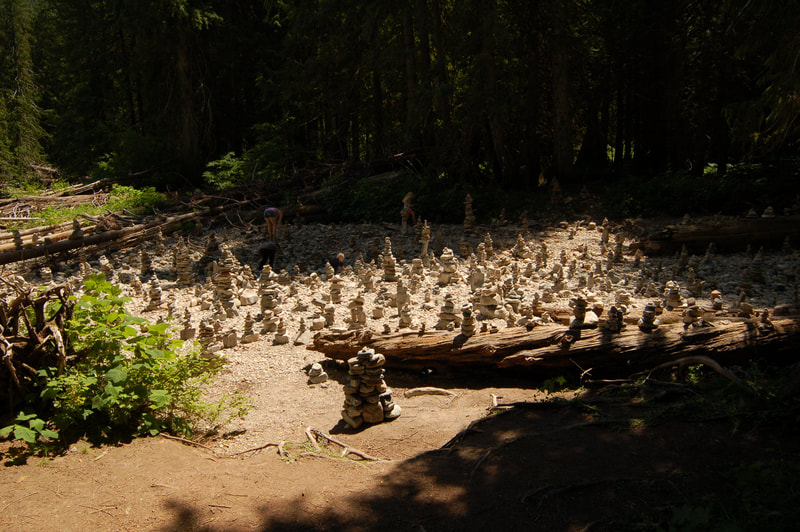"

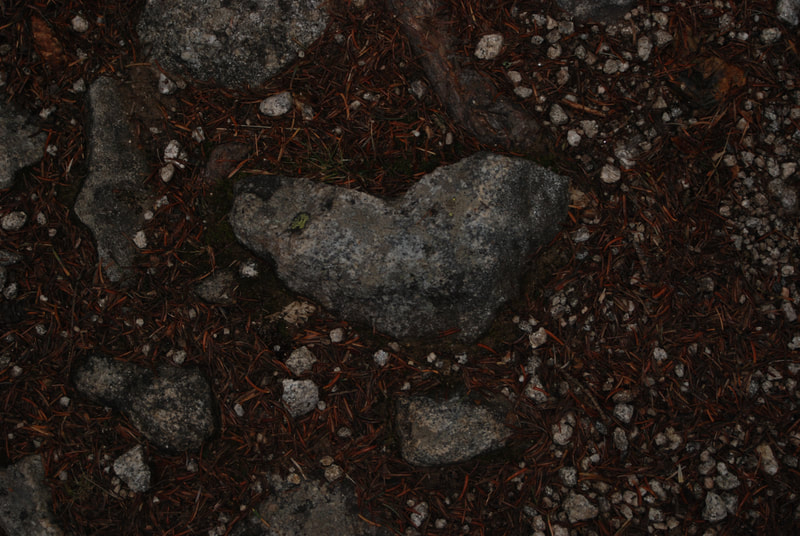{: data-src=" data-title="SOME ROCKS ARE HEART SHAPED" }

## Orbicular rock

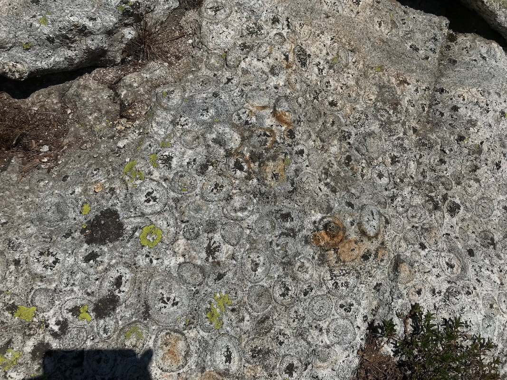

On an exploratory hike i lead in the american selkirks, above ball lakes, fellow hiker darcy verona came across a rock that none of us had ever seen before. i took these images and did research on them. It turns out this is an orbicular rock or orbiculite.it is a rare rock formation, found in slightly more then 100 places world wide. I CONTACTED THE U.S.G.S. IN SPOKANE, AND A STEVEN BOX, PhD RESEARCH GEOLOGIST, VERIFIED THAT THIS IS ORBICULAR ROCK. STEVE SENT ME SOME TECHNICAL PAPERS ON THE ROCK, AND SAID IT IS VERY RARE. THE CLOSEST PLACE TO SEE THIS ROCK IS IN NEVADA
