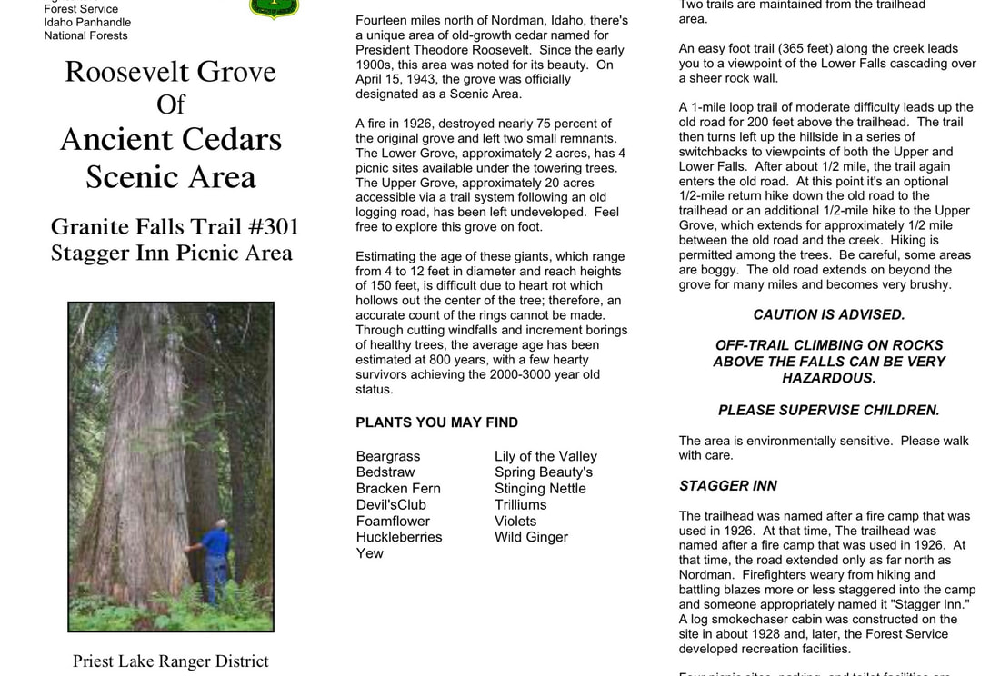
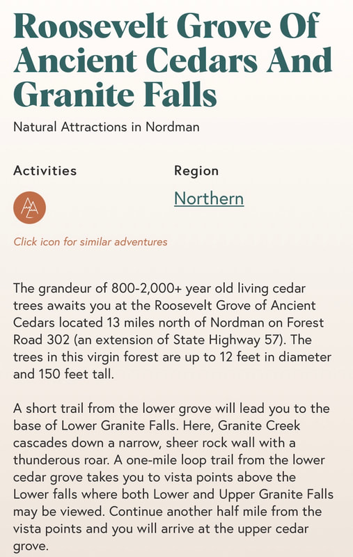

---
tags:
- Trails & Scrambles
- Easy
- Day Hiking
- Photography
stats:
- label: Event Type
  icon: hiking
  value: Day hiking, and photography
- label: Distance
  icon: map-marker-distance
  value: 2.5 Miles RT
- label: Elevation
  icon: terrain
  value: 300 verts
- label: Difficulty
  icon: speedometer
  value: easy
- label: Maps
  icon: map
  value: Kanicsu N.F.
- label: GPS
  icon: crosshairs-gps
  value: 48°45;99"n 1117°03"74"w
- label: Managing Agency
  icon: domain
  value: Priest River R.D. 208.443.2512
- label: Bonner County Sheriff
  icon: shield-account
  value: 208.263.8417
---

# Roosevelt Grove Of Ancient Cedars

## Description

Fourteen miles north of Nordman, Idaho, there's a unique area of old-growth cedar named for President Theodore Roosevelt. Since the early 1900s, this area was noted for its beauty. On April 15, 1943, the grove was officially designated as a Scenic Area.
A fire in 1926, destroyed nearly 75 percent of the original grove and left two small remnants. The Lower Grove, approximately 2 acres, has 4 picnic sites available under the towering trees. The Upper Grove, approximately 20 acres accessible via a trail system following an old logging road, has been left undeveloped. Feel free to explore this grove on foot.
Estimating the age of these giants, which range from 4 to 12 feet in diameter and reach heights of 150 feet, is difficult due to heart rot which hollows out the center of the tree; therefore, an accurate count of the rings cannot be made. Through cutting windfalls and increment borings of healthy trees, the average age has been estimated at 800 years, with a few hearty survivors achieving the 2000-3000 year old status.

## Option #1

Granite Falls Trail #308

An easy foot trail (365 feet) along the creek leads you to a viewpoint of the Lower Falls cascading over a sheer rock wall.Ancient Cedars Scenic Area
A fire in 1926, destroyed nearly 75 percent of the original grove and left two small remnants. The Lower Grove, approximately 2 acres, has 4 picnic sites available under the towering trees. The Upper Grove, approximately 20 acres accessible via a trail system following an old logging road, has been left undeveloped. Feel free to explore this grove on foot.
A 1-mile loop trail of moderate difficulty leads up the old road for 200 feet above the trailhead. The trail then turns left up the hillside in a series of switchbacks to viewpoints of both the Upper and Lower Falls. After about 1/2 mile, the trail again enters the old road. At this point it's an optional 1/2-mile return hike down the old road to the trailhead or an additional 1/2-mile hike to the Upper Grove, which extends for approximately 1/2 mile between the old road and the creek. Hiking is permitted among the trees. Be careful, some areas are boggy. The old road extends on beyond the grove for many miles and becomes very brushy.

## Option #2

Granite Falls Trail #301 Stagger Inn Picnic Area

Estimating the age of these giants, which range from 4 to 12 feet in diameter and reach heights of 150 feet, is difficult due to heart rot which hollows out the center of the tree; therefore, an accurate count of the rings cannot be made. Through cutting windfalls and increment borings of healthy trees, the average age has been estimated at 800 years, with a few hearty survivors achieving the 2000-3000 year old status.
Priest Lake Ranger District
Four picnic sites, parking, and toilet facilities are available at the trailhead.
Fourteen miles north of Nordman, Idaho, there's a unique area of old-growth cedar named for President Theodore Roosevelt. Since the early 1900s, this area was noted for its beauty. On April 15, 1943, the grove was officially designated as a Scenic Area.
Two trails are maintained from the trailhead area.

## Directions

From Priest River, drive north on Hwy 57 to the Dickensheet Junction at the south end of Priest Lake. Bear left staying on Hwy 57 to Nordman .
At Nordman, continue north on Road 302 for 14 miles to Granite Falls & Roosevelt Grove of Ancient Cedars.

## Cool things close by

The Stagger Inn, Salmo-Priest Wilderness, Gypsy Peak on the Crowell Ridge.
Sullivan Lake, Hall Mountain, Lower & Upper Priest Lakes, Blacktail Mountain, The Mollies & Phoebes Tip, the Hughes Ridge, and the Gardner Cave at Crawford State Park.

## Hazards

The trail to and in the R.G.A.C. is relatively easy, but watch out for slippery roots.
if you visit Granite Falls, BE EXTRA CAREFUL ANYWHERE AROUND THE FALLS, ITS OVERLOOK AND ASSOCIATED TRAILS.

## R & P

Burger Express, Stagger Inn

## Photo gallery

*Picture (Image missing)*

Roosevelt grove of ancient cedars scenic area

Granite falls trail #301

Roosevelt Grove Of
An easy foot trail (365 feet) along the creek leads you to a viewpoint of the Lower Falls cascading over a sheer rock wall.
Ancient Cedars Scenic Area
A fire in 1926, destroyed nearly 75 percent of the original grove and left two small remnants. The Lower Grove, approximately 2 acres, has 4 picnic sites available under the towering trees. The Upper Grove, approximately 20 acres accessible via a trail system following an old logging road, has been left undeveloped. Feel free to explore this grove on foot.
A 1-mile loop trail of moderate difficulty leads up the old road for 200 feet above the trailhead. The trail then turns left up the hillside in a series of switchbacks to viewpoints of both the Upper and Lower Falls. After about 1/2 mile, the trail again enters the old road. At this point it's an optional 1/2-mile return hike down the old road to the trailhead or an additional 1/2-mile hike to the Upper Grove, which extends for approximately 1/2 mile between the old road and the creek. Hiking is permitted among the trees. Be careful, some areas are boggy. The old road extends on beyond the grove for many miles and becomes very brushy.
Granite Falls Trail #301 Stagger Inn Picnic Area

Estimating the age of these giants, which range from 4 to 12 feet in diameter and reach heights of 150 feet, is difficult due to heart rot which hollows out the center of the tree; therefore, an accurate count of the rings cannot be made. Through cutting windfalls and increment borings of healthy trees, the average age has been estimated at 800 years, with a few hearty survivors achieving the 2000-3000 year old status.
Priest Lake Ranger District
Four picnic sites, parking, and toilet facilities are available at the trailhead.
Fourteen miles north of Nordman, Idaho, there's a unique area of old-growth cedar named for President Theodore Roosevelt. Since the early 1900s, this area was noted for its beauty. On April 15, 1943, the grove was officially designated as a Scenic Area.
Two trails are maintained from the trailhead area.

## No images yet. to contribute, contact chic
