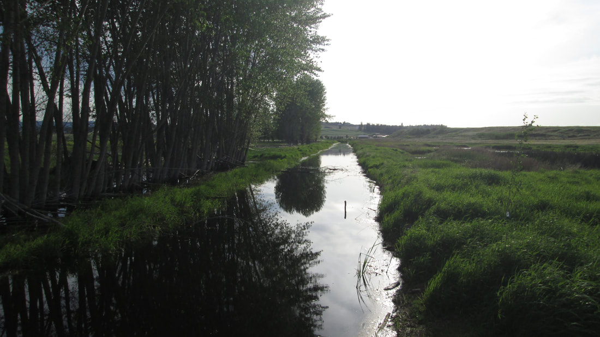
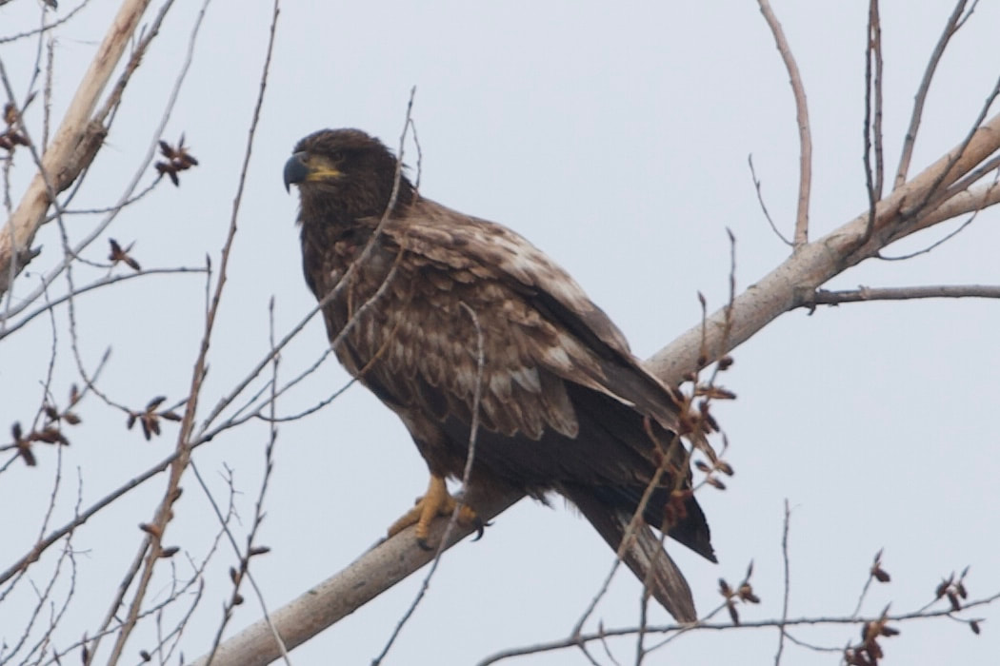
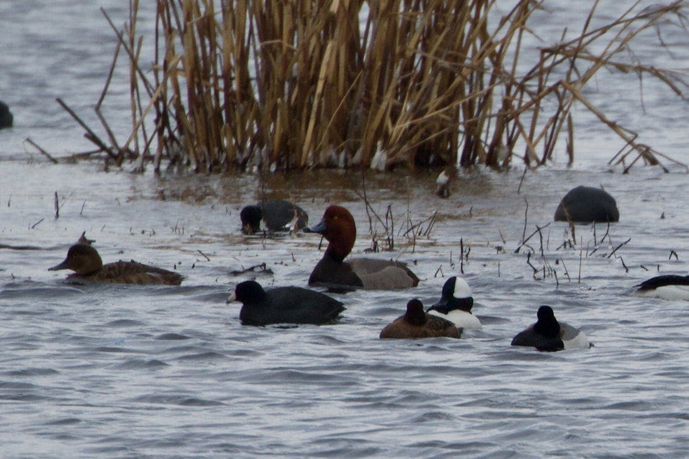
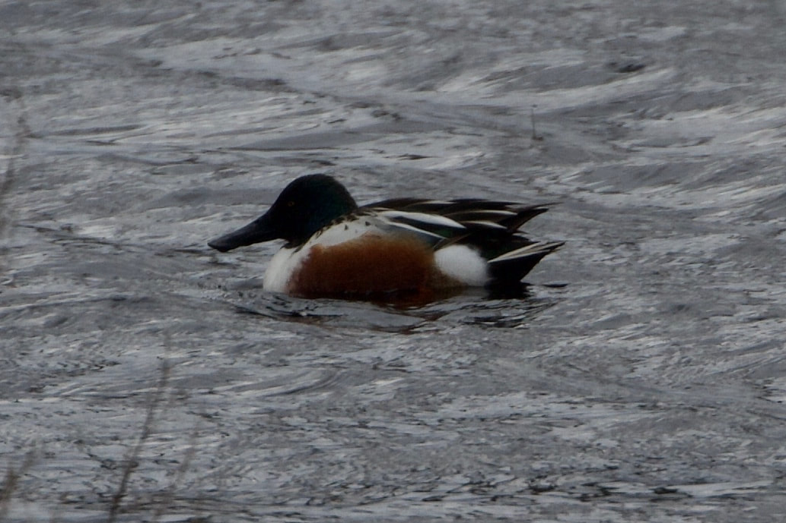
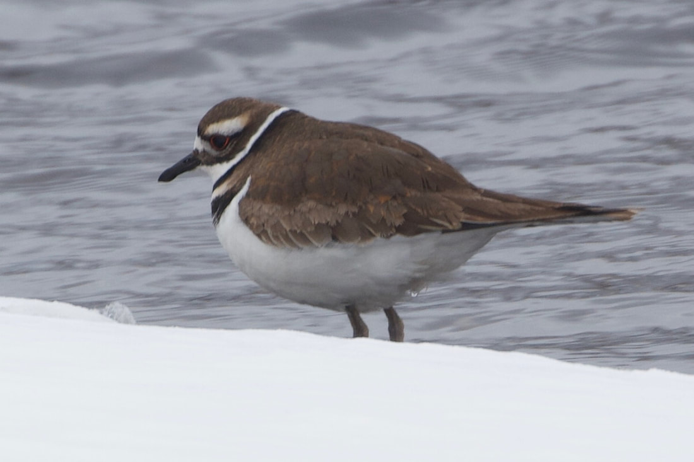
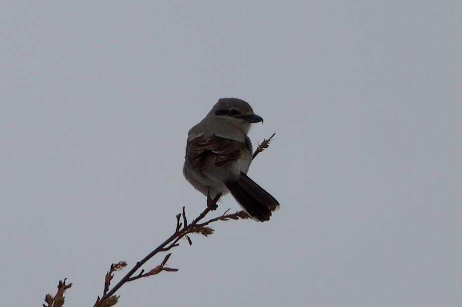

---
tags:
- Trails & Scrambles
- Easy
- Walking
- Birding
- Cross-country Skiing
- Snow-shoeing
stats:
- label: Event Type
  icon: hiking
  value: Walking, Birding, Cross-country skiing and Snow-shoeing
- label: Distance
  icon: map-marker-distance
  value: 1.5 miles
- label: Elevation
  icon: terrain
  value: Minimal gain at 2032’ elevation.
- label: Difficulty
  icon: speedometer
  value: Easy
- label: Maps
  icon: map
  value: '[Saltese Flats Open Trails](https://www.spokanecounty.org/DocumentCenter/View/33110/May2020_OpenTrail)'
- label: GPS
  icon: crosshairs-gps
  value: 47° 38’ 26.2"n 117° 07’ 34.3"w
- label: Spokane County Parks
  icon: information-outline
  value: 509.456.4730
- label: Spokane County Sheriff
  icon: shield-account
  value: CALL 911 FIRST or 509.477.2240
---

# Saltese Flats Wetland Trail

## Description

Spokane county partially opened the trail in May 2020. It is a raised bed of crush rock so it is high and
dry. It meanders through the wetlands with remarkable views of Mica Peak and the Saltese Uplands. Many
species of migratory birds stop here to refuel. The trail is dead flat so it does not get any easier than
that.

## Directions

Access to the trail is from Henry Road at the northeast corner of the site. The best parking is about a half
mile north at the Saltese Upland Conservation Area Trailhead.

## Cool things close by

Saltese Uplands, Mica Peak, and Liberty Lake.

## Hazards

None

## R & P

Snow Eater Brewery, Trailbreaker Cider, Liberty Lake County Park

---

## Plan your trip

Click for Current NOAA Weather Conditions

## Photo gallery

### Picture (Image missing)

## Trail head parking lot

---

### Picture (Image missing) Details

## The start of the raised gravel trail looking south

---

## Saltese creek

---

<!-- Missing Image: <!-- Missing Image: [*Picture (Image missing)*](assets/images/img-5771.jpg) --> -->

## Looking back toward the trail head and parking lot

---

### Picture (Image missing) Details (2)

## Looking from the south end of the trial north to the trail head

---

### Picture (Image missing) Details (3)

## The end of the trial looking south

---

## Birding - uplands and wetland on 16-april-2022

### Picture (Image missing) Details (4)

## Overlooking the flat land from the uplands

---

### Picture (Image missing) Details (5)

## Northern shoveler and ring-necked ducks

---

## Bald eagle juvenile (1st year)

---

### Picture (Image missing) Details (6)

## Bald eagles (1st and 3rd year)

---

## Canvasback and bufflehead

---

## Northern shoveler

---

### Picture (Image missing) Details (7)

## Black-necked stilt

---

## Killdeer

---

### Picture (Image missing) Details (8)

## Savannah sparrow

---

## Northern shrike

---

### Picture (Image missing) Details (9)

## Say's phoebe

---

### Picture (Image missing) Details (10)

## Mountain blue bird

---

### Picture (Image missing) Details (11)

## Western meadowlark
