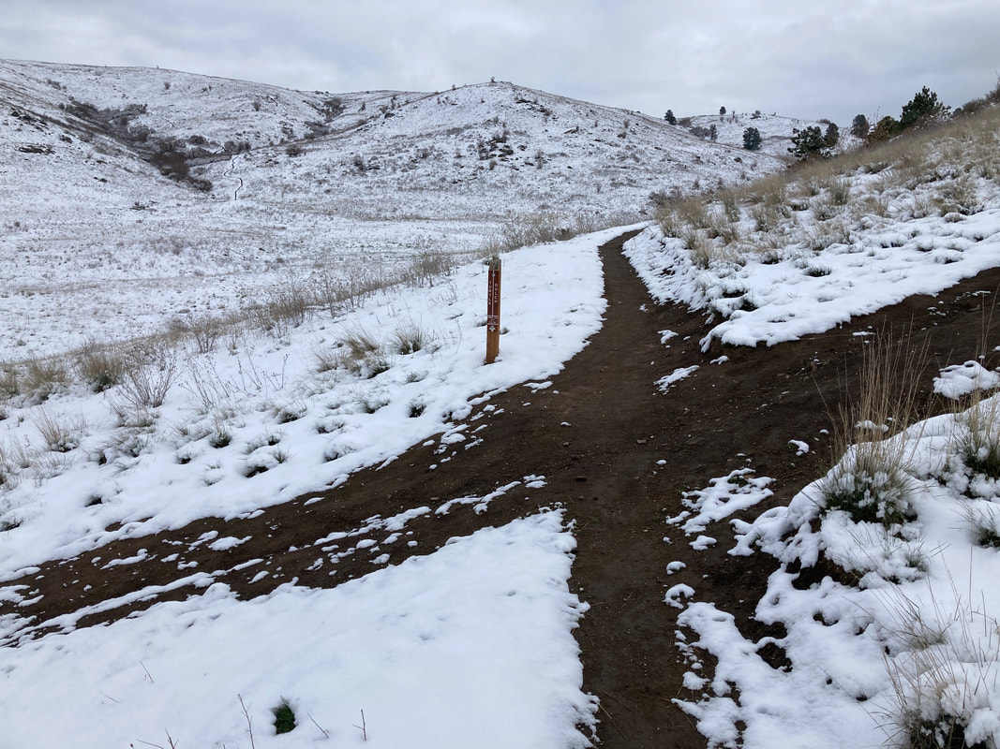
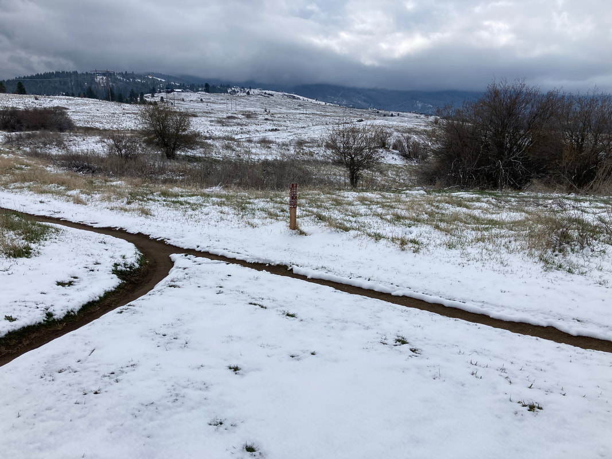

# Saltese Highlands Summit Loop

## Saltese highlands summit loop (2)

---

trailforks widget start[Saltese Uplands Loop to Summit

Loop](https://www.trailforks.com/route/saltese-uplands-loop-to-summit-loop/) on
[Trailforks.com](https://www.trailforks.com/)

trailforks widget end

The Saltese Highlands conservation area is a great place to ride in the spring and fall because it faces
west into the sun so it is too hot to ride out there in the middle of summer. This route takes you to the
summit on the less steep leg and then descent the steeper one. This is not a real long bike ride so more
than one lap may be called for.

## Photo gallery

---

### Picture (Image missing)

## Overlooking the saltese weland area

---

## Turtle gulch and uplands loop junction

---

### Picture (Image missing) Details

## Mountain blue bird

---

## Uplands loop and summit loop junction
