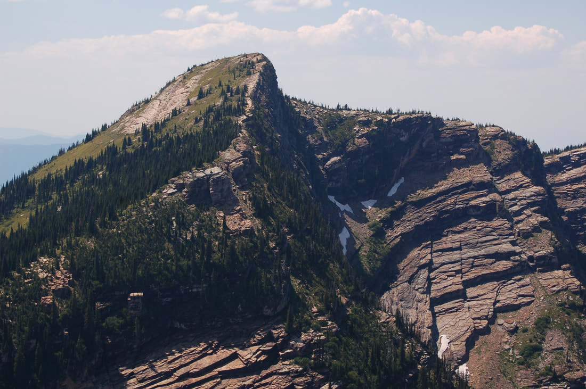
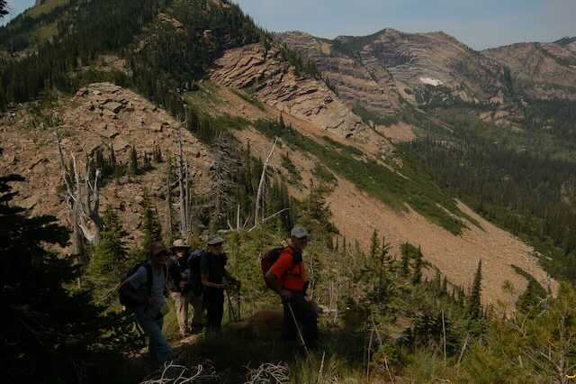
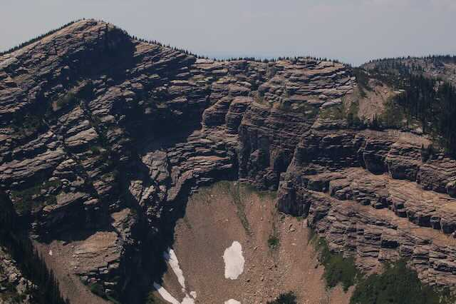
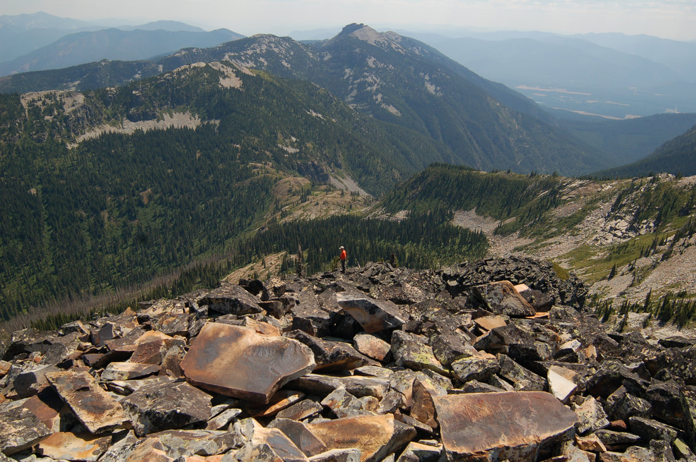
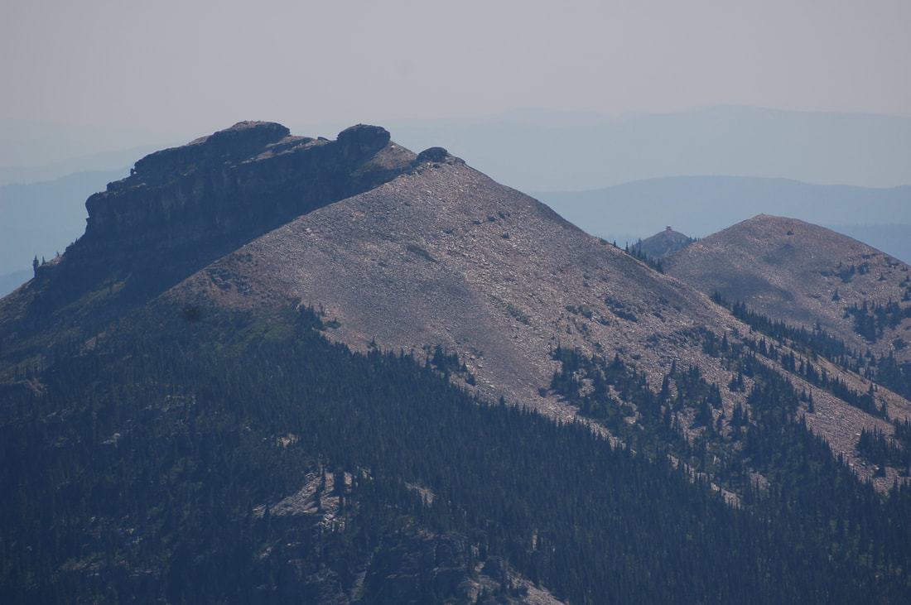
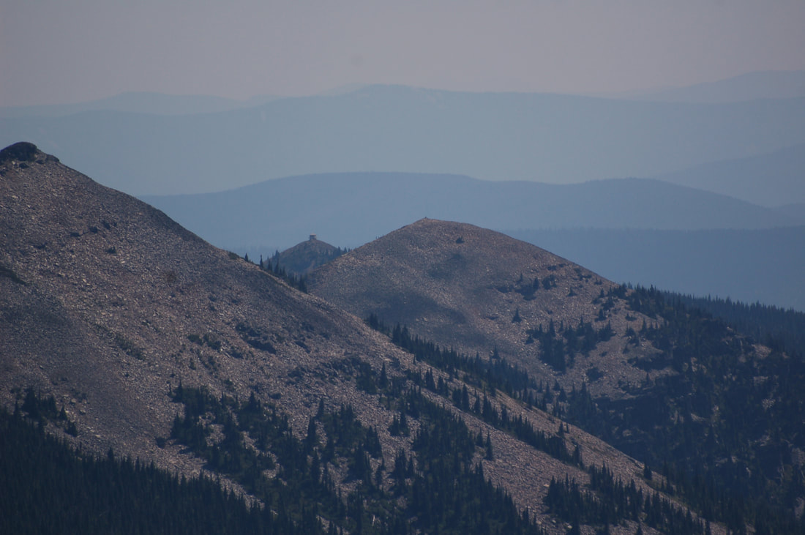

---
tags:
- Peaks & Mountains
- Strenuous
- Day Hiking
- Backpacking
- Scrambling
stats:
- label: Event Type
  icon: hiking
  value: Day hiking, backpacking, scrambling
- label: Distance
  icon: map-marker-distance
  value: 18 miles RT
- label: Elevation Gain
  icon: elevation-rise
  value: 2263 verts
- label: Difficulty
  icon: speedometer
  value: Strenuous
- label: Maps
  icon: map
  value: Kootenai N.F., Heron & Sawtooth topos
- label: GPS
  icon: crosshairs-gps
  value: 48°16’38"n 115°97’78"w
- label: Ranger District
  icon: pine-tree
  value: Three Rivers R.D. 406.295.4693
- label: Lincoln County Sheriff
  icon: shield-account
  value: CALL 911 FIRST or 406.293.4112
notes:
- Kootenai national forest/alerts<https://www.fs.usda.gov/alerts/kootenai/alerts-notices>
---

# Sawtooth Mountain

*Sawtooth mountain 6758’*

## Description

We have added the areas sheriff’s emergency phone numbers for each trip write up under the ranger district info. if an emergency ocurrs, evaluate your circumstances and call only if needed.
To get a preview of Sawtooth Peak, drive towards Heron, Mt. off Hwy 200, and turn around before the bridge. As you head back towards Hwy 200, Sawtooth Mountain sticks up high in the background. See landing page image above.
The trail starts near an old mining operation where you can park your car, but not on their property.
Over the years, the folks with the Proposed Scotchamn Peaks Wilderness group has led many hikes to Sawtooth Mountain, so look for a faint trail heading up near Blue Creek to the north. Middle Mountain stands to the west of Sawtooth. The "trail" skirts past Middle Mountain as you reach the ridge.
​As you head east, you will have to climb a very steep scree slope, then down along the ridge to the base of Sawtooth Mountain.
​From the ridge its about 600 verts to the summit. It’s beautiful on the summit, and the views across the valley are spectacular. The scene from the summit is one that few have ever seen. Don’t miss this hike.

## Directions

From Clark Fork, head east on Hwy 200 into Montana. At about 1.5 miles from the boarder, turn left (north) up the Blue Creek Road 2625 to a junction with FR #2855 to the end of the road.

## Hazards

Following this route can be a challenge. Look for a faint trail all along the way. Your route is to achieve the ridge. Once on the ridge, hike east to the base of the Sawtooth Mountain.

## Cool things close by

Heron, Montana, Clark Fork River, Cabinet Gorge Dam, Sandpoint, Clark Fork, Pend Orielle Lake, the Proposed Scotchman Peaks Wilderness, Highway 56, and the Cabinet Mountain Wilderness

## R & p

Clark Fork Pantry & Squeeze In, in Clark Fork. Jalapeños, Mr. Sub, Burger  Express, & Eichardt’s in Sandpoint

---

Click for Current NOAA Weather Conditions

## Photo gallery

*Picture (Image missing)*

## This is the view that said to me, "come climb me", from heron, mt

## Middle mountain west of sawtooth mountain

## The group after climbing a killer scree slope, on way to sawtooth

*Picture (Image missing)*

## Sawtooth mountain from the high ridge 600 verts

## A spectacular view that few have ever seen, from sawtooth mountain

*Picture (Image missing)*

## On the way to the top of sawtooth peak, ​sandy pointed out scotchman peak

## The descent route from sawtooth mountain. billiard table mt. top center

## Billiard table mountain 6622' ​ on the left with star peak 6167' lookout on the right

## Star peak from the side of sawtooth mountain

*Picture (Image missing)*

## From the summit of sawtooth, spar peak stands to the north

*Picture (Image missing)*

## Chris descending, with sawtooth mountain in back

The mountains are calling me again. "Come play along my ridges.   Visit my summits. Wander my lush valleys. Drink in it's beauty, it's peacefulness. Absorb it's wonder. Allow yourself to become drunk on it's visual nectar. My mountains are screaming--                                                      'Come play with me.'                                                                chic.  9.23.11
