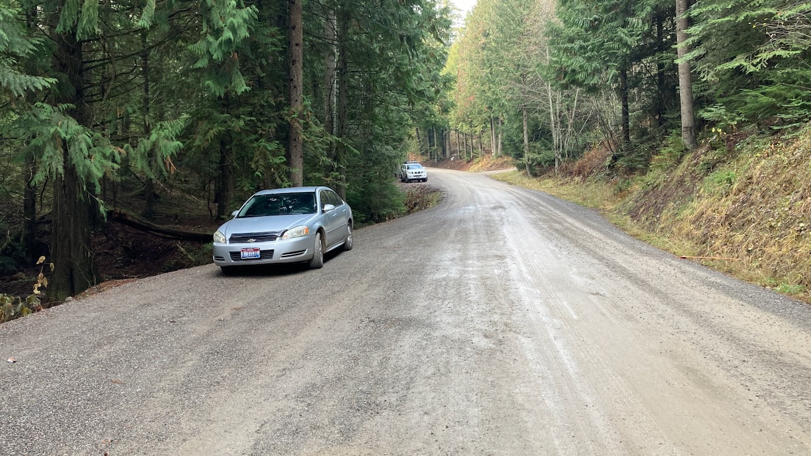
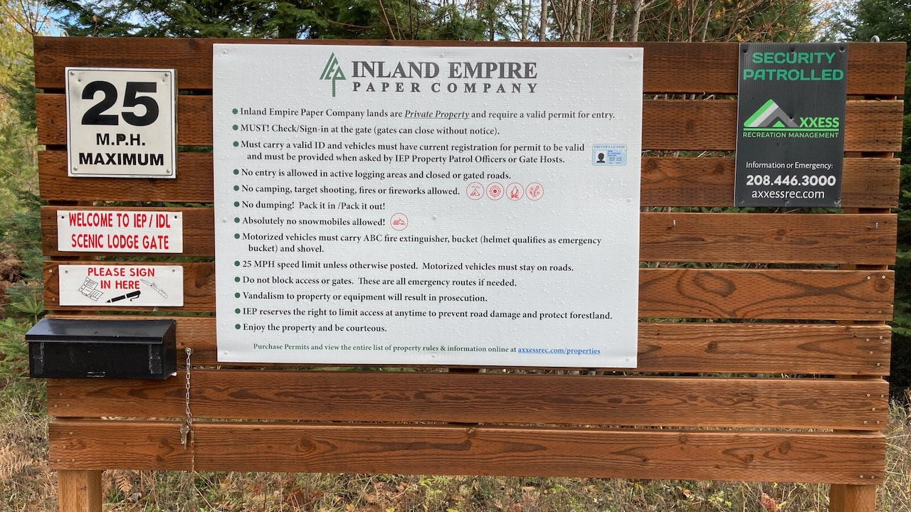
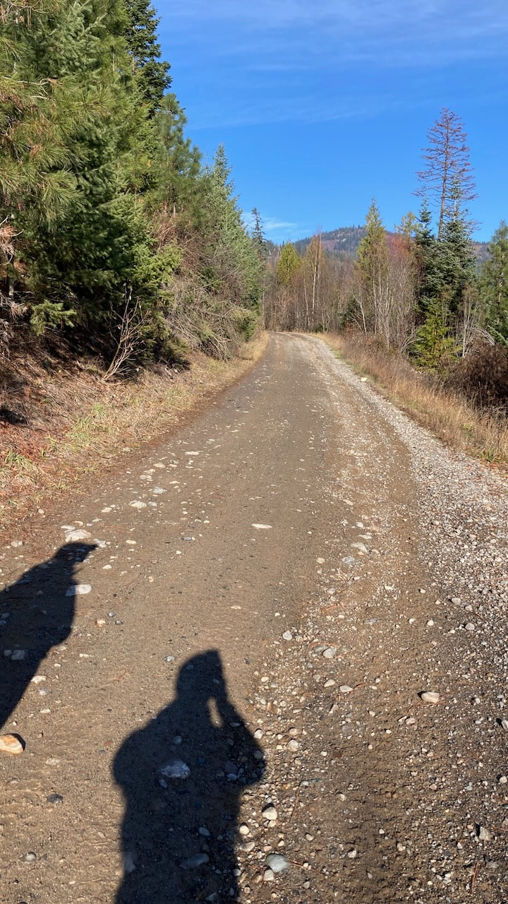
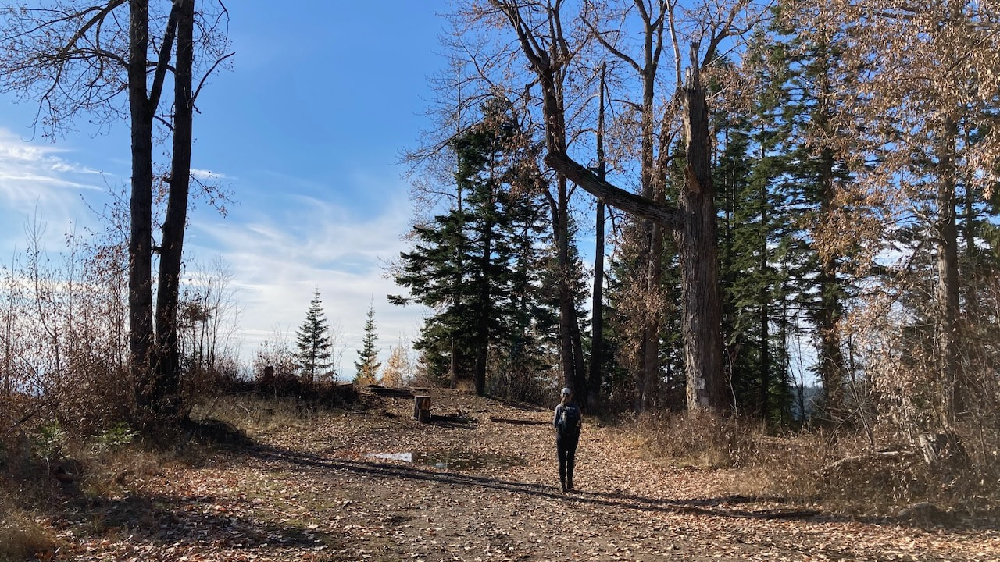
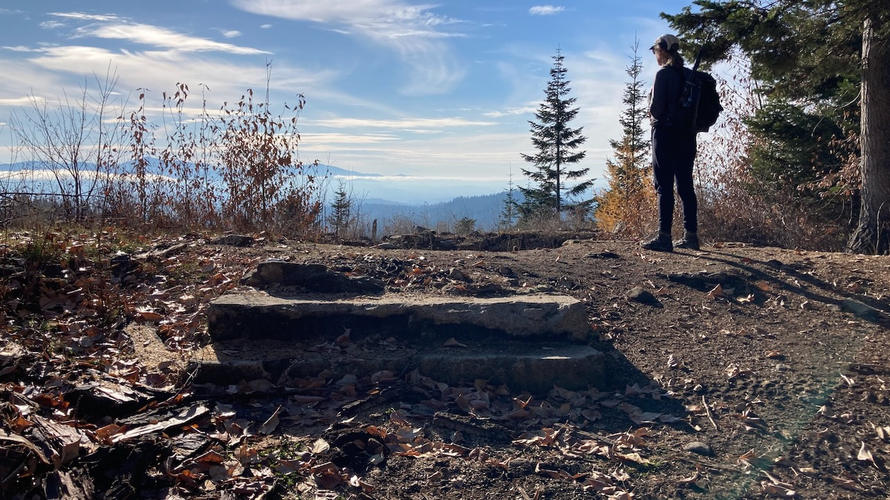

---
tags:

- Peaks & Mountains

- Difficult

- Day Hiking

stats:

- label: Event Type
  icon: hiking
  value: Day Hiking

- label: Distance
  icon: map-marker-distance
  value: 6.4 Miles

- label: Elevation
  icon: terrain
  value: 1,150 gain/loss

- label: Difficulty
  icon: speedometer
  value: Difficult

- label: Maps
  icon: map
  value: GaiaGPS.com USFS 2016

- label: GPS
  icon: crosshairs-gps
  value: 47°50'25.4"n 116°57'32.3"w
---

# Scenic Lodge Rathdrum Mountain

*Scenic lodge rathdrum mountian 3,658’*

## Description

20+ years ago I set off with a friend to hike to the top of Rathdrum Mountain and nearing the top we found a small ridge and a flat spot. There we found an old stone foundation with several large deciduous trees out front that seemed out of place. The building was no longer there but the cement stairs leading up to the front door and the stone walls of the basement or lower level remained. Given the remoteness, size, craftsmanship and the commanding view we assumed it was on old speakeasy but we had no way to confirm that.

I can see the mountain out my front window and I have said many times since then that I need to go back up there and take some photos and figure out the history of the place.

The night before heading out to go try and re-find the place my partner Googled "Rathdrum Mountain Speakeasy" and found a FaceBook post on the public group Old School North Idaho confirming our suspicions of the place along with two photos of the original building. Researching the maps and the route to get there we found the location of the building on the USGS and USFS maps so the next morning we set off on a cold sunny November day and found it again

The hike up is a bit strenuous at just over three miles and 1,150 feet elevation gain. The route follows an Inland Empire access/fire road and it is one of the steepest roads I have ever walked with an average grade of 13% which means it is steeper than that in sections. In addition to that the camber in some of the corners is much steeper than normal too.

The road is gated so vehicles cannot get in but it should be noted that ORV's can and they do. It being hunting season there where a handful of guys all with rifles on there backs coming and going. Not much of a nuisance but that might turn some people off.

We had a pleasant lunch break eating in the sun while sitting on the old stone foundation with commanding views of the two Mica Peaks across the East Spokane Valley. We spent some time checking out the grounds and trying to imagine the dancing, drinking and good times that must have occurred up there during a somewhat bad time during our County's history through the Great Depression.

## Directions

---

## Option #1

## Option #2

## Option #3

---

## Cool things close by

## Hazards

## R & p

---

## Plan your trip

Click for Current NOAA Weather Conditions: [www.nws.noaa.gov/wtf/udaf/MapClick.php?lel=2500&uel=5500&polygon=47.865%2C-117.002%2C47.866%2C-116.907%2C47.811%2C-116.902%2C47.810%2C-116.998%2C&area=17](https://www.nws.noaa.gov/wtf/udaf/MapClick.php?lel=2500&uel=5500&polygon=47.865%2C-117.002%2C47.866%2C-116.907%2C47.811%2C-116.902%2C47.810%2C-116.998%2C&area=17)

trailforks widget startpowered by [Trailforks.com](https://www.trailforks.com/)

trailforks widget end

## Photo gallery

---

"

Parking pull outs at the end of hidden valley road just before the gated fire road on the right leading up to the scenic lodge

---

You must get an inland empire paper company pass to use their property. apply on line or get one at one of the local vendors in rathdrum

---

## Hiking the road to the scenic lodge

---

## The large cotton woods in front of the scenic lodge overlooking spokane valley

---

## The front steps leading into the speakeasy overlooking the valley

---

---
