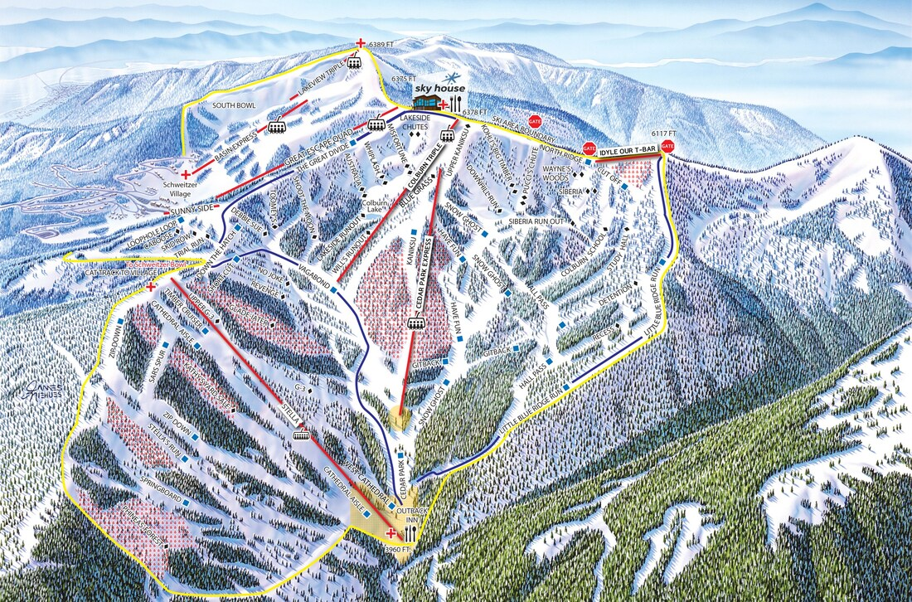
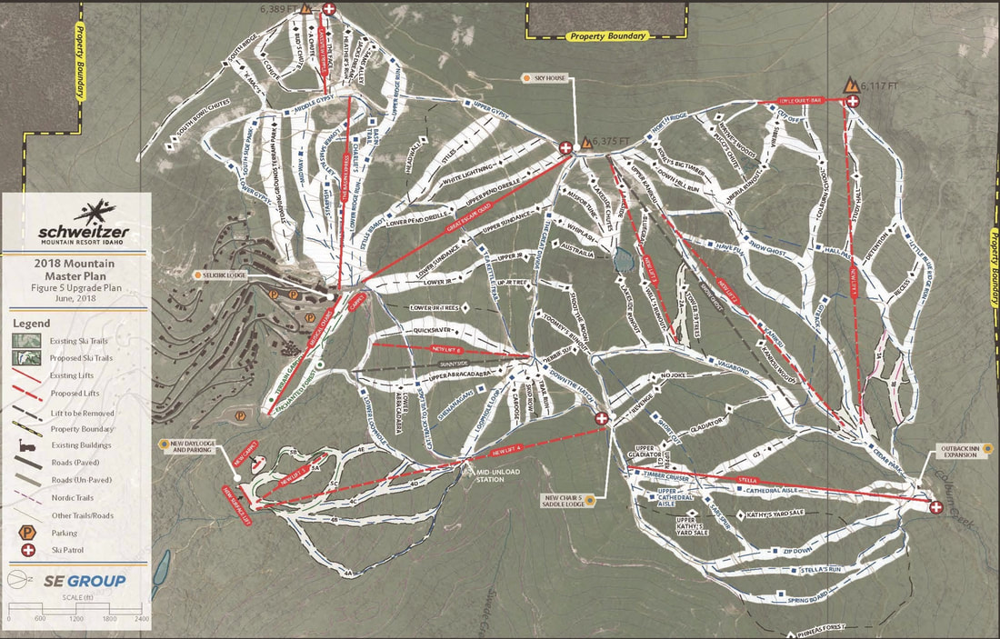

---
tags:
- Peaks & Mountains
stats:
- label: Phone
  icon: phone
  value: 208.263.9555
- label: Acres
  icon: vector-square
  value: '2900'
- label: Average Snow Fall
  icon: weather-snowy-heavy
  value: 300"
- label: Summit Elevation
  icon: terrain
  value: 6400'
- label: Base Elevation
  icon: terrain
  value: 4000'
- label: Verts
  icon: arrow-expand-vertical
  value: 2400'
notes:
- Schweitzer.com
---

# Schweitzer Mountain Resort

*Schweitzer mountain resort sandpoint, id*

## of named runs: 92

## of lifts: 10

Miles from spokane: 85 miles Other amenities: xc, ns, tube

---

## Description

Schweitzer Mountain ResortJust the FactsConsidered by many as the best skiing in Idaho and the best
family-friendly resort in the Pacific Northwest, Schweitzer Mountain Resort is independently owned and proud
of it. Schweitzer ranks as one of the nation’s top winter destinations with 2900 acres of amazing terrain
thanks to its two massive bowls and renowned tree skiing. Located in the Selkirk Mountains of the northern
Idaho panhandle, and only 80 miles from Spokane, WA , Schweitzer overlooks the town of Sandpoint, ID and
offers breathtaking views of three states, Canada and the impressive Lake Pend Oreille. This inland
Northwest ski resort is also home to Stella - Idaho's only

six-person,

high-speed lift.

The Details: Hours of Operation **Winter Season** - Early December to early April (conditions permitting)
from 9am to 3:30pm, daily **Summer

Season** -

Late June to Labor Day from 11am to 5pm, daily Acreage**Winter** - 2900 skiable acres, 92 trails plus open

bowl skiing **Summer** - Over 40 miles of mountain bike trails on both downhill and cross-country terrain

### Ski Specific Stats

**Terrain** - 10% Beginner, 40% Intermediate, 35% Advanced, 15% Expert **Longest Continuous Groomed Run** -
Little Blue Ridge Run, 2 miles in length **Vertical Drop** - 2,400 feet **Top Elevation** - 6,400 feet
**Average Annual Snowfall** - 300 inches **Nordic Skiing trails** - 32 kilometers maintained daily **Terrain
Parks** - Stomping Grounds, Southside Progression Park and the Terrain Garden **Lifts** - 10 including one
high-speed six-pack named Stella, three high-speed quads, two triple chairlifts,

two double

chairlifts, 1 T-Bar, and 1 conveyor lift. **Total Uphill Capacity** - 15,900 riders per hour **Twilight
Skiing** - The Basin Express and Musical Chairs from 3 to 7 pm. For twilight skiing dates, visit

the

[Twilight Skiing](https://www.schweitzer.com/to-do/twilight-skiing/) page. **Tubing** -
[Hermit's Hollow](https://www.schweitzer.com/to-do/hermits-hollow/) tubing center offers two

lanes with

single and double tubes.

History Schweitzer first opened in 1963 and has remained independently owned, operating on 100% private
land.

---

## Photo gallery

---

## To contribute images, contact chic via this website

## Then history of schweitzer mountain resort

A Little History Considered by many as the best skiing in Idaho and the best family-friendly resort in the
Pacific Northwest, Schweitzer Mountain Resort is independently owned and proud of it. Schweitzer ranks as
one of the nation’s top winter destinations with 2900 acres of amazing terrain thanks to its two massive
bowls and renowned tree skiing. Located in the Selkirk Mountains of the northern Idaho panhandle, and only
80 miles from Spokane, WA, Schweitzer overlooks the town of Sandpoint, ID and offers breathtaking views of
three states, Canada and the impressive Lake Pend Oreille. The resort also offers 32 kilometers of Nordic
trails for cross-country, snowshoeing and snow biking during the winter season. Other activities for
non-skiers like an on-site spa, dining, and shopping are all located in the intimate village. In summer, the
resort offers a variety of activities for families including hiking, mountain biking, a side-by-side zip
line, climbing wall, trampoline jumper, and scenic chairlift rides. Schweitzer offers year-round
accommodation on the mountain with lodging options from classic hotel style rooms to full ski-in/ski-out
condominiums in winter. Steep hills good people and a lake. This is who and what we are.

Schweitzer's HistoryThe BeginningThe history of Schweitzer Mountain Resort dates back over a century ago
when, as legend has it, a Swiss hermit took shelter at the bottom of a mountain not far from the town of
Sandpoint. Little was known about the man, but locals began to refer to the mountain after him as
**"Schweitzer," which in German, means "Swiss man.**"

Our Founding FatherOne winter, while traveling back to Spokane from a ski vacation in Kimberley, BC , **Jack
Fowler**, was inspired. Struck by the beauty of Schweitzer Mountain’s snowy basin, mountaintop and open
bowls, he felt the area could be developed into a premier ski destination. Fowler found like minded key
investors, including Jim Brown, who worked together to combine their resources and sell "shares" to local
residents. The dream became a reality when Schweitzer’s first chairlift was opened to the public on December
4, 1963. In 2002, Jack Fowler celebrated his 80th birthday at Schweitzer Mountain. As a tribute to
Schweitzer’s founding father, a new run, "Jack’s Dream," was built close to where the first chairlift was
built over 40 years ago. The Brown YearsA few years after Schweitzer’s modest beginnings, **Jim Brown**
bought out his partners and

began to

expand the resort with the addition of a day lodge in the base area and construction of nearby mountain
condos. During his ownership, he was credited for offering summer lifts for mountain bikers and outdoor
enthusiasts and hosting the first Festival at Sandpoint, an annual music festival showcasing international
and local performing artists.

Harbor Resorts On December 31, 1999, **Harbor Resorts**, a Seattle-based real estate company and then owner
of Stevens Pass Resort, purchased Schweitzer and brought more than a quarter century of experience in
ski-resort development and management. Through their partnership with the McCaw family, who owned Mission
Ridge in the Cascade Mountain Range, Schweitzer was able to climb out of bankruptcy, expand and renovate
existing services. 1999: Green Gables village hotel was renovated and re-named The Selkirk Lodge. The
Terrain Park was rebuilt and lit for night operations. Harbor installed two new handle lifts, improved local
roads, and expanded the beginner ski area. One year later, Stella, Idaho’s only high-speed 6-passenger
chairlift, opened on the mountain. 2001: construction began on White Pine Lodge. The 75,000-square-foot
guest lodge, which opened in August 2002, features 50 condominium units which command spectacular views with
shop and restaurant space at ground level. 2002: The Chimney Rock Grill, a full-service restaurant in the
heart of Schweitzer Village, was completely renovated and in 2003, the Schweitzer Activity Center was added,
which offers year-round mountain activities. 2005: The Idyle Our T-bar was installed, expanding the area’s
skiable terrain by 400 acres into the Little Blue area and making Schweitzer the largest ski resort in Idaho
with 2900 acres. When the partnership between Harbor Properties and the McCaw family dissolved, Misson Ridge
was sold and **the McCaw family became the sole owner of Schweitzer and remains so to this day.**

Today's SchweitzerIn 2006, Schweitzer's board of directors hired **Tom Chasse** as President and CEO of

Schweitzer

Mountain Resort. Chasse has been instrumental in the continued development of Schweitzer's ski terrain and
infrastructure.

2007: two new chairlifts, the Lakeview Triple and the Basin Express Quad, were added to the resort's lift
system 2008: A cutting edge snowmaking system was installed and completed in 2009. 2015: Construction began
on the 9,000 sq ft summit lodge, Sky House. The building was opened to the public in December of 2016 and is
home to The Nest restaurant and bar, The Red Hawk cafeteria, ski patrol dispatch, and on-mountain restrooms.
2019: Schweitzer installed of two new lifts in The Outback. The high-speed detachable quad, Cedar Park
Express, and the fixed grip triple, Colburn Triple, began service during the 2019/20 winter season. The
resort also added an additional 7 new runs and increased gladed terrain accessed by those lifts. 2019:
Construction began on a 30-unit boutique hotel in Schweitzer's village. The hotel is expected to be
completed in the winter of 2021/22. The resort is committed to being the best ski destination in the Pacific
Northwest and is working diligently to improve the experience both on and off mountain for their guests,
passholders, and employees. Schweitzer crafted a strategic master plan in 2017, outlining future expansion
and development for the next 5 - 10 years. For more details,

please

visit our [master plan page](https://www.schweitzer.com/schweitzer-life/schweitzer-master-plan/) on the
website.

***Master plan – a comprehensive or far-reaching plan of action."***Schweitzer Mountain Resort is a special
place. One of the last great undiscovered resorts in North America, it provides access to a beautiful
wilderness, marvelous views, family adventure and a magnificent lake. Looking Back - October 2017

In October 2017, an engaged group of stakeholders met at Sky House to discuss the future of Schweitzer and
what it would take to transform the resort from a regional ski resort to the top 4-season resort in the
Northwest. Among the stakeholders at Sky House in 2017 were some of the country’s most experienced real
estate analysts, investors, marketers and developers, branding and creative experts, landscape architects,
relationship architects and storytellers as well as Schweitzer’s own senior management. The group identified
six areas of the Schweitzer experience that held high promise for achieving Schweitzer’s goals. The 2017
group believed that focusing on these six things would begin the measured and sustained process of enhancing
the existing customer experience and drawing new customers to the mountain:

1. **Family** ‘Adventurers’ may lead the charge in discovering a destination like Schweitzer, but its
   families who will

populate

most of the Resort.

1. **Live/Work** At Schweitzer, work-life balance takes on special meaning. The resort itself is a symbol of
   how people can

achieve

more balance in their lives. But for many visitors, because Schweitzer is more a three-or-four-day weekend
than a two-day weekend, Schweitzer Mountain Resort needs to get much tech-savvier and fast.

1. **Food and Beverage** Americans have become foodies. Not just in the cities, but everywhere. Schweitzer
   needs to capitalize on

this

interest and support the growth of a culture that embraces great local foods and cooking.

1. **Health/Wellness/Sustainability** These topics need to become core values and at the heart of all
   decisions made on the mountain.

1. **Summer** It’s been said that "summer drives winter" in creating successful all-season mountain resorts.
   The more

immersive

those summer experiences can be, and the more they connect the mountain with the town and the lake, the more
Schweitzer, and the community of Sandpoint, benefits.

1. **Skiing** Mountain improvements with upgraded lifts, new terrain and expanded services need to develop
   in parallel

with

business growth.

Moving ForwardSince the 2017 Sky House gathering, Schweitzer has been growing rapidly. The resort has seen
record skier visits in the last two years and its reputation as the best family friendly resort in the
Pacific Northwest is reverberating with many who are searching out more authentic ski and snowboard
experiences. With this growth, there have been some challenges – strains on the existing infrastructure, the
need for more beginner terrain, and more lodging accommodations for visitors on the weekends. Identifying
key areas that need improvement has been a relatively easy task, but developing a strategy to tackle these
challenges becomes critical. Yes, Schweitzer is growing and so the question becomes, how does the 16th
largest ski area in the US work towards a sustainable future that keeps it moving forward without changing
the heart of what customers love about Schweitzer? This question isn’t new. Since the resort first began in
1963, there have been plans to upgrade and improve the overall experience both on and off the slopes. "The
resort, from its inception, has always been looking forward, searching for ways to improve and grow,"
explains Schweitzer CEO Tom Chasse. The newest master plan for Schweitzer was developed thanks to that
October 2017 meeting and culminated with the Board of Directors engaging with
[SE Group](https://segroup.com/), a company whose focus is on strategy, permitting, planning and design for
communities, ski resorts, educational institutions, real estate development and public land management
groups. Throughout the process, it was SE Group’s role to analyze and look into every aspect of the overall
guest experience at Schweitzer. They took into account details like the exact number of hotel beds, parking
spaces and lift capacity numbers, how many tables are in the restaurants, and even the number of toilets
available on the mountain. They worked closely with the director team to understand how Schweitzer functions
during day to day operations and what areas were facing new challenges. With no stone left unturned and
studied, the latest master plan for Schweitzer was finalized, laying out three phases of growth over the
next 15 years. Phase One of the Master Plan

The first part of Schweitzer’s master plan was launched quickly in the spring of 2019 with the replacement
of the Snow Ghost double chair serving the Outback and North bowls on the mountain. "Something we need to
remember when it comes to acting on our master plan is Schweitzer’s unique situation as a private land
owner," adds Chasse. "We own all the land therefore it makes the whole process much faster. From a
regulatory stand point, we don’t need to request permission from the Forest Service to move forward with
projects. That's why we were able to install the new lifts as quickly as we did." Snow Ghost was replaced
with two new lifts – the Cedar Park Express and the Colburn Triple. The Cedar Park Express quad chair starts
just above the Cedar Park run and terminates at approximately the same location of the former mid-unload of
Snow Ghost. This new lift provides more access to several underutilized runs like Have Fun and Snow Ghost.
"The two lift configuration helps us split up our skier user groups," explains Mountain Operations Director
Rob Batchelder. "The new quad offers easier access to blue, intermediate terrain and the Colburn Triple gets
us right back to the steep stuff in Lakeside Chutes. During the lift construction process, we logged
approximately 300 acres and created new runs for our guests to enjoy in the North Bowl and we are pretty
proud of that." *[Press Release (Oct 24, 2018) - Schweitzer Contracts Installation of Two New Lifts for

2019/20](https://www.schweitzer.com/installation-of-two-new-lifts/)*

Phase Two of the Master Plan Schweitzer finalized plans and broke ground on an additional 30 unit boutique
hotel in the village. "The Board of Directors is motivated to find a solution for our lack of accommodations
on the mountain," says Chasse. "It’s challenging at best to find a room over weekends and holidays so the
additional units will help ease that lodging crunch." Schweitzer started the surveying process, relocation
of utilities, and excavation of the underground parking in June of 2019 with a planned delivery during the
20/21 season. "Again, thanks to owning our own land, we can move forward with this project as quickly as
permitting and financing allow."The as yet unnamed hotel is designed by the Portland based firm
[Skylab Architecture](https://www.skylabarchitecture.com/). "Drawing on the heritage of Schweitzer Basin,
yet contemporary in its design, it will provide a perfect venue for guests to relax, play and revel in the
natural beauty surrounding them," says Jeff Kovel, Principal/Design Director at Skylab. "Guests will enjoy
spaces that heighten their connection to the outdoors and the rich local history. The building will be a
state of the art facility and feature heavy timber construction (CLT) but also reuse materials (like
chairlift cables) from around the Resort." In concert with the development of the hotel, Schweitzer and
Skylab have partnered with [Dunn + Kiley](http://www.dunnandkiley.com/), a master planning and landscape
architecture firm that is

internationally

recognized for its expertise in the planning and design of mountain resorts. Dunn + Kiley will be
instrumental

in

improving the landscape architecture surrounding the hotel and within the existing village. *[Press Release
(July 9, 2019) - Schweitzer Announces Construction of New 30 Unit Boutique

Hotel](https://www.schweitzer.com/new-30-unit-boutique-hotel/)*

## Phase Three of the Master Plan

The third phase of Schweitzer’s master plan is arguably the most unique from any other plan put forward for
the resort. "Growth has been huge the last few years and we need to find solutions for our parking issues
and ease the burden on our existing village," Batchelder comments. "Honestly, I’m very excited about solving
those problems with this third phase of development in the Mid-Mountain area." Mid-Mountain would be a
dedicated day-skier area, perfect for beginner and intermediate skiers and riders, with ample parking for
day visitors and additional rental and ski school facilities. "Right now, we have a gap in offering enough
beginner and intermediate terrain," continues Batchelder. "Mid-Mountain will create approximately 8 new runs
with new lifts and an additional carpet which will cater directly to those new skiers." Batchelder also
points out that one of the proposed lifts from the Mid-Mountain area would connect to the saddle area
between Down the Hatch and the Stella off-load making it possible to head straight to the backside of the
mountain without needing to pass through the main village or ride the Great Escape quad. "Physically, we
need room to grow and Mid-Mountain does that for us." The resort also has another lift expansion project in
this phase with the addition of a lift from the Cedar Park area to the summit of Little Blue. "Our skiers
and riders enjoy skiing the far northern boundary of the resort and a lift serving that location will make
access so much easier," explains Chasse. As with any development or planning on this scale, there are
several factors that can play into the timeline in which the plan will be completed. "We have a pretty
conservative approach," notes Chasse. "Our business is growing but we want to make sure that we are
financially sound and don’t get ahead of ourselves. We also want to maintain a razor sharp focus on
improving the overall customer experience with everything that we do." Schweitzer expects this master plan
to reach full completion in 7 to 15 years as long as business levels continue to grow as predicted. "During
my tenure at Schweitzer, we’ve replaced Chair 1 by adding 2 new lifts, enhanced our snowmaking capacities,
built Sky House and added 2 new lifts in the North Bowl," reminisces Chasse. "I really feel we have achieved
everything we can to be competitive. The goal is to make Schweitzer a true destination ski resort with some
national recognition and that’s happening. We think this master plan will help us achieve our goal to
provide the best skiing and snowboarding experience around."
