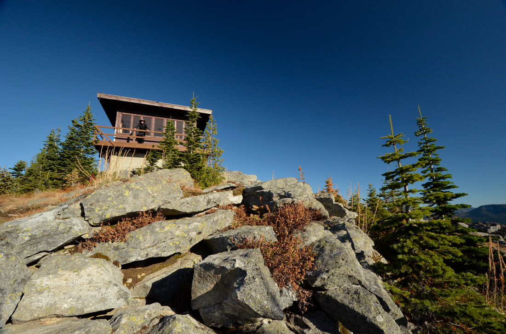
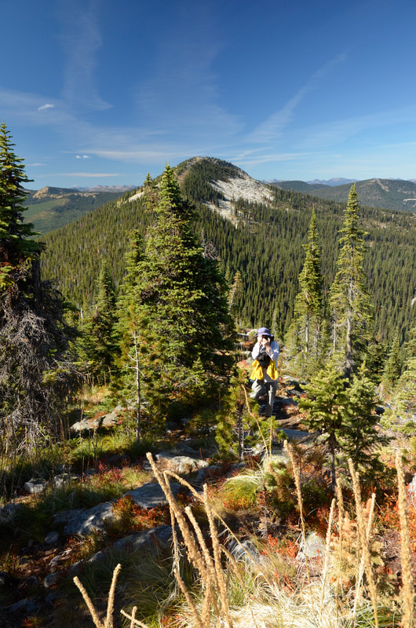
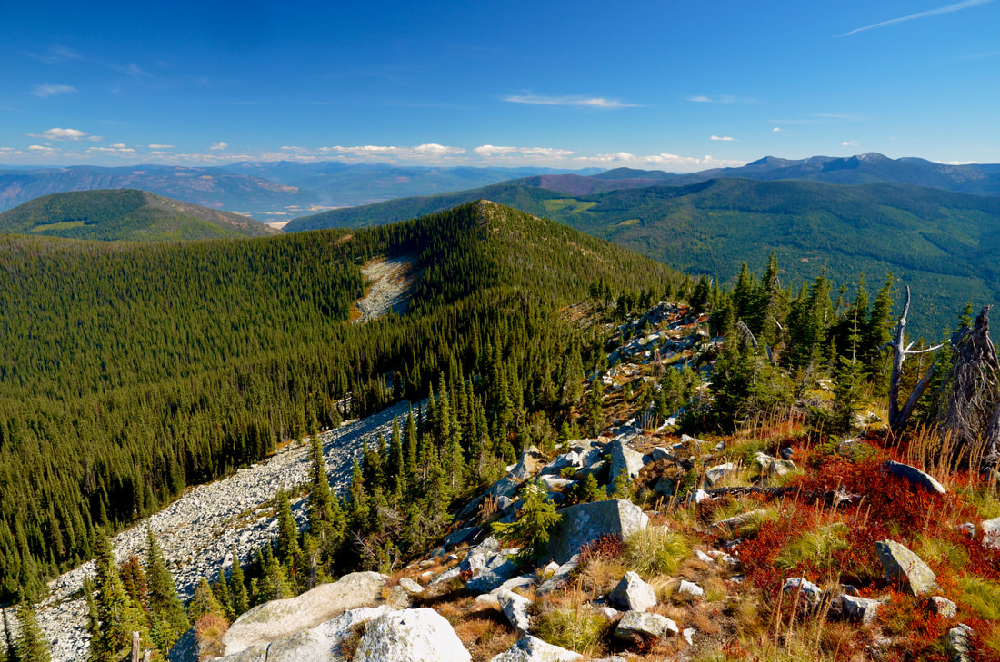
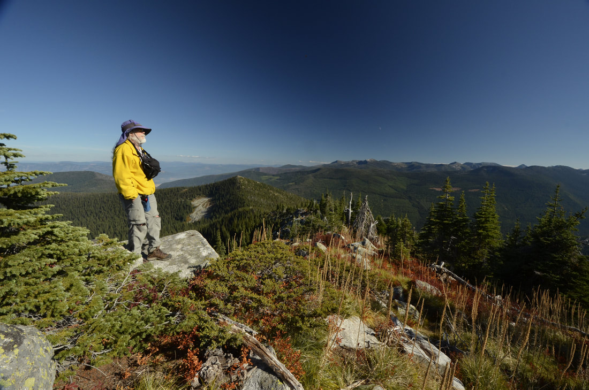
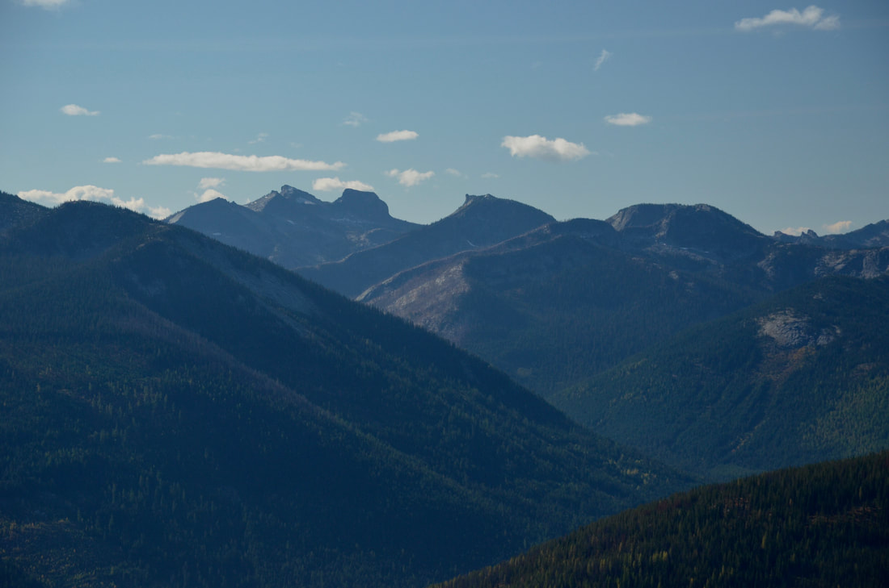
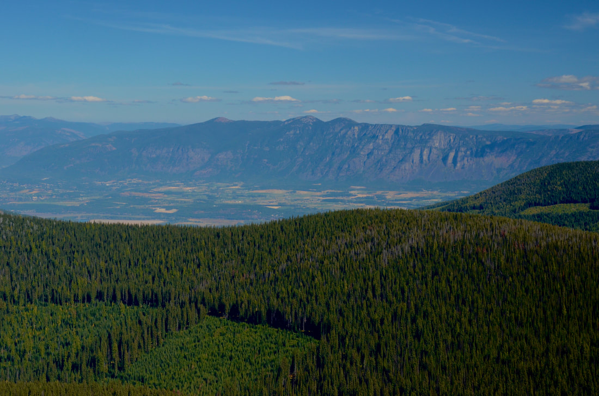
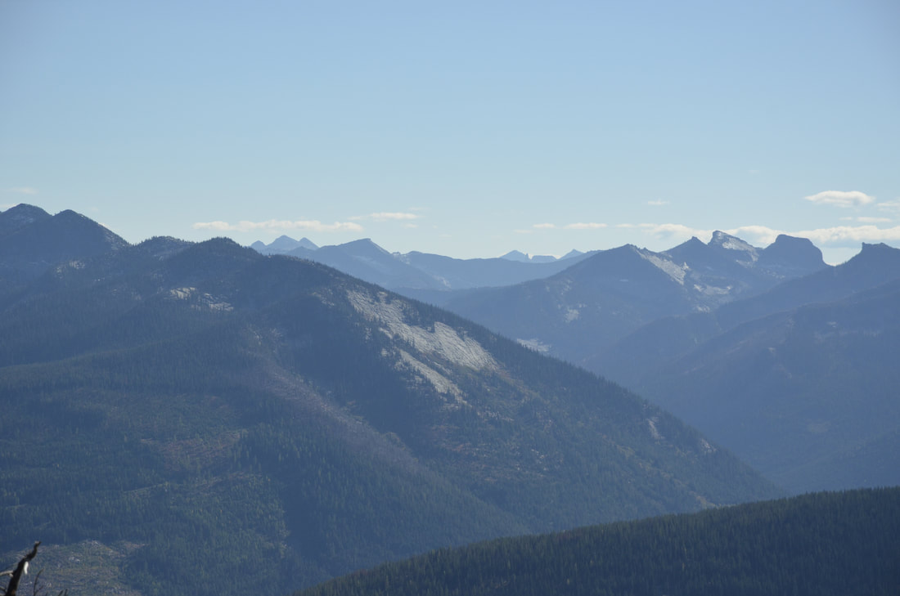

---
tags:
- Peaks & Mountains
- Moderately Easy
- Hiking
- Backpacking
- Equestrian
- Lookout Tower Rental
stats:
- label: Event Type
  icon: hiking
  value: Hiking, backpacking, equestrian, Lookout Tower Rental
- label: Distance
  icon: map-marker-distance
  value: 2.5 miles RT
- label: Elevation
  icon: terrain
  value: 1300 verts
- label: Difficulty
  icon: speedometer
  value: moderately easy
- label: Maps
  icon: map
  value: IPNF Forest map, Shorty Peak Topo
- label: GPS
  icon: crosshairs-gps
  value: 48°56'25" n 116°41;21" w
- label: Ranger District
  icon: pine-tree
  value: Priest River R.D. 208.443.2512
- label: Boundary County Sheriff
  icon: shield-account
  value: 911 or 208.267.3151
notes:
- Idaho panhandle national forest/alerts<https://www.fs.usda.gov/alerts/ipnf/alerts-notices>
---

# Short Peak 6515 And Lone Tree Peak 6732

*Short peak 6515' and lone tree peak 6732' #95*

## Description

We have added the areas sheriff’s emergency phone numbers for each trip write up under the ranger district
info. if an emergency ocurrs, evaluate your circumstances and call only if needed.The trail starts next to
an old clearcut, but soon enters the forest before the gentle hike reaches a shallow ridge. For about a half
a mile the trail offers shade on a hot day. As you get closer to Shorty Peak the forest starts to open up.
Eventually, you will come to a large scree summit slope. The trail switchbacks three times as the trail
nears the lookout tower.

## Option #1

From Shorty Peak 6515', due west and a little over a mile is Lost Tree Peak about 300 verts of gain. Even
tho Lost Tree is higher, the lookout was built on Shorty Peak. Lost Tree Peak 6706', has 360° views of
Washington, Idaho, Montana, and British Columbia, Canada. its a short hike and well worth the views. its
also a nice place to take a nap.

---

## Directions

From Bonners Ferry drive 95 drive 15 miles to a junction with SH 1, where you will drive about 2 miles to
Copeland, Idaho ( County Road #45. Turn left (west) on Copeland Road as it crosses the Kootenai Valley and
the Purcell Trench, to the Westside Road #417. Drive 9 miles to a switchback onto Smith Creek Road #281. The
road is paved for about 6.5 miles.

Just past milepost 7, bear right on Road 655 for 1.5 miles and turn sharply to the right onto Road #282.
Continue on Road 282 for 4 miles to a saddle and a locked gate.

The trail is an old road on the left.

## Cool things close by

Italian Ridge, Osborn Vista, Smith Falls, Cutoff Peak & Smith Peak, and Canada.

## Hazards

Non until you get the the upper scree summit. Walk carefully, paying attention to your steps.

## R & P

Jalapeños, Eichardt's, Mr. Sub, and Burger Express in Sandpoint

---

## Plan your trip

Click for Current NOAA Weather Conditions

## Photo gallery

---

## Shorty peak lookout 6515'

## This lookout is a usfs rental

*Picture (Image missing)*

## Inside the fire lookout

*Picture (Image missing)*

## Chris heating up my homemade chicken & rice soup

*Picture (Image missing)*

## What a lunch spot

*Picture (Image missing)*

## The outhouse is down hill to the south

## In the distance is lone tree peak 6706'

---

## Shorty peak and lookout from near the top of lone tree peak

## From lone tree's summit, looking towards shorty peak image by chris herath

---

## Lion head group due south of shorty peak

## The creston valley, canada looking ne from the image above

---

## The mollies 👇🏻                                       phoebe tip 👇🏻

*Picture (Image missing)*

## Looking sw towards upper priest lake

---

## The american selkirk's "seven sisters"

*Picture (Image missing)*

## Shorty peak lookout as the sun sets

*Picture (Image missing)*

## There's nothing like a sunset in the mountains

*Picture (Image missing)*
