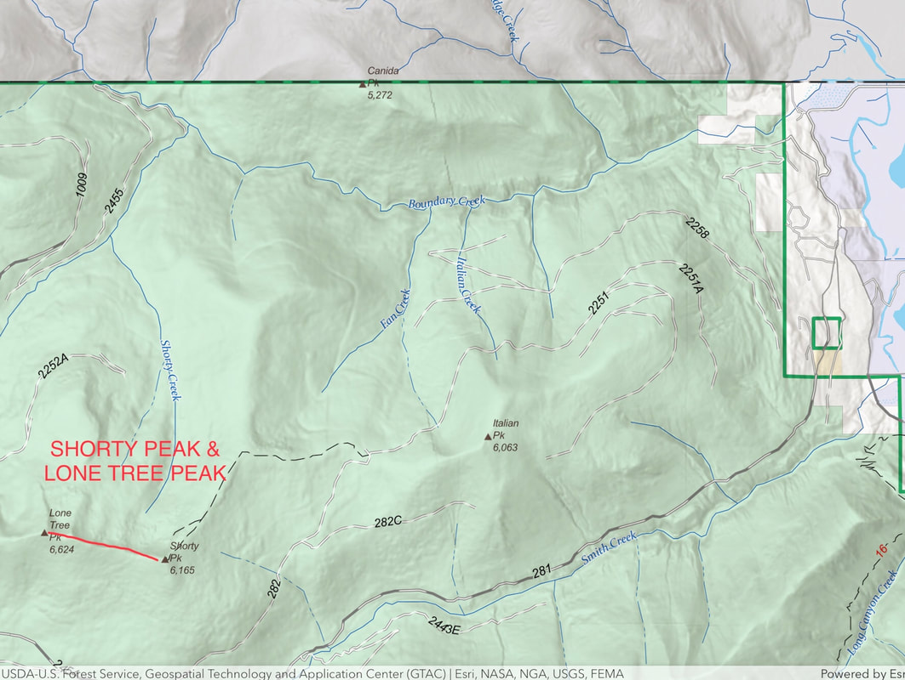
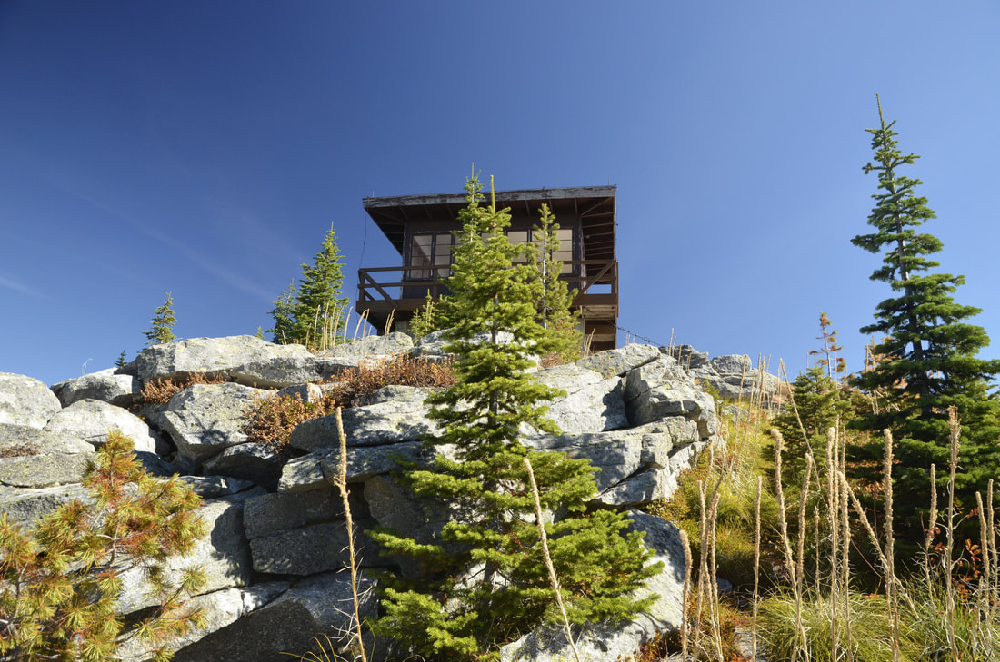
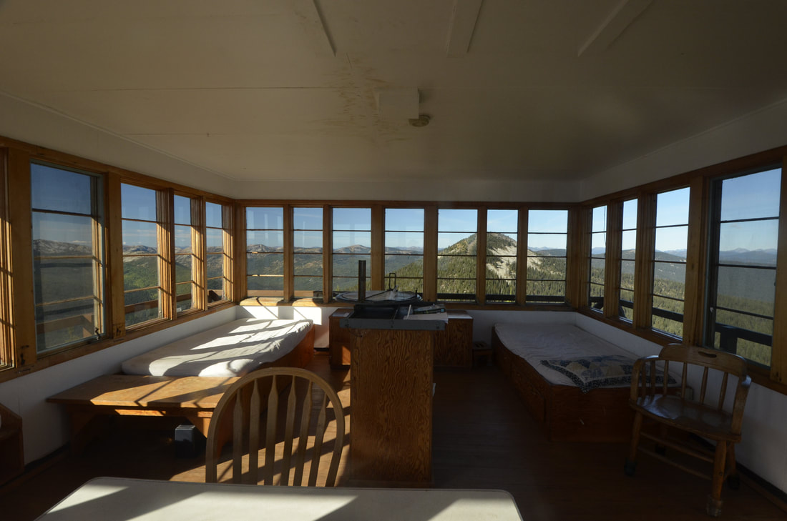
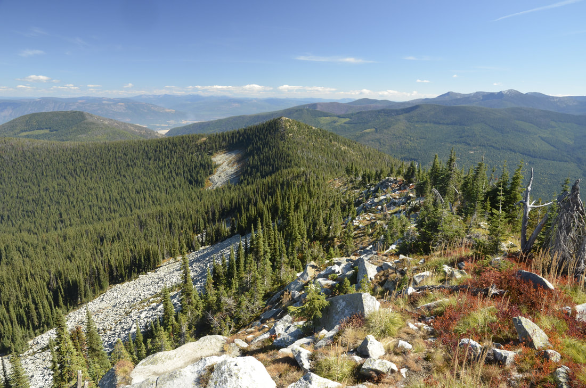
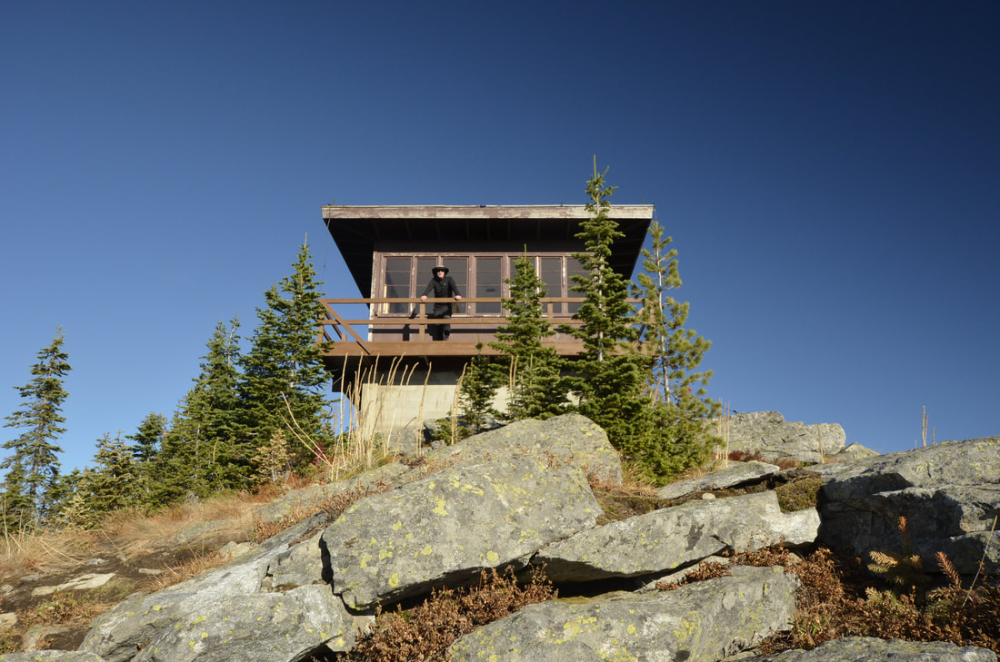
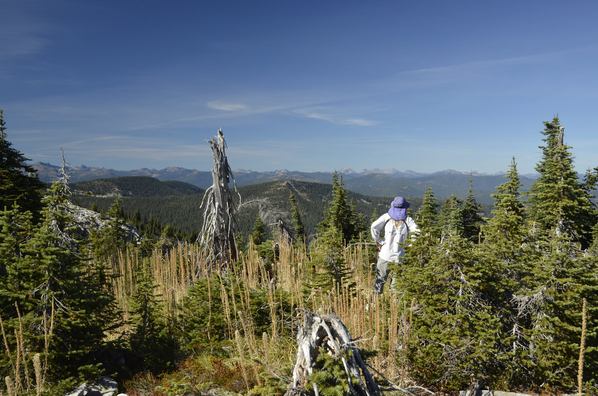

---
tags:
- Peaks & Mountains
- Moderate to Both Summits
- Hike
- Backpack
- Fire Lookout Rental
stats:
- label: Event Type
  icon: hiking
  value: Hike, backpack, Fire Lookout Rental
- label: Distance
  icon: map-marker-distance
  value: 5 miles RT
- label: Elevation
  icon: terrain
  value: 1275' gain to Shorty, about 250' loss and 263' gain to Lone Tree Peak
- label: Difficulty
  icon: speedometer
  value: Moderate to both Summits
- label: Maps
  icon: map
  value: IPNF-Kaniksu N. F., Shorty Peak
- label: GPS
  icon: crosshairs-gps
  value: n48° 57’ 12"w116° 39’ 02"
- label: Ranger District
  icon: pine-tree
  value: Bonners Ferry R.D. 208.267.5561
- label: Bonners Ferry County Sheriff
  icon: shield-account
  value: 911 or 208.267.3151
notes:
- Idaho panhandle national forest/alerts
- <https://www.fs.usda.gov/alerts/ipnf/alerts-notices>
---

# Shorty Peak Trail 95 6515  Lone Tree Peak 6732

## Description

Like several other hikes in this area, the drive is the hard part. Its about 3 hours to the trailhead from Rathdrum. The trail skirts an old clear cut and climbs gently thru a forest where it flattens out a bit and enters a shady forest for about 1/2 a mile. The trail begins to climb again thru a thinning forest until the last walk up a rather steep section that circles to the summit. On top is a cute and clean forest lookout that you can rented.
The lookout is a 15x15 structure with two single beds, a cooking area and incredible views.
As you sit in a chair on the lookout’s deck, the American Selkirks fill your eastern view. Take a map, and try identifying the many summits.
​See how many you have stood on.
The rental cost is 45$ per night. contact recreation.gov.

## Option #1

Continue the hike to Lone Tree Peak about 1 mile to the west. From Lone Tree, the higher of the two, the views are spectacular. On top take a nap on the grass and enjoy the views

## **​**Directions

From the Bonners Ferry Ranger Station: Take Highway 95 north for 17 miles. Turn left onto Highway 1 and head north for 2 miles. Turn left onto Copeland Road and head west for 4 miles. Stay right at the T junction and continue north on Westside Road for 9 miles. Stay to the left around the switchback, onto Forest Road 281, then drive west for 8 miles. Turn right on Road 655 and drive west 1.5 miles. Stay right again at the switchback, heading east 1 mile on Rd 282. Go straight at the next junction, and continue northeast on Road 282 for 4 miles. Park at the trailhead on top of the saddle before the locked gate. Hike 2.5 miles up the trail to the west to reach the lookout.

## Hazards

It’s a long drive, so maybe car camp to get an early start.

## Cool things close by

Lone Tree Peak, Canada to the north and the American Selkirks all around you.
This is a hike you should not miss.

## R & p

Mr, Sub, Eichardt’s , & Jalapeños, Burger Express in Sandpoint

## Photo gallery

---

## All the images are from the chris herath images

*Picture (Image missing)*

The view of the american selkirks from the shorty peak lookout. ​notice the outhouse. ya gotta plan ahead at this lookout

## Shorty peak lookout from the trail

*Picture (Image missing)*

## Shorty peak fire lookout rental

---

## The inside is pretty nice. but wait for the views outside

---

*Picture (Image missing)*

## The three tallest peak are in the lion head group

*Picture (Image missing)*

## Chris heating up my homemade chicken & rice soup i made

The short hike to lone tree peak 6732'. Shorty  peak 6515', the purcell trench, and cascade ridge

*Picture (Image missing)*

## Shorty peak and lookout from lone tree peak 6732'

## Chris on the deck after visiting lone tree peak

## Chic taking in the view of the american selkirks

*Picture (Image missing)*

## Chic sitting on the deck admiring the view

Shorty Peak Lookout, 45 miles northwest of Bonners Ferry, sits atop Shorty Peak with views of the Selkirk and Purcell mountain ranges of Northern Idaho, Montana, and British Columbia. The rustic dwelling was once used to patrol forest fires, and is now a unique way for overnight guests to escape the city and become enthralled with 360 degree views of area's magnificence.  Access requires a moderate to steep 2.5 mile hike with a 1,300 foot elevation gain. The lookout was refurbished in 2005 and is in excellent condition. The 15' X 15' cabin sits atop a 5 foot foundation and can accommodate two overnight guests. The look of the interior is modern with hardwood floors. Two twin beds with pads, two chairs, two tables, a historic fire finder, and a district map are included inside the cabin. A pit toilet is within 100 yards of the lookout. No drinking water or electricity is available. Guests are asked to bring plenty of water, food, bedding, a first aid kit and all other basic camp gear. Horses are allowed, but no corrals or hitching racks are available. Hobbles are recommended for horses. The 2.5 mile hike up to Shorty Peak is part of the fun of staying at the cabin. The trail is also open to horseback riding. While here, landscape photography and wildlife viewing are popular pastimes. Birding is particularly popular and guests may have the chance to look down on some birds of prey. Look for red-tailed hawks, golden eagles, and goshawks soaring over the valleys. Clear nights offer prime stargazing opportunities. ​Need to Know Entry to the cabin is by combination lock; contact the ranger district at (208) 267-5561 for combination 5-10 days prior to visit No drinking water; bring plenty or properly boil and treat water from stream located a mile from lookout Please bring garbage bags; this is a 'pack it in-pack it out' facility No off-road vehicles allowed Bring bedding, cooking supplies, flashlights, etc. Be bear aware; keep all food out of sight in approved containers or locked inside your vehicle and remove all food from area after eating [Click here](http://www.fs.usda.gov/main/ipnf/home) for more information on the Idaho Panhandle National Forests Don't Move Firewood: Prevent the spread of tree-killing pests by obtaining firewood near your destination and burning it on-site. For more information visit [dontmovefirewood.org.](http://www.dontmovefirewood.org/)

## Friends are ones  most favorite possessions thru life.      chic      2013
