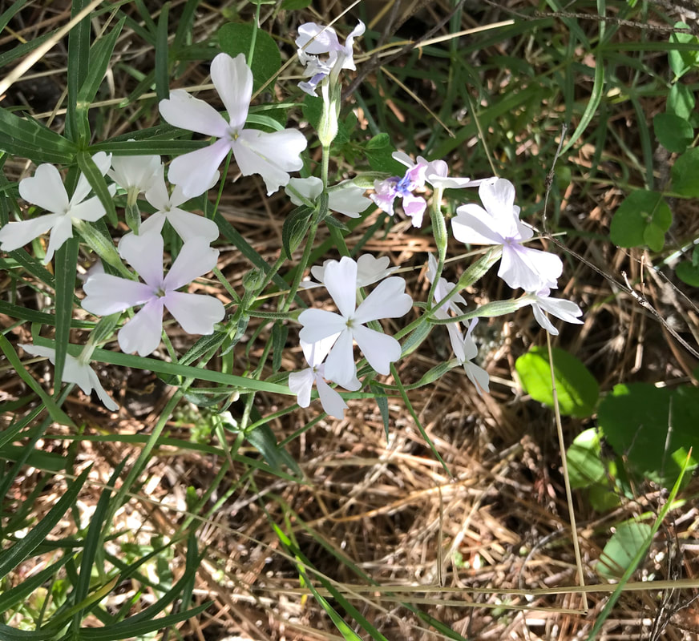

---
tags:
- Trails & Scrambles
stats:
- label: Genesis Name
  icon: book-open-variant
  value: Phlox speciosa
- label: Distribution
  icon: earth
  value: U.DS...CA, ID, MT, NV, WA. Canada...BC
- label: Season
  icon: calendar
  value: Blooms April, May, June
- label: Medical Use
  icon: medical-bag
  value: leaves of some phlox species were made into a **tea used to treat eczema
    and to "purify the blood**." A tea of boiled phlox roots was once thought useful
    in treating venereal disease
- label: Poisonous
  icon: skull-crossbones
  value: 'no'
- label: Edibility
  icon: food-apple
  value: The perennial or garden phlox is **the only type of phlox that is edible**.
    These familiar cottage garden favorites have an intoxicating scent and look especially
    pretty sugared on cakes and desserts or floating in summer cocktails.
- label: Features
  icon: information-outline
  value: Showy phlox is a low, half-sprawling phlox, tending to become shrubby toward
    its base. Its leaves are narrow and leathery, and though this perennial is not
    particularly attractive out of flower, it is very showy in bloom. The flowers
    have pink, shallowly notched petals.
- label: Leaves
  icon: leaf
  value: Leaves of the Garden Phlox are opposite, **oblong to lance shaped**, widest
    at the middle and have prominent lateral veins that do not reach the leaf margin
    but curl upward - an identifying characteristic. Leaves are usually more than
    1/2 inch wide whereas native phlox species are less than 1/2 inch wide.
- label: Fruits
  icon: fruit-cherries
  value: Capsule. Seeds 1-many.
---

# Showy Phlox

## Description

Phlox speciosa is a species of phlox known by the common name showy phlox. It is native to western North
America from
British Columbia to Arizona and New Mexico, where it occurs in sagebrush, pine woodlands, and mountain
forests. It is an
erect perennial herb with a shrubby base growing up to about 40 centimeters tall. The leaves are linear or
lance-shaped,
oppositely arranged, and generally glandular. The inflorescence bears one or more white to pink flowers with
elongated
tubular throats each up to about 1. 5 centimeters long. The corolla has five double-lobed, notched, or
heart-shaped
lobes. There are several subspecies, most being limited to certain sections of the plant's overall
distribution. Phlox
speciosahas an erect stem. Leaves are between 1-5 cm and lance-linear. Terminal inflorescence with leaf like
bracts
below; pedicel 3-20 mm and slender. The calyx is 7-10 mm, membrane not keeled; corolla bright pink to white,
tube 10-15
mm, lobes obcordate to deeply 2-lobed; stamens short, anthers in corolla tube; style 0. 4-2 mm, stigmas >
style. Rocky,
wooded slopes, sagebrush scrub; 500-2400 m. Several subspecies named, study needed. Flowers Apr- Jun.

Occurrences in

Oregon. Phlox speciosa is a widely distributed plant which occurs at many Serpentine sites throughout the
western United
States. In southern Oregon specifically, P. speciosa has been known to co-occur with Darlingtonia californica
the Eight
Dollar Mountain Botanical Wayside, managed by the BLM (Medford District. ) Additionally, this plant is known
to occur in
the Deer Creek Center near Selma, Oregon.

Erect branched stems. Leaves opposite, linear, with pointed tip, few hairs and glands on top surface, smooth
below.
Flower head at top, loose, flowers solitary, with 1/2–2 in. stalks. Flowers pink or sometimes white, with
lighter or
darker central rings; tube about twice as long as deeply notched heart-shaped petals. Grows in open rocky
soils,
shrub-steppe, grasslands, lightly wooded areas, at low to mid elevations.

Purple, bright pink, or white, with white throats and 5 notched petals with 2 rounded lobes at each tip,
corolla tubes
10-15 mm long, the lobes obcordate to deeply 2-lobed, calyx 7-10 mm long, (membrane not keeled), stamens
short, anthers
within the corolla tube, styles to 2 mm long, stigmas larger than the styles, inflorescences dense, terminal,
with
leaf-like bracts below, pedicels slender, 3-20 mm long.

---

## Photo gallery

---

*Picture (Image missing)*

