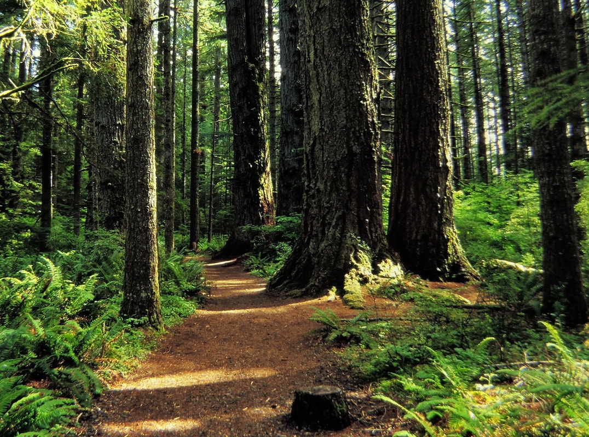
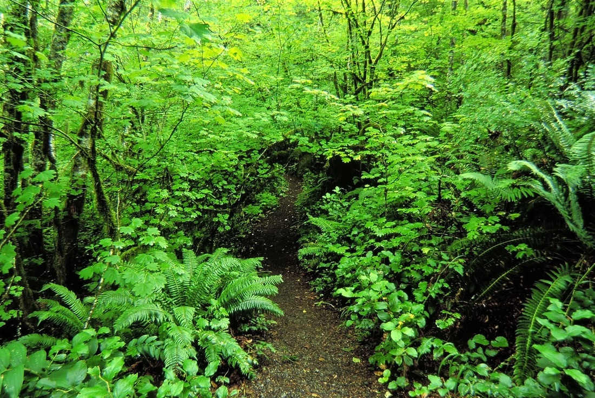
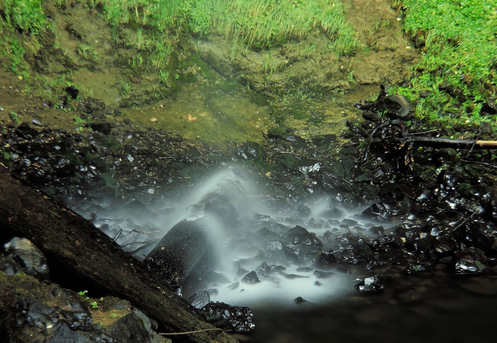
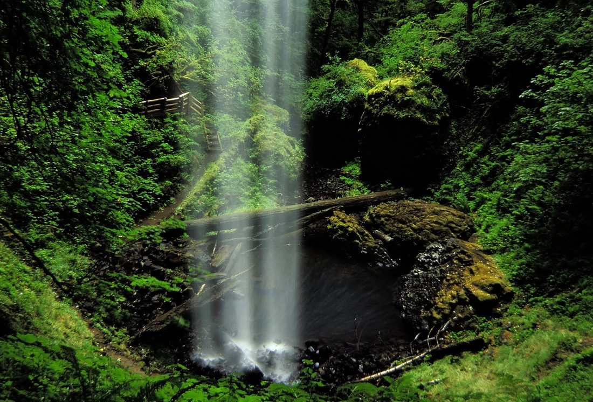
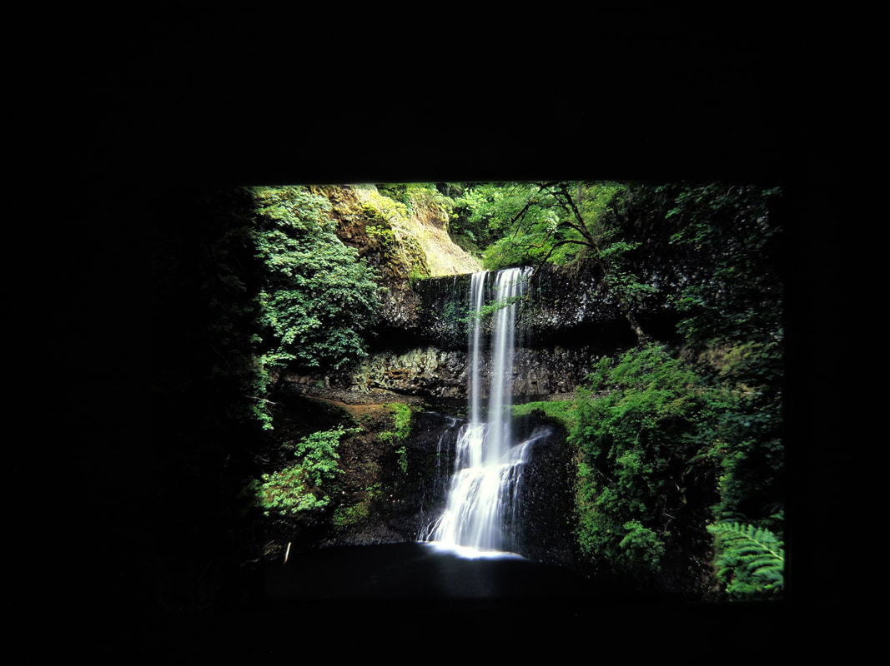
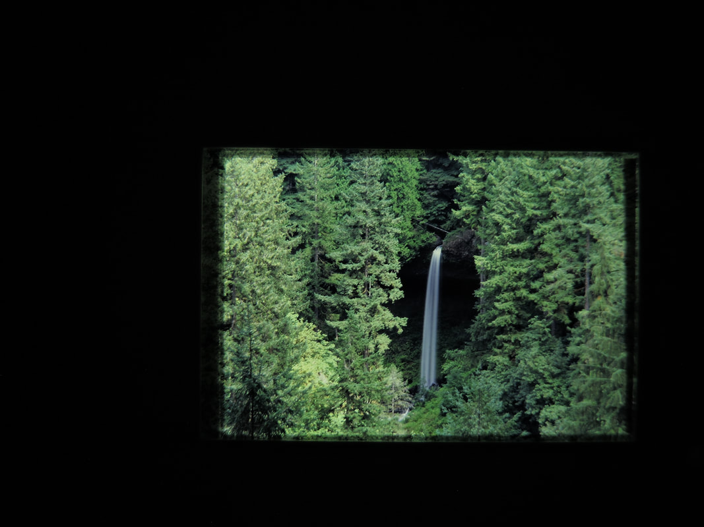
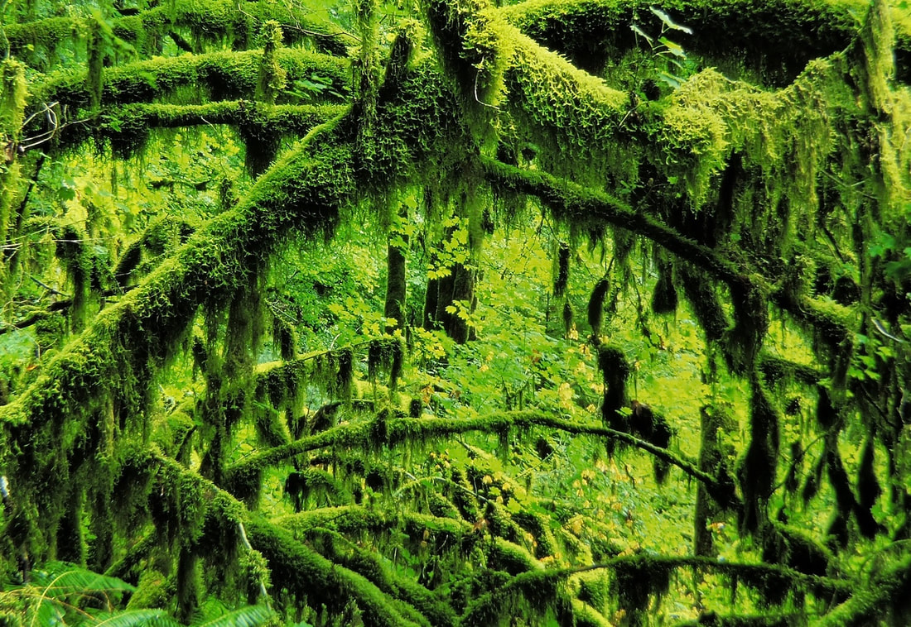
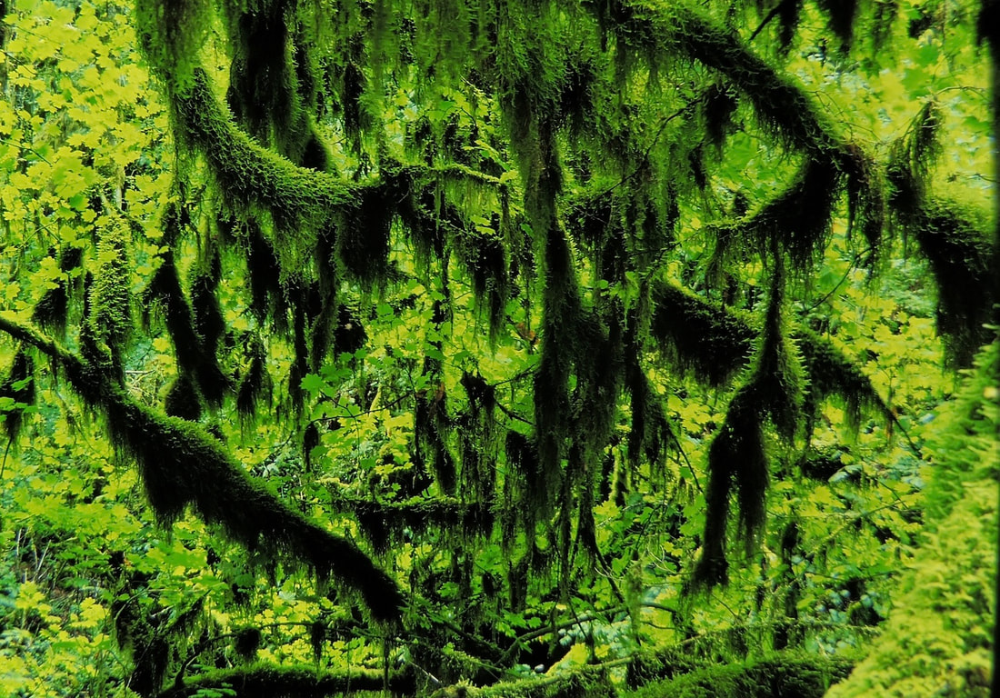
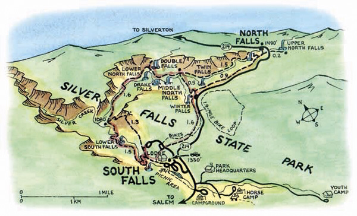

---
tags:
- Waterfalls
- Easy
- Day Hiking
- Camping
- Photography
stats:
- label: Event Type
  icon: waterfall
  value: Day hiking, camping, and photography
- label: Distance
  icon: map-marker-distance
  value: 6.9 mile loop.
- label: Elevation
  icon: terrain
  value: 700 verts
- label: Difficulty
  icon: speedometer
  value: easy
- label: Maps
  icon: map
  value: Silver Falls State Park brochure
- label: GPS
  icon: crosshairs-gps
  value: 44052'40" n 122039'22"
- label: Wild Rivers Ranger District
  icon: pine-tree
  value: 541.592.4000
- label: Marion County Sheriff
  icon: shield-account
  value: CALL 911 FIRST or 541.588.5094
---

# Silver Falls Sp

*Silver falls state park, oregon*

## Description

We have added the areas sheriff’s emergency phone numbers for each trip write up under the ranger district
info. if an
emergency ocurrs, evaluate your circumstances and call only if needed.
If you are ever near Salem, Oregon, make sure you spend a day at Silver Falls State Park.
The "Trail of Ten Falls" is spectacular.
You will feel the wonder of the area.

## Option #1

Once you are at Winter Falls, be sure to walk out to North Falls and Upper North falls.
Its less than 2 miles RT

## Option #2

The State Park has many other attractions to take advantage of.
There are 12 other trails to visit, including a horse camp and trail.
They also offer a Bike trail, Pet area, Campground, picnic area, several view points, an amphitheater, food is
available, an the Historical South Falls Lodge.

---

## Directions

From Salem, take Hwy 22 to the Hwy 214 turn off.
From Silverton, take Hwy 214 SE to the park.

---

## Hazards

Some trails may be slippery on days it rains. Please use caution.
There is hiking or snowshoeing in the winter, so enjoy this marvelous park year round.

## R & P

South Falls Lodge

## Photo gallery

---

## The trail in is about as good as it gets

## The lushness of this area alone is worth the walk

*Picture (Image missing)*

## North falls 136'

## North falls landing

## North falls 136'

*Picture (Image missing)*

## North falls from the trail in the above image

*Picture (Image missing)*

## Most all the trail are outstanding

## Upper north falls 65'

## Close up of upper north falls

*Picture (Image missing)*

## North falls 136'

*Picture (Image missing)*

## Close up of the bottom of north falls

## North falls

## Did i mention lushness, this trail is exceptional

*Picture (Image missing)*

## Silver creek

## The area drips with green

Hike Silver Falls State Park
A spectacular canyon with 10 waterfalls
**About the Hike:** The popular trail through Silver Falls State Park's forested canyons visits 10 spectacular

waterfalls, five more than 100 feet high. The path even leads through mossy caverns behind the falls'
shimmering silver
curtains.This loop is suitable for families with beginning hikers because side trails provide shortcuts back
to the car.
Dogs are not allowed on the trail.
**Difficulty:** The full loop to see all 10 waterfalls (from South Falls to North Falls) is a moderate hike of 6.9

miles, gaining 700 feet of elevation, but the recommended shortcut (omitting Twin and North Falls) trims the
loop to 5.1
miles.

For a shorter, 2.8-mile loop, turn back after Lower South Falls. For an even shorter 0.7-mile tour, simply
loop to the
bridge at the base of South Falls.
**Season:** Open all year. The park is usually snow-free even in mid-winter, but the falls are still quite

full and the

wildflowers are at their best from late March to May.
**Getting There:** From Interstate 5 exit 253 in Salem, drive 10 miles east on North Santiam Highway 22, turn

left at a

sign for Silver Falls Park, and follow Highway 214 for 16 miles to the park entrance sign at South Falls.

Coming from the north, exit Interstate 5 at Woodburn and follow Highway 214 southeast through Silverton 30
miles.
In the South Falls parking complex, follow signs to Picnic Area C, and park at the far end of the lot.
**Fees:** A special $3-per-car fee is charged to park anywhere in the state park.
**Hiking Tips:** From the South Falls Picnic Area C parking lot, follow a broad path downstream a few hundred

yards to

historic Silver Falls Lodge, built by Civilian Conservation Corps crews in 1940. After inspecting this rustic
stone-and-log building, continue a few hundred yards to an overlook of 177-foot South Falls. From here take a
paved
trail to the right. Then switchback down into the canyon and behind South Falls.

A few hundred yards beyond South Falls is a junction at a scenic footbridge. Don't cross the bridge unless
you're truly
tired, because that route merely returns to the car. Instead take the unpaved path along the creek. This path
eventually
switchbacks down and behind Lower South Falls' broad, 93-foot cascade.
Beyond Lower South Falls the trail forks again. If you're wearing down, you can turn right and climb the
steepish ridge
trail to the canyon rim and parking lot, for a total trip length of 2.8 miles.
If you're ready for a longer hike continue straight, heading up the north fork of Silver Creek to 30-foot
Lower North
Falls. At a footbridge just above the falls, take a 250-yard side trail to admire tall, thin Double Falls.
Then continue
on the main trail past Drake and Middle North Falls to the Winter Falls trail junction.
At this point, turn right for the recommended 5.1-mile loop. This path climbs to a parking area above Winter
Falls. From
there, keep right on a 1.6-mile return trail through the woods to the South Falls area, the lodge, and your
car.
**History:** Silver Falls City, platted here in 1888, was an early center for logging and some fairly

unsuccessful

homestead farming. Future US President Herbert Hoover surveyed some of the land here while serving as a young
engineer.

By 1900, June Drake, a Silverton photographer, began pushing for park status. His early photographs of the
falls have
become classics. An inspector for the National Park Service rejected the area for national park status in
1926, however,
because logging had scarred the area with "thousands of stumps that from a distance look like so many dark
headstones."
After that, the private owner of South Falls charged admission to let people watch as he floated derelict cars
over the
falls. In 1928 a paying audience watched daredevil Al Faussett canoe over 177-fout South Falls. He had to
spend months
afterward in a hospital, recovering from his injuries.
In 1935 President Franklin D. Roosevelt announced that Silver Falls would be one of his largest Recreational
Demonstration Projects. He bought private land and employed young men in the Civilian Conservation Corps to
develop park
facilities. Since then the forest has regrown so that most visitors do not even notice that the area was once
logged.
**Geology:** All waterfalls in the park spill over 15-million-year-old Columbia River basalt. At that time the

Columbia

River flowed through this area to the sea at what is now Newport. Repeated lava flows poured down the river
channel from
vents in Eastern Oregon, gradually pushing the river northward. As the lava slowly cooled, it sometimes
fractured to
form the honeycomb of columns visible on cliff edges. Circular indentations in the ceilings of the misty
caverns behind
the falls are tree wells, formed when the lava flows hardened around burning trees. The churning of Silver
Creek gouged
the soft soil from beneath the harder lava, leaving these caverns and casts.

### By William Sullivan

Silver Falls State ParkNestled in the foothills of the Cascade Mountains, just a short scenic drive from the
Willamette
Valley, is 9,000 acres of temperate rainforest waiting for you – to explore, play, or simply stop and
recharge. Silver
Falls State Park, Oregon’s largest State Park, is centrally located in Oregon just east of the State Capital,
Salem, and
an easy day’s drive from Portland, Eugene, or Bend.
Silver Falls’ namesake comes from the 10 unforgettable waterfalls crashing into the canyon carved by the North
and South
Forks of Silver Creek – five of these waterfalls are over 100 feet and four you can walk behind! Hike through
the mist
on the Trail of Ten Falls, a National Recreation Trail, or explore miles of trails beyond the falls through
quiet,
old-growth forest on foot, bike, or horseback. The Silver Falls Historic District, a must for history-lovers,
is filled
with rustic-style buildings built by the young men of the 1930s Civilian Conservation Corp (CCC) camps which
serve today
as our South Falls Lodge, Nature Store, and Combination Picnic Shelter, all of which are listed on the
National Registry
of Historic Places. Many other visitors enjoy the cool waters of the day use area’s swimming area, lounge in
the sun
while kids play in one of the three playgrounds, or satisfy their curiosity about natural history through the
many
interpretative programs and special events offered throughout the year.
Silver Falls State Park is overflowing with lodging and refreshments options to satisfy any visitor – from the
full-service Silver Falls Lodge & Conference Center complete with cabins, meals, a swimming pool, and meeting
facilities
to the campgrounds with 100 tent/RV sites, cabins, and group camping facilities. Popular for family reunions
and
weddings, the two "ranches" offer another unique lodging option all under one roof – complete with bunks, full
kitchens,
and a center fire-pit you won’t soon forget on a chilly evening with your friends. The YMCA camp is reservable
outside
of the summer season and also has many CCC-era historical buildings along with a swimming pool and full
commercial
kitchen. Snacks and refreshments are conveniently located in the Silver Creek Grill next to the swimming
area’s D
Shelter and in the Café in the South Falls Lodge, while meals and seasonal buffets are found in the Silver
Falls Lodge &
Conference Center.
The rangers at Silver Falls State Park have but one word of advice – it is very difficult to take in all that
Silver
Falls has to offer in one day so plan to stay awhile or come back and visit!

Silver Falls History: A Chronological Story  Silver Falls History: A Chronological Story
Draft, July 2011)
circa 1811: Donald McKenzie and other members of the
Pacific Fur Company were probably the first
white men to see the Silverton area. They are
believed to have followed the beaver up the
creeks and eventually discovered Silver Falls.
1865: The Silverton Fire, the largest known in Oregon’s
history, burned a million acres including the Silver
Falls area.
1882: April 20: Patent issued to W.T. Eaton, one of the
first settlers on record in the Falls area, for 160
acres near South Falls.
1886: A forest fire destroyed a large part of the forest
on lands that would become Silver Falls State
Park.
1888: March 16: The plat map for Silver Falls City was
filed with Marion County for the Eaton land,
which had been purchased by T.C. Smith.
Herbert Hoover is believed to have been on the
surveying crew.
1899: A church was built in Silver Falls City and became
the center of community activities.
1900: Silverton photographer, June Drake, began
advocating for the establishment of Silver Falls as
a national park.
1925: September: A destructive forest fire raged near
and at House Mountain.
1926: August 7: The 2,746 acres of Silver Creek Falls
was proposed to the National Park Service by
Senator McNary for establishment as a National
Park. The proposal was rejected and the area was
recommended as a state park.
1928: July 1: Al Faussett rode a 12-foot homemade
canvas-covered canoe filled with 36 inflated inner
tubes over the 177-foot South Falls and survived
to tell the tale.
1928: Summer: South Burn, a forest fire, damaged the
Silver Falls area.
1931: April 3: First park acquisition was 90 acres from
George and Anna Parkhurst at the cost of $2,000.
1931: April 30: North Falls became park property.
1931: October 19: South Falls became park property.
1931: December 3: The Highway Commission named
the area "Silver Creek Falls State Park".
1933: July 23: Silver Falls State Park was dedicated.
More than 5,000 people attended. At this time,
the park was comprised of 1,268 acres.
1934: December 15: Emergency Conservation Work
Organization crew commenced work at Silver
Falls.
1934: December 31: Federal government established a
Recreational Demonstration Area near Silver
Falls.
1935: March: The Oregon State Highway Commission
signed an agreement with the National Park
Service and the US Army to create a master plan
with designs and construction drawings for Silver
Creek Falls State Park. They also agreed to
establish a Civilian Conservation Corps (CCC)
program at the park.
1935: March 30: CCC Camp was established near
North Falls.
1935: Silver Creek Falls State Park was again reviewed
and rejected as a National Park.
1935: March: Oregon State Highway Commission
signed agreement with NPS and the US Army to
create a master plan for Silver Creek Falls State
Park and to establish a CCC program at the park.
1936: Latrine constructed behind Log Cabin. (Fulton,
1998)
1937: CCC Combination Building completed.
1938: September 17: Parks purchased 50 acres on
which Silver Falls City was located.
1938: Silver Creek Youth Camp, a boys’ camp, was
created.
1938: Log Cabin built. (This building is now occupied
by the Friends of Silver Falls Nature Store.)
1939 – 40: South Falls Lodge was constructed.
1940: Smith Creek Camp, for girls, was completed.
1940: Myrtlewood furniture of Concession Building
(now called the South Falls Lodge) designed by
Margery Hoffman Smith, director of Oregon Art
Project under the Federal Works Agency. Smith
also designed furniture for Timberline Lodge at
Mount Hood, Oregon.
1942: April: CCC Camp closed.
1942: December 5: CCC Camp buildings at North Falls
were transferred to the State and remodeled for
use as a Youth Camp.
1944: Myrtlewood furniture installed in Lodge. This
furniture remains.
1946: The Salem YMCA was granted an ongoing
cooperative agreement to operate Silver Creek
Youth Camp by the National Park Service. This
agreement continues to the present time.
(Armstrong, 1965)
1946: May 27: Nohgren’s Restaurant opened in the
Concession Building (the South Falls Lodge.)1947 – 49: National Park Service deeded 5,989.58 (6,305?)
acres to the State restricted to Park and
Recreational use only. The Highway Commission
paid $1 an acre.
1951: Overnight camp was constructed. Samuel
Boardman succeeded as State Park
Superintendent by Chester Armstrong. (Langille,
1953)
1952: Attendance totaled 242,742 day visitors.
1953: Davidsons’ barn was altered to "The Ranch."
1955: Conservative Baptist Association agreed to
construct a pool at North Falls. (Armstrong,
1965)
1956: Recreation hall built at North Falls. (Armstrong,
1965)
1956: South Falls Lodge closed.
1956: Salem YMCA agreed to build a swimming pool at
the Silver Creek Youth Camp. (Armstrong, 1965)
1963: Attendance totaled 305,560 day visitors and
12,797 overnight stays. (Armstrong, 1965)
1972: A swimming area and other day use area
improvements were added. (Proposed in original
NPS master plan of 1940.)
1972: New Ranch built.
1973: Four-mile bicycle trail constructed.
1977: Mother’s Day: Park volunteer Blanche Sweger
founds the first annual Mother’s Day Wildflower
Show.
1977 – 80: Conference Center was constructed at the site of
the declining Smith Creek Camp.
1978: South Falls Lodge reopened after being restored
as a visitor and nature center.
1978: December: The first Christmas Festival held in
the South Falls Lodge.
1982: Updated Silver Falls Master Plan completed.
1983: 9 acre area including the historic Silver Falls
Lodge and South Falls viewpoint listed by the
National Register of Historic Places.
1984: The late Leo Cieslak bequeathed 160 acres.
1985: The 1249th Engineer Battalion of the Oregon
National Guard completed several projects
including the construction a new vehicle bridge
and camp loop road (B-Loop), new jogging trail,
two playgrounds, and several new buildings in the
shop maintenance complex.
1986: The Friends of Silver Falls State Park founded as
a non-profit organization with the mission to
support the park.
1988: Campground B-Loop completed.
1990: January 1: Oregon State Parks and Recreation
Department became independent agency;
separate from Oregon State Highway
Department—later to become Oregon
Department of Transportation.
1992: Updated Silver Falls Master Plan completed.
1992: Mother’s Day: Friends of Silver Falls State Park
opens the Nature Store in the South Falls Lodge.
1994: Silver Creek Canyon Trail listed on the Register
of National Recreation Trail in perpetuity. (Letter
from Secretary of the Interior, July 15, 1994)
1996: A one hundred-year flood early in the year takes
out two bridges on the "Trail of Ten Falls."
1998: Paver path project in South Falls Day use began.
1998 – 99: Cabin Loop cabins constructed.
1998 – 99: Lodge restoration.
1999: Picnic Shelters rebuilt.
2000: July: Covered bridge connecting Campground
and Cabin Loop completed.
2001: South Falls View Point reconfigured.
2003: New playground installed in Campground B
Loop.
2003: Restoration of the Lodge garage complete.
2005: Restoration of the CCC Combination Building
begun.
2006: Oregon Parks and Recreation Department
purchased 2 parcels of land totaling 365 acres
from the DeSantis family, bringing the total
acreage to 9,064.
2008: CCC Combination Building rededicated.
2008: In January 2008, Fred Girod of the Oregon
House of Representatives sought federal
designation of Silver Falls State Park as a national
park via a house joint memorial to the United
States Congress. The bill died in committee
2009: Updated Silver Falls Master Plan completed.
2009: July 13: Grand opening of the Nature Store in
the retrofitted CCC Log Cabin.
2010: Cell tower erected in the Silver Falls forest.
2010: Natural Play Area at North Falls Group Camp
begun.
2010: Phase 1 of the Interpretive Plan begun. Includes
panels at the Combination Building; kiosks at
North Falls, South Falls, and South View Point;
and panels at access points of the South Falls
Historic District.
Note: This document is a work in progress and is currently in draft form.
Footnotes need to be added and dates cross-referenced. Construction and building
dates may reflect the beginning, middle, or end of a project—most projects span

more than one year. Silver Falls History: A Chronological Story (Draft, July 2011)
circa 1811: Donald McKenzie and other members of the
Pacific Fur Company were probably the first
white men to see the Silverton area. They are
believed to have followed the beaver up the
creeks and eventually discovered Silver Falls.
1865: The Silverton Fire, the largest known in Oregon’s
history, burned a million acres including the Silver
Falls area.
1882: April 20: Patent issued to W.T. Eaton, one of the
first settlers on record in the Falls area, for 160
acres near South Falls.
1886: A forest fire destroyed a large part of the forest
on lands that would become Silver Falls State
Park.
1888: March 16: The plat map for Silver Falls City was
filed with Marion County for the Eaton land,
which had been purchased by T.C. Smith.
Herbert Hoover is believed to have been on the
surveying crew.
1899: A church was built in Silver Falls City and became
the center of community activities.
1900: Silverton photographer, June Drake, began
advocating for the establishment of Silver Falls as
a national park.
1925: September: A destructive forest fire raged near
and at House Mountain.
1926: August 7: The 2,746 acres of Silver Creek Falls
was proposed to the National Park Service by
Senator McNary for establishment as a National
Park. The proposal was rejected and the area was
recommended as a state park.
1928: July 1: Al Faussett rode a 12-foot homemade
canvas-covered canoe filled with 36 inflated inner
tubes over the 177-foot South Falls and survived
to tell the tale.
1928: Summer: South Burn, a forest fire, damaged the
Silver Falls area.
1931: April 3: First park acquisition was 90 acres from
George and Anna Parkhurst at the cost of $2,000.
1931: April 30: North Falls became park property.
1931: October 19: South Falls became park property.
1931: December 3: The Highway Commission named
the area "Silver Creek Falls State Park".
1933: July 23: Silver Falls State Park was dedicated.
More than 5,000 people attended. At this time,
the park was comprised of 1,268 acres.
1934: December 15: Emergency Conservation Work
Organization crew commenced work at Silver
Falls.
1934: December 31: Federal government established a
Recreational Demonstration Area near Silver
Falls.
1935: March: The Oregon State Highway Commission
signed an agreement with the National Park
Service and the US Army to create a master plan
with designs and construction drawings for Silver
Creek Falls State Park. They also agreed to
establish a Civilian Conservation Corps (CCC)
program at the park.
1935: March 30: CCC Camp was established near
North Falls.
1935: Silver Creek Falls State Park was again reviewed
and rejected as a National Park.
1935: March: Oregon State Highway Commission
signed agreement with NPS and the US Army to
create a master plan for Silver Creek Falls State
Park and to establish a CCC program at the park.
1936: Latrine constructed behind Log Cabin. (Fulton,
1998)
1937: CCC Combination Building completed.
1938: September 17: Parks purchased 50 acres on
which Silver Falls City was located.
1938: Silver Creek Youth Camp, a boys’ camp, was
created.
1938: Log Cabin built. (This building is now occupied
by the Friends of Silver Falls Nature Store.)
1939 – 40: South Falls Lodge was constructed.
1940: Smith Creek Camp, for girls, was completed.
1940: Myrtlewood furniture of Concession Building
(now called the South Falls Lodge) designed by
Margery Hoffman Smith, director of Oregon Art
Project under the Federal Works Agency. Smith
also designed furniture for Timberline Lodge at
Mount Hood, Oregon.
1942: April: CCC Camp closed.
1942: December 5: CCC Camp buildings at North Falls
were transferred to the State and remodeled for
use as a Youth Camp.
1944: Myrtlewood furniture installed in Lodge. This
furniture remains.
1946: The Salem YMCA was granted an ongoing
cooperative agreement to operate Silver Creek
Youth Camp by the National Park Service. This
agreement continues to the present time.
(Armstrong, 1965)
1946: May 27: Nohgren’s Restaurant opened in the
Concession Building (the South Falls Lodge.)1947 – 49: National Park Service deeded 5,989.58 (6,305?)
acres to the State restricted to Park and
Recreational use only. The Highway Commission
paid $1 an acre.
1951: Overnight camp was constructed. Samuel
Boardman succeeded as State Park
Superintendent by Chester Armstrong. (Langille,
1953)
1952: Attendance totaled 242,742 day visitors.
1953: Davidsons’ barn was altered to "The Ranch."
1955: Conservative Baptist Association agreed to
construct a pool at North Falls. (Armstrong,
1965)
1956: Recreation hall built at North Falls. (Armstrong,
1965)
1956: South Falls Lodge closed.
1956: Salem YMCA agreed to build a swimming pool at
the Silver Creek Youth Camp. (Armstrong, 1965)
1963: Attendance totaled 305,560 day visitors and
12,797 overnight stays. (Armstrong, 1965)
1972: A swimming area and other day use area
improvements were added. (Proposed in original
NPS master plan of 1940.)
1972: New Ranch built.
1973: Four-mile bicycle trail constructed.
1977: Mother’s Day: Park volunteer Blanche Sweger
founds the first annual Mother’s Day Wildflower
Show.
1977 – 80: Conference Center was constructed at the site of
the declining Smith Creek Camp.
1978: South Falls Lodge reopened after being restored
as a visitor and nature center.
1978: December: The first Christmas Festival held in
the South Falls Lodge.
1982: Updated Silver Falls Master Plan completed.
1983: 9 acre area including the historic Silver Falls
Lodge and South Falls viewpoint listed by the
National Register of Historic Places.
1984: The late Leo Cieslak bequeathed 160 acres.
1985: The 1249th Engineer Battalion of the Oregon
National Guard completed several projects
including the construction a new vehicle bridge
and camp loop road (B-Loop), new jogging trail,
two playgrounds, and several new buildings in the
shop maintenance complex.
1986: The Friends of Silver Falls State Park founded as
a non-profit organization with the mission to
support the park.
1988: Campground B-Loop completed.
1990: January 1: Oregon State Parks and Recreation
Department became independent agency;
separate from Oregon State Highway
Department—later to become Oregon
Department of Transportation.
1992: Updated Silver Falls Master Plan completed.
1992: Mother’s Day: Friends of Silver Falls State Park
opens the Nature Store in the South Falls Lodge.
1994: Silver Creek Canyon Trail listed on the Register
of National Recreation Trail in perpetuity. (Letter
from Secretary of the Interior, July 15, 1994)
1996: A one hundred-year flood early in the year takes
out two bridges on the "Trail of Ten Falls."
1998: Paver path project in South Falls Day use began.
1998 – 99: Cabin Loop cabins constructed.
1998 – 99: Lodge restoration.
1999: Picnic Shelters rebuilt.
2000: July: Covered bridge connecting Campground
and Cabin Loop completed.
2001: South Falls View Point reconfigured.
2003: New playground installed in Campground B
Loop.
2003: Restoration of the Lodge garage complete.
2005: Restoration of the CCC Combination Building
begun.
2006: Oregon Parks and Recreation Department
purchased 2 parcels of land totaling 365 acres
from the DeSantis family, bringing the total
acreage to 9,064.
2008: CCC Combination Building rededicated.
2008: In January 2008, Fred Girod of the Oregon
House of Representatives sought federal
designation of Silver Falls State Park as a national
park via a house joint memorial to the United
States Congress. The bill died in committee
2009: Updated Silver Falls Master Plan completed.
2009: July 13: Grand opening of the Nature Store in
the retrofitted CCC Log Cabin.
2010: Cell tower erected in the Silver Falls forest.
2010: Natural Play Area at North Falls Group Camp
begun.
2010: Phase 1 of the Interpretive Plan begun. Includes
panels at the Combination Building; kiosks at
North Falls, South Falls, and South View Point;
and panels at access points of the South Falls
Historic District.
Note: This document is a work in progress and is currently in draft form.
Footnotes need to be added and dates cross-referenced. Construction and building
dates may reflect the beginning, middle, or end of a project—most projects span
more than one year.

---

---

---

---

---

---
