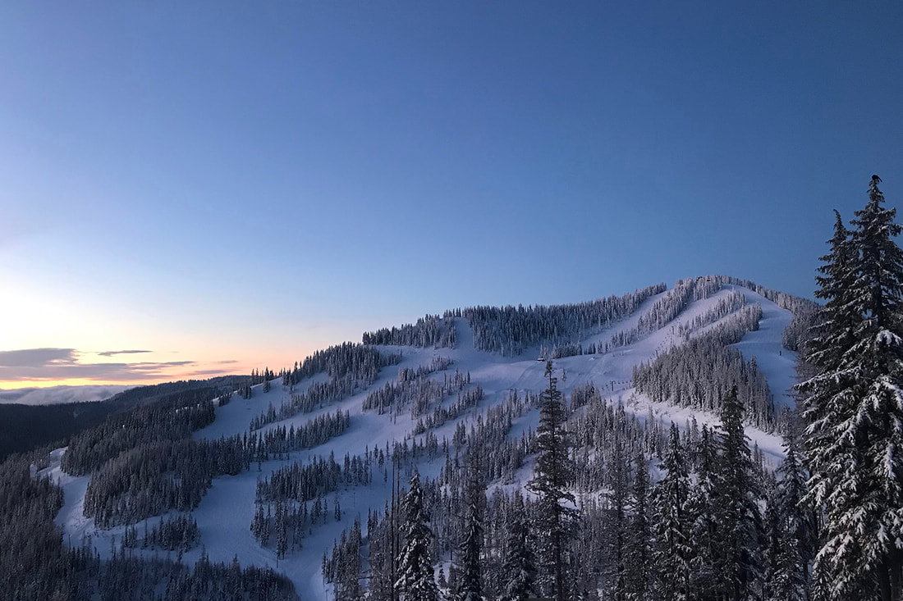
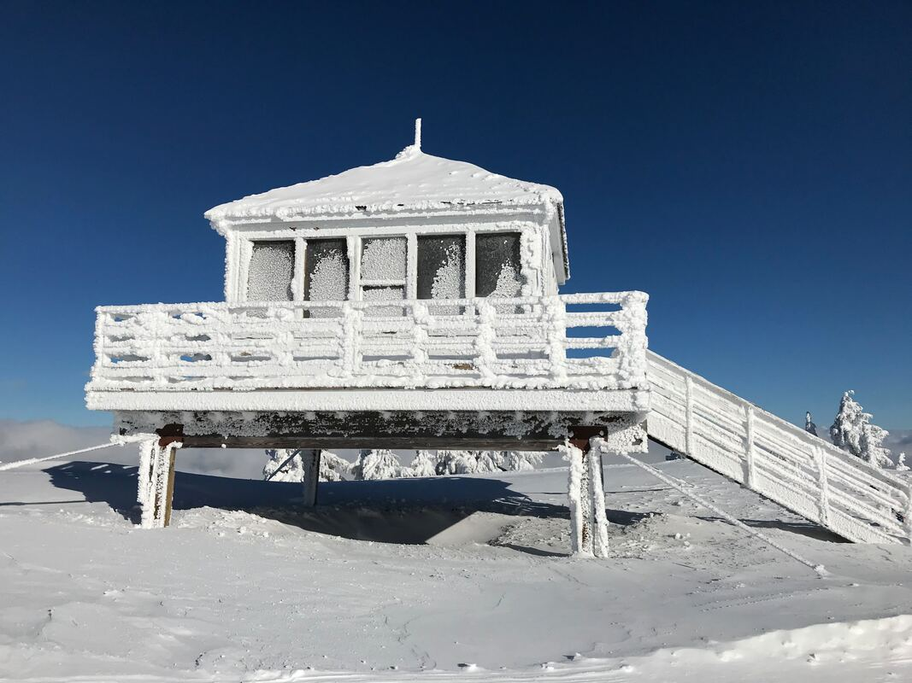
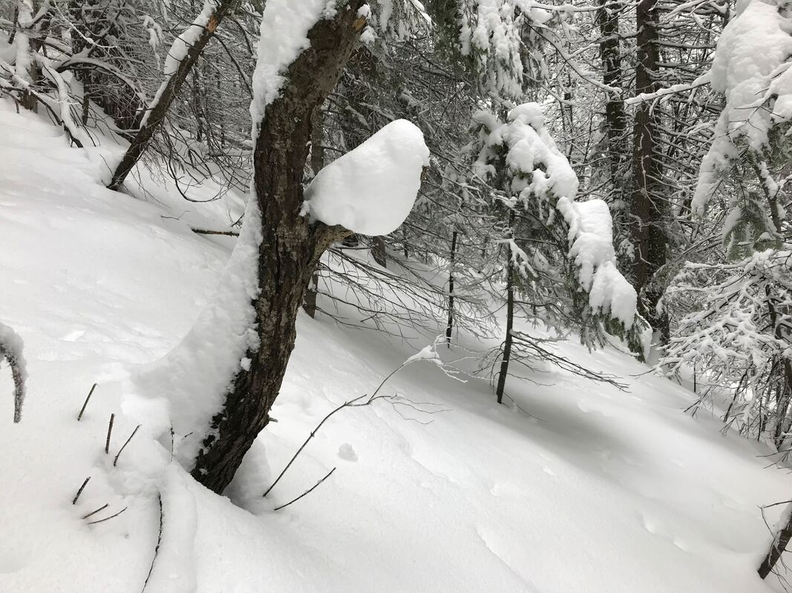
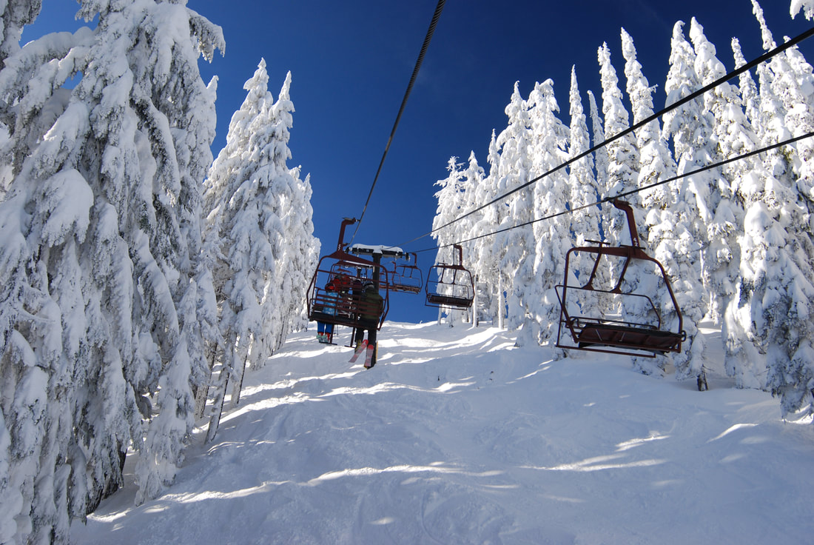
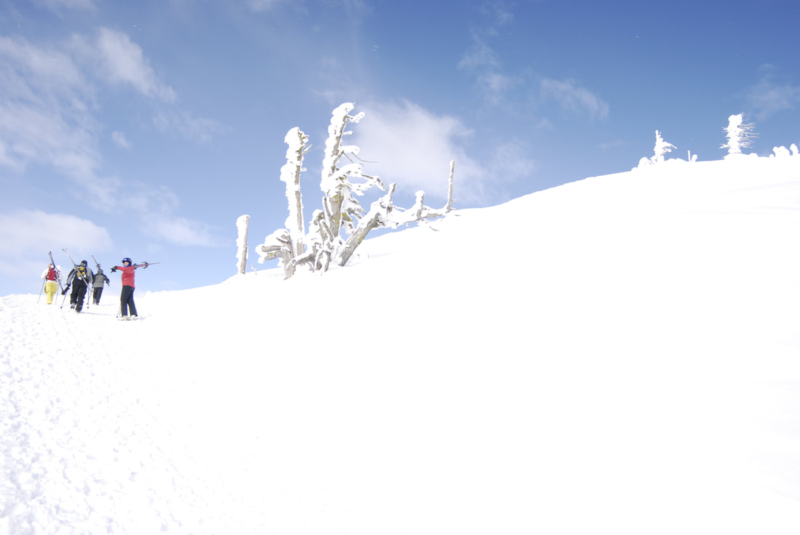
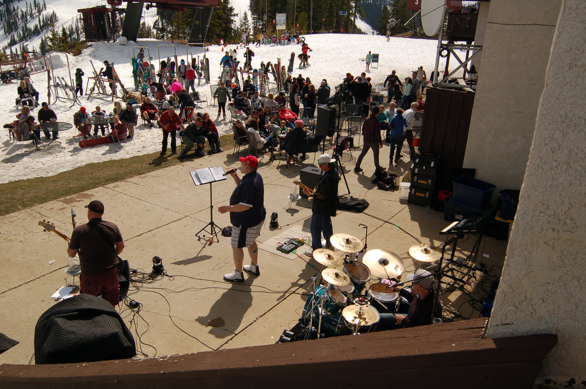

---
tags:
- Peaks & Mountains
stats:
- label: Phone
  icon: phone
  value: 208.783.1111
- label: Acres
  icon: vector-square
  value: '1600'
- label: Average Snow Fall
  icon: weather-snowy-heavy
  value: 300"
- label: Summit Elevation
  icon: terrain
  value: 6300'
- label: Base Elevation
  icon: terrain
  value: 4100'. mountain house 5700'
- label: Verts
  icon: arrow-expand-vertical
  value: 2200'
notes:
- Silvermt.com
---

# Silver Mountain Resort

## Silver mountain resort kellogg, id

## of named runs: 82

## of lifts: 7

Miles from spokane: 70 miles Other amenities: ss, tube, bc access, golf, water park, and condos

---

## Description

Silver Mountain is accessed by the U.S.'s longest single stage gondola. The Mountain House is located at
5700' or about midway in the ski area boundary.

Silver Mountain Resort is a four-season destination for the ultimate family vacation. We offer amenities
that are sure ot keep the whole family entertained, from Grandma and Grandpa all the way to the smallest of
kids. We offer skiing, snowboarding, snowshoeing, and snowtubing in the winter, with various hiking trails,
a world-class mountain bike trail system, and a mountainous 9-hole golf course in the summer. Our gondola,
built in 1990 and the longest single-stage gondola in the United States, is a beautiful 3.1 mile ride from
the town of Kellogg to the mountain house. We offer scenic gondola rides all summer and winter. Silver
Rapids Indoor Water Park, always a balmy 84 degrees and included in every lodging stay, is open year-round
and offers amenities such as a FlowRider, lazy river, several water slides, basketball hoops, and a large
kids area with a water bucket that dumps every 5 minutes. Ever skied and surfed in the same day? Visit
Silver Mountain Resort, where you can do both in under an hour!

---

## Photo gallery

---

### Picture (Image missing)

The pride of skiing at silver mountain is the fun of the riding in the longest single stage gondola in the

u.s.a. image

courtesy of silver mountain

### Picture (Image missing) Details

## While riding the gondola, wardner peak 6200' comes into view

### Picture (Image missing) Details (2)

## Chair 3 in the distance, with chair 4 in the foreground

## Kellogg peak's ski terrain Image courtesy of silver mountain

On top of kellogg peak is a replica of a fire lookout cabin On a sunny ski day, the temps are in the 70°
range and is a great spot to have lunch with a view

### Picture (Image missing) Details (3)

## Wardner peak with mount spokane in the distance

### Picture (Image missing) Details (4)

## Looking north north east from the lookout

## An illusive snowbird perched on a limb

### Picture (Image missing) Details (5)

Silver's backcountry south of the boarder A warning to snowboarders, do not go south out of bounds its a 1.2

mile walk

out

## The rimmed trees near the top of chair 2

## The gang onn the way to the top of wardner peak

### Picture (Image missing) Details (6)

## Face shots abound at silver mountain Image courtesy of silvermt

### Picture (Image missing) Details (7)

## Silver mountain hosts the special olympics trials

A day of skiing at ***Silver***, is like skiing in ***Heaven.*** You don't need ***Collateral***, to ski the
***Steep

and******Deep***. Just the ***North Star*** to guide you. You will experience ***Sheer******Bliss***, as you

shush the ***Solitude*** of***Wardner Peak***. You won't get the ***Shaft*** from a Shady Lady, a
***Bootlegger*** or

any other ***Jackass***. ***Eureka!!*** There's ***Gold*** in them thar hills. But you will not find a
***Claim******Jumper***,

unless you look closely. Whoever, you may find a ***Corkscrew*** or two, in ***Mogul's Bar***. ***16 to 1***

you will

find ***Heaven***, and you don't need***Collateral***or a ***Silver Belt***, to enjoy a ***Sunrise*** or a
***Sunset***. You won't find ***Terrible Edith*** in the ***Meadows***, or a***Fast Eddy*** like ***Tall

Paul*** on

the***Ridg***e. But you will find, if you look closely, ***Northern******Lights***, a ***Happy Jack***, and
a ***Silver Basin*** filled with pow. So Why Not ***Rendezvous*** with a ***Gem***, and don't just go
***Home James***, go

the ***Silver Mountain***. And don't forget the the ***Snow Tubing Hill*** or the ***Magic Carpet***
beginners

hill. You

don't need a ***Paymaster*** to ski at ***Silve***r, nor do you need ***Gold***. All you need to***Get

There***, is

your addiction to powder. After you have worn yourself out, ***Silver Rapid Waterpark*** can sooth those
sore

muscles

before you retire to your***Village*** condo. So load up that old ***Saddleback***car of yours, and set your
***T2d2***

navigation system east to ***Silver Mountain***.

chic. 1.26.2017

## Silver's spring party

### Picture (Image missing) Details (8)

## The party continues

What's new at silver mountain

We are always looking for new and innovative ways to improve the resort for season pass holders and guests.
There are quite a few new things for 2021. We purchased 2 brand new Pisten Bully snowcats for our grooming
fleet. One of them has a winch, so we will be able to groom steeper terrain. We are installing a new Jackass
Snack Shack near midway Chair 4 that will include a restroom. We purchased and installed a dynamic trail
map, situated outside of the mountain house, that shows which trails are groomed for the day. We purchased a
mulching tractor that has a winch, so we can mow the summer growth easier, especially on steeper terrain. We
also installed a brand new covered carped over the winter, which will shield beginner skiers and boarders
from the elements on the ride up. This will improve the beginner experience tremendously, hopefully
encouraging repeat visits and creating lifelong skiers and boarders. We are also part of the Powder
Alliance, which gives our season passholders 3 free tickets at 15 other resorts in the west.

We have some big plans for the future, some that are not able to be disclosed quite yet. Long term, we are
always looking to add more bike trails, and have plans to eventually expand our golf course to a full 18
holes.

the history of jackass ski bowl to silvermt.com

the legend In 1885, a gold prospector named Noah Kellogg borrowed a burro, named Bill, and started down the
great north fork of the Coeur d’Alene River. After weeks of searching with no luck, he ended up about 1,000
yards above the present city of Wardner where he made camp one last time before heading back to Murray to
report. In what turned out to be a fortunate stroke of luck, Bill broke free of his rope and wandered off in
search of food.

When Noah caught up with the jackass the next morning, he found Bill standing on a large outcropping of
galena (lead ore), leading to the formation of the Bunker Hill and Sullivan mines on September 4, 1885. The
Bunker Hill lode turned out to be Idaho’s largest mining operation, and today it is home to some of the
finest skiing and riding found in the Northwest. Bill lived to the rip old age of 21 and was forever known
as "the $12,000,000 burro."

### Picture (Image missing) Details (9)

the founding

The Jackass Ski Bowl, named in honor of Bill the burro, opened on December 16, 1967 after a group of 12 sole
proprietors formed the "Fabulous Valley Development Corporation," and sold shares of stock to fund the
construction of their new ski area. Valley residents traded work and cash for stock. Opening day at the
resort saw many recognizable names including, Rep. James McClure, Governor Don Samuelson, Sen. Len Jordan,
and Idaho Department of Commerce head, Louise Shadduck.

The first general manager, Gosta (Jonny) Johnson was a transplant from Big Boulder, PA and founder of the
Gosta Johnson Ski School. He oversaw the completion of the original ski area, which consisted of one Riblet
chairlift and the Tamarack Lodge, designed by local Coeur d’Alene architect, Robert Nelson. This
construction took place on lands owned by the Bunker Hill Mining Company, and in 1973, the Jackass Ski Bowl
fell into bankruptcy and was taken over by the Bunker Hill Mining Company.

### Picture (Image missing) Details (10)

silverhorn

The Shoshone Recreation Inc., a subsidiary of the Bunker Hill Co., purchased Jackass Ski Bowl at auction in
1973 for $100,100. They immediately changed the name to Silverhorn, and set out to build the old cat shop
still seen from midway Chair 4 today. With the collapse of the mining economy, Bunker Hill Mine was forced
to close the ski area in 1981. Fortunately, Bunker Hill Limited, formed by Jack Simplot, Duane Hagadone,
Harry F. Magnason, and Jack Kendrick, bought the ski area. However, in 1983, it was once again decided that
operation of the ski area would be discontinued due to rising costs.

Prior to closing the ski area, Bunker Hill Limited approached the city of Kellogg to determine if they had
any interest in operating the ski area. In 1984, the city entered into a lease arrangement with the mining
company giving the city the right to operate the ski area in exchange for the payment of all property taxes
levied against the ski area land and improvements. An adult lift ticket increased from $12 to $14 dollars
for the first time since the resort opened.

### Picture (Image missing) Details (11)

silver mountain resortDuring the mid-1980s, city councilman Wayne Ross came up with the concept of

constructing a

gondola from the valley floor to an expanded ski and summer resort area to stimulate a stagnating economy,
which was devastated by the loss of mining and logging jobs. The Gondola Board, comprised of Duane Little,
Terry Douglas, Dale Lavigne, Terry Turnbow, and three representatives from Von Roll Tramways, worked
tirelessly to attract funding for the gondola project. In December 1987, Congress approved a $6.4 million
grant to assist in the construction of the gondola. Von Roll Tramways, a Swiss lift manufacturing company,
agreed to guarantee the remaining funds needed to construct the gondola. In April 1989, ground was broken
for the construction of the gondola and other resort improvements.

The city of Kellogg renamed the original Jackass Chair to Chair 4 and expanded the ski area adding Chairs 1,
2, and 3, the Mountain House, the gondola terminals, Timbers Restaurant, parking lot, a slew of new ski
runs, and more. Chair 5 was later added along with the Amphitheatre, a new cat shop, and an eventual
expansion to the new lodge. Around town, the businesses embraced a Bavarian theme, adding murals,
gingerbread trim, and other design elements meant to mimic the alpine feel of Leavenworth, Wa.

Silver Mountain Resort opened for operations on June 30, 1990, to much fanfare. Concerts, hiking,
huckleberry picking, scenic chairlift and gondola rides, as well as mountain biking were all a hit in the
summer time. During the winter people flocked to the greatly expanded ski area, and were greeted with a
completely new experience. Everything from the ski runs, to the instructors jackets and lodge was fresh and
new.

### Picture (Image missing) Details (12)

eagle crest, inc.

Significant cost overruns during the construction phase of the project led to an insurmountable debt load
for the city. The City Council decided to search for a new owner, and in June of 1996, they agreed to sell
the assets of the resort to Eagle Crest, Inc., a wholly owned subsidiary of the JELD-WEN Corporation. When
Eagle Crest purchased the resort in 1996, it envisioned an exciting ski-in, ski-out resort, and set out to
construct the Morning Star Lodge condominiums, Galena Ridge Golf Course, and Silver Rapids Waterpark.

In the early 2000’s the Morning Star Lodge and Gondola Village complex began to take shape, followed in 2008
by the addition of Silver Rapids, Idaho’s Largest Indoor Waterpark, and the surface lift and winter tubing
park on top of the mountain. Business was booming, and the expansion was moving fast. The first nine holes
of Galena Ridge golf course were opened in 2010. As a result of a challenging financial climate, the ski in
ski out village and massive ski area expansion was put on permanent hold. Silver Mountain was officially
listed for sale, but continued operating and moving forward as Jeld-wen looked for a buyer.

Following the financial crisis, Silver Mountain continued operating year-round. Small improvements continued
to be made, and things started to pick back up. Moving forward, summer became an increasingly important part
of Silver’s business. In 2013 Silver Mountain relaunched their mountain bike program and officially opened
Silver Mountain Bike Park. Building on the remains of the previous bike trail network, Silver began rapidly
expanding their trail system, and revamping their mountain biking experience completely. Over the next four
seasons Silver Mountain was rated #1 in the Northwest three times, and became a host to many of the region’s
premier mountain bike events. From 2013 to 2016 Silver Mountain added new winter and summer events, cut new
ski runs, added an additional terrain park, and experienced a surge of popularity. With the incredible range
of activities offered, Silver was rediscovered as a year-round destination, and became a popular destination
for corporate groups and meetings.

### Picture (Image missing) Details (13)

new beginnings

In October of 2016 Silver Mountain was purchased by Tryg Fortun, a passionate skier and customer of Silver
Mountain. Tryg decided that he wanted to use his "stoke" for Silver Mountain to help the resort reach its
true potential. With a fresh leader and a new outlook on life, Silver Mountain has undertaken massive
amounts of infrastructure improvements, and behind the scenes work that is setting the stage for the next
chapter of improvement.

Since 2016, Silver Mountain has reopened the Jackass Snack Shack, added Mo’s Froyo & Jo, The Donut Hole, and
Silver Mountain Sports Shop to the village, and purchased and remodeled the Silver Inn, formerly the
Silverhorn Motor Inn. The resort has come a long way since it first opened but still maintains a piece of
its history with a Jackass Day celebration every year commemorating the original Jackass Resort and offering
discounted lift tickets.

### Picture (Image missing) Details (14)
