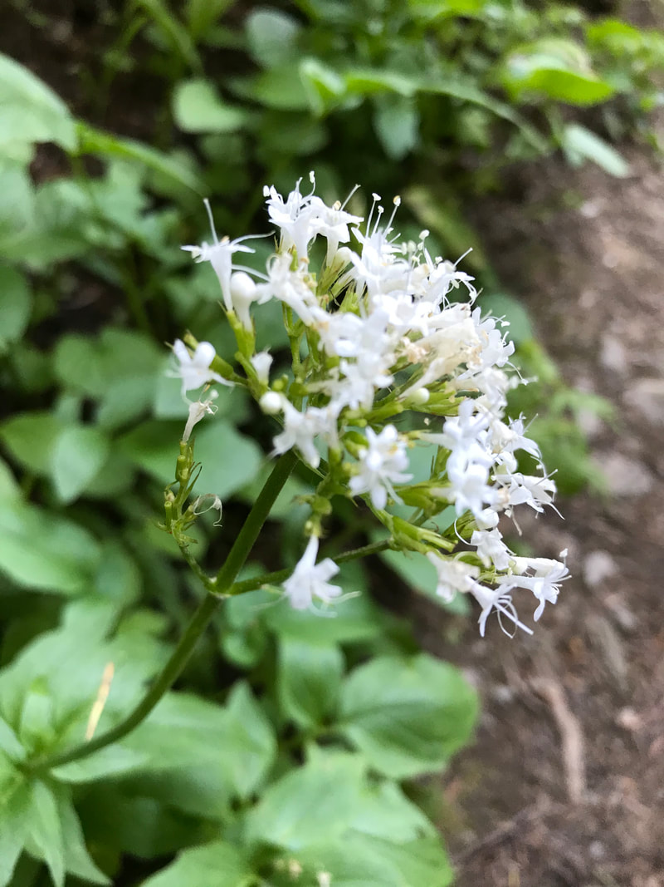

---
tags:
- Trails & Scrambles
stats:
- label: Genesis Name
  icon: book-open-variant
  value: Valeriana sitchensis
- label: Distribution
  icon: earth
  value: It is native to northwestern North America from [Alaska](https://en.wikipedia.org/wiki/Alaska)
    and northern Canada to [Montana](https://en.wikipedia.org/wiki/Montana) to northern
    [California](https://en.wikipedia.org/wiki/California)
- label: Season
  icon: calendar
  value: Mid summer July to August
- label: Medical Use
  icon: medical-bag
  value: Valerian has been shown to **encourage sleep, improve sleep quality and reduce
    blood pressure**. It is also used internally in the treatment of painful menstruation,
    cramps, hypertension, irritable bowel syndrome etc. It should not be prescribed
    for patients with liver problems.
- label: Poisonous
  icon: skull-crossbones
  value: Some caution is advised with the use of this plant. At least one member of
    the genus is considered to be **poisonous raw**[161] and V. officinalis is a powerful
    nervine and sedative that can become habit-forming. Moist open or wooded places
    at mid or upper elevations in the mountains, often in wet meadows.
- label: Edibility
  icon: food-apple
  value: '[Native Americans](https://en.wikipedia.org/wiki/Native_Americans_in_the_United_States)
    cooked and ate the roots, which have a poor scent.[[2]](https://en.wikipedia.org/wiki/Valeriana_sitchensis#cite_note-2)
    Some tribes also pounded the roots to make a poultice.'
- label: Features
  icon: information-outline
  value: '***Valeriana*** The root of **sitka valerian is edible cooked**. Having
    a strong flavor, it needs to be steamed for 24 hours. The seeds can be parched.
    Valerian is a well-known and frequently used medicinal herb that has a long and
    proven history of efficacy.'
- label: Leaves
  icon: leaf
  value: Leaves opposite, chiefly cauline, 2-5 pairs, the lowermost 1-2 pairs reduced,
    the others well-developed, petiolate, pinnatifid, the enlarged terminal segment
    up to 10 cm. long and 7 cm. wide, the 1-4 pairs of lateral segments up to 7.5
    cm. long and 4.5 cm. wide; upper leaves reduced and sub-sessile; all leaves and
    their segments usually wavy margined.
- label: Fruits
  icon: fruit-cherries
  value: Fruit an achene, 3-6 mm. long, ovate-oblong to ovate, glabrous.
notes:
- Based on the available research, **take 300 to 600 milligrams (mg) of valerian**
  root 30 minutes to two hours before bedtime. This is best for insomnia or sleep
  trouble. For tea, soak 2 to 3 grams of dried herbal valerian root in 1 cup of hot
  water for 10 to 15 minutes.
- label: valerian
  url: https://en.wikipedia.org/wiki/Valeriana
---

# Sitka Valerian

## Sitka valeriaan

## Description

Plants from a short, often branched rhizome. Stems 25–75 cm, glabrous except at the nodes. Basal leaves
absent or similar to but smaller than the cauline. Stem leaves petiolate; blades 6–15 cm long, with 1 to 4
pairs of lanceolate to ovate, crenate lateral lobes and a somewhat larger terminal lobe. Inflorescence
hemispheric, 2–6 cm across, puberulent. Flowers perfect; corolla white to pink, sparsely hairy, 5–8 mm long,
lobes less than half as long as the tube. Achenes lance-ovate, 4–6 mm long, glabrous. Erect sturdy stems,
most leaves along stem. Leaves deeply lobed or coarsely toothed, hairless to slightly hairy. Inflorescence
is tight head at stem top. Flowers white or pale pink tubes opening to 5 lobes, stamens and pistil extending
beyond lobes. Grows in wet places at mid- to alpine elevations. Common species in North Cascades

subalpine

meadows. Distinguished from *V. scouleri* by coarsely toothed leaf margins, more stem leaves, flowers more

often white

than pink.

---

## Photo gallery

---

