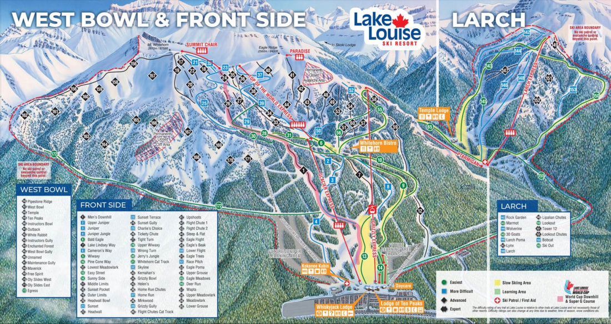

---
tags:
- Skiing & Snowshoeing
- Resort
- Winter Sports
stats:
- label: Phone
  icon: phone
  value: 877.956.8473
- label: Skiable Acres
  icon: vector-square
  value: 4,200
- label: Named Runs
  icon: slope
  value: '164'
- label: Lifts
  icon: gondola
  value: '11'
- label: Average Snowfall
  icon: weather-snowy-heavy
  value: 169"
- label: Summit Elevation
  icon: terrain
  value: 8,650'
- label: Base Elevation
  icon: terrain
  value: 5,400'
- label: Vertical Drop
  icon: arrow-expand-vertical
  value: 3,250'
- label: Distance from Spokane
  icon: map-marker-distance
  value: 354 miles
notes:
- label: Lake Louise Ski Resort Official Site
  url: https://skilouise.com
---

# Lake Louise Ski Resort

_Lake Louise Ski Resort_

## Description

Located in Lake Louise, Alberta (354 miles from Spokane), Lake Louise Ski Resort encompasses over 4,200
skiable acres with 164 named runs, 11 lifts, and 3,250 feet of vertical drop, complemented by world-class
alpine views.

Lake Louise has been a home to skiing since the 1920s as the gateway to the historic Skoki Ski Lodge. The
first lift was constructed in 1954, and a poma was added in 1960. Until autumn 2008, the ski resort was
owned and operated by the Resorts of the Canadian Rockies (RCR) company.

---

## Resort Overview & Updates

Lake Louise ski area was abuzz as a Bell 214 helicopter carried new towers and tower heads up to the site of
the **new Ptarmigan chair**, replacing the old lift of the same name. This new lift is a fixed-grip quad
with its drive station at the top, resulting in a more efficient lift that uses less power to run.

There is also excitement around the **change in ownership** at Lake Louise. Former owner Charlie Locke
bought back half the resort, separating it from RCR to operate as a stand-alone company. Local skiers are
optimistic about plans to build the terrain park to its former glory and potentially reopen the legendary
Sitzmark Pub.

---

## Photo Gallery

### To contribute images, please contact Chic via this website
