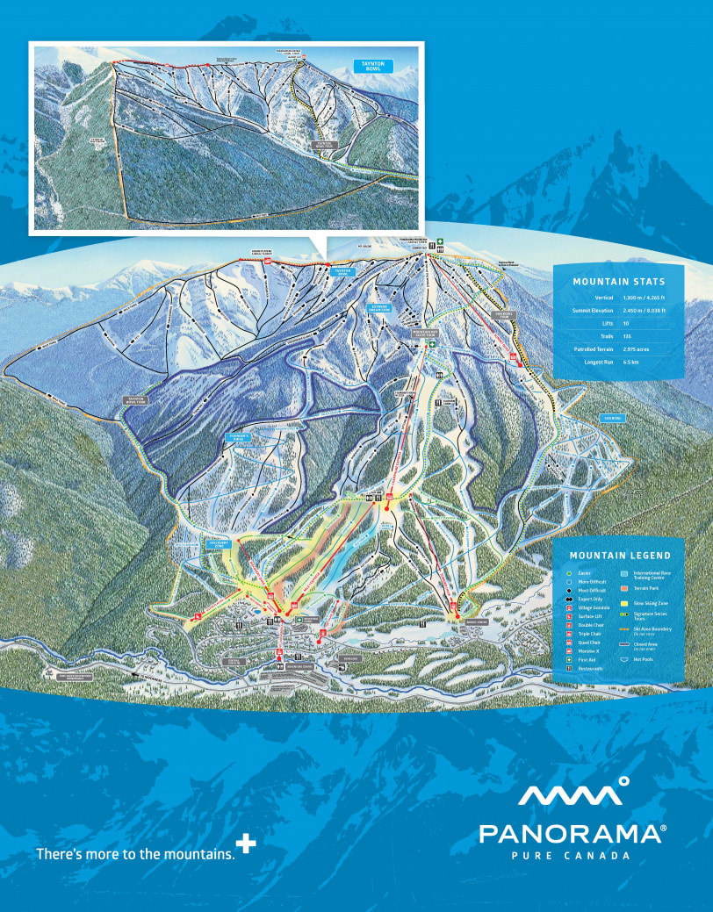

---
tags:
- Peaks & Mountains
stats:
- label: Phone
  icon: phone
  value: 250.342.6941
- label: Acres
  icon: vector-square
  value: '2975'
- label: Average Snow Fall
  icon: weather-snowy-heavy
  value: 204"
- label: Summit Elevation
  icon: terrain
  value: 8038'
- label: Base Elevation
  icon: terrain
  value: 3773'
- label: Verts
  icon: arrow-expand-vertical
  value: 4265'
notes:
- label: Panoramaresort.com
  url: https://panoramaresort.com
---

# Panorama Mountain Resort

_Panorama Mountain Resort_

## Panorama mountain resort panorama, b.c

## of named runs: 135

## of lifts: 10

Miles from spokane: 271 miles Other amenities: ???

---

## Description

Panorama offers one of the easiest mountain resort vacations you'll ever experience. Simply check in, ditch
your transportation and step out onto the mountain. Our intimate village has a great variety of restaurants,
retail therapy, pubs, and cafés. There is also free access to the hot pools for all resort guests, an
on-mountain massage and spa, plus a calendar packed full of events and activities.

---

## Photo gallery

The Past.The history of Panorama begins in 1959, when several local ski enthusiasts joined together to look
for a location for a local ski hill. After four years of searching, and several unsuccessful attempts, the
present location was established in 1962. The original facilities consisted of a warming hut, a rope tow
accessing what is known today as "Old Timer", and a parking lot. The area was named after the nearby
Panorama Plateau, a popular hiking area. The plan to establish the Panorama ski slope soon outgrew the
resources of its volunteers. A consortium of 12 local businessmen saw the potential of Panorama and formed
the Panorama Ski Hill Company Ltd in 1968. In 1969, they cleared several slopes and installed a massive
mile-long T-Bar, which at the time was among the longest in North America. During the early 70s, the
Panorama Ski Hill Company Ltd. continued to grow, with the addition of an A-frame day lodge for the new ski
shop and ski school. It soon became apparent, however, that an additional lift would be required to
accommodate the growing number of skiers. And with that in mind, water and electricity were provided for 75
lots in 1974, which were sold in the residential subdivision to finance the purchase of a double chairlift.
The Horizon Chair was installed in 1975 above the T-Bar, increasing Panorama's vertical drop to 3,200 feet
and accessing two super runs: Skyline and Roller Coaster. In 1978, Panorama was purchased by the
Calgary-based "Cascade Group", which saw the potential of the area as a major ski destination resort. With a
larger capital base, the Cascade Group developed a master plan for the resort to accommodate overnight
guests. Construction of the original village began in 1979 with the Toby Creek Lodge, followed by the
addition of the Horsethief Creek Lodge and the Pine Inn by 1982. The Cascade Group was also responsible for
installing the Toby and Sunbird Chairs in 1980, tennis facilities in 1982, an extensive snowmaking system in
1983, the addition of the Champagne T-Bar in 1984 for the first Men's World Cup Downhill, and a conference
centre in 1985. By the mid-eighties, the village could accommodate over 1,200 skiers in one of the most
unique destination resorts in North America. In 1988, the original giant T-Bar was replaced with Quadzilla,
a high-speed detachable quad that increased the total lift capacity to 7,000 skiers per hour. In 1993,
Panorama was purchased by I.W. Resorts Limited Partnership, a subsidiary of Intrawest Corporation. One of
Intrawest's first enhancements was the installation of the Summit T-Bar to the top of the mountain, bringing
Panorama's vertical drop to 4,000 feet and opening up a number of black diamond runs and gladed terrain for
advanced skiers and riders. By 1995, experts could ride over 200 acres of double black diamond terrain in
the new Extreme Dream Zone. In 1997, Intrawest unveiled a 10-year master plan, pledging to open more
terrain, improve snowmaking, develop an 18-hole championship mountain golf course, and create a rustic
village with restaurants and shops at the base of the mountain. Later that year, the old A-frame was
replaced by The Residences at Ski Tip, a multi-use facility that housed the new skier's day lodge, lift
ticket office, guest services desk, ski school desk, and a clothing & accessory store. In the late nineties,
Intrawest continued to grow Panorama, opening Tamarack Lodge, a retail and rental shop, a real estate
discovery centre, a ski and snowboard park, slopeside townhomes, a paved valley trail, the new Panorama
Springs and adjacent outdoor hot pools, a village gondola to link the lower and upper village, a central
check-in, and the much anticipated Greywolf Golf Course. In the new millennium, Panorama Mountain Village
saw the installation of two new high speed chairlifts, the terrain expansion into Taynton Bowl, the
construction of Taynton Lodge, 1000 Peaks Summit, 1000 Peaks Lodge, the Lookout, a new and improved terrain
park, and the development of a Bike Park in the summer months. On February 26, 2010, Panorama Mountain
Resort returned to local ownership when a group of investors from the Panorama community purchased the
resort. Panorama Mountain Resort is not simply about development anymore. In recent years, the company has
incorporated the innovative Project Planet and is committed to responsible environmental action. The latest
changes include the use of environmentally friendly products in all common areas, low-flow faucets and
toilets, and the use of 100% recycled paper in public washrooms. TodayWe've come a long way since the
original warming hut and rope tow. Panorama is now an international destination renowned for long descents,
incredible hot pools, jaw-dropping heli-skiing and amazing golf. The resort is located on British Columbia's
Powder Highway, at the heart of some of North America's best skiing. From the Calgary International Airport
(YYC, Calgary), drive 3.5 hours along one of the world's great mountain highways, through Banff and Kootenay
National Parks. Panorama is a two hours from Banff, Alberta and only 90 minutes from the Canadian Rockies
Airport in Cranbrook, British Columbia. The mountain rises a full 4,265 vertical feet above the village, but
it's not until you slide off the Summit Quad that the true scale of the terrain becomes apparent. All
around, as far as the eye can see, are snow covered peaks including the world-famous Rocky Mountains. The
mountain offers 2,975 acres of skiable terrain, ranging from endless corduroy cruisers, to 'backcountry
style' runs in Taynton Bowl - it's a former heli-skiing area. Panorama also boasts a custom designed
Discovery Zone,

perfect for

families and those learning to turn.

The regular ski and snowboard season lasts from mid-December to mid-April, although pre-season alpine ski
race training starts in early November. While Winter at Panorama is undeniably amazing, the mountain offers
exciting activities year-round. From mid-May to mid-October, the award-winning Greywolf Golf Course offers
signature holes in a spectacular alpine setting. By late-June, the Panorama Bike Park opens single track
trails with natural features, wide cruisers, and expert terrain with man-made stunts. Meanwhile, the less
adventurous can beat the Summer heat at the slopeside Panorama Springs pools and waterslide complex. Our
AccommodationPanorama Mountain Resort manages 13 condos, townhomes, and hotels, offering more than 400 rooms
for a maximum capacity of over 2,000 people. In addition, there is the Earl Grey Lodge Bed & Breakfast, and
a number of cabins and homes that are available as private rentals.

## To contribute, contact chic via this website
