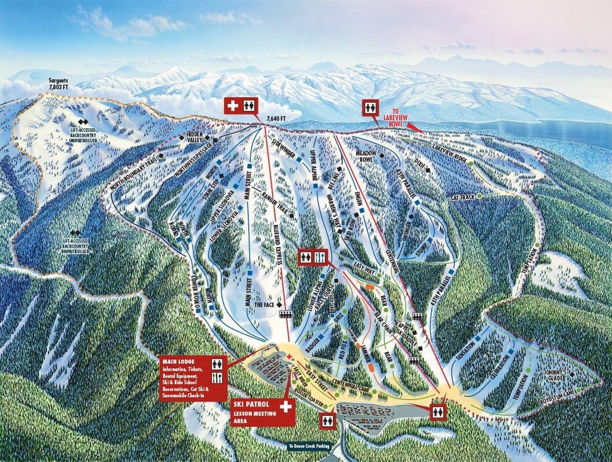
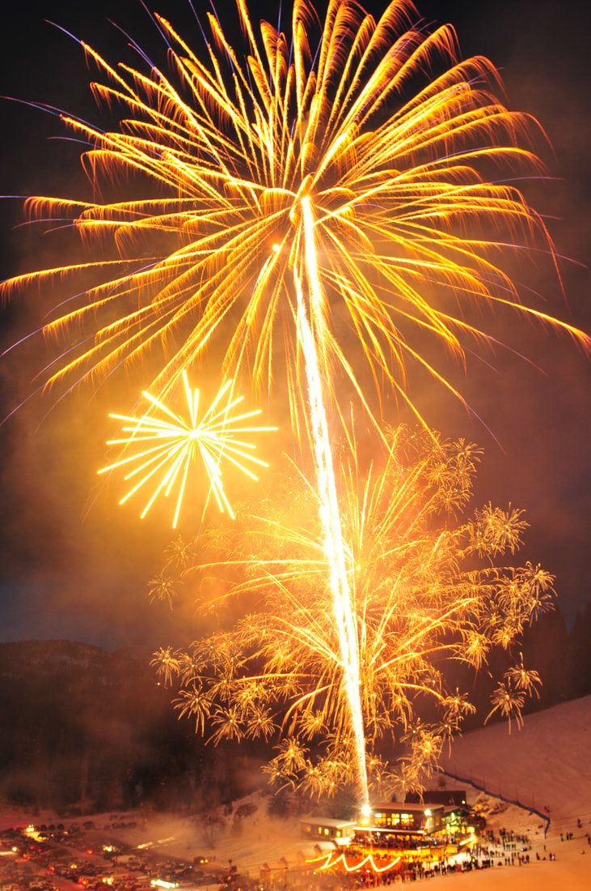
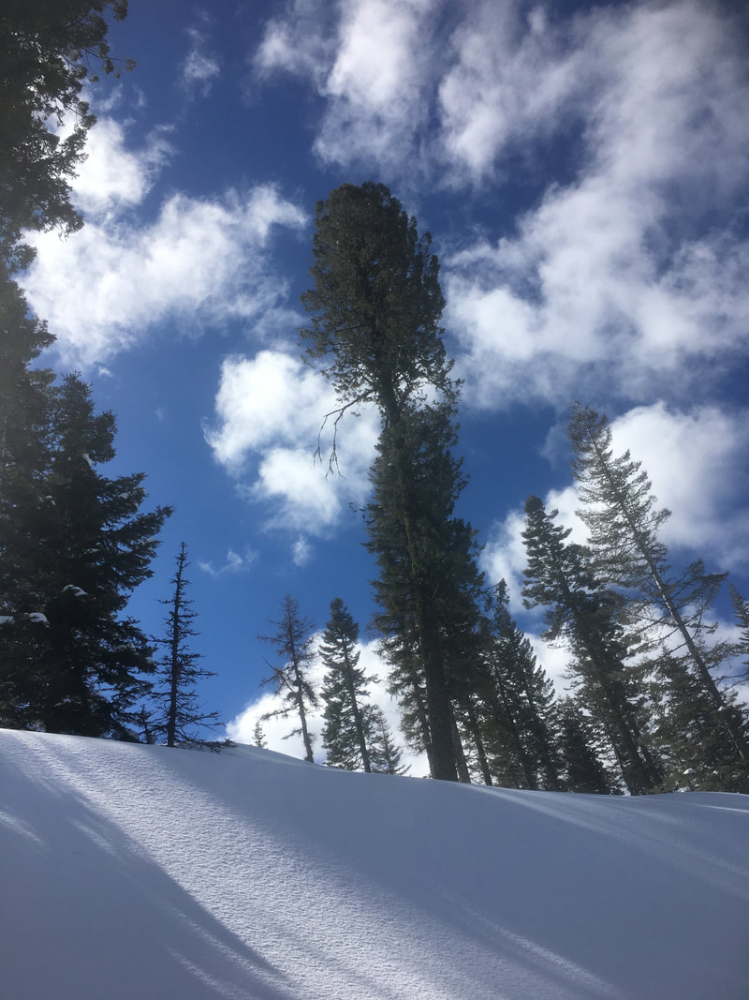
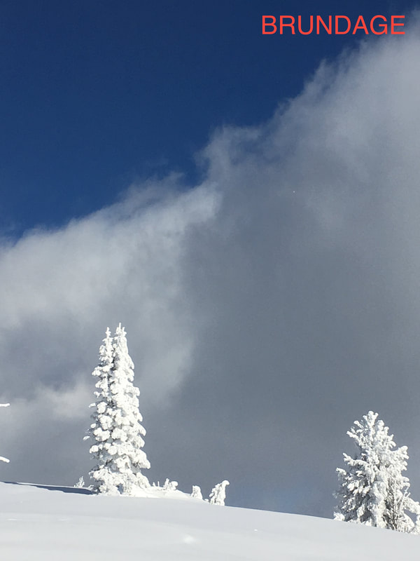
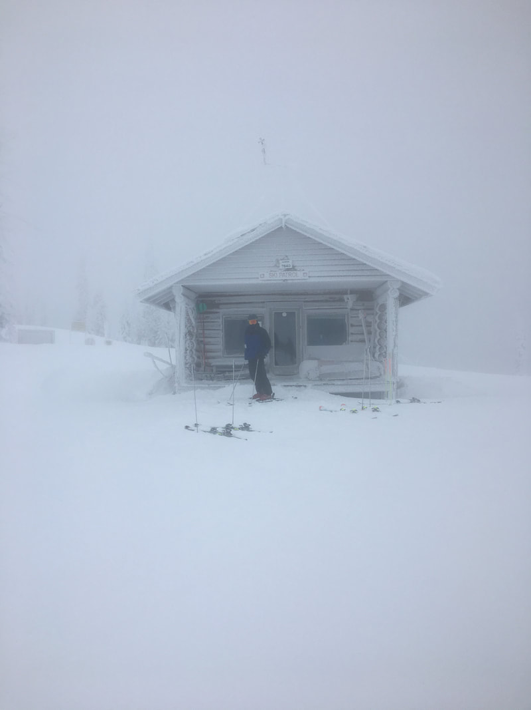
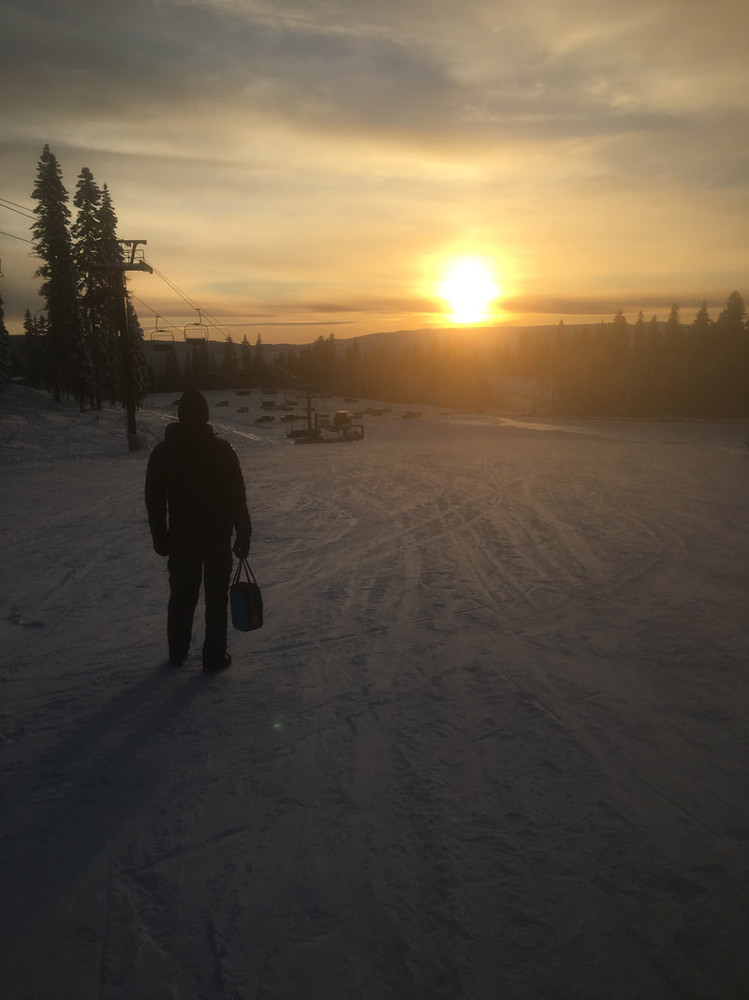

---
tags:
- Peaks & Mountains
stats:
- label: Phone
  icon: phone
  value: 208.634.4151
- label: Acres
  icon: vector-square
  value: 1920+420 bc
- label: Average Snow Fall
  icon: weather-snowy-heavy
  value: 320"
- label: Summit Elevation
  icon: terrain
  value: 7830'
- label: Base Elevation
  icon: terrain
  value: 5882'
- label: Verts
  icon: arrow-expand-vertical
  value: 1921'
notes:
- label: Brundagemountain.com
  url: https://brundagemountain.com
---

# Brundage Mountain Resort

_Brundage Mountain Resort_

## Overview

- **Location:** McCall, ID
- **Named Runs:** 68
- **Lifts:** 6
- **Distance from Spokane:** 259 miles
- **Other Amenities:** Lift-serviced backcountry skiing, guided SnowCat trips, snowmobile tours/rentals

## Description

Located high in the mountains of Central Idaho, independently owned Brundage Mountain is a classic Idaho Ski
Resort with amazing terrain and a friendly vibe. Brundage Mountain averages more than 320 base area inches
of snowfall annually and has earned an undisputed reputation for the Best Snow in Idaho™. In addition to
exceptional skiing and snowboarding, Brundage Mountain offers top-notch amenities, including guided SnowCat
Trips on 18,000 acres of backcountry terrain, guided snowmobile tours, snowmobile rentals, and more.

## Photo Gallery

_Light up the night on New Year's - Image by Mel & Tony Kozlowski_

_Lower section of run Temptation - Image by Mel & Tony Kozlowski, McCall, Idaho_

_Near the summit of Brundage Mountain - Image by Mel & Tony Kozlowski_

_Ski patrol hut on top of Brundage - Image by Mel & Tony Kozlowski_

_Easy Street after a day's work - Image by Mel & Tony Kozlowski_

## History

### The Early Years

The townspeople of McCall had a passion for skiing and ski jumping, dating back to the early 1900s.
Fortunately, two businessmen and a former Norwegian Olympic ski champion shared the same passion for the
sport. In 1959, businessman Warren Brown and Norwegian ski champion Corey Engen began discussing the need
for a steeper and larger ski mountain for the residents of McCall and the surrounding region.

After initial discussions and preliminary scouting trips with local US Forest Ranger Wally Lancaster, they
asked Jack Simplot to join the venture of opening a new ski area on Brundage Mountain. In two short years
the founders selected an ideal location for a ski resort, developed a master plan, arranged for financing,
and assembled the manpower to build a ski lodge, installed a chairlift, and cleared two runs that were
called North and South. Today they are known as Main Street and Alpine.

On Thanksgiving Day, November 27, 1961, Brundage Mountain Ski Resort opened to the public. 1,000 skiers
turned out for opening day and paid $4 a head for lift tickets. The 3,000 square foot "Triad Lodge" opened
the same day.

### Key Milestones

- **1976: A Double Double** - Skier capacity doubles with the addition of a new double chairlift, the
  Brundage Creek, which operated alongside the Pioneer Chairlift, also a double.
- **Early 1990s: Expanding Terrain, Guided Skiing & Mountain Biking** - The Centennial Triple Chair opened
  in November of 1990, expanding Brundage Mountain’s skiable acreage by more than 30 percent. The
  following year, Brundage opened lift-served mountain biking and scenic chairlift rides for the first
  time. In January 1991, Brundage introduced guided Snowcat Skiing on Sargents Mountain just north of the
  resort. In 1994, the Easy Street Triple chair was installed in the beginner area, and the lower, or
  "Centennial" parking lot was added at its base.
- **1997: Picking Up the Pace** - Brundage installs the Bluebird Express high speed quad, replacing both the
  Brundage Creek (’76) and Pioneer (’61) chairlifts and providing a seven-minute ride to the 7,640 foot
  summit of Brundage Mountain.
- **2006: Setting the Stage** - In August 2006, Brundage Mountain and the Forest Service finalized a
  long-awaited land swap. The product of a process started in 1992, the swap allowed Brundage to assume
  ownership of 388 acres at the base of the resort in exchange for 349 acres that the DeBoer Family
  (descendants of co-founder, Warren Brown) owned within national forest land. It also enabled the resort
  to leverage equity to finance new lifts and make improvements to amenities and operations.
- **2007: New Lifts, New Terrain** - Two new chairlifts opened during the bountiful 2007-2008 Winter season.
  The Lakeview Triple chair opened up 160 acres of south-facing terrain that overlooks scenic Payette
  Lake. The Bear Chair replaced a platter tow to provide easy access to several mid-mountain runs that had
  been underutilized. Total uphill capacity increased from 3,100 to 6,700 riders per hour. The Bear’s Den
  – an eight-sided D-log building – was constructed at the top of the Bear Chair and is used as a warming
  hut and food and beverage outlet.
- **2009:** Adams County approves a PUD (Planned Unit Development) on the private land in the base area,
  allowing for future construction of ski-in/ski-out lodging and expanded base area facilities.
- **2016:** Brundage Mountain launches Guided Snowmobile Tours on the Payette National Forest and also
  offers Snowmobile Rentals on site, with a reservation.
- **2017:** Brundage offers its first adventure dining experience with the four-course Bear’s Den "Dinner
  After Dark" Snowcat Dinners.
- **2020–2021: The Homegrown Vision Takes Flight** - In 2020, Brundage Mountain Holdings, led by long-time
  Board Member Bob Looper, assumes ownership of the resort several months after the death of former
  president Judd DeBoer. DeBoer’s favorite run, Lower Slobovia, is re-named Judd’s Gem in his honor. In
  2021, Brundage Mountain announces a three-part improvement plan that will span 10 years. Key features of
  the plan include new Day Lodge facilities, a 37-acre residential development with 89 units of
  ski-in/ski-out accommodations, and an updated Master Development Plan for the mountain.
