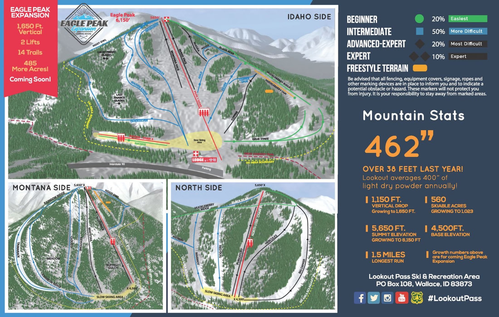
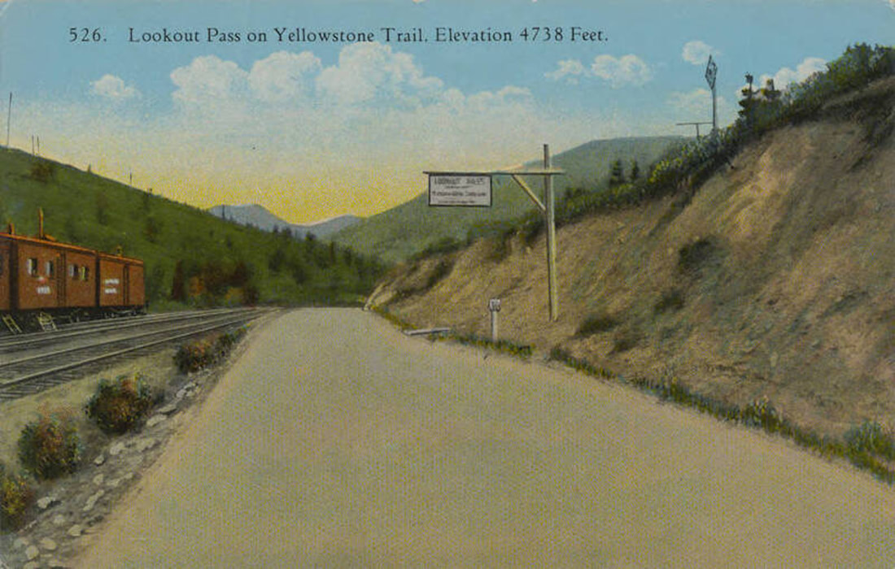
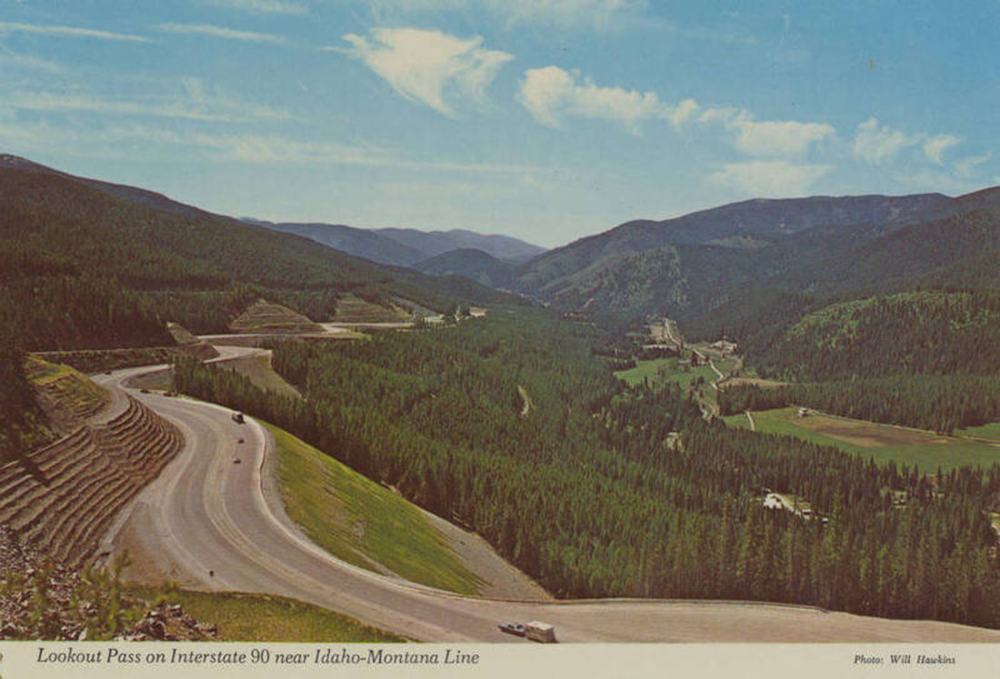
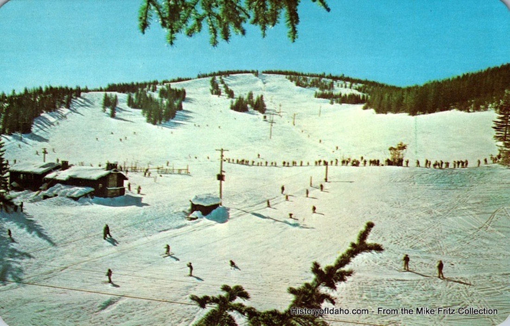
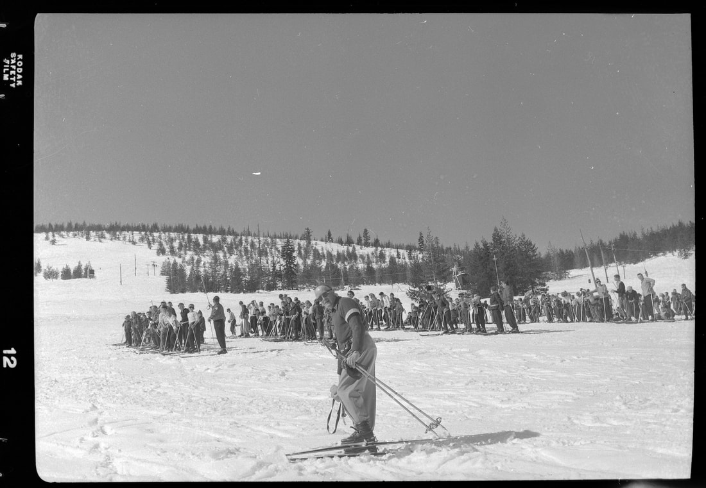
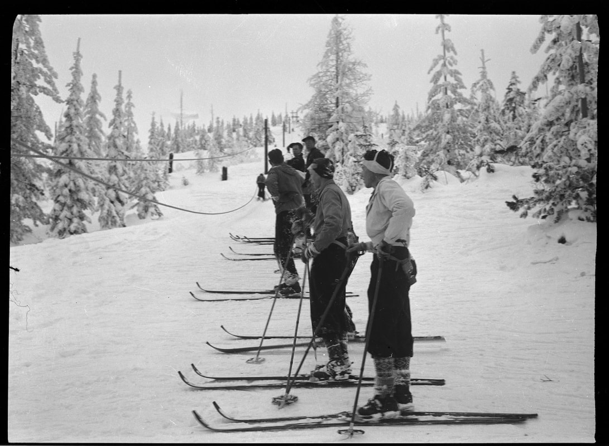
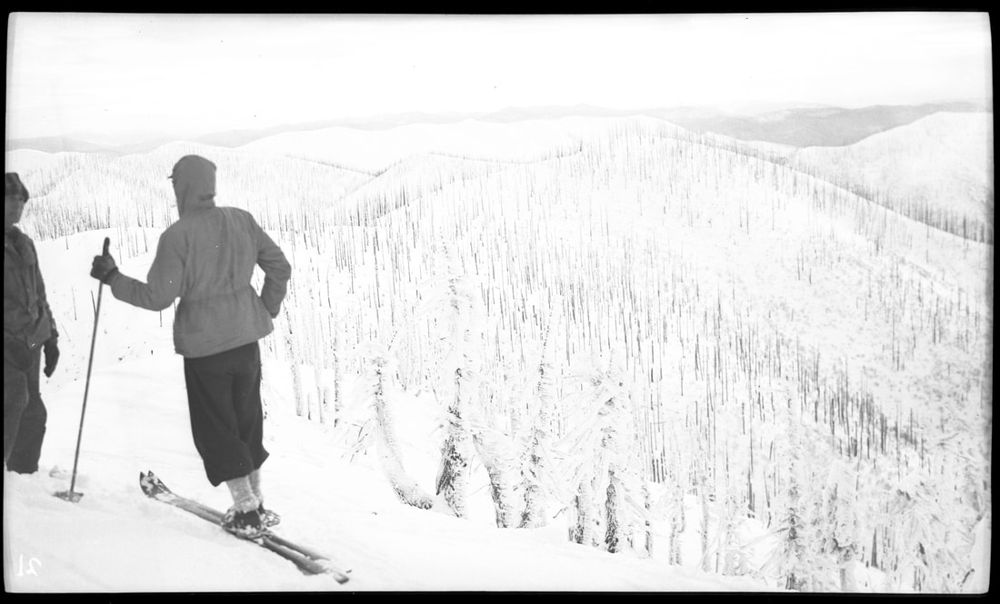
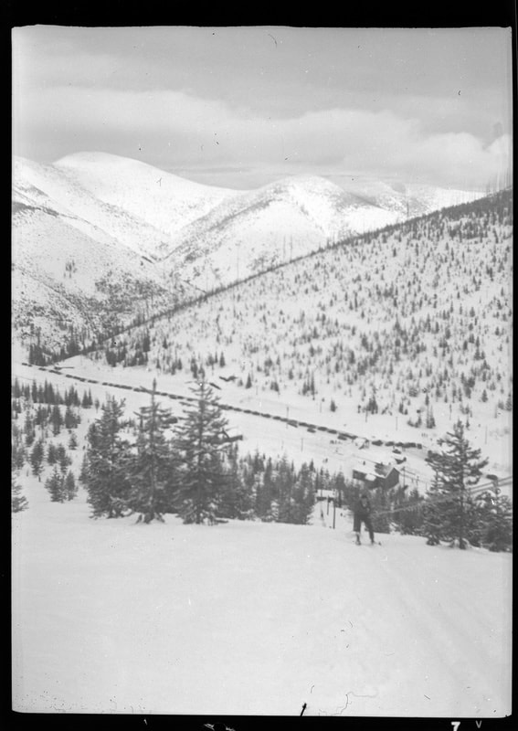

---
tags:
- Skiing & Snowshoeing
stats:
- label: Phone
  icon: phone
  value: 208.744.1234
- label: Acres
  icon: vector-square
  value: '1023'
- label: Average Snow Fall
  icon: weather-snowy-heavy
  value: 400+
- label: Summit Elevation
  icon: terrain
  value: 6150'
- label: Base Elevation
  icon: terrain
  value: 4500'
- label: Verts
  icon: arrow-expand-vertical
  value: 1650'
notes:
- label: Skilookout.com
  url: https://skilookout.com
---

# Lookout Pass Ski & Recreation Area

_Lookout Pass Ski & Recreation Area_

## Overview

- **Location:** Lookout Pass (Idaho / Montana Border)
- **Named Runs:** 52
- **Lifts:** 5
- **Distance from Spokane:** 94 miles
- **Summer Amenities:** Route of the Hiawatha scenic rail-to-trail bike trail

## Description

Lookout Pass operates the **Route of the Hiawatha - Scenic Bike Trail**, described as "The Most Scenic
Stretch of Rail-to-Trail Adventure in the Country". The trail features 10 dark tunnels and 7 sky-high
trestles along a 15-mile all-downhill route. Learn more at
[www.RideTheHiawatha.com](https://www.ridethehiawatha.com/).

## Master Development Plan & Expansion

Lookout Pass's long-range master plan includes expanding lift-served terrain by approximately 2,000 acres
onto two 6,200-foot peaks west-southwest of the existing ski area at the gateway to the St. Regis basin.

### Phase I Expansion

Approved by the U.S. Forest Service on May 19, 2017, Phase I increased the special-use permit area by 458
acres (expanding total acreage from 538 to 1,023 acres). Phase I includes two chairlifts to the summit of
Eagle Peak (top elevation 6,150 feet), accessing 14 new runs plus glades and raising total vertical drop to
1,650 feet. It also includes a 14,000 square foot base lodge in Idaho, maintenance facilities, and 130
additional parking spaces.

### Phase II Concept

Conceptual Phase II encompasses a new lodge and parking at the base of a second peak covering roughly 30
acres. The new base area would be accessed from Exit 0 on I-90 via old Highway 10. No real estate
development is planned.

## History of Lookout Pass

Lookout’s original historic base lodge built in 1941 is the second-oldest ski lodge in the Pacific
Northwest.

- **Winter 1935–36:** The Idaho Ski Club is born. Ski pioneers build a rope tow powered by an engine from an
  abandoned car found on the old Yellowstone Highway (now I-90) and use a highway maintenance shed as a
  warming hut.
- **1940:** Lookout’s Famous Free Ski School is founded. Over 80 years, volunteer instructors have
  introduced more than 75,000 youth to skiing and riding.
- **1941:** The Civilian Conservation Corps (CCC) and US Forest Service construct Lookout’s historic lodge.
- **1950s:** The volunteer Idaho Ski Club operates the hill and sells lift tickets for 50 cents.
- **1980:** Chair One is financed through contributions from local mining companies.
- **1992:** With the local mining industry in decline, a local group purchases the mountain to maintain
  operations.
- **1999:** Lookout Associates LLC acquires the mountain, initiating major terrain expansions and facility
  upgrades.
- **2003:** Timber Wolf double chairlift (Chair 2) opens on the Montana side, adding five runs and expanding
  vertical drop to 1,150 feet.
- **2005:** A three-story, 6,000 square foot lodge expansion opens with expanded dining, retail, and loft
  lounge.
- **2007:** North Star double chairlift opens expert terrain on the northern aspect.
- **2011:** U.S. Forest Service accepts Phase One of the long-range expansion plan.
- **2017:** Phase One expansion receives final USFS approval and trail cutting commences on Eagle Peak.
- **2018:** Lookout finishes the season with 503 inches of snowfall and sets attendance records on the Route
  of the Hiawatha.

## Photo Gallery

_The Original Lodge at Lookout Pass_

_Postcard Before the Ski Area Opened_

_Lookout Pass Postcard from the 1960s_

_Lookout Pass Lodge in the 1940s_

_Skiers Standing in Lift Lines_

_Bottom of the Rope Tow_

_Skier Haul on Rope Tow with Cars Parked on Highway 10_

## Contributing Photos

To contribute images, contact Chic via this website.
