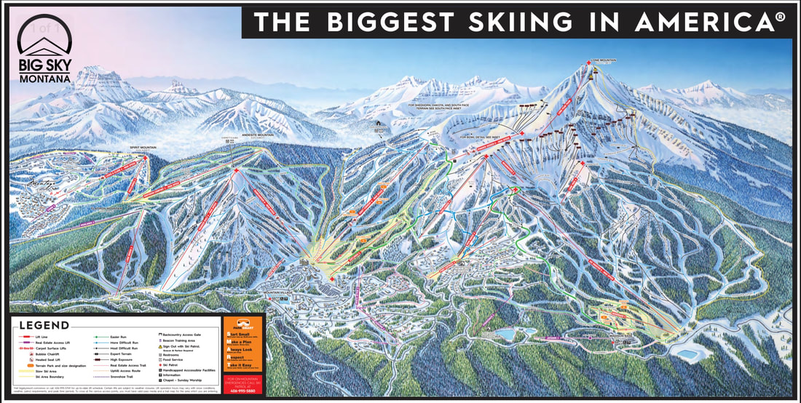

---
tags:
- Skiing & Snowshoeing
stats:
- label: Phone
  icon: phone
  value: 800.548.4486
- label: Acres
  icon: vector-square
  value: '5850'
- label: Average Snow Fall
  icon: weather-snowy-heavy
  value: 400"
- label: Summit Elevation
  icon: terrain
  value: 11166'
- label: Base Elevation
  icon: terrain
  value: 6800'
- label: Verts
  icon: arrow-expand-vertical
  value: 4350'
notes:
- label: Bigskyresort.com
  url: https://bigskyresort.com
---

# Big Sky Resort

_Big Sky Resort_

## Overview

- **Location:** Big Sky, MT
- **Named Runs:** 300
- **Lifts:** 39
- **Distance from Spokane:** 439 miles

## Description

Big Sky Resort offers expansive terrain, massive vertical drop, and legendary powder across Lone Mountain in
Montana.

## History

Though the U.S. acquired the territory that is now Montana with the Louisiana Purchase in 1803, it wasn’t
until the late 1890s that homesteaders started settling in the remote area that is now Big Sky. In 1902,
Augustus Franklin Crail set up his homestead that still stands today in Big Sky’s Meadow. For the next 70
years Big Sky was home to a small group of ranchers, and it wasn’t until 1973, when NBC newscaster Chet
Huntley opened Big Sky Resort, that Big Sky started to take the shape it holds today. Though making Lone
Mountain into a ski mountain was Huntley’s dream, he never saw it fully realized: Huntley died of lung
cancer in 1974.

Boyne USA Resorts then purchased the ski mountain in 1976, and Big Sky began to grow. In 1995, Big Sky
Resort built the Lone Peak Tram, increasing Big Sky’s vertical drop to 4,180 feet. In 2003, Moonlight Basin
opened on the North side of Lone Peak, and in 2006, the resorts partnered up to offer the Lone Peak Ticket,
creating the biggest skiing in America over the combined trails - 5,512 acres.

Today, Big Sky’s year-round population only adds up to about 2,200 residents. The ski mountain draws 400
more in the winter, plus hundreds of vacationing skiers. Still, slopes are rarely crowded and Big Sky holds
its authentic small-town vibe.

### Swift Current 6 Chairlift

#### North America’s fastest six-person chairlift debuts on Big Sky Resort’s opening day

*Big Sky, Mont. (November 25, 2021)* – Today at 9 a.m.,
[Swift Current 6](https://bigskyresort.com/swift-current-6), the fastest six-person chairlift in North
America, complete with heated seats and a weatherproof bubble, debuted on Big Sky Resort’s opening day. The
excitement was palpable as skiers and riders experienced the quick seven-minute ride on the resort’s most
popular chairlift.

"Now with two D-line lifts in the base area, it sets the tone for a world-class experience when guests
arrive at the resort," said Troy Nedved, general manager of Big Sky Resort. "We’re one step closer to our
goal to be the home of North America’s most technologically-advanced lift system."

Traveling at 1,200 feet per minute, Swift Current 6 is among the fastest chairlifts in the world. Between
both Ramcharger 8 and Swift Current 6, the chairlifts can quickly move up to 6,600 skiers per hour out of
the base area.

"We are proud to be part of the lift transformation happening at Big Sky," said Katharina Schmitz,
president, Doppelmayr USA. "Big Sky is on a path to rival the best lift systems in the world when the 2025
vision is completed," added Schmitz.

A Big Sky tradition, the Thanksgiving Day opening was well-attended by skiers and riders who explored more
than 100 acres of terrain across three chairlifts and three surface lifts.

"We’re grateful to all the teams involved in the installation of Swift Current 6," said Nedved. "To be
riding the lift today is the culmination of two years of planning and execution. It’s a pretty incredible
moment for us here in Big Sky."

## Photo Gallery

To contribute images, contact Chic via this website.
