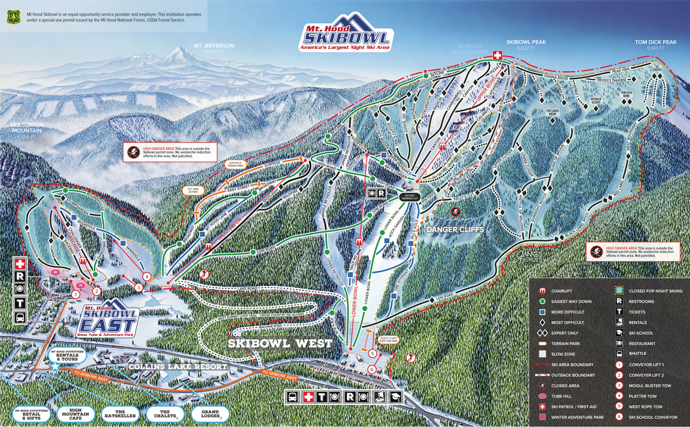

---
tags:
- Skiing & Snowshoeing
stats:
- label: Phone
  icon: phone
  value: 503.272.3206
- label: Acres
  icon: vector-square
  value: '960'
- label: Average Snow Fall
  icon: weather-snowy-heavy
  value: 300"
- label: Summit Elevation
  icon: terrain
  value: 5028'
- label: Base Elevation
  icon: terrain
  value: 3650'
- label: Verts
  icon: arrow-expand-vertical
  value: 1500'
notes:
- label: Skibowl.com
  url: https://skibowl.com
---

# Mount Hood Ski Bowl

_Mount Hood Ski Bowl_

## Overview

- **Location:** Government Camp, OR
- **Named Runs:** 69 Day / 36 Night
- **Lifts:** 4
- **Amenities:** Cross-country skiing, snow tubing, snowshoeing, sleigh rides, America's largest night
  skiing area

## Description

Mt. Hood Skibowl is less than an hour from Portland and offers some of the best terrain on Mt. Hood. The ski
area is known as
[America’s Largest Night Ski Area](https://www.skibowl.com/winter-activities/skiing-snowboarding.html#NightRiding),
featuring 36 lighted runs, 69 day runs, and the most lit black diamond runs in Oregon.

Offering terrain for all ability levels, the resort features an expansive outback area with choice gladed
terrain, steep slopes groomed to perfection by two state-of-the-art winch cats, and two progressive terrain
parks.

Mt. Hood Skibowl is an equal opportunity recreation provider operating under a special use permit from Mt.
Hood National Forest.

## Historical Timeline

Mt. Hood Skibowl’s origin dates back to 1928, making the resort one of the oldest remaining ski resorts in
the country. The ski area began as two separate resorts: Skibowl and Multorpor. While Skibowl’s name was
derived from the natural shape of its Upper Bowl, Multorpor’s name came from combining Multnomah County,
Oregon, and Portland.

- **1928:** The famous Jump Hill on Multorpor Mountain was developed by Everett Sickler.
- **1929:** The newly-formed Cascade Ski Club began holding competitions at Multorpor’s Jump Hill, gaining
  national recognition with an official National Ski Association event.
- **1935:** Work began on the Historic Warming Hut located on the shelf between Lower and Upper Bowl at
  Skibowl, completed in 1937.
- **1937:** The first rope tow was installed at Skibowl by French Boyd. The
  [Historic Mid-Mountain Warming Hut](http://www.skibowl.com/winter/mt-hood-warming-hut) served as the
  bottom terminal. If skiers carried a gallon of gas to the top for the automobile engine, they could ski
  for free.
- **1938:** Raymond Hughes built Multorpor Mountain’s first rope tow powered by a Dodge truck engine on the
  run now called Raceway.
- **1946:** The first Lower Bowl chair was installed by "Sandy" Sandberg using wooden lift towers.
- **1949:** Multorpor Lodge was built by George Beutler, and a Riblet double chair became the first chair to
  use steel towers.
- **1961:** The Multorpor Mountain Company erected the Multorpor Chair and constructed the A-frame addition
  to Multorpor Lodge.
- **1964:** Carl Reynolds and Everett Darr bought Skibowl and merged the two resorts as Multorpor Inc.
- **1965:** Multorpor Inc. installed a Riblet double chair on Lower Bowl.
- **1966:** Skibowl’s world-famous night lighting was installed.
- **1967:** The [Starlight Lodge](http://www.skibowl.com/winter/mt-hood-starlight-lodge) was built.
- **1975:** Current Upper Bowl chair installed; old chair moved to Skibowl East as the Cascade Chair.
- **1980:** Summer recreation began at Skibowl with the installation of the Alpine Slide.
- **1987:** Kirk Hanna purchased Skibowl and formed H-Ski Corporation, expanding night skiing to 34 lit
  runs, adding 300 acres in the outback, and remodeling the Historic Warming Hut.
- **1988:** Summer activities expanded with mountain biking, Indy Karts, miniature golf, and group
  recreation.
- **1993:** Skibowl purchased the first winch cat in the Northwest for grooming steeps and installed a
  100-foot Bungee Tower.
- **1998:** Lower Bowl chairlift rebuilt; Upper Bowl chair received a new drive and motor.
- **2005:** Multorpor Chair and Lower Bowl terminal rebuilt, rental shop remodeled, and bathrooms finished
  at the [Historic Mid-Mountain Warming Hut](http://www.skibowl.com/winter/mt-hood-warming-hut).
- **2006:** New Summer Tube Hill added to The Adventure Park at Skibowl East.
- **2009:** Major renovation to public areas and restroom facilities at Skibowl.

## Photo Gallery

## Contributing Photos

To contribute images, contact Chic via this website.
