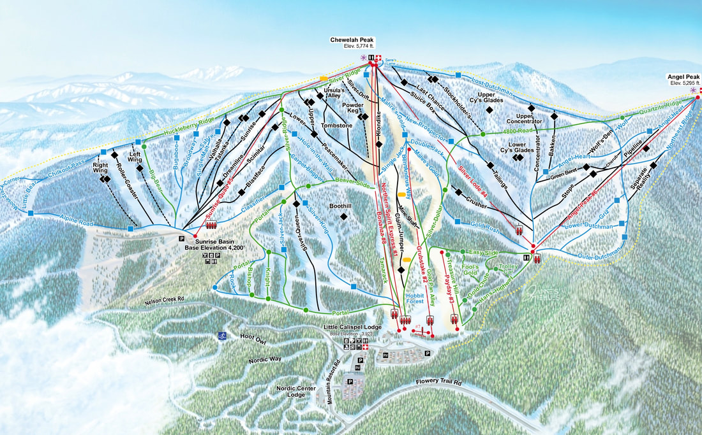

---
tags:
- Skiing & Snowshoeing
stats:
- label: Phone
  icon: phone
  value: 509.935.6649
- label: Acres
  icon: vector-square
  value: '2325'
- label: Average Snow Fall
  icon: weather-snowy-heavy
  value: 301'
- label: Summit Elevation
  icon: terrain
  value: 5774'
- label: Base Elevation
  icon: terrain
  value: 3923'
- label: Verts
  icon: arrow-expand-vertical
  value: '1851'
notes:
- label: Ski49n.com
  url: https://ski49n.com
---

# 49 Degrees North Ski Area

_49 Degrees North Ski Area_

## Overview

- **Location:** Chewelah, WA
- **Named Runs:** 86
- **Lifts:** 8
- **Distance from Spokane:** 59 miles
- **Other Amenities:** Cross-country skiing

## Description

49° North has replaced the old chairlift with a new High-Speed Quad.

## Photo Gallery

To contribute images, contact Chic via this website.
