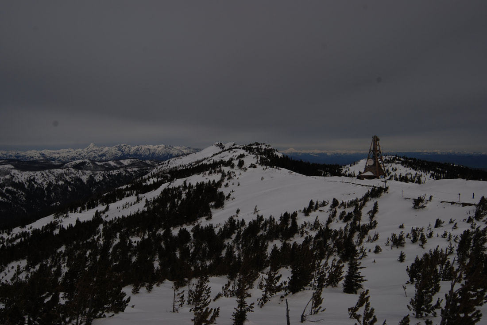
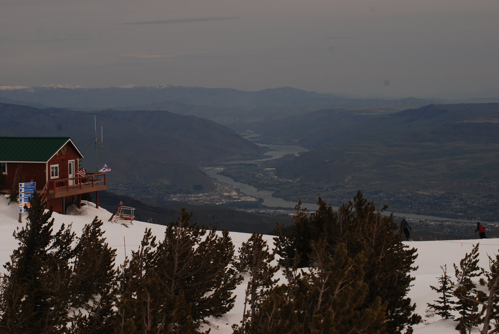
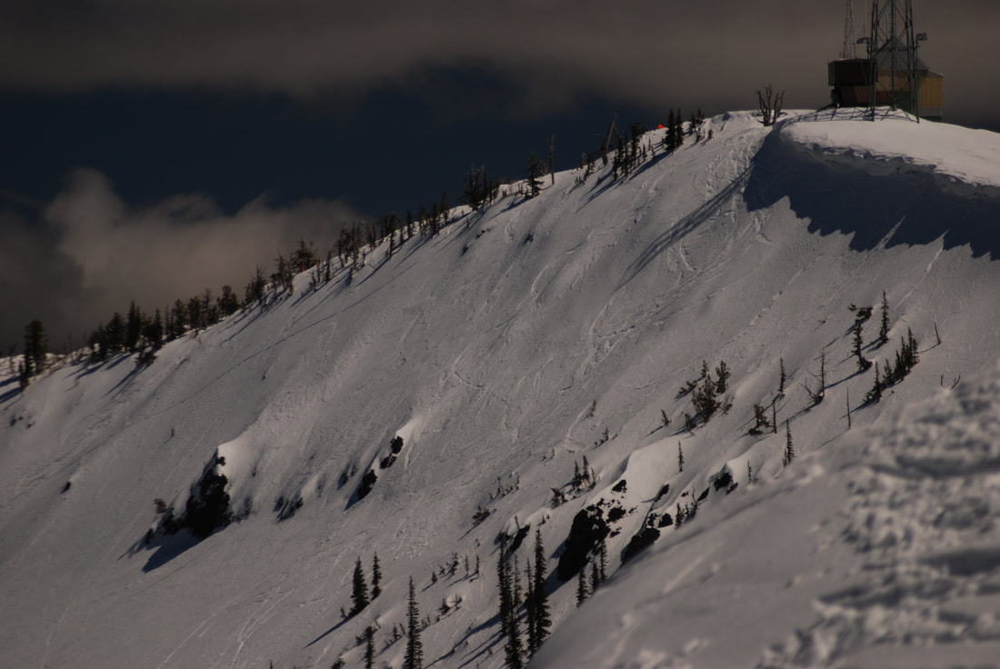
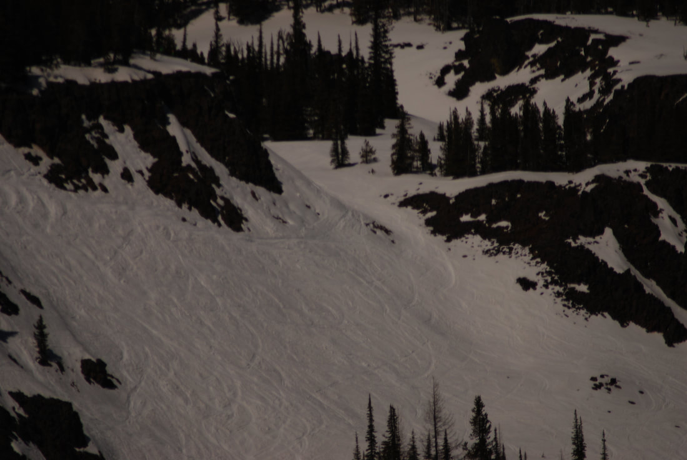
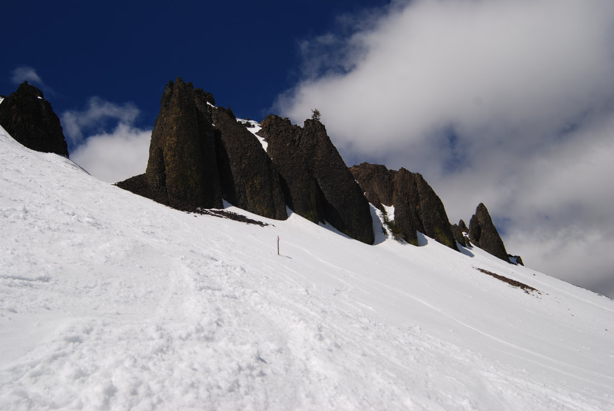
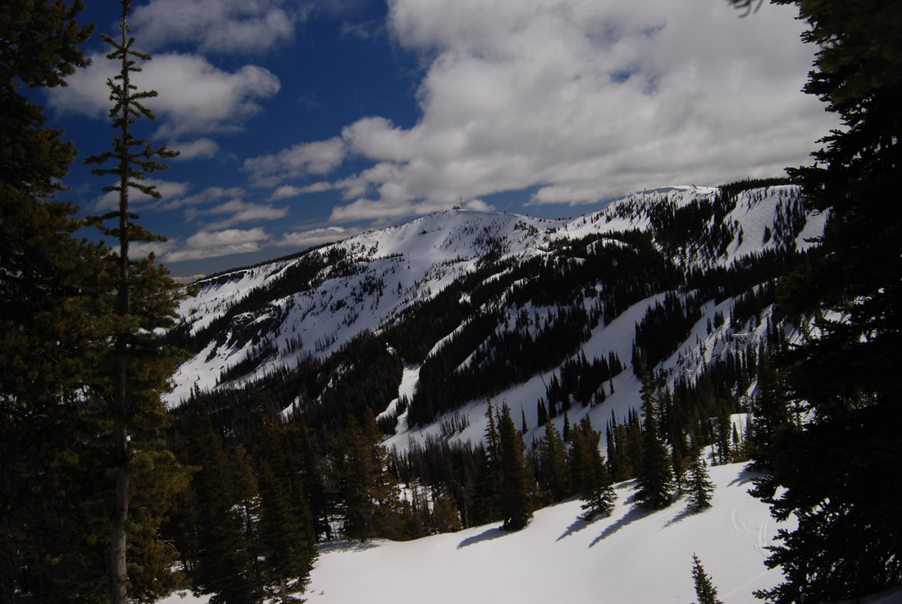
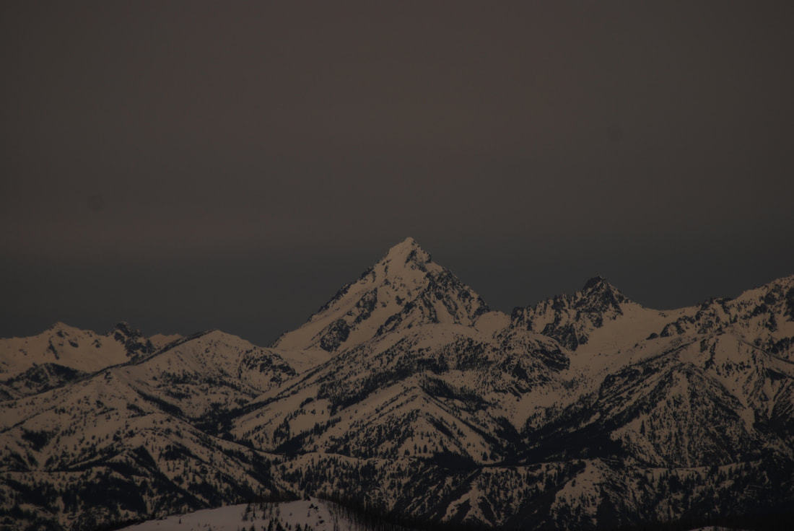

---
tags:
- Skiing & Snowshoeing
- Peaks & Mountains
stats:
- label: Phone
  icon: phone
  value: 509.663...
- label: Acres
  icon: vector-square
  value: '2000'
- label: Average Snow Fall
  icon: weather-snowy-heavy
  value: 200"
- label: Summit Elevation
  icon: terrain
  value: 6820'
- label: Base Elevation
  icon: terrain
  value: 4570'
- label: Verts
  icon: arrow-expand-vertical
  value: 2250'
notes:
- label: Missionridge.com
  url: https://missionridge.com
---

# Mission Ridge Ski & Board Resort

## Overview

- **Location:** Wenatchee, WA
- **Named Runs:** 36
- **Lifts:** 6
- **Distance from Spokane:** 180 miles

## Photo Gallery

_Top of Chair #2 with Mount Stuart on the Left_

_Summit of the Quad Chair with the Columbia River in the Distance_

_The Microwave along Windy Ridge_

_Part of the Bomber Cliffs_

_The Bomber Cliffs Chutes_

_Microwave Ridge viewed from Near the Bomber Cliffs_

_Mount Stuart Telephoto View_

## Contributing Photos

To contribute images, contact Chic via this website.
