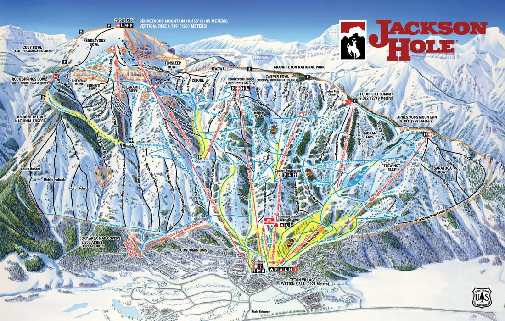

---
tags:
- Skiing & Snowshoeing
stats:
- label: Phone
  icon: phone
  value: 307.733.2292
- label: Acres
  icon: vector-square
  value: '2500'
- label: Average Snow Fall
  icon: weather-snowy-heavy
  value: 459"
- label: Summit Elevation
  icon: terrain
  value: 10450'
- label: Base Elevation
  icon: terrain
  value: 6311'
- label: Verts
  icon: arrow-expand-vertical
  value: 4139'
notes:
- label: Jacksonhole.com
  url: https://jacksonhole.com
---

# Jackson Hole Ski Resort

_Jackson Hole Ski Resort_

## Overview

- **Location:** Teton Village, WY
- **Named Runs:** 130
- **Lifts:** 13
- **Distance from Spokane:** 564 miles

## Description

John Simms of the Jackson Hole Mountain Resort Ski Patrol invented Life-Link's avalanche probe. He also
invented other avalanche forecasting equipment that he sold to Life-Link. John and fellow patroller Charlie
Sands, who started Sands Wild Water River Trips, were the first people to drop into the couloir adjacent to
Corbet's Couloir—giving it the name S&S Couloir.

Simms was not the only inventive patroller at JHMR. Bobbie Fuller invented a strap to keep his sunglasses on
that led to his early retirement. The straps are known as Croakies and are found all over the world. Most of
the runs at JHMR were named after the geographic features of the valley. The ridges are named for the early
mountain men who explored the area and the bowls are named for cities and towns in Wyoming. Over time,
almost every mountain feature has picked up a nickname, mostly for navigational purposes and for ski patrol
to locate lost or injured skiers.

## Historical Timeline

### Early Skiing in Jackson Hole (1930s–1940s)

- **1930s:** Banty Bowlsby and the Hicks brothers (Sam, Ed, and Joe) were known as the Hoback Boys. They
  were superb racers and fearless jumpers who put together a ski circus that included jumping through
  rings of fire. They used homemade skis with no ankle supports and single poles eight feet long! Banty
  went on to replace the base of skis with melted-down phonograph records.
- **1930s:** Teton Ski Club built lifts and cleared runs in Moose Creek, north of Victor, Idaho. Later, rope
  tows were installed on Signal Mountain, Leek's Canyon, Two Ocean Mountain, Angle Mountain, Catholic Bay
  on Jackson Lake, and Huckelberry Ridge on Moose-Wilson Road.
- **1930:** John Wayne's first speaking part was in *The Big Trail*, filmed in Jackson Hole. More than 15
  feature films have been made on location in Jackson Hole, including *Shane*, *Spencer's Mountain*, *Any
  Which Way You Can*, and *Rocky IV*.
- **1931–1932:** Fred Brown (16) and chief park ranger Allen Hanks were the first to ski into Grand Teton
  National Park.
- **1935:** Paul Petzoldt, his brother Curly, and Fred Brown enjoyed the first-known descent of Rendezvous
  Mountain, which would later become JHMR.
- **1936:** Betty Woolsey, Olympic ski team member, came to Jackson Hole to train.
- **1937:** Fritz Brown wrote a weekly column in the *Jackson Hole Courier* addressing skiing technique and
  equipment.
- **1937:** Fred Brown, president of the Ski Club, helped form the Jackson Hole Ski Association.
- **1937:** The first race was held on Snow King where skiers raced down a hiking trail cut by the Forest
  Service and Civilian Conservation Corps.
- **1937:** The Dartmouth Ski Team stopped at Fred Brown's ranch on their way to Sun Valley and demonstrated
  two-pole technique and fixed-heel bindings to over 200 spectators on Telemark Bowl.
- **1939:** Snow King opened as a ski area with the Old Man Flat Rope Tow.
- **1939:** Jackson Hole Ski Club hosted the first Tri-State ski meet, including skiers from Alta, Utah, and
  Sun Valley, Idaho.
- **1942:** Paul McCollister, a 27-year-old radio advertising salesman, set out on a fortuitous elk-hunting
  trip to Jackson Hole.
- **1945:** The Jackson Hole Winter Sports Association was formed in response to post-WWII ski popularity
  driven by veterans of the 10th Mountain Division.
- **1946:** Neil Rafferty installed the first chairlift in Wyoming on Snow King using truck wheels for drive
  ropes. Paul Petzoldt sought to create a rival ski area on Rendezvous Mountain.
- **1947:** McCollister returned to fish the Snake River and Yellowstone National Park.

### Jackson Hole Ski Corporation & Resort Opening (1950s–1960s)

- **1950:** John D. Rockefeller purchased and donated land to expand Grand Teton National Park.
- **1952:** McCollister purchased 21 acres above Antelope Flats and spent summers in the valley.
- **1953:** The Ski Club built the ski cabin northeast of Jackson Peak for backcountry journeys.
- **1955:** The famous theatrical "Shoot-Out" began on the Jackson town square.
- **1956:** After attending the 1956 Winter Olympics in Cortina d'Ampezzo, Paul McCollister retired to
  Jackson Hole to develop a major ski area.
- **1957:** McCollister purchased a 390-acre cattle ranch at the base of Shadow Mountain.
- **1959:** McCollister became Chairman of the Jackson Hole Corporation for ski area development.
- **1960:** Barry Corbet accompanied McCollister on his first descent of Rendezvous Mountain. Looking into
  the couloir, Corbet stated, "Someday, someone will ski that—it will be a run."
  ([Watch/Buy the documentary *Someday Somebody Will Ski That*](https://vimeo.com/ondemand/corbetscouloir)).
  Patrolman Lonnie Ball made the first plunge into Corbet's Couloir after a cornice broke, and Barry
  Corbet skied it a couple years later.
- **1961:** McCollister purchased land at the base of Rendezvous Mountain for $1,355 an acre.
- **1962:** Willy Schaeffler assessed avalanche potential on Rendezvous Mountain.
- **1963:** McCollister formed the Jackson Hole Ski Corporation with partners Alex Morley and Gordon Graham.
- **Spring 1964:** Construction of JHMR commenced, including the original Aerial Tram.
- **1965:** Après Vous Mountain opened to the public. Lienz, Austria, became Jackson Hole's sister city.
- **1966:** The original Jackson Hole Aerial Tram opened to Rendezvous Mountain summit (10,450 ft), holding
  52 passengers.
- **1966:** Pepi Stiegler (1964 Olympic slalom gold medalist) was hired as Ski School Director. Patrolman
  Dick Porter survived a 55-minute avalanche burial in Dick's Ditch.
- **1967:** Jackson Hole hosted the Wild West Classic, concluding the inaugural World Cup season.
  Jean-Claude Killy said, "If there is a better ski mountain in the United States, I haven't skied it."
- **1968:** JHMR hosted its first downhill race.
- **1969:** Grand Targhee opened on the western side of the Teton Range.

### National & International Growth (1970s–1980s)

- **1970:** The first national Powder 8 Championship was held at Jackson Hole.
- **1971:** Bill Briggs completed the landmark first ski descent of Grand Teton.
- **1977:** Voyager II launched with an Ansel Adams photograph of the Tetons and Snake River aboard.
- **1978:** Melissa Malm became the first woman on the Jackson Hole Ski Patrol.
- **June 1989:** President George H.W. Bush delivered a major environmental speech in Grand Teton National
  Park.
- **July 1989:** The New York Philharmonic held a summer residency performing benefit concerts for the Grand
  Teton Music Festival.
- **September 1989:** U.S. Secretary of State James Baker and Soviet Foreign Minister Eduard Shevardnadze
  held a summit on Jackson Lake.
- **December 1989:** New tram car cabins were installed.

### Modern Era & Infrastructure (1990s–Present)

- **1992:** Paul McCollister sold Jackson Hole Ski Corporation to the Kemmerer family. John Resor became
  President.
- **1994:** Olympic gold medalist Tommy Moe became JHMR Ambassador.
- **1995:** Jerry Blann named President of JHMR.
- **1996:** U.S. Forest Service approved the updated Mountain Master Plan, setting daily skier capacity at a
  comfortable 7,690.
- **1997:** Teewinot high-speed quad opened and Après Vous chairlift was upgraded to a high-speed quad.
- **Winter 1997–1998:** Bridger Gondola and the 37,000 sq ft Bridger Center opened.
- **1999–2000:** Backcountry gate system launched, opening thousands of acres of backcountry access.
- **2003:** Four Seasons Resort Jackson Hole opened as its first ski destination resort.
- **2004:** The Crags area opened 200 acres of expert terrain.
- **2006:** The original Aerial Tram retired after 40 years for replacement. JHMR achieved ISO 14001
  environmental certification.
- **December 20, 2008:** The new $32 million Aerial Tram opened, carrying 100 passengers 4,139 vertical feet
  in 9 minutes. ([Watch/Buy *Cable to the Sky*](https://vimeo.com/ondemand/cabletothesky)).
- **2011:** Jackson Hole Bike Park opened. Snowmaking expanded to 210 acres.
- **2012:** Casper chair replaced with a high-speed quad. Mountain Collective™ pass alliance launched with
  Aspen/Snowmass, Alta, and Squaw Valley.
- **2013:** JHMR named #1 Overall Resort in North America by *SKI Magazine*.
- **2015:** Teton Lift added for 50th Anniversary season.
- **2016:** Sweetwater Gondola opened with Solitude mid-station.

## Photo Gallery

## Contributing Photos

To contribute images, contact Chic via this website.
