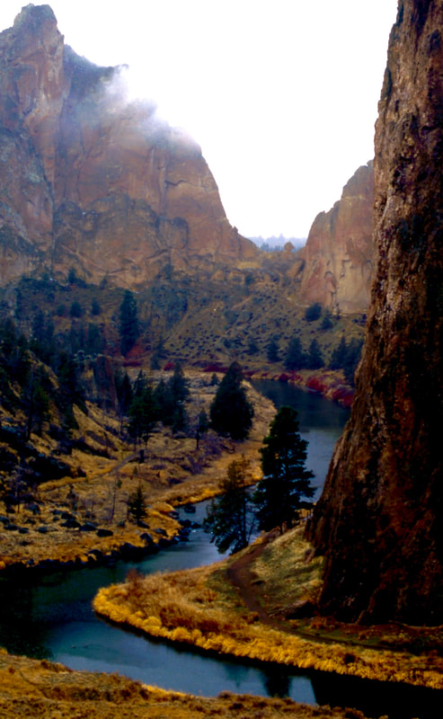
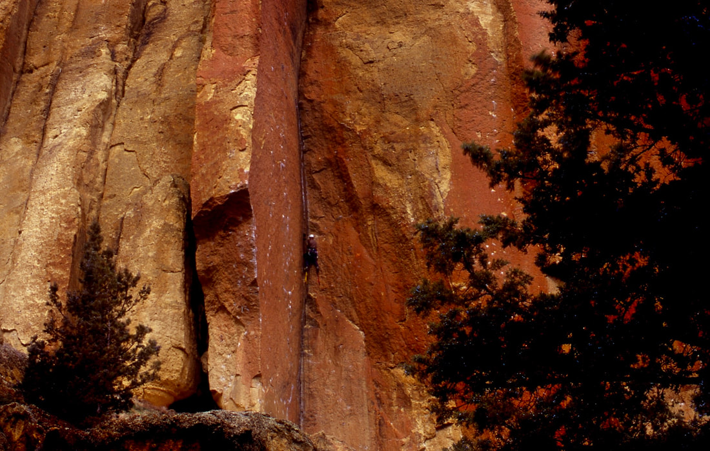
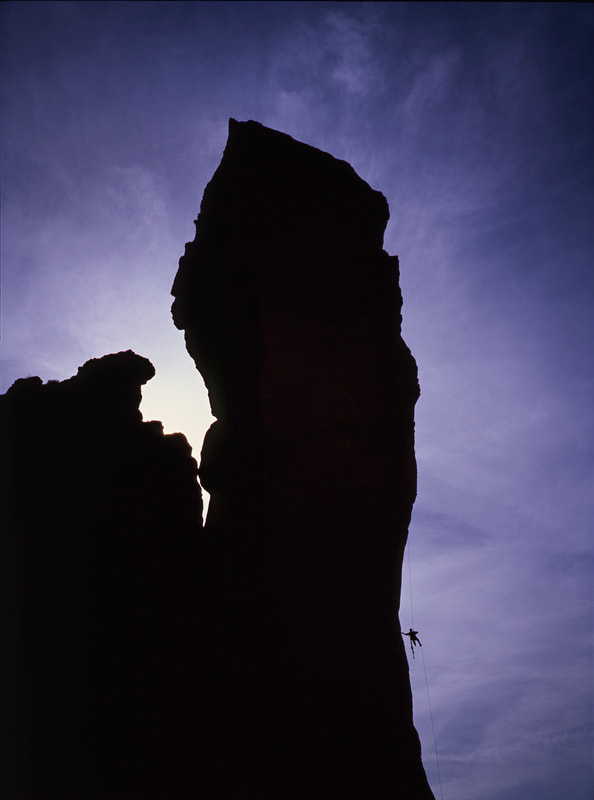

---
tags:
- Trails & Scrambles
- Moderately Easy
- Hiking
- Paddling
- Climbing
stats:
- label: Event Type
  icon: hiking
  value: Hiking, paddling, & climbing
- label: Distance
  icon: map-marker-distance
  value: 4.5 mile RT loop
- label: Elevation
  icon: terrain
  value: 1150' cumulative gain.
- label: Difficulty
  icon: speedometer
  value: Moderately easy
- label: Maps
  icon: map
  value: Smith Rocks State Park
- label: GPS
  icon: crosshairs-gps
  value: 44° 21’ 32"n 121° 09’ 00"w
- label: Sisters Ranger District
  icon: pine-tree
  value: '[541.549.7700](tel:541.549.7700)'
- label: Deschutes County Sheriff
  icon: shield-account
  value: CALL 911 FIRST or [541.388.6655](tel:541.388.6655)
---

# Smith Rocks

## Description

We have added the areas sheriff’s emergency phone numbers for each trip write up under the ranger district
info. if an emergency ocurrs, evaluate your circumstances and call only if needed. Features: This is one of
the most popular hiking and rock climbing areas in Oregon. After one visit, you'll see why. Thisplace is
just plain fantastic! I did the hike clockwise. Beginning at the main parking area, I went east toward the
picnic area, then to the main trail. The trail drops about 140'to the Crooked River Canyon below. Then it
crosses the river via an excellent bridge. After crossing the bridge, you have two main choices. If you only
want to get to the top of the mountain in front of you, just keep straight ahead, and climb 700 feet and
about three quarters of a mile later you will be on top. If, on the other hand, you'd like to do a fun loop
hike, which will include getting to the top of Misery Ridge, then bear left and follow the trail along the
Crooked River. It is about a mile and a half to the base of Monkey Face, which is a 400 foot verticle spire.
You then can climb through a series of well placed switchbacks to the top of Misery Ridge. From there you
can complete your loop hike by following the trail back down to the bridge where you began the loop. There
are alot of wonderful things to enjoy here at Smith Rock. Each season will offer appropriate opportunities
to satisfy your desire for a great day in the out-of-doors. You can't go wrong with a trip to Smith Rock
State Park! enjoy.

---

## Directions

From Biggs Junction on the Columbia River, drive south on U.S.97 to Terrebonne. Turn left onto Smith Rocks
Way to Lambert Road. Lambert Road becomes N.E. Wilcox Ave., and drive east to the Canyon Trail parking area.

---

## Cool things close by

Warm Spring Indian Reservation, Mount Hood, Hood River, Columbia River, and the Columbia River Gorge. Near
Salem is the Silver Falls State Park. Also nearby is Clear Lake. Rent a canoe and paddle this very unusual
clear lake.

## Hazards

All climbing areas have hazards. Be cautious while in the Smith Rocks State Park.

## R & P

NA

## Photo gallery

*Picture (Image missing)*

---

## Snoopy hangs out in one of the areas of smith rocks

*Picture (Image missing)*

## The north end of smith rocks

---

Smith rocks has some of the best climbing rocks in the west. in spring & fall, these routes are filled with
the world's best rock climbers

---

*Picture (Image missing)*

## Snoopy resting after a hard climb

## Monkey face is a very technical aid route along the north end of misery ridge
