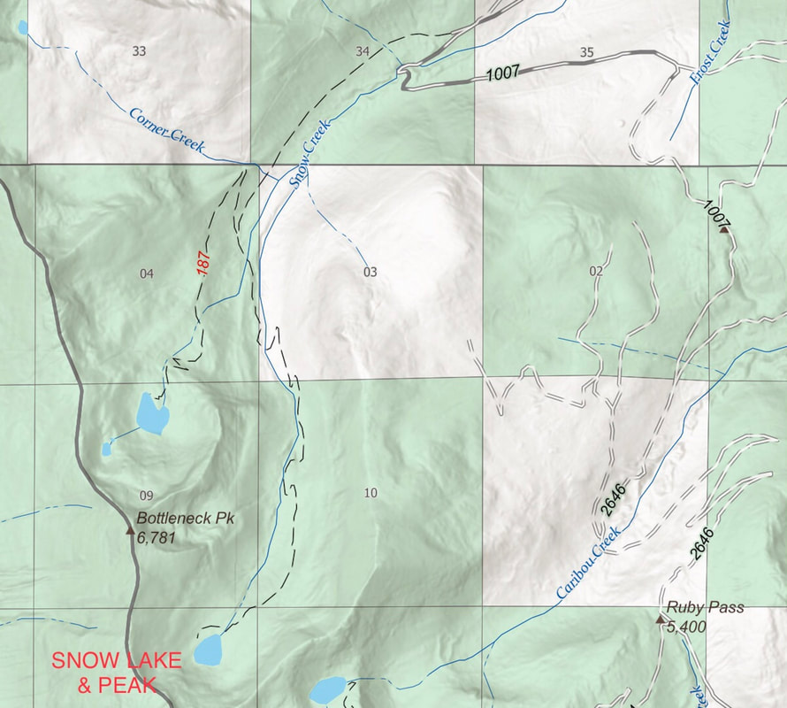
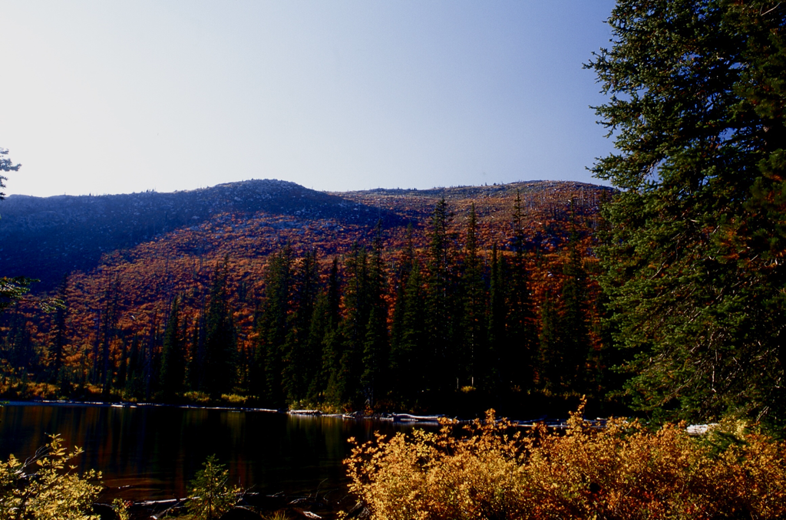
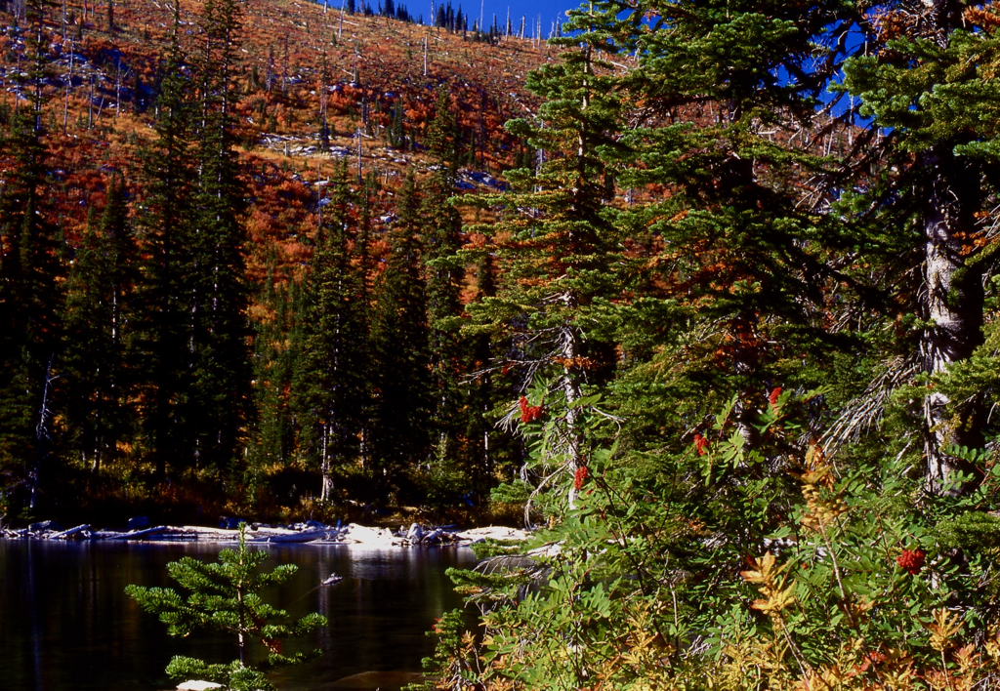

---
tags:
- Skiing & Snowshoeing
- Difficult
- Day Hiking
- Backpacking
- Scrambling
stats:
- label: Event Type
  icon: ski
  value: Day hiking, backpacking & scrambling
- label: Distance
  icon: map-marker-distance
  value: 11.2 miles RT
- label: Elevation
  icon: terrain
  value: To Snow Lake 1,554', to Snow Peak 2,557' gain
- label: Acres
  icon: vector-square
  value: '8.1'
- label: Difficulty
  icon: speedometer
  value: Difficult because of distance
- label: Maps
  icon: map
  value: IPNF, Kaniksu N.F., Roman Nose USGS topo
- label: GPS
  icon: crosshairs-gps
  value: 48°49′57″ N 116°34′17″ W
- label: Ranger District
  icon: pine-tree
  value: Bonners Ferry R.D. (208.267.5561)
- label: Boundary County Sheriff
  icon: shield-account
  value: CALL 911 FIRST or 208.267.3151
notes:
- label: Idaho Panhandle National Forests Alerts
  url: https://www.fs.usda.gov/alerts/ipnf/alerts-notices
---

# Snow Lake & Peak (Trail #163)

## Description

For the most part, the trail is on an old logging road nearly to the lake. In 1967, the Sundance Fire burned
most of the upper section, but now the views are more open and the fall colors are spectacular. Just before
the lake’s basin, the road becomes slightly steeper, but that levels out the closer you get to Snow Lake.
There are several creeks for filtering water along the upper trail, but they aren’t an issue to cross except
during spring runoff.

## Route Options

### Option 1: Scramble Ridge to Bottleneck Peak

If a higher point of view is desired, you can scramble up to the ridge line between Bottleneck Peak and the
ridge above Snow Lake. This extension adds about 3 miles.

### Option 2: Snow Lake to Bottleneck Lake Loop

Once on the ridge above Snow Lake, you can head north up the ridge for a little over a mile to Bottleneck
Peak (6,923'). With fantastic views all around from Bottleneck Peak, you can descend past Upper Bottleneck
Lake to the lower lake. Bottleneck Peak trail leads back to the same trailhead as Snow Lake. The complete
loop hike is just under 11 miles.

## Directions

Drive to Bonners Ferry on US-95. Just before coming to the Kootenai River, turn left (west) onto Riverside
Street (please obey the speed limits for the next 5 miles). After 5 miles turn sharp left (south) onto West
Side Road #18 for about 2.2 miles, then make another sharp right (NW) turn up Forest Road #402 for about 9.5
miles to the joint trailhead with Bottleneck Lake.

## Hazards & Safety Tips

The hike to Snow Lake is long but scenic. If you do the loop, plan on more than ample time from lake to
lake.

## Nearby Attractions

Kootenai National Wildlife Refuge, Myrtle Creek Falls, Burton Peak, Lower & Upper Snow Creek Falls, and
Roman Nose Lakes & Peak.

## Refreshments & Dining (R & P)

Eichardt’s, Mr. Sub, Burger Express, and Jalapeños in Sandpoint.

## Photo Gallery

_Snow Lake trail approach._

_Snow Lake._

_Snow Lake in fall colors._

!!! quote "Chic's Safety Note (2013)"

    Staying safe is a whole lot more important than succeeding. — Chic Burge
