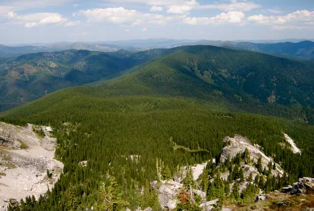
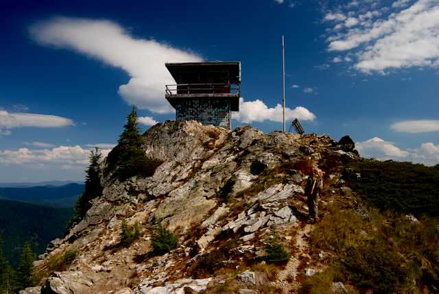
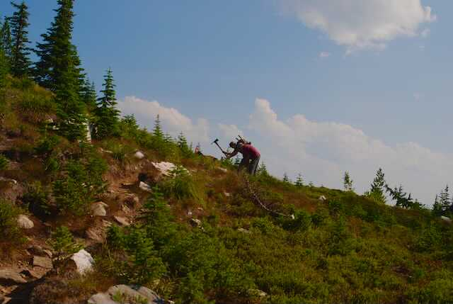

---
tags:

- Peaks & Mountains

- Moderate

- Day Hiking

- Backpacking

- Equestrian

stats:

- label: Event Type
  icon: hiking
  value: Day hiking, backpacking, and equestrian

- label: Distance
  icon: map-marker-distance
  value: 9.6 miles RT

- label: Elevation
  icon: terrain
  value: 2660’

- label: Difficulty
  icon: speedometer
  value: moderate

- label: Maps
  icon: map
  value: IPNF-St Joe District at Avery, Bathtub Mountain, Montana Peak topos

- label: GPS
  icon: crosshairs-gps
  value: Trailhead 47°04’40" N 115°34’41" W

- label: Ranger District
  icon: pine-tree
  value: Avery R. D. 208.245.4517

- label: Shoshone County Sheriff
  icon: shield-account
  value: CALL 911 FIRST or 208.556.1114
notes:

- Idaho panhandle national forest/alerts<https://www.fs.usda.gov/alerts/ipnf/alerts-notices>
---

# Snow Peak

*Snow peak 6760’wildlife management area trail # 55*

## Description

We have added the areas sheriff’s emergency phone numbers for each trip write up under the ranger district info. if an emergency ocurrs, evaluate your circumstances and call only if needed.The Snow Wildlife Management Area was consists of 32,292 acres, in Shoshone County, Idaho. The area is co-owned and managed by the USFS, and the Idaho Department of Fish and Game, since 1990. The area has 50 miles of trails that are only open to hiking and equestrian modes of traffic.
The trailhead starts near Bathtub Mountain, and after a mile, bears right at the "Y". Most of the beginning of the trail is in a dense forest. After the Y, a clearing offers the first view of Snow Peak’s granite prominence off in the distance. At about 3.6 miles the trail breaks out of the woods on a saddle. At the saddle, Spotted Louis Trail #104 bears right. Stay left on Trail #55 for about .8 of a mile to Snow Peak. As you get close to the peak, you will notice the fire lookout tower about 1240 feet atop Snow Peak. The faces of Snow Peak are home to Mountain Goats. PLEASE be aware of their presents, and do not disturb them, or let them get near you or your children. But be kind to them. And PLEASE leave your dogs at home on this hike.

Once on the summit, look to the south. The Mallard-Larkin Pioneer Area, butts up against the Snow Peak W.M.A.

As you hike to Snow Peak, notice the trail. Spokane Mountaineer, Lynn Smith, and his crews have done trail maintenance several time over recent years. I was even on one of those trail maintenance crews.

Below is some history of the area I found while doing research on the area.

history of snow peak wildlife management area
Snow Peak WMA lands were owned by Plum Creek Timber Corporation prior to 1990. Idaho Fish and Game acquired the Snow Peak lands by trading 3,680 acres of St. Maries WMA with Plum Creek Timber Corporation. In 1990, the acres on St. Maries WMA to be traded, appraised at $6,000,000. The 12,055 acres on Snow Peak WMA were appraised at $5,800,000. Three public hearings were held in January 1990 regarding the land exchange proposal.
In August of 1995, Idaho Fish and Game purchased a 130-acre easement from Crown Pacific to protect timber values on section 11 near Snow Peak WMA using Bonneville Power Administration funds.
The single most important reason the department acquired the property in this location was to provide roadless elk hunting opportunity.
In July 2007, the wildland fire use option agreement with USFS expanded onto Snow Peak WMA to allow wildland fire use as a management option for benefit of wildlife habitats. In October 2008, the Idaho roadless rule was published in the federal register. All of the U.S. Forest Service land surrounding and part of Snow Peak WMA is inventoried roadless.
Snow Peak WMA is open to public travel use with the following restrictions:
Vehicles must remain on established, opened roads. Trails allow non-motorized access only.

Overview

Exploring Snow Peak WMA is by foot or horseback only. The vision for the WMA is to protect and manage wildlife habitats and to provide high quality non-motorized backcountry recreational opportunities. Fifty miles of trail provide hunters, anglers, backpackers, horseback riders, and hikers access to explore this rugged WMA. Volunteers actively maintain the most popular trails.
Mountain goats commonly seen near the Snow Peak Lookout make it a popular destination for wildlife watchers and photographers. Other wildlife species commonly seen include elk, mule deer, black bear, moose, forest grouse, pileated woodpeckers, and cutthroat trout. The WMA provides important winter range habitat for elk and deer.

## Directions

I-90 route thru st. regis, mt.
Drive I-90 to St. Regis, Mt and turn up Highway 200. Turn left (NW) after the Casino/gas station/gift shop, and drive about 1/2 a mile and turn left (SW) onto Little Joe Creek Road # 282 and across over the freeway bridge up FR 282 for about 25 miles to the Idaho Montana boarder.

At the border, the road becomes F.R. #50. At about 5 miles, turn right onto F.R.#339. Stay on 339 until you come to F.R. #50 again. Turn left and drive about 2.5 miles. Turn right onto F.R. #509, and turn left onto F.R. #1258 towards the Mammoth Springs Campground. At Mammoth Springs, turn left onto F.R. #201 towards Pineapple Saddle for about 3.5 miles to the Snow Peak Trailhead.

Wallace, avery, st joe river route
In Wallace, head towards the Pulaski Tunnel Trail on the Moon Pass Road. Continue on the Moon Pass Road #456 to the junction with F.R. #50 just east of Avery. Turn left on #50, also known as the St. Joe River Road. Continue on #50 past the Nugget Creek Campground. In about 5.5 miles turn right onto F.R. #509. Stay on #509 to the junction with F.R. #1258. You will pass the Mammoth Springs Campgrounds, and turn onto F.R. #201 for about 3.5 miles to the Snow Peak Trailhead.

## Cool things close by

The Snow Peak W.M.A. buts up to the Mallard-Larkin Pioneer Area, the St. Joe Wild and Scenic River, Red Ives Historical Station, Ward & Eagle Peaks, and the Five Lakes Butte Area.

## Hazards

Getting to the trailhead requires good navigational skills, so have your co-pilot pay attention.
the trail itself is well maintained by the Spokane Mountaineers and other groups. As you approach the summit prominence, the trail climbs over 1200’ to the summit and the fire lookout. There are Mountain Goats on Snow Peak, so keep them away from you. But try to be kind to them.
And most importantly, it would be wise to leave your dogs at home.

## R & p

NA

---

## Plan your trip

Click for Current NOAA Weather Conditions

## Photo gallery

## Unnamed lake below snow peak

---

## Snow peak active lookout tower

---

## Spokane mountaineers doing trail work on the way to the lookout

---

---

---

---
