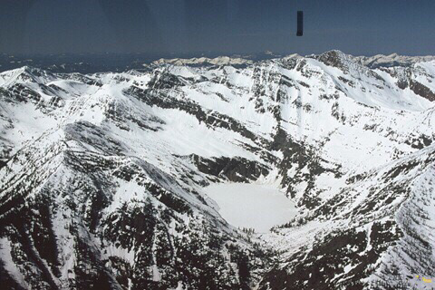
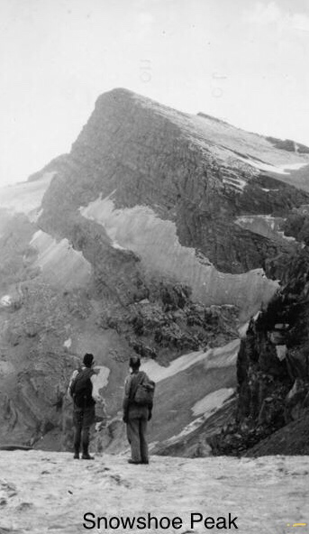
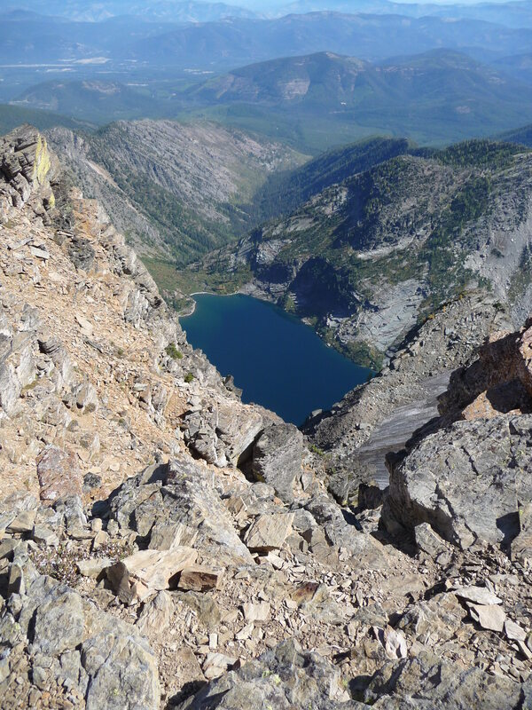
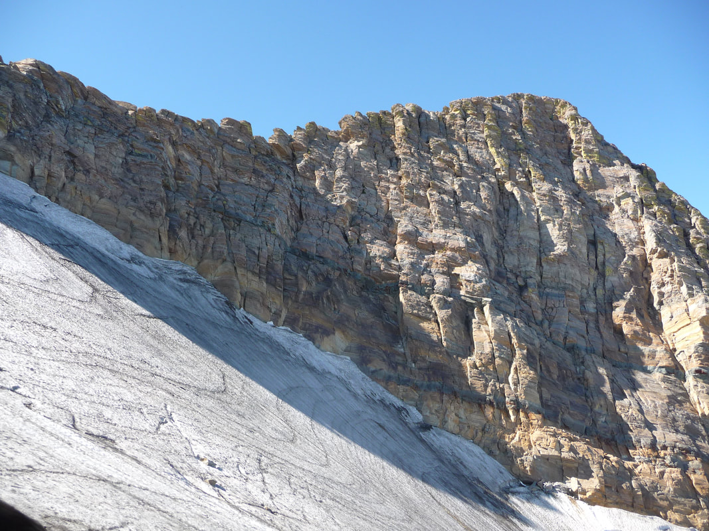

---
tags:
- Peaks & Mountains
- Extremely Difficult
- Scrambling
- Climbing
stats:
- label: Event Type
  icon: hiking
  value: Scrambling, climbing
- label: Distance
  icon: map-marker-distance
  value: From Leigh Lake about 13.4 miles to Middle Fork Bull River
- label: Elevation
  icon: terrain
  value: 3594 verts. Descent to Bull River trailhead is about 5785verts Down
- label: Difficulty
  icon: speedometer
  value: Extremely difficult
- label: Maps
  icon: map
  value: Kootenai N.F., Libby District, Snowshoe Peak topo. 406.293.8861
- label: GPS
  icon: crosshairs-gps
  value: 48°13’22"n 115°41’20"w
- label: Ranger District
  icon: pine-tree
  value: 'Libby R.D.: 406.293.7773'
- label: Sanders County Sheriff
  icon: shield-account
  value: CALL 911 FIRST or 406.827.3584
notes:
- Kootenai national forest/alerts<https://www.fs.usda.gov/alerts/kootenai/alerts-notices>
---

# Snowshoe Peak 8738

## Description

Climbing Snowshoe from any direction is a very challenging endeavor.
The easiest, if you can call it that, is to hike the 1.52 miles into Leigh Lake. Once at Leigh Lake, head
around the
right (N) side of the lake on a well beaten path for about .5 miles to a rocky beach, and an avalanche
terminus. From
here, head up the intermittent creek about 1/3 the way up to a "shelf".
be sure to mark this spot for the descent, if you are foolish enough to descend to leigh lake..
Locate a relatively level bench to cross to the left (W), to the first intermittent creek. MARK THIS SPOT.
From here,
start your ascent up this dry waterfall to a "Y" in the creek. Veer left to the high ridge. BE SURE TO MARK
THIS SPOT
FOR YOUR DESCENT. This will be your descent route, back to Leigh Lake. Once on the high ridge, head left (W)
up above
the only glacier in our region, Blackwell Glacier. The route ascends loose scree to the summit of Snowshoe
Peak 8738’.
Once on the summit, retrace your steps to the marker at the Intermittent creek. Because the descending the
route is down
the dry creek bed is very difficult, and dangerous, I WOULD STRONGLY SUGGEST, TAKING A 75’ LENGHT OF GLACIER
ROPE FOR
THE DESCENT. Down climbing the dry waterfall is too dangerous, and very time consuming. Use the rope to do
body belays
down the hard descents.

Having explained all this, I would suggest you continue over Snowshoe Peak, and walk out the N. Fork Bull
River.
The descent to Leigh Lake from Snowshoe is very dangerous.

## Option #1

Snowshoe peak can be accessed via Snowshoe Lake and the North Fork Bull River. This route is much longer, and
higher,
but much safer.
From the trailhead off of National Forest Road #2722, head northeast up the North Fork. The trail is good at
the bottom,
but the last half a mile is steep, rugged and hard to follow up high. Once at Snowshoe Lake, skirt the left
side around
the lake, and slowly ascend to the ridge SE of Snowshoe Peak. From here, hike/scramble NW to Snowshoe Peak.

The elevation gain via this route is 5785 verts.

## Option #2

Another route to Snowshoe is via the North Fork Bull River, but makes an up hill turn in about 3 miles. This
non
de-script route takes you to a very cool ridge to A Peak. Once up on the "level" look for a rock ridge line
that does a
slow arch up to A Peak’s summit.
From A Peak, head SE along a scary ridge to just below Snowshoe Peak. Choose your route above this point,
carefully.

## Directions

East side route from libby:

From Libby, drive south on Highway 2 towards Glacier National Park for about 8 miles to the Big Cherry Creek
Road #278.
Turn right (west) for three miles to FR#867. Turn right (west) for about 5 miles to FR #4786. Drive up 4786
for about 2
miles to the trailhead. Notice along this last stretch of road, that there is pull off to the left to a very
primitive
campsite.

West side route via n.fork bull river

On Hwy 56, look for milepost 16. Turn right (east) up the South Fork Bull River Road #410 for about 2 miles,
where the
road "Y’s". Bear right (east) onto F.R. # 2722 for about 2 miles to the trailhead.

## Hazards

Either route to snowshoe peak are very hazardous. please use extreme caution.

## Cool things close by

Kootenai Falls, historic Libby, Montana, U & L Geiger Lakes, Snowshoe Peak, Blackwell Glacier, and A Peak.

## R & P

Henry’s & Pizza Hut, The Shed, and Roasters in Libby, Clark Fork Pantry, Eicharts, Mr Sub, Burger Express, &
Jalapeños
in Sandpoint

## Photo gallery

## Aerial view of snowshoe peak above leigh lake

---

## Spokane mountaineers, snowshoe peak climb from east face of a peak, 50’s

*Picture (Image missing)*

Aaron herath, chris's son purifying water at leigh lake. the scrambling route is above.   image by chris

herath

*Picture (Image missing)*

## The route to snowshoe peak. image by chris herath

*Picture (Image missing)*

## A mountain goat comes over to check out the two climbers. image by chris h

*Picture (Image missing)*

## The high route to the ridge below snowshoe peak. image by chris herath

*Picture (Image missing)*

## Aaron examining the route above.   image by chris herath

*Picture (Image missing)*

## Leigh lake below part of the route to snowshoe peak. image by chris herath

*Picture (Image missing)*

From the route to snowshoe peak, with a peak top right, and blackwell glacier, center left. Image by chris h.

The

blackwell glacier is the closest glacier to spokane

*Picture (Image missing)*

Aaron enjoying the view from the snowshoe ridge. Bockman peak 8174' in background image by chris herath

*Picture (Image missing)*

## Aaron standing on the summit of snowshoe peak. image by chris herath

## Leigh lake 3588' below the summit of snowshoe peak. Image by chris herath

Blackwell glacier lies on the side of snowshoe peak. Blackwell glacier is the nearest glacier to spokane image
by chris
herath

## A peak & snowshoe peak from schweitzer mountain resort
