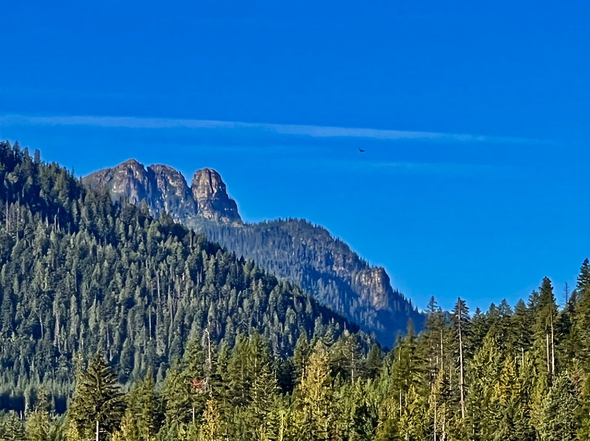
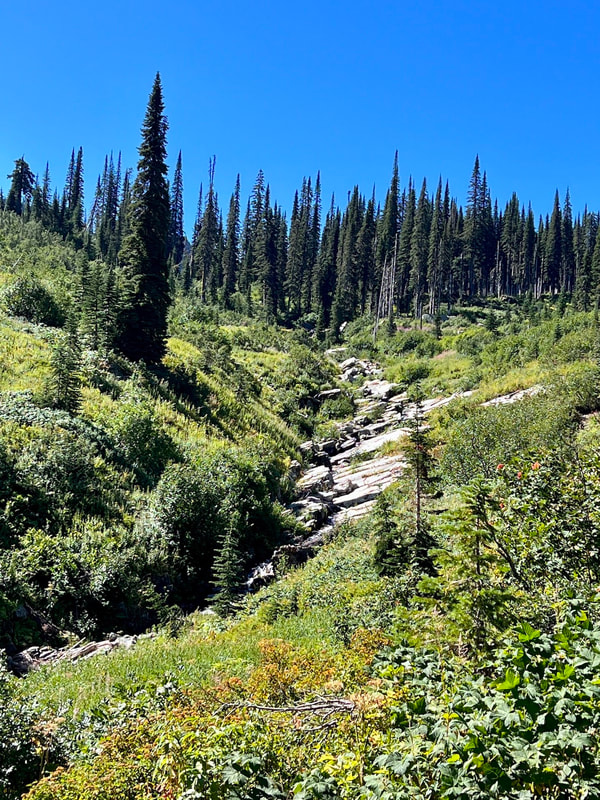
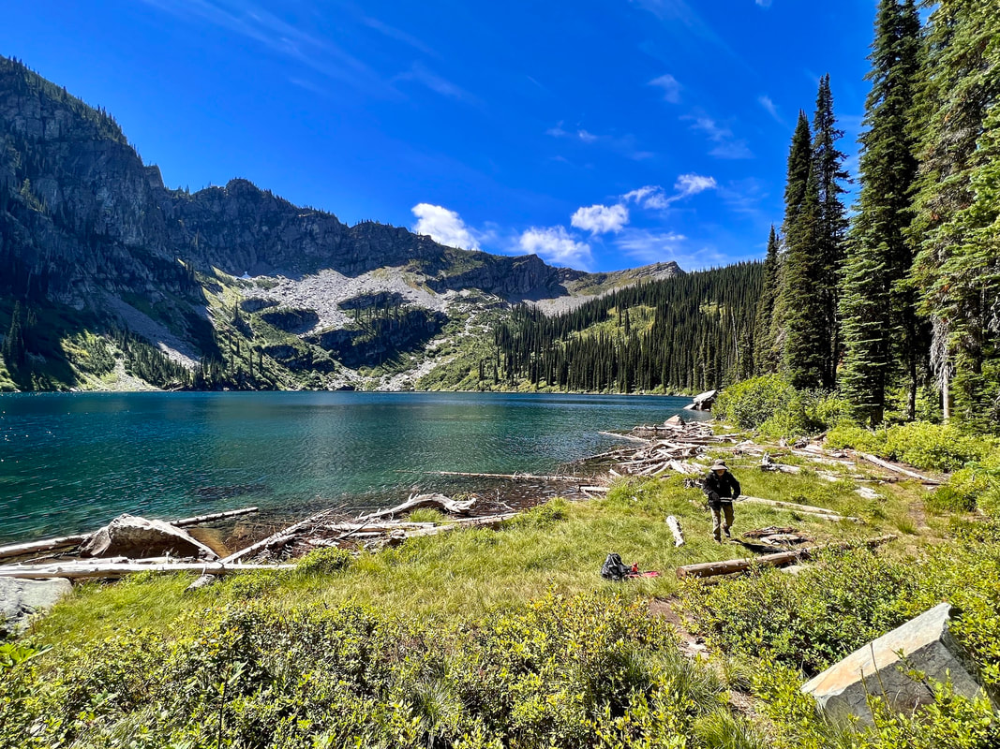
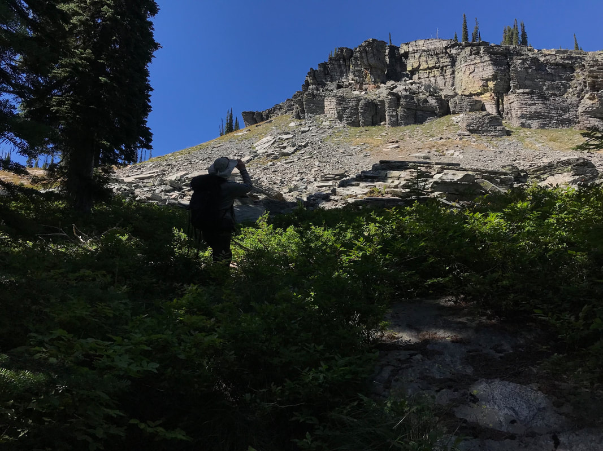
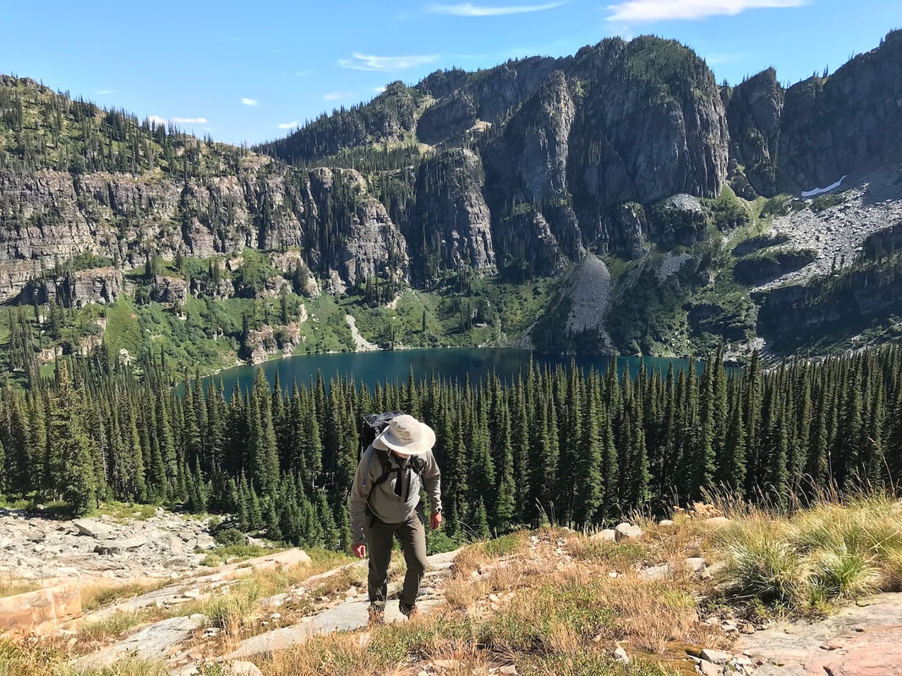
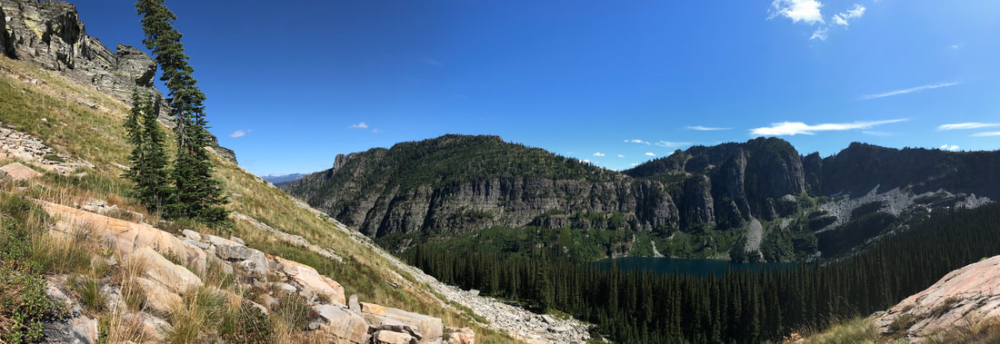
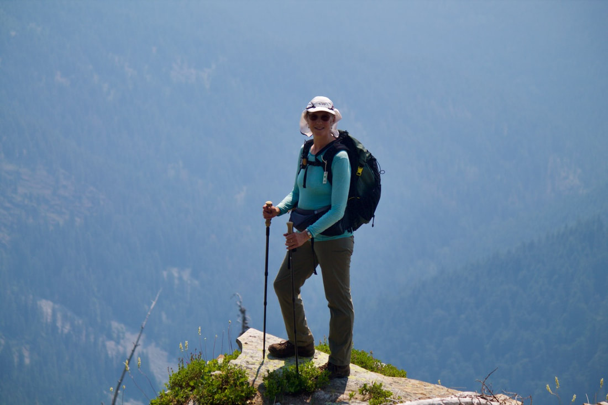
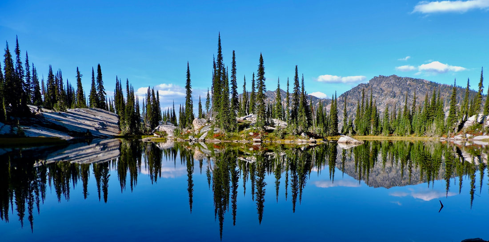
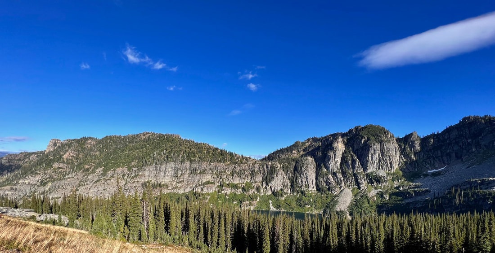

---
tags:
- Lakes
- Day Hiking
- Backpacking
- Scrambling
- Paddling
stats:
- label: Event Type
  icon: hiking
  value: Day hiking, backpacking, scrambling, paddling
- label: Distance
  icon: map-marker-distance
  value: 7.4 miles RT to Little Spar Lake
- label: Elevation
  icon: terrain
  value: '1852verts’ to Little Spar Lake #143'
- label: Acres
  icon: vector-square
  value: spar 387…..little spar lake 37.3
- label: Difficulty
  icon: speedometer
  value: Moderately Difficult to Little Spar Lake
- label: Maps
  icon: map
  value: Kootenai N.F., Spar Lakes topo
- label: GPS
  icon: crosshairs-gps
  value: Trailhead 34°15''48" N. 115°57'29" W
- label: Maps
  icon: map
  value: Kootenai National Forest Map, Spar Lakes topo
- label: Ranger District
  icon: pine-tree
  value: Three River R.D. 406.295.4693
- label: Lincoln County Sheriff
  icon: shield-account
  value: CALL 911 FIRST or 406.293.4112
notes:
- 8 miles RT to Spar Peak
- 9.4 miles RT to Horseshoe Lake
- '2985verts to Spar Peak #324'
- 500verts from Little Spar Lake to Horseshoe Pond, for a total of 2353 verts
- Difficult to Spar Peak
- Difficult to Horseshoe Pond
- 'Spar Peak 48°13''25" N 115°59''14: W'
- Little Spar Lake 48°12'56" N. 116°00'47"W
- Horseshoe Pond. 48°122'49"N 116‚01;52" W
- Kootenai national forest/alerts
- <https://www.fs.usda.gov/alerts/kootenai/alerts-notices>
---

# Spar Peak Little Spar Lake  Horseshoe Pond

*spar peak #324,  Little spar lake #143  & horseshoe pond (chicwackin')*

## Description

We have added the areas sheriff’s emergency phone numbers for each trip write up under the ranger district info. if an emergency ocurrs, evaluate your circumstances and call only if needed.
​To little spar lake     
The day started at 5am, when I met Chris for a trip to the Proposed Scotchman Peaks Wilderness area, Little Spar Lake and Horseshoe Pond..
We choose Hwy 95 to Hwy 2 east. It’s the fastest auto route.
Once at the trailhead, which looks more like a washout zone, the trail heads WSW up Spar Creek. Trail #143.

Watch for the second Spar Lake Trail #143 sign, and go right along side the creek. 

Soon you will have to cross Spar Creek. When you come to the open area above the sign, a faint near vertical trail on the opposite side, gets you to the trail above. Turn left (SW) with Spar Creek on your left as you ascend.
From here, the trail is more obvious and direct to the lake.
What I noticed about this trail, was there were over twenty undulations as the trail ascends to the lake. So the ascent isn’t always up.
Just before the lake is an open area, and a short stretch of the creek before another short stretch thru the woods.
All along this trail are massive cliffs, towering above, on the left (S) side.
When the lake comes into view, you know you are in a very special place.
Beautiful green grasses occupy the NE end of the lake. The views are spectacular.
This is a good place for a snack, before you head up to Horseshoe Pond
Little Spar Lake is 37.3 acres and sits at 5884’

## Option #1

To horseshoe pond from little spar lake

Memorize and discuss your route in, always looking back at places like where you pop out of the woods onto scree, etc.
After a snack, we cut straight up hill, NNW to the ridge high above.
The forests in our region, are experiencing an incredible growth of under brush. On this scramble, the vegetation was head high and challenging to ascend thru. BE SURE TO STAY ON SMALL RIDGES TO GET THRU THE BRUSH. THE VALLEYS ARE TOO BRUSHY
After about .5 miles, the forest opens up into scree slopes. These make for easy hiking and traversing.
Directly above are massive cliffs that all look like they are ready to come crashing down.
Walk left (W) soon we are on the SW ridge we need to be on, to get to Horseshoe Pond.
As we drop down the ridge line, we soon come to where this ridge meets the saddle above Little Spar Lake.
Horseshoe Pond is next to the saddle, to the your right( NW). Don’t drop down until you see the route to the lake.
Horseshoe Pond, is similar to Little Harrison Lake in the Selkirks, but a third the size, and has a large peninsula to have lunch on.
This area around Horseshoe Pond is extremely fragile. 
PLEASE, PLEASE, camp clean, off the vegetation, and away from the lake. And remember, no human or pet waste within 200’ of any water source. Please, not above the Pond.
After visiting  Horseshoe Pond, retrace your steps you did on your way in. 
Down thru the forest above the lake, know that you can not get lost here.
Simply head down the fall line until you come to Little Spar Lake or the trail below.
All along the trail out is the 2.2 miles long cliffs above, on your right. Outstanding scenery and photo ops, are everywhere.
Try to be off the lower trail above the first crossing, before dark. 
Even with headlights, this trail is rough and complicated.
I wouldn’t suggest sneakers. Sturdy boots are your best bet.
Hiking poles really help, but stow them in your pack when you are chicwackin’ up thru the forests.
To understand the geology of this mountain range, search AMERICAN SELKIRKS and double click it.
An article on the most spectacular event ever to happen near us, will open up.
It’s hundreds and hundreds of time bigger then the Glacier Lake Missoula Floods which occurred 12,000-15,000 years ago.
I have had two geologist verify this article.
The article mentioned above took place about 80+ Million years ago.
You will be amazed.
​Please keep in mind, Trail #143 has 15+ creek crossings, with 5 that are very difficult during spring run off. Bring sandals in case the creek is up.

If you call the Ranger District listed above, you can find out if the trail is cleared, and how the creek crossing may impact your hike.
​

## Option #2

Just past the first Spar Lakes trail, look for another trail about 200 yards to the west. Trail #324 heads SW along Club Creek for about 2.25 tough miles to Spar Peak. The views south down the Proposed Scotchman Peaks Wilderness is to die for. Don't miss it.

​It is a difficult trail.

## Directions

North
From Troy, Montana drive east on Highway 2 for two miles to Lake Creek Road #384. Drive about 15 miles to Spar Lake. Most of 384 is paved, with a center section that is gravel.  

The trailhead looks like it was built in a creek washout zone. Be cautious in the spring.
South
Turn left (north) up Highway 56 and look for the milepost 25 sign, and the Troy Mine Road and follow the signs.

## Hazards

To Upper Spar Lake, the trail is rough due to jagged rocks, and there are a few stream crossings that  can be an issue, depending on the time of year.
To Spar Peak however, there are several sketchy trail sections, that are steep and tough. Use care.
To Horseshoe Pond, there is no trail. On this section, stay on the ridge tops thru the forest, and stay out of the gullies.

Click to set custom HTML

## Cool things close by

Kootenai Falls & the Kootenai River, the Cabinet Mountain Wilderness, Bull Lake, Ross Creek Cedars, Sawtooth Mountain 7663', and the South Fork Ross Creek.

## R & p

Clark Fork Pantry in Clark Fork, Jalapeños in Sandpoint. Henry's and The Shed in Libby, but don’t miss the Kaiju Sushi Bar on 9th Street.

---

*Picture (Image missing)*

## Photo gallery

## Spar peak 6585' and unnamed tower along the trail in ​image by chris h

*Picture (Image missing)*

## The unnamed spire along the lengthy wall above spar creek ​image by chris h

*Picture (Image missing)*

## The south wall above spar creek stretches over a mile ​image by chris h

## Upper spar creek on the way to spar lake Image by chris h

## A great place to have a snack along the nne end of little spar lake ​image by chris h

## We cut directly up, my favorite direction, Thru the woods until we broke out with this view

## Chris hiking above little spar lake towards horseshoe pond

A pano view of the cliffs above trail #143 Way far off in the distance is sugarloaf mountain 7566'.  ​the tower next to spar peak. Little spar lake

## Mountaineer darcy on top of spar peak

*Picture (Image missing)*

## Horseshoe pond with savage mountain 6906' ​image by chris h

*Picture (Image missing)*

## The peninsula at horseshoe pond ​image by chris h

## Horseshoe pond pano

*Picture (Image missing)*

## The view west from horseshoe pond Scotchman peak #2 on left ​image by chris h

## On the return hike, views of little spar lake are incredible

*Picture (Image missing)*

## The last view of little spar lake before heading down ​image by chris h

*Picture (Image missing)*

## The tower, as the setting sun bathes it in warm light ​image by chris h
