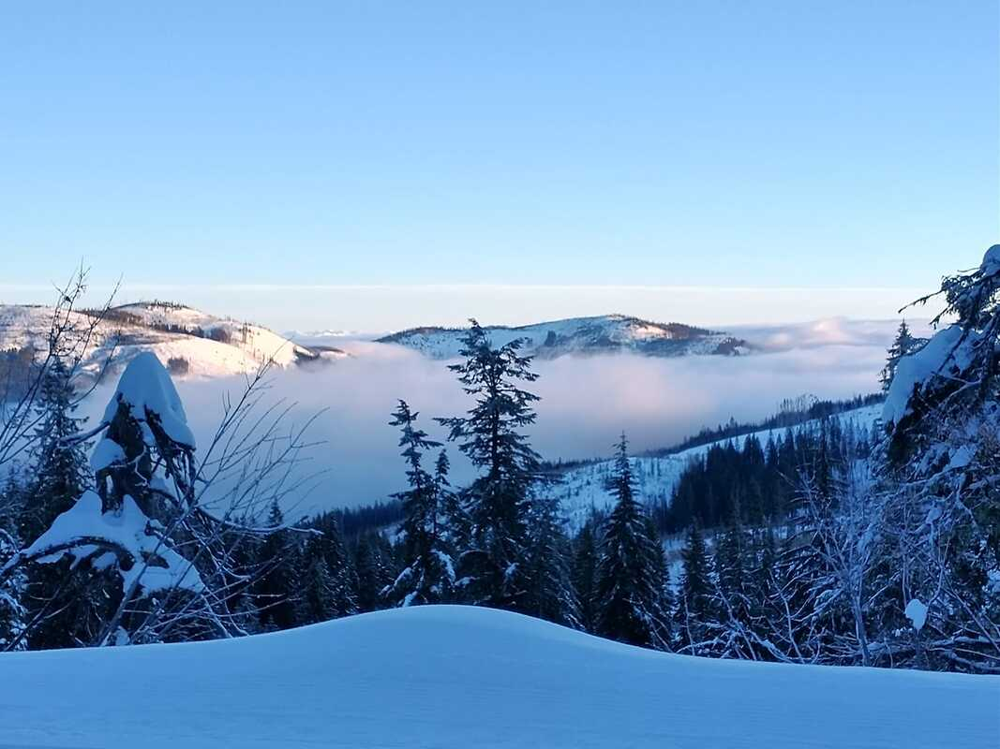
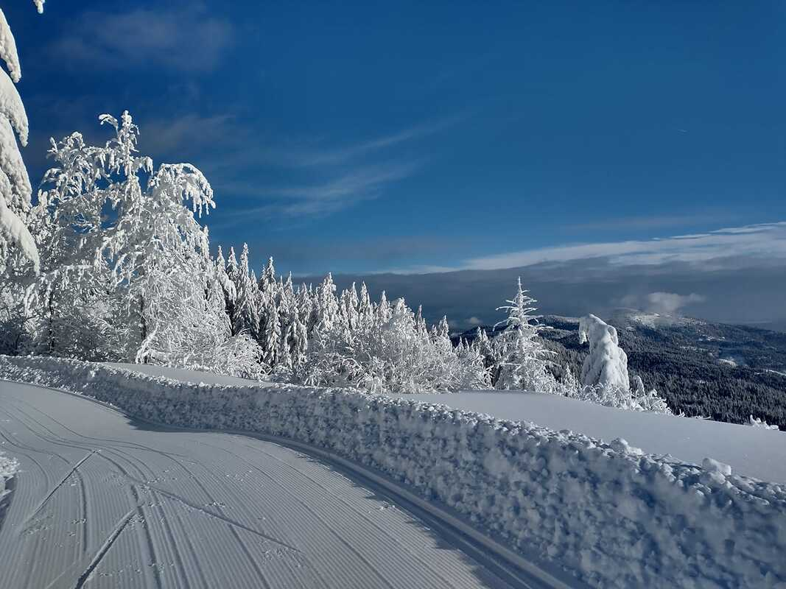
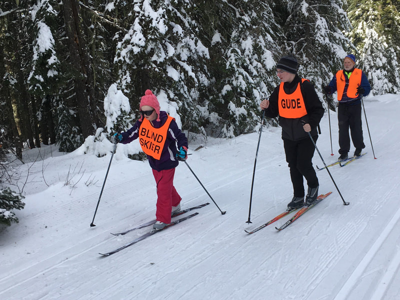
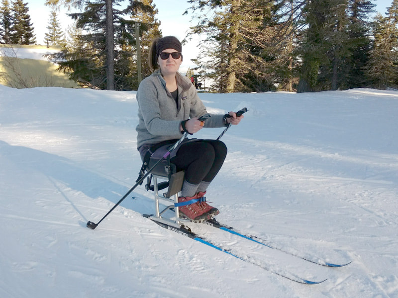
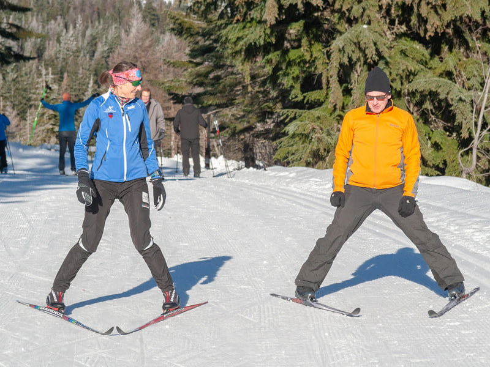
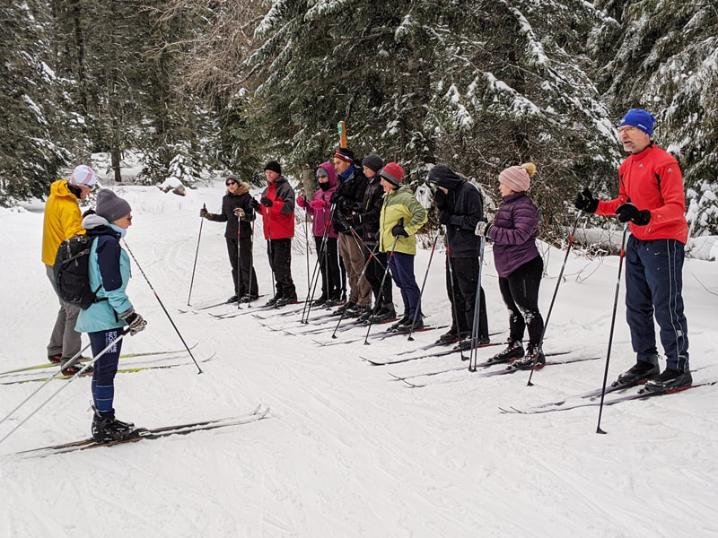
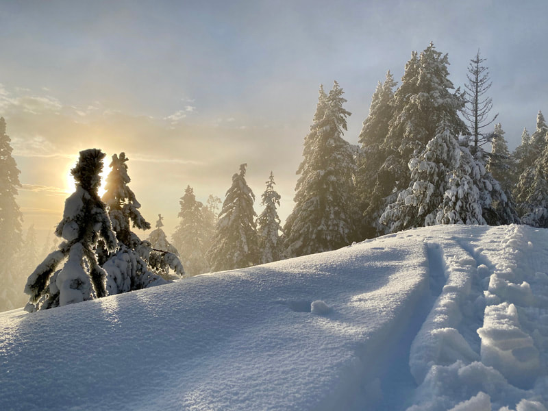
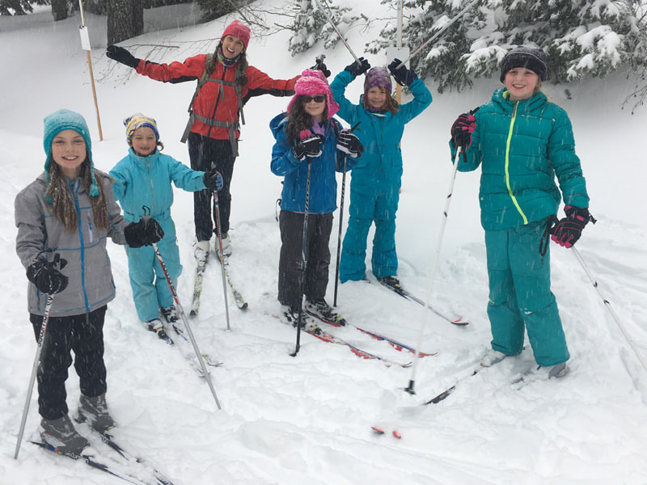

---
tags:

- Winter & Skiing

stats:

- label: Resort Name
  icon: domain
  value: Spokane Nordic Ski Association

- label: Type of Business
  icon: ski
  value: Nordic Ski Club (501c3 Non-Profit)

- label: Website
  icon: web
  value: '[www.spokanenordic.org](https://www.spokanenordic.org)'

- label: Address
  icon: map-marker
  value: PO BOX 501, Spokane, WA 99210

- label: Phone
  icon: phone
  value: n/a

- label: Email
  icon: web
  value: '[Email Protected](mailto:protected@example.com)'
---

# Spokane Nordic Ski Association

## Description

The Nordic Ski Area at Mt Spokane State Park is possible because of  the cooperation between WA State Parks, Inland Empire Paper Co, and The ID Department of Lands.  SNSA exists to advocate, on behalf of the Nordic skiers who use the trail network, on issues related to maintenance and development of the Nordic ski area.

Through membership, donations, and volunteer efforts, Spokane Nordic provides maps, signs, trail maintenance, firewood, land lease costs, facility improvements, grooming logistics, and requests for State development funds.

Spokane Nordic teaches all ages how to Nordic (cross-country) ski, provides ski lessons for all ages, hosts ski events, and informs the community about cross-country ski developments.

Spokane Nordic is member-funded and our board of directors is made up entirely of volunteers. Donations and memberships promote Spokane Nordic’s efforts and bring you into a vibrant community that celebrates health, fitness, family, and the great outdoors. Spokane Nordic members receive informative emails, are invited to special events, have opportunities for ski lessons, and more!

## Photo gallery

---

{: data-src="assets/images/202210021210.jpg" }

---

---

---

---

---

---

---

---

*Picture (Image missing)*
