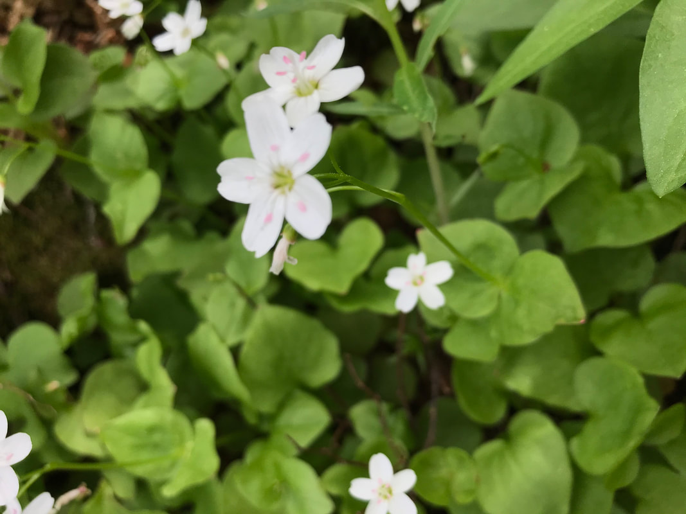

---
tags:
- Trails & Scrambles
stats:
- label: Genesis Name
  icon: book-open-variant
  value: Claytomia lanceolata
- label: Distribution
  icon: earth
  value: ca, co, id, mt nm, or, ut, wa, wy
- label: Season
  icon: calendar
  value: Blooms JAN, FEB, MAR, APR, MAY
- label: Medical Use
  icon: medical-bag
  value: Past medicinal uses have included using **powdered corms to treat convulsions
    and as a contraception**. Other species of spring beauty have been used by various
    Indian tribes to make poultices to treat eye problems and as an infusion to treat
    sore throats, dandruff, and urinary tract problems.
- label: Poisonous
  icon: skull-crossbones
  value: 'no'
- label: Edibility
  icon: food-apple
  value: The Spring Beauty is an **edible plant**. Both man and beast may eat the
    leaves and the tubers (or corms). ... The starchy tubers can be eaten raw or cooked.
    If eaten raw, they will taste like radishes. The entire plant is edible raw or
    cooked, including the potato-like [corm](https://en.wikipedia.org/wiki/Corm) from
    which it grows.
- label: Features
  icon: information-outline
  value: Spring beauty is an herbaceous perennial in the Montiaceae family. This plant
    is a woodland perennial that produces small flowers in spring. The petals are
    pink or white, with darker pink veins. The plant disappears from above the ground
    soon after the seed capsules have ripened.
- label: Leaves
  icon: leaf
  value: One or two basal leaves may be present early in the season. Western Spring
    Beauty grows from **a spherical, edible, underground tuber** which tastes like
    a potato. Native Americans used the tuber for food and for animal fodder.
- label: Fruits
  icon: fruit-cherries
  value: Claytonia lanceolata is a species of wildflower in the family Montiaceae,
    known by the common names lanceleaf springbeauty and western springbeauty. ...
    Claytonia lanceolata (Lanceleaf springbeauty,
notes:
- Native Americans ate the roots and [pods](https://en.wikipedia.org/wiki/Pod_(fruit)),
  which can be cooked and eaten like potatoes. The leaves can be eaten raw or cooked.
---

# Spring Beauties

## Description

This plant is native to western North America as far south as [New Mexico](https://en.wikipedia.org/wiki/New_Mexico) where it grows in foothills up to alpine slopes. It thrives in the rocky soil of [alpine climates](https://en.wikipedia.org/wiki/Alpine_climate) where the snow never melts. It is a [perennial](https://en.wikipedia.org/wiki/Perennial_plant) [herb](https://en.wikipedia.org/wiki/Herbaceous_plant) growing from a [tuber](https://en.wikipedia.org/wiki/Tuber) one to three centimeters wide. It produces a short, erect stem reaching a maximum height of 15 centimeters. At its smallest the plant bears only its first two rounded leaves before flowering and dying back. Its thick leaves are helpful for storing water. If it continues to grow it produces thick, lance-shaped leaves further up the stem. The star-shaped flowers come in [inflorescences](https://en.wikipedia.org/wiki/Inflorescence) of three to 15 blooms and they are white or pink, often with veiny stripes and yellow blotches near the base of each petal. The fruit is a small capsule containing 2 seeds, which are black and shiny.
The species is considered somewhat rare.
Basal leaves sometimes absent; stem leaves a single pair clasping the stem partway from ground. Leaves wedge-shaped tapering to sharp tips. Flowers 3–15 with short stalks or sessile above leaves in loose, sometimes 1-sided cluster. Flower petals white or pink with pink veins or occasionally yellow or orange. Found in moist meadows, slopes, woodlands, at mid to alpine elevations. Grows from corms that taste like potato when cooked; sometimes called Indian potato.
*Claytonia lanceolata* - Lanceleaf Spring Beauty, Western Spring Beauty.
*Claytonia* is a relatively small genus of 26 species, with all but one of those species found in North America. Most of those species are in the western half of the United States, but a few are found in the east as well.

*Claytonia lanceolata* is a small, pretty white, pink, or even orange or yellow wildflower of early spring in the western United States, especially in somewhat higher elevations. A similar species is *Claytonia multiscapa* - also known as Lanceleaf Spring Beauty.  *C. multiscapa* is not as widely distributed, and is a slightly larger plant with narrower leaves and smaller flowers. It won't be found with pink petals, while *C. lanceolata* petals may be pink. *C. multiscapa* will have multiple bracts in the inflorescence, while *C. lanceolata* will usually have a single bract; sometimes 2. Some authorities have considered *C. multiscapa* to be part of *C. lanceolata* and others part of *C. flava* rather than a separate species. If part of *C. flava* it would expand the range of that species notably.

---

## Photo gallery

---

##

*Picture (Image missing)*

*Picture (Image missing)*

##

*Picture (Image missing)*

Image by james colquhoun
