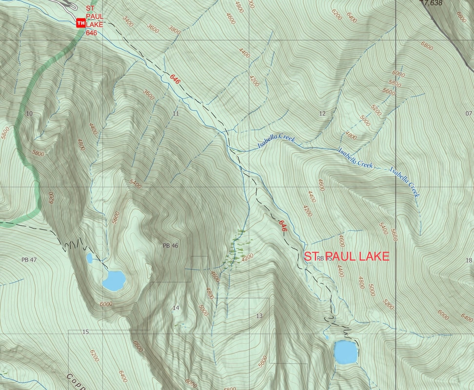
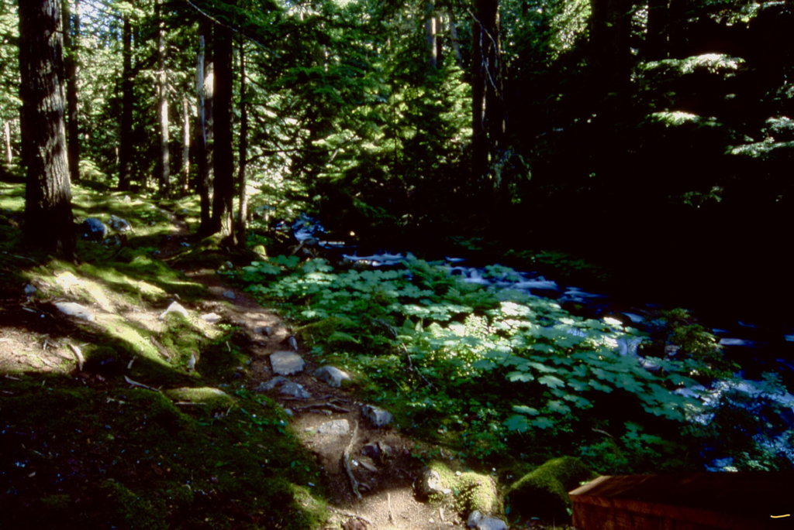
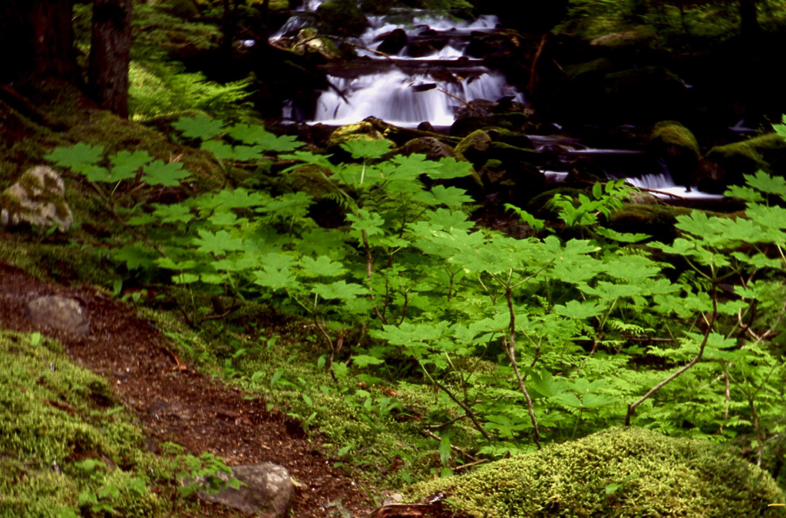
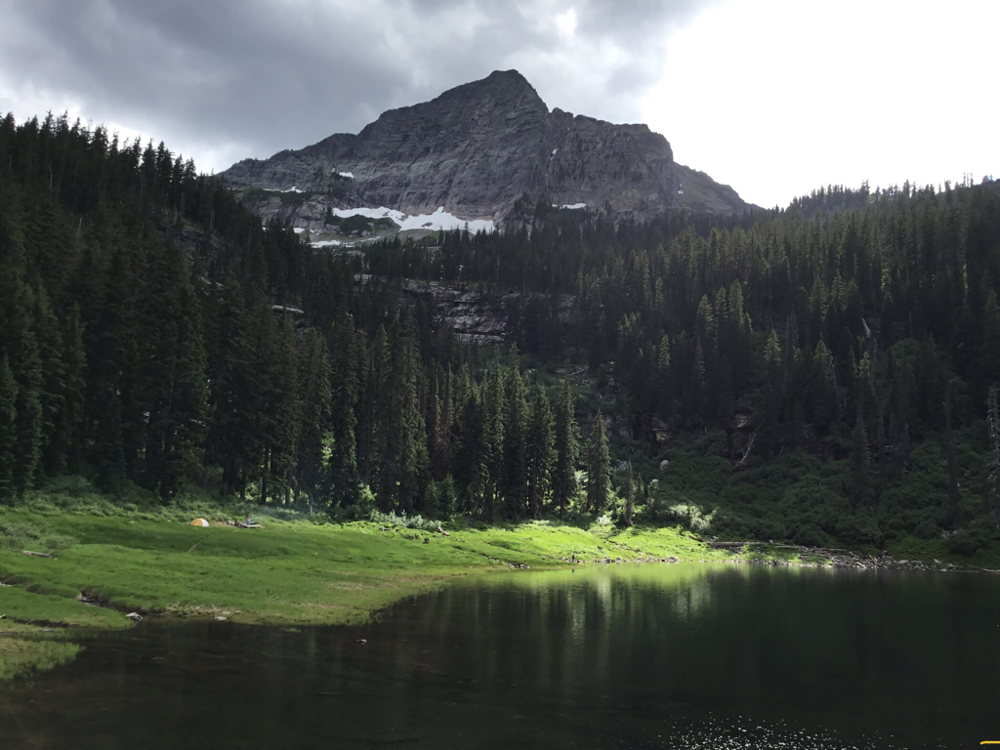
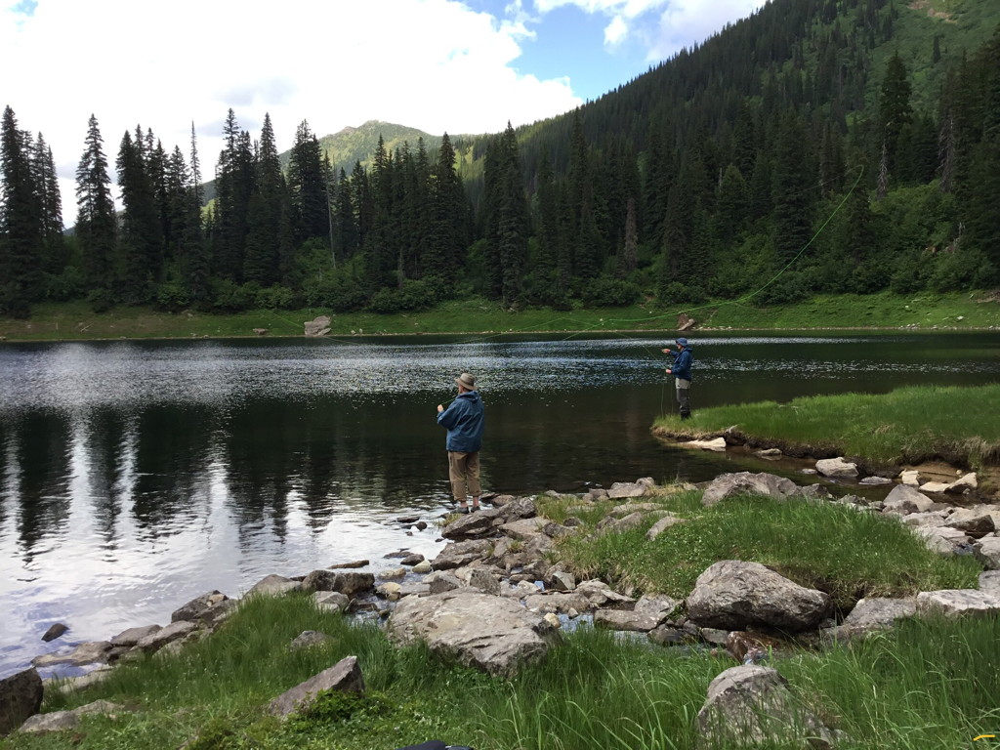
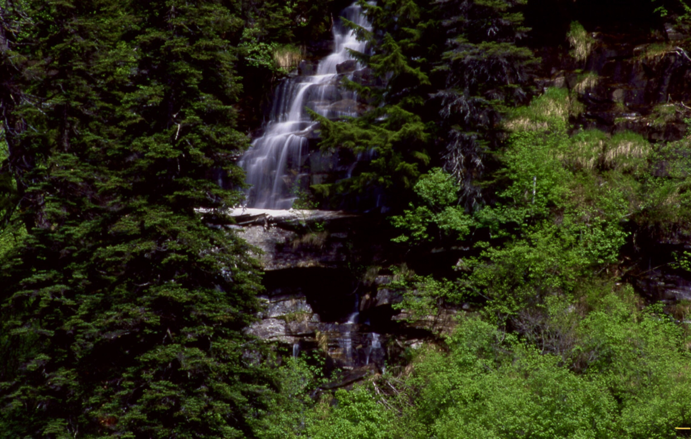
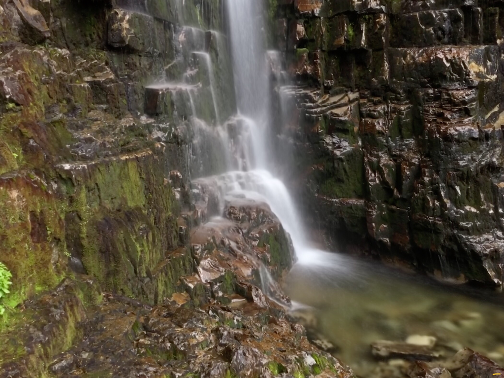
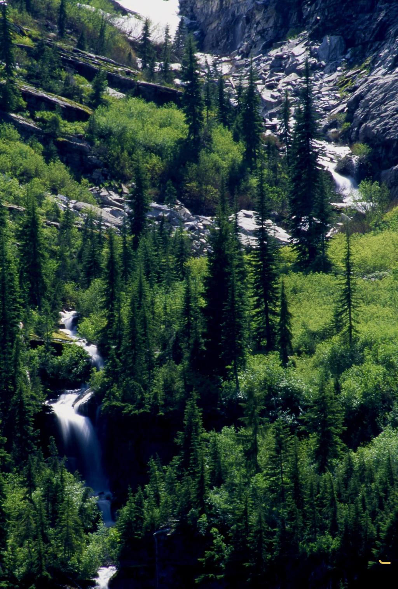
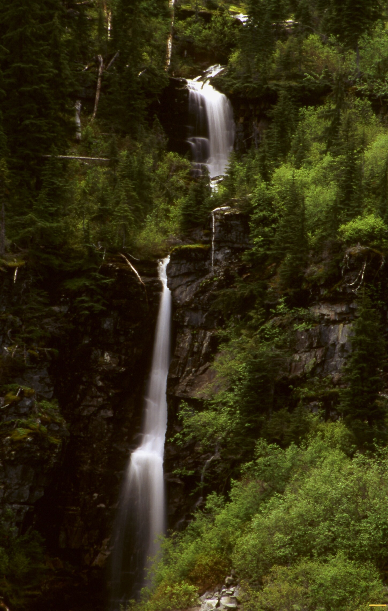
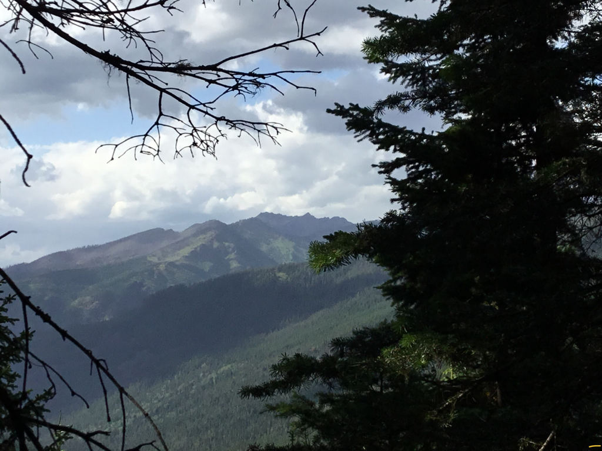

---
tags:
- Lakes
- Moderate +
- Day Hiking
- Backpacking
- Fishing
- Photography
stats:
- label: Event Type
  icon: hiking
  value: Day hiking, backpacking, fishing, and photography
- label: Distance
  icon: map-marker-distance
  value: 7.8 miles RT
- label: Elevation Gain
  icon: elevation-rise
  value: 1720v
- label: Acres
  icon: vector-square
  value: '14.8'
- label: Difficulty
  icon: speedometer
  value: Moderate +
- label: Maps
  icon: map
  value: Kootenai N.F., Cabinet Ranger District C.M.W. , Elephant Peak. 406.827.3533
- label: GPS
  icon: crosshairs-gps
  value: 48°05’24" w 115°39’32" n
- label: Ranger District
  icon: pine-tree
  value: 'Cabinet Ranger District: 406.827.3533'
- label: Sanders County Sheriff
  icon: shield-account
  value: 911 or 406.827.3584
notes:
- Kootenai national forest/alerts
- <https://www.fs.usda.gov/alerts/kootenai/alerts-notices>
---

# St Paul Lake

*St. paul lake & waterfalls*

## Description

From the trailhead Hike S.E. up the East Fork Bull River for about 2 miles to a bridge over the river. On the right is Placer Creek, with the E. Fork Bull River on your left. As you leave the bridge, notice the stereophonic sounds of the two creeks. For most of the hike to the lake the sounds, are worth the hike itself. In about 1.75 miles the trail begins a few switchbacks until the lake appears thru the trees.
St. Paul Lake is over 800 feet round and has no obvious outlet.
There are two campsite, one as you come to the lake, and another on its south shore.

## Option #1

St Paul Pass is located about a mile S.E. of the lake. From this pass you can access Libby Lakes, Rock Lake, and Ojibway Peak.

## Option #2

Above the lake are several tall waterfalls that make this hike a must do for photographers, and hikers alike. There is no trail, and you must rock hop over semi dangerous terrain. I was there in July, 2019 and the jungles have grown above head high. Be very careful getting to the many falls.
For a view of the lake with several waterfalls in the image, CAREFULLY walk to the N.W. corner of the lake.
A word of caution....if you take children, watch them while any where near the lake. or up by the waterfalls.

## Directions

Turn east off of Hwy 56 at about milepost 8.
The trailhead is up F. R. #407 about 6 miles from Hwy 56. Along the way is an old historical Ranger Station.

## Hazards

The banks around St. Paul Lake are very steep on all but the south shore. If you take kids or dogs, be very aware of slips into the lake

## Cool things close by

Historical Bull River Ranger Station, St. Paul Peak, Libby Lakes, Rock Lake & Peak, and Ojibway Peak.

## R & P

Kaiju Bar & Grill in Libby.     Henry’s & Pizza Hut, TheShed, and Roasters in Libby, Clark Fork Pantry, Eicharts, Mr Sub, Burger Express & Jalapeños in Sandpoint

## Photo gallery

---

"

## Trail #646 to st. paul lake

---

## Upper trail to st. paul lake

---

## St. paul lake with st. paul peak 7714’ towering above i told them fishing for flies is futal

---

## St.paul lake from st.paul peak. (pictured) above

## Father & son fly fishing

---

## One of the many waterfalls above st. paul lake

---

## The bottom section of a 50 foot waterfall

*Picture (Image missing)*

## Waterfall from the north shore Elephant peak on left..st. paul peak on right

## Waterfalls below st. paul peak

---

## One of the taller waterfalls above st. paul lake

---

## The peaks are poplar & dad peaks
