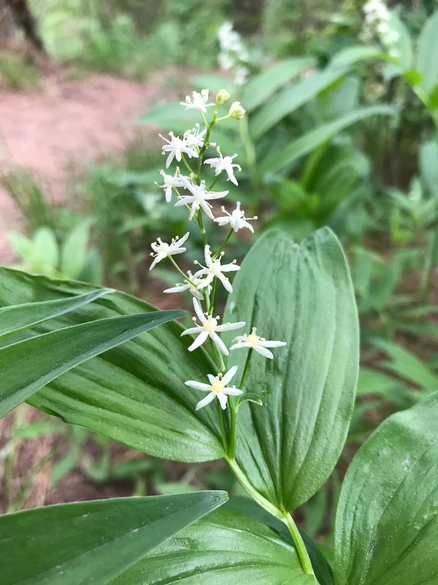

---
tags:
  - Flora & Wildlife
stats:
  - label: Genesis Name
    icon: book-open-variant
    value: Maianthemum stellatum
  - label: Distribution
    icon: earth
    value: Much of the U.S.A. and Canada
  - label: Season
    icon: calendar
    value: Blooms May & June
  - label: Medical Use
    icon: medical-bag
    value: Star-flowered lily of the valley was employed medicinally by several native North American Indian tribes who used it to treat a variety of complaints. It is little, if at all, used in modern herbalism. A tea made from the roots is drunk to regulate menstrual disorders. A decoction of the leaves is taken 2 - 3 times a day in the treatment of rheumatism and colds. Half a cup of leaf tea drunk daily for a week by a woman is said to prevent conception. The root is analgesic, antiseptic, haemostatic, ophthalmic, stomachic and vulnerary. An infusion has been used in the treatment of stomach complaints, internal pains and to regulate menstrual disorders. The dried powdered root has been used in treating wounds and bleeding. The crushed root has been used as a poultice on sprains, boils, swellings and limbs affected by rheumatism. The pulped root has been used as ear drops to treat ear aches. An infusion of the roots has been used as a wash for inflamed eyes.
  - label: Features
    icon: information-outline
    value: Spike-like raceme 1 to 4 inches long of up to 20 stalked white flowers. Each flower is about 3/8 inch across, has 6 tepals (petals) and 6 stamens with pale yellow or cream colored tips.
  - label: Leaves
    icon: leaf
    value: Leaves are up to 6 inches long and 2 inches across, generally elliptical tapering to a point at the tip, toothless, finely hairy on the underside, with prominent parallel veins and often folded some lengthwise. The base of the leaf clasps the stem. The stem slightly zig-zags between the alternately attached leaves and may be hairless or finely hairy. The plant does not grow upright, but tilts to one side and arcs a bit at the top.
  - label: Fruits
    icon: fruit-cherries
    value: Each flower is replaced by a berry, about ¼ inch in diameter. Berries are initially green with purple stripes and ripen to solid reddish-purple.
notes:
  - Like onions, the fleshy roots were used to flavour other foods. Medicinally, the roots were chewed raw or used in syrups and teas to relieve coughs. They were also applied as poultices to burns and swellings.
---

# Star-Flowered Lily of the Valley

## Description

***Maianthemum stellatum*** (**star-flowered**, **starry**, or **little false Solomon's seal**, or simply **false Solomon's seal**; **starry false lily-of-the-valley**; syn. *Smilacina stellata*) is a species of flowering plant, native across North America generally from Alaska to California in the west and from Newfoundland to the central Appalachian Mountains in the east. An everchanging seasonal plant with little white buds in the spring, followed by delicate starry flowers, then green-and-black striped berries and finally deep red.

## Photo Gallery

_Star-Flowered Lily of the Valley_
