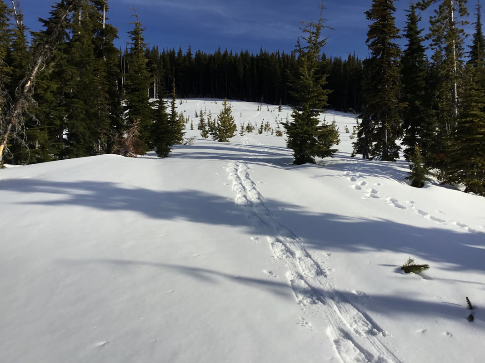
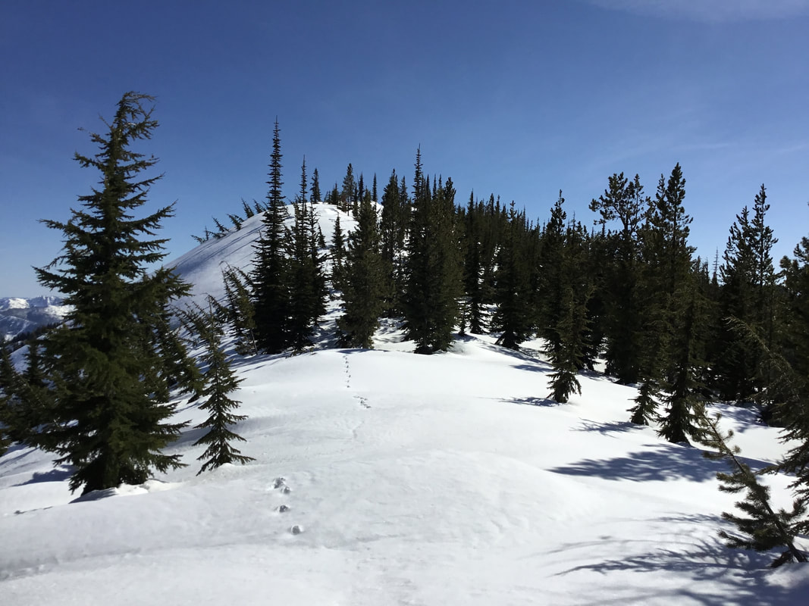
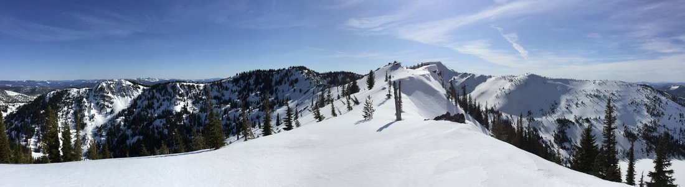
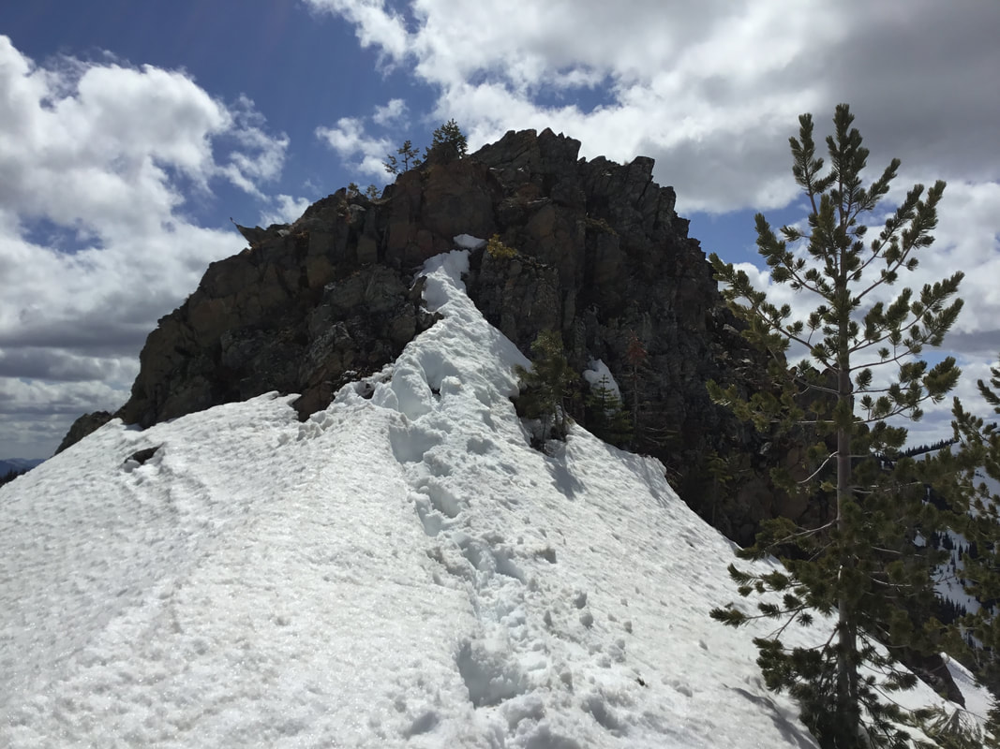
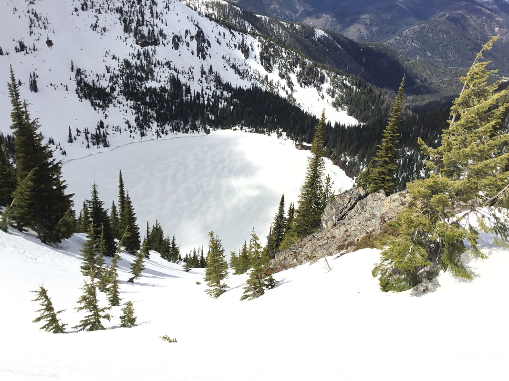
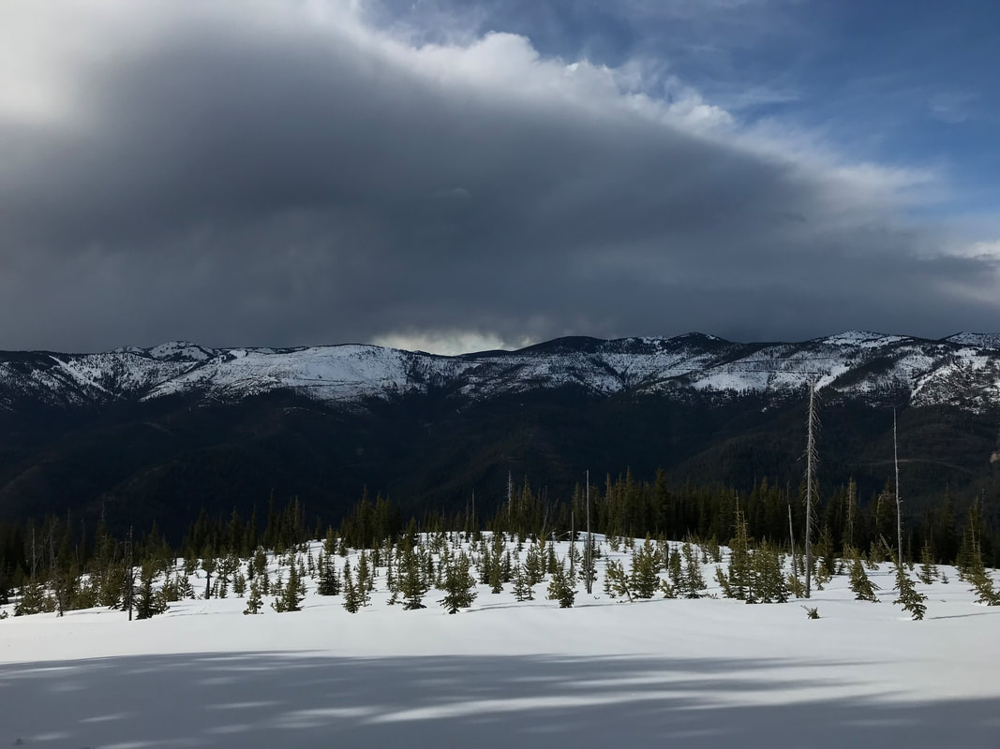
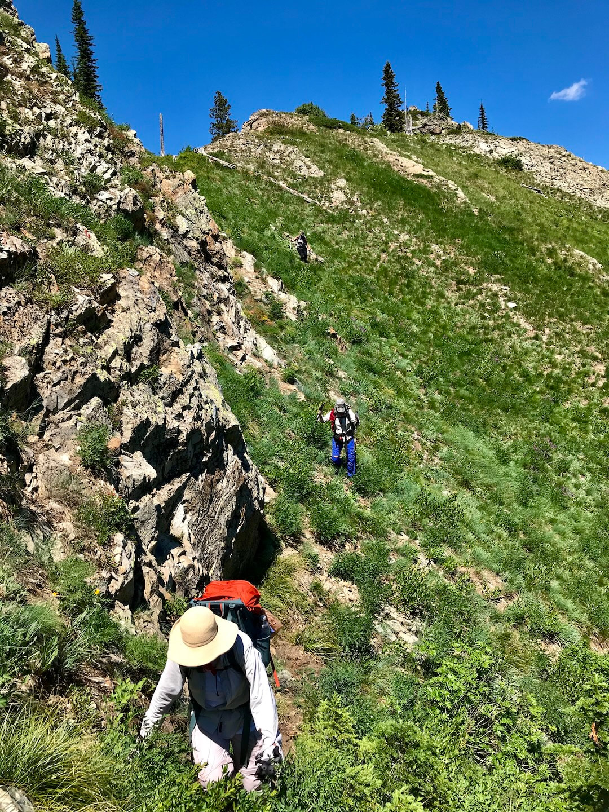
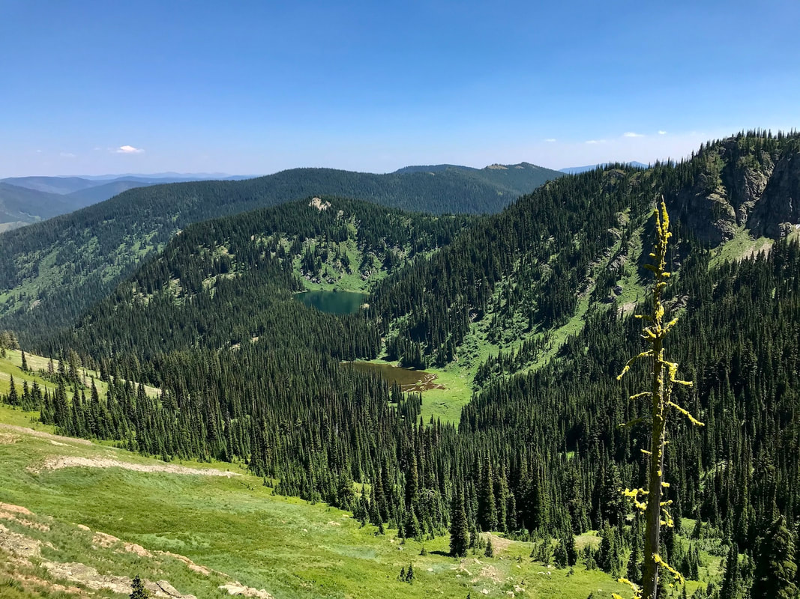
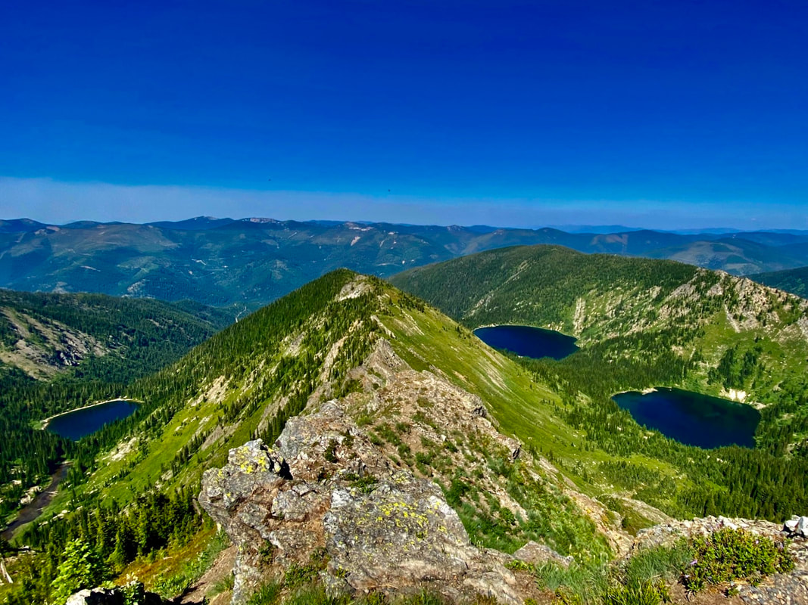

---
tags:
- Peaks & Mountains
- Moderate to Difficult
- Hiking
- Sshoe Backpacking
- Photography
- Scrambling
- Backcountry Skiing
stats:
- label: Event Type
  icon: hiking
  value: Hiking, sshoe backpacking, photography, scrambling, and backcountry skiing
- label: Distance
  icon: map-marker-distance
  value: 7.75 miles RT to the prominence (next two lines are personal GAIA data)
- label: Elevation
  icon: terrain
  value: From the Stevens Lakes Trailhead 2426 verts. From the Freeway parking area
    it is 2689 verts
- label: Difficulty
  icon: speedometer
  value: Moderate to difficult
- label: Maps
  icon: map
  value: IPNF & Mullan Topo
- label: GPS
  icon: crosshairs-gps
  value: 'Summer trailhead: 47°27''15" N 115°45''58" W. Winter trailhead: 47°27''56"
    N 115°45''33" W'
- label: Ranger District
  icon: pine-tree
  value: CDA River Ranger District 208.769.3000
- label: Shoshone County Sheriff
  icon: shield-account
  value: Call 911 first, or 208.556.1114
notes:
- label: Idaho Panhandle National Forests Alerts
  url: https://www.fs.usda.gov/alerts/ipnf/alerts-notices
---

# State Line Ridge Trail

## State line ridge sshoe & hike

## Description

We have added the areas sheriff's emergency phone number ffor each trip write up under the ranger district
info. If an emergency occurs, evaluate the circumstances and call 911 only if needed.

Snow season The trail to Stevens Lakes, starts the sshoe. Stay on the trail/road until it turns left just
below where the official trail begins uphill. This left turn is the only left turn that is not choked with
brush. Walk up Trail #165 for about .4 of a mile and turn left just before the second vertical Trail #165
vertical sign.

Follow this logging road up for 7 switchbacks. Follow this road around and below the gigantic ARROW (SEE
SCREENSHOT BELOW). As this old road circles the bottom of the ARROW, look for a way to into the center of
the ARROW, from the NE side. NOTE….you can stay on this old logging road as it circles the ARROW, and pops
out on the State Line Ridge.

Once centered in the ARROW walk directly up hill to the point of the ARROW. Before you enter the woods, stop
for a break and a snack. When you are ready to walk again, cut up thru the woods for about .4 of a mile. BE
SURE to stay on the faint top of the ridge, or do not allow yourself to drop down either side. Soon you will
pop out of the woods and see Upper & Lower St. Regis Lakes off to then SSE. Follow the obvious ridge line
south, which will undulate several times , before the walk continues along a safe knife edge ridge. I like
to walk out to the prominence to have lunch. DO NOT ATTEMPT TO GO FURTHER SOUTH ON THIS RIDGE. ITS WAY TOO
DANGEROUS. This lunch spot requires a short climb to the top, where lunch is with an incredible view.

Non snow season

Hiking the State Line Ridge is a great way to see an area you have visited many time, from a different point
of view. Please note that this route is being opened up as an emergency road for easy access to the
backcountry skiing. The directions are basically the same as winter, but an experienced hiker can make the
south State Line which is also a section of the Idaho Centennial Trail. However, just south of the tall
prominence, the terrain becomes very steep and the rock is steep without any hand holds. For that reason, I
would suggest that you drop down on a critter trail from the very start. This route is safe and gets you to
the same back ridge. Once past the vertical rock features, the ascent to the back ridge is some great
hiking/scrambling.

## Option #1: non snow season

Follow the above directions to the side of the ARROW, but do not go up into the ARROW.. Continue up this
road until it comes to the State Line Road. For great views: Turn left and walk over to the south running
ridge line. This road/trial will lead you south as it diminishes, to the prominence. To get to stevens peak:
As soon as you break out of the woods, look for a faint game trail that drops down and skirts the Start Line
Ridge. Hiking past the prominence is too dangerous. Continue south towards the back wall that is the
East-West Stevens Peak Ridge. Once on the back ridge, turn right to Stevens Peak. Enjoy the views from the
summit of Stevens Peak.

From here you can retrace your steps back to the trailhead. The following is the easiest and safest route
back to the stevens trailhead Or you could walk out Willow Ridge to the NNE. Continue hiking the Willow
Ridge until you come to Willow Peak. Stop for the views, then walk back towards Steven Peak where you will
find a very faint trail on the saddle that heads west down to the Upper Sanctuary and Lone Lake.

## Directions

Drive east on I-90 to Exit 69 and turn off the freeway. At the stop sign, turn left , drive over the freeway
to the next Stop sign. Turn right and drive past the Lucky Friday Mine. Continue east on Friday Ave. for .8
of a mile past the Shoshone Park left turn, and continue on Friday Ave. to where the road passes over the
freeway. This is the Willow Creek Road. Drive .9 of a mile to the trailhead.

---

## Cool things close by

Upper & Lower Stevens Lakes and Peak, Lone Lake, Lookout Pass Ski Area, the Route of the Hiawatha, the Trail
Of the CDA's, Crystal Lake, Graham Mountain, Silver Mountain, and Lower & Upper Glidden Lakes

## Hazards

Because most of this route is off trail, you must be careful and use extreme caution on the entire hike or
sshoe.

## R & P

The Pizza Factory, the 1313 Club, Muchachos Tacos in Wallace. In Kellogg visit the Radio Brewery. In CDA
visit the Mexican Food Factory, Franklin"s Hoagies, and the Trails End Brewery on 95 by Fred Meyers.

---

## Photo gallery

---

## Snow season

---

### Picture (Image missing)

## Upper & lower st. regis lakes, state line ridge,  stevens peak & lake

### Picture (Image missing) Details

The state line ridge route Notice the large "arrow" cut into the forest. My route takes us up thru the
arrow.

And is

referred to in this write up

---

## The route up thru the arrow

## This image shows the route after it breaks out of the woods

## After you get out of the woods, the image above, is the state line ridge

## Our lunch spot along the state line ridge See below, please

### Picture (Image missing) Details (2)

## this is our lunch spot, seen from upper stevens lake

## Please do not hike the ridge past this point,  its way too dangerous, see summer route

## Upper stevens lake

### Picture (Image missing) Details (3)

## Upper & lower st. regis lakes the first lake you come to, is the upper lake

### Picture (Image missing) Details (4)

## Avalances on stevens peak's ne face

### Picture (Image missing) Details (5)

## Lookout ski area from the state line ridge

## The route down thru the arrow

### Picture (Image missing) Details (6)

## Chris trekking down the arrow

## Non snow season

### Picture (Image missing) Details (7)

## The vertical rocks are too dangerous to cross, so drop to the "trail"

## Chicwackin' from the ridge prominence

### Picture (Image missing) Details (8)

## At the back wall, the climb up to the ridge is steep and fun and short

### Picture (Image missing) Details (9)

## Views of the upper stevens lake & peak are incredible

## From the same spot above, turn around and view The upper & lower st. regis lakes

### Picture (Image missing) Details (10)

## This faint "trail" leads to the back ridge that stevens peak is on

### Picture (Image missing) Details (11)

## Once on the back ridge, the view of the state line ridge shows the hazards

### Picture (Image missing) Details (12)

## Once on the back ridge, the views of lower & upper stevens lakes are great

The prize for doing this route is the views from the summit of stevens peak Lone lake is on the left...
lower & upper stevens lakes are on the right The easiest way down is to follow the willow ridge (center) Out
to the willow peak and drop down to lone lake at a saddle On a much easier user created trail

### Picture (Image missing) Details (13)

This image shows the user created route From willow ridge down to the upper sanctuary. Before descending as

the arrow

shows, Walk west up to two large knolls for a place To enjoy what you just did, and have a snack. It really
is the easiest way down
