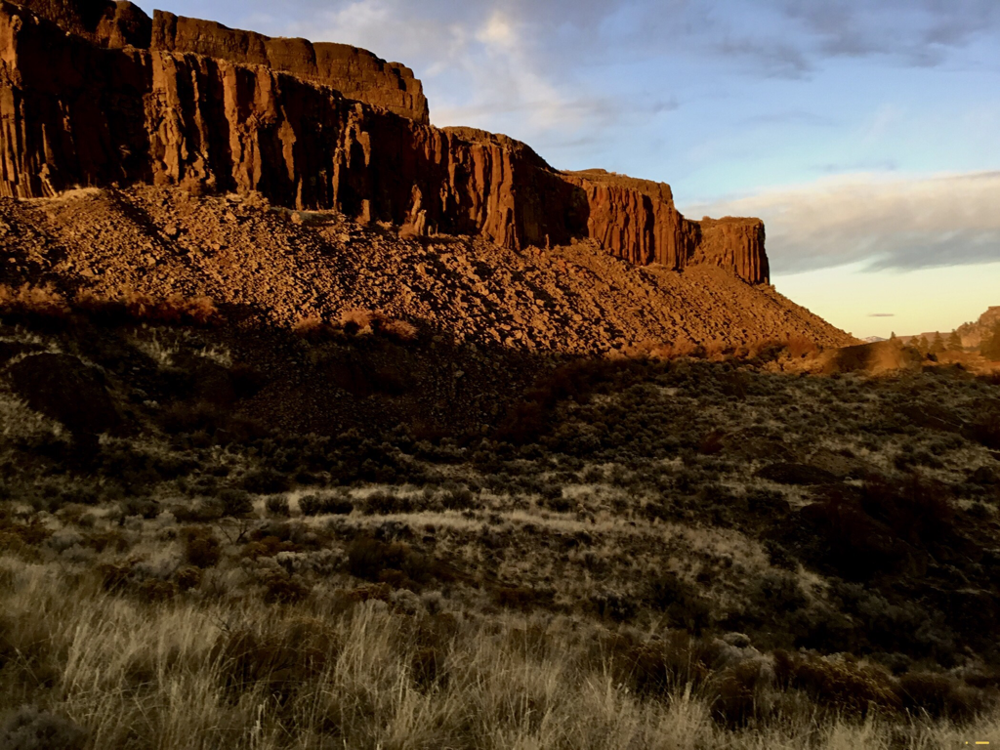
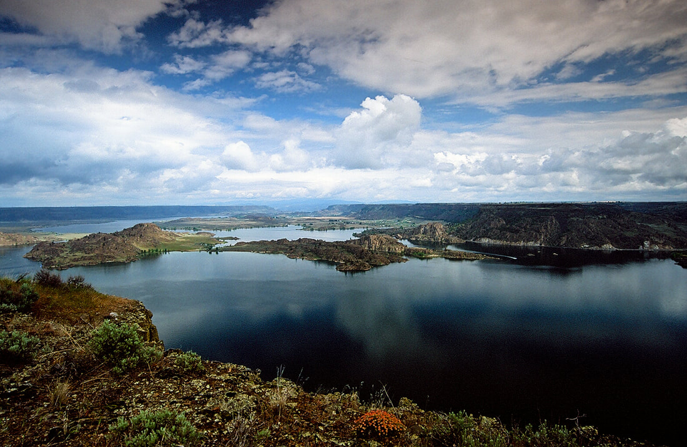
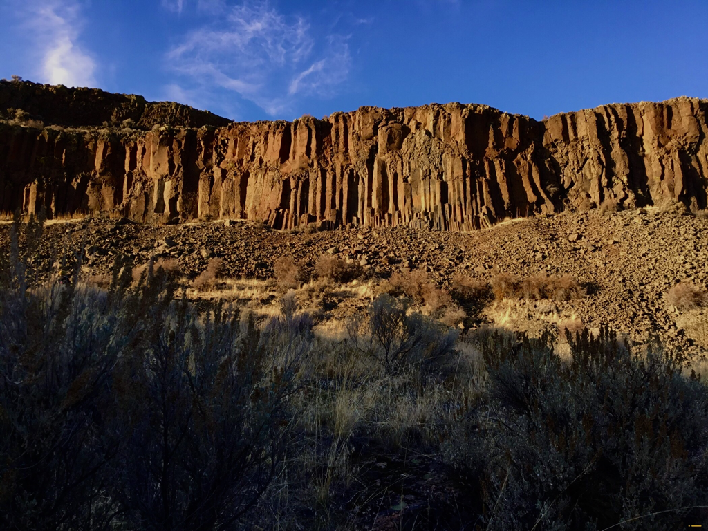
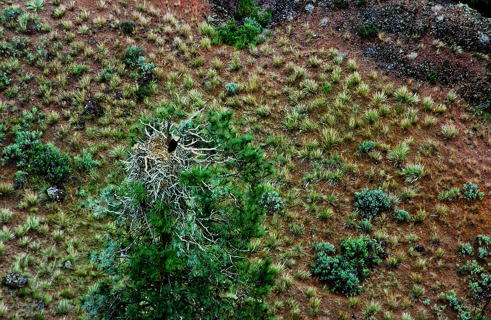
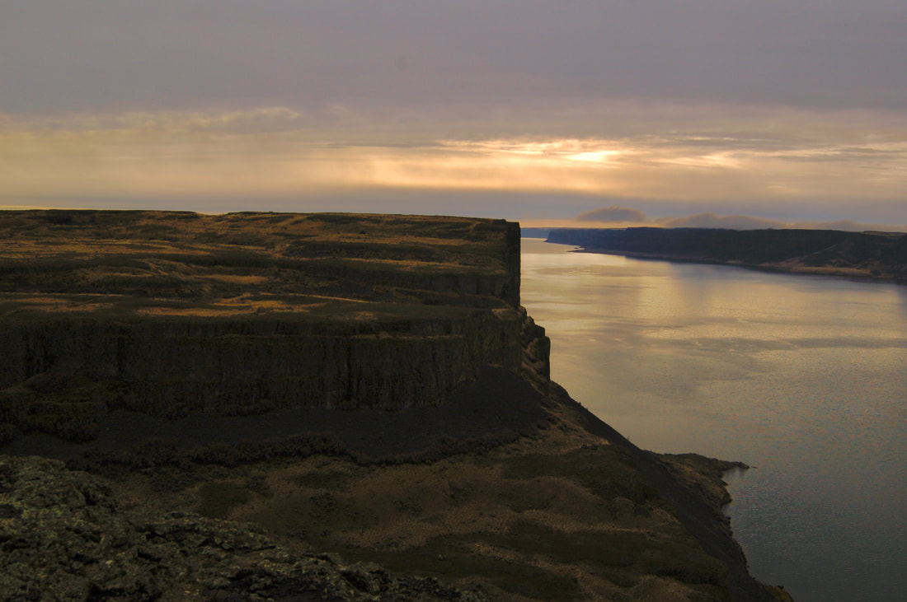
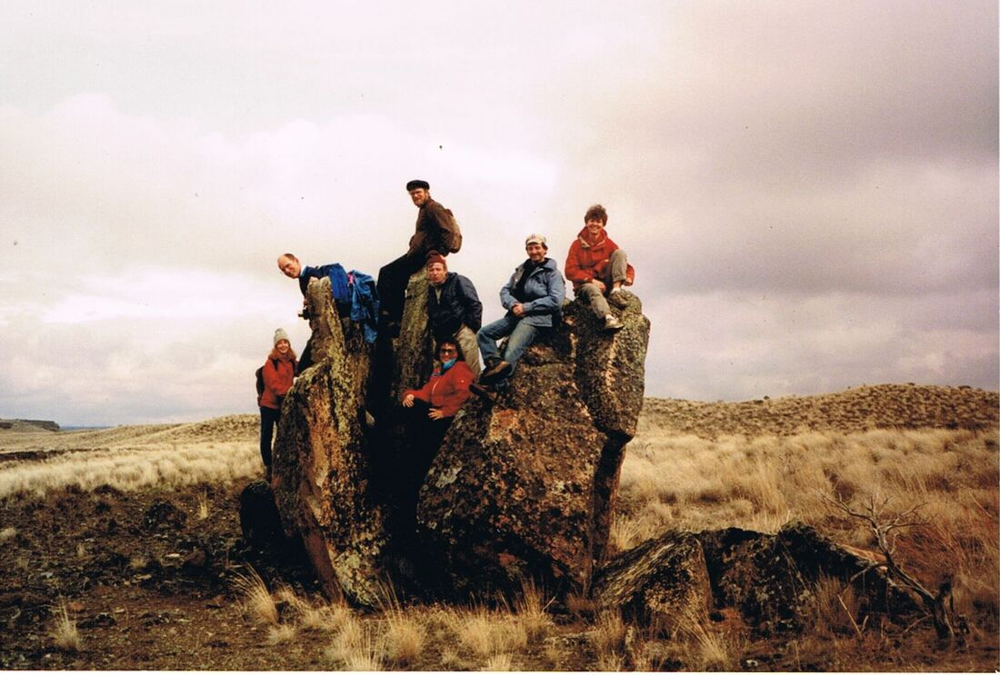

---
tags:

- Paddling & Rivers

- Day Hiking

stats:

- label: Event Type
  icon: kayaking
  value: Day hiking

- label: Distance
  icon: map-marker-distance
  value: 4 miles RT, unless you wander a lot

- label: Elevation
  icon: terrain
  value: 700’

- label: Difficulty
  icon: speedometer
  value: The ascent to the Rock is difficult. Once on top it’s easy.

- label: Maps
  icon: map
  value: Barker Canyon, Electric City, Steamboat Rock SE & SW

- label: GPS
  icon: crosshairs-gps
  value: 47°51’83" n 119°07’39" w

- label: Managing Agency
  icon: domain
  value: w.s.p. & r. 509.663.1304

- label: Grant County Sheriff
  icon: shield-account
  value: CALL 911 FIRST or 509.754.2011
---

# Steamboat Rock

*Steamboat rock state park*

## Description

When you turn off SH155 and drive about 12 miles, Steamboat Rock sticks up high and fills the horizon.
The Rock has an area of about one square mile, and raises about 700 verts off the water.
There is a parking area near the campgrounds.
The hike up onto the Rock goes thru a gap in the east wall. Once on top follow the trail around the perimeter for maximum views. On the very north end, look for a Ponderosa Pine with the top lightninged off, below the rocks rim. From spring to late fall, there is an eagle family that lives on it.
Along the west shore line, observe the waters below you. A steam comes in below and colors the waters. Make your way back to the trail out, or continue off trail to the south around the rim, before heading back to the cars.

## Directions

From Spokane drive west on Highway 2 to the junction with SH #155. Turn right (north) and drive about 14 miles to the state park.

## Hazards

The trail up onto the Rock is rough, as is the loop trail above.
The obvious 800' side walls can be hazardous.
Keep close eye on your kids and pets, near the edge.

There are safety shin guards you can buy to protect from snake bites.

## Cool things close by

Northrup Canyon, Summer Falls, Lake Lenore Caves, and the Sun Lakes-Dry Falls State Park, Banks Lake, Banks Lake Trail NW.

## R & p

Harvest Restaurant,
Lenny’s in Cheney

---

## Plan your trip

Click for Current NOAA Weather Conditions

## Photo gallery

## The north east end of steamboat rock

---

## Northern banks lake and islands

## Basalt columns along the east face

---

## Upper banks lake from the north side of steamboat rock

---

*Picture (Image missing)*

## Upper banks lake with the steamboat campground

---

## Below the north rim of steamboat rock is an eagles nest

---

*Picture (Image missing)*

## Lunch on the rock

*Picture (Image missing)*

## Jeniffer walking along the west shore cliffs

## Looking south along the west side of the rock

## Spokane mountaineers clowning around on steamboat rock    spring 1989

---

---
