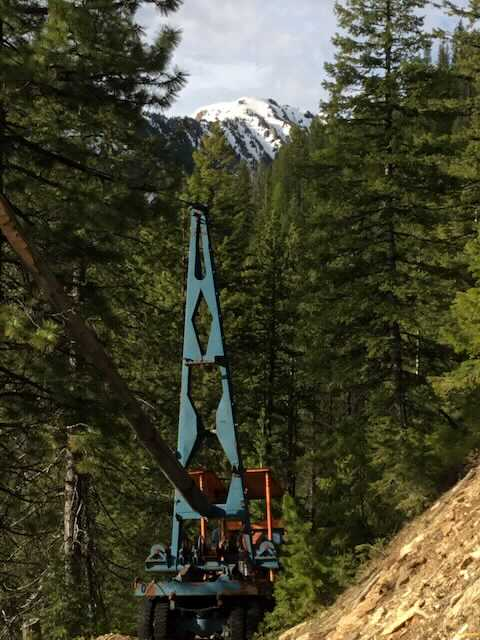
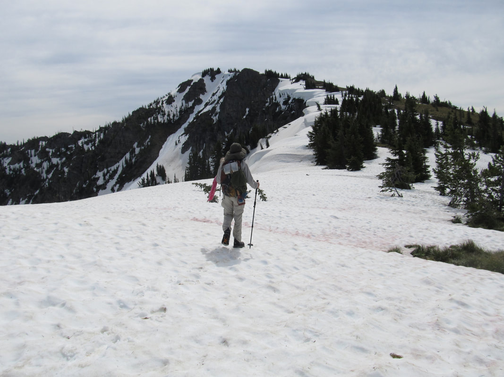
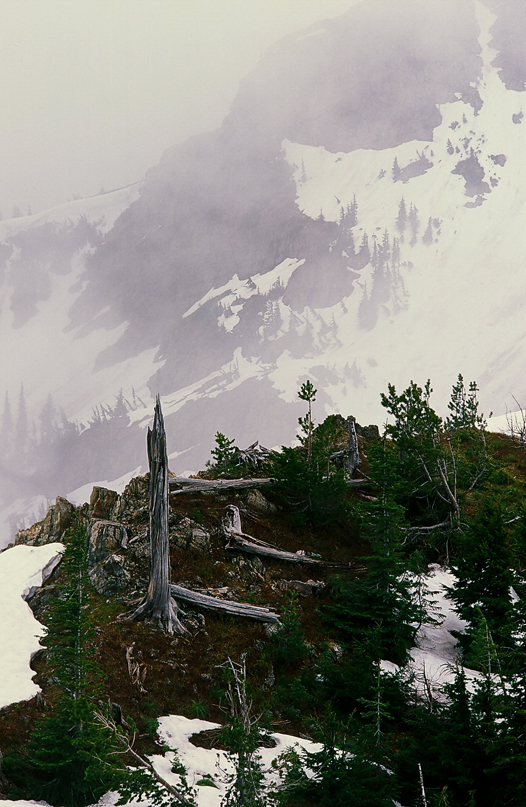
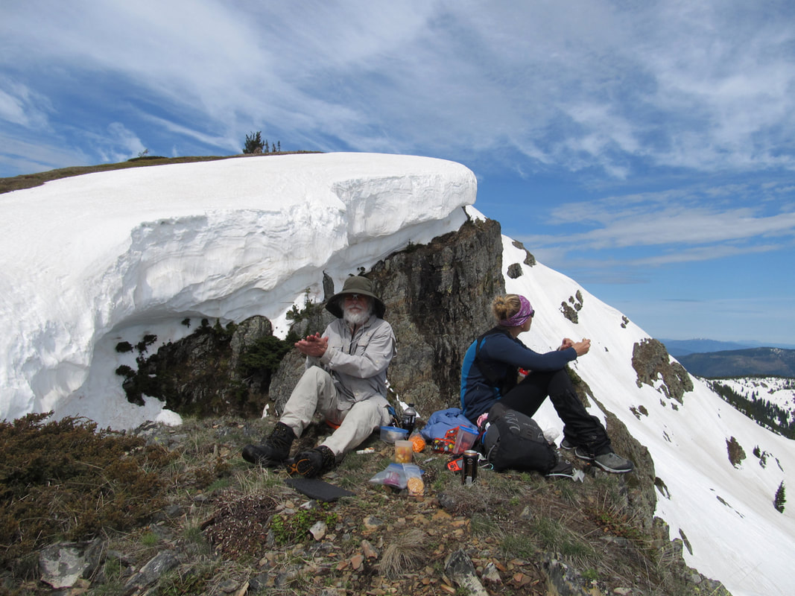
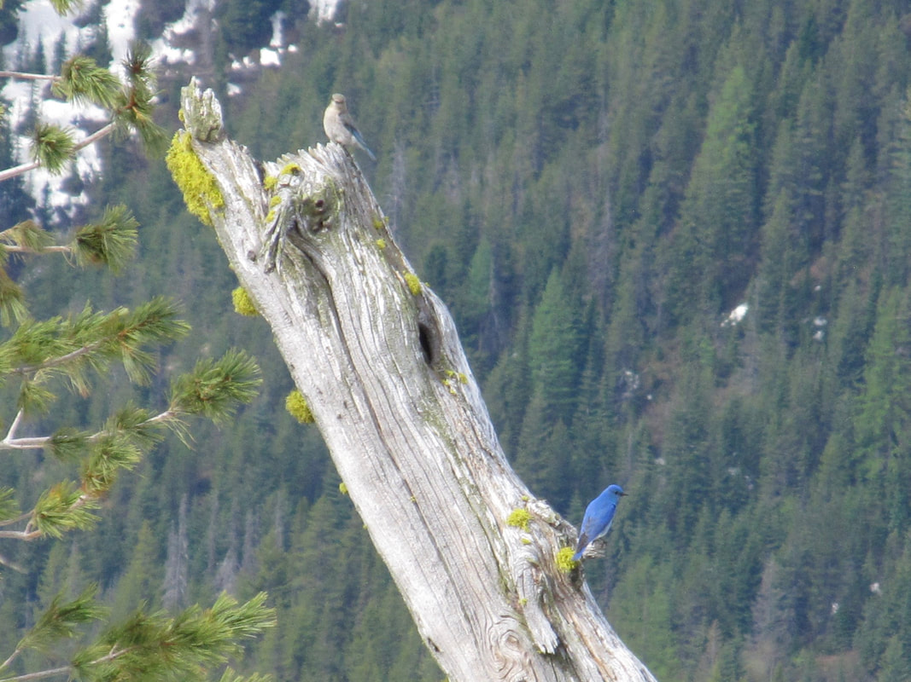
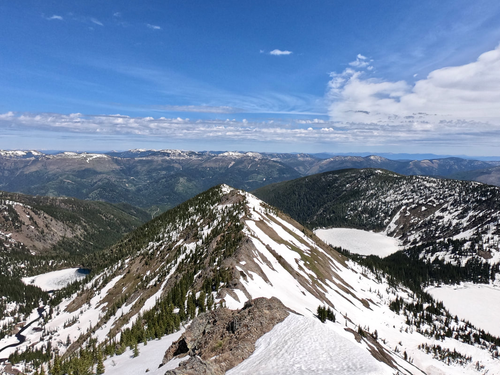
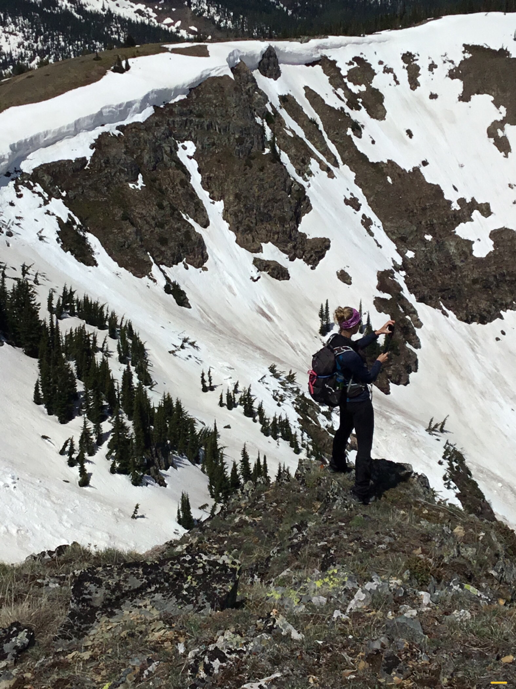
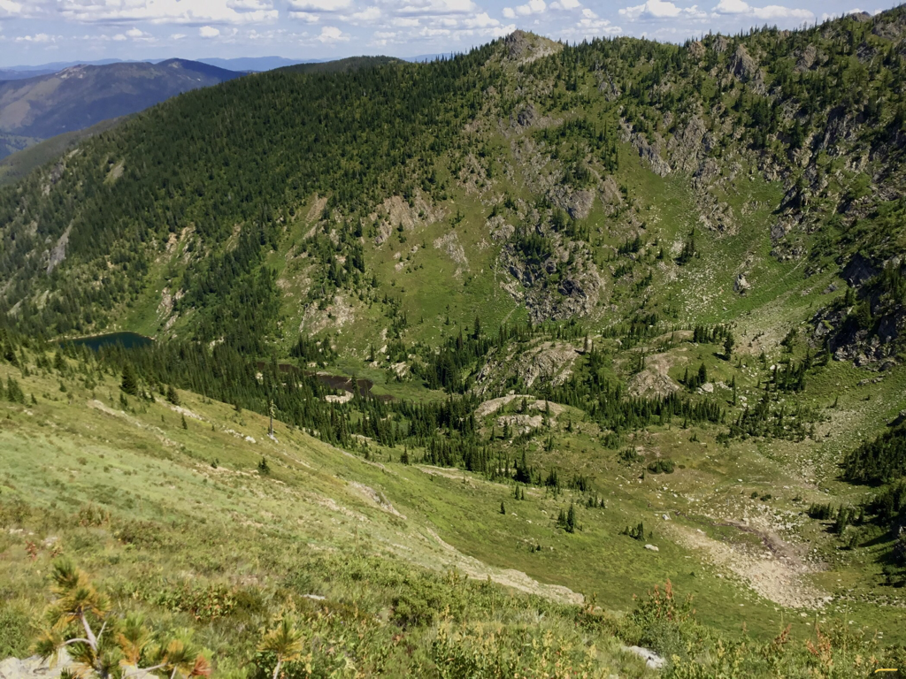
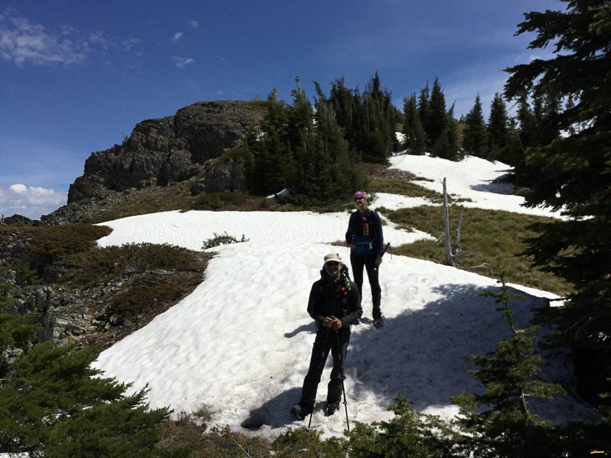
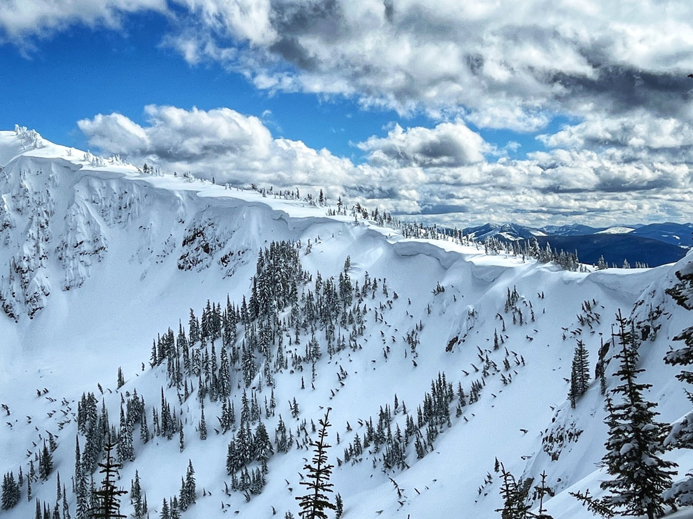

---
tags:

- Peaks & Mountains

- Difficult

- Hiking

- Backcountry Skiing

- Snowshoeing

stats:

- label: Event Type
  icon: hiking
  value: Hiking, Backcountry Skiing, Snowshoeing

- label: Distance
  icon: map-marker-distance
  value: 9.3 Miles RT

- label: Elevation
  icon: terrain
  value: 2878 verts gain

- label: Difficulty
  icon: speedometer
  value: Difficult

- label: Maps
  icon: map
  value: USGS - IPNF, St. Joe N.F., & Mullan, Idaho topo

- label: GPS
  icon: crosshairs-gps
  value: 47°25'34.5"n 115°46'20.6"w

- label: Ranger District
  icon: pine-tree
  value: CDA River R.D. 208.769.3000

- label: Shoshone County Sheriff
  icon: shield-account
  value: CALL 911 FIRST or 208.556.1114
notes:

- Idaho panhandle national forest/alerts

- <https://www.fs.usda.gov/alerts/ipnf/alerts-notices>
---

# Stevens Peak Via West Willow Ridge 6838

## Description

We have added the areas sheriff’s emergency phone numbers for each trip write up under the ranger district info. if an emergency ocurrs, evaluate your circumstances and call only if needed.
Stevens Peak is surrounded by several remarkable alpine glacier carved cirques, lake and aerates. There are several ridges leading up to the summit which makes for many different options for ascents, descents, loops and through hikes. One route follows the West Willow Ridge, which is also the Idaho Centennial Trail which comes from the south east along the Idaho/Montana border up and over Stevens Peak and continues on north into the Coeur d'Alene N.F. and ultimately into the Selkirks.

West Willow Ridge offers a hard,  but safest routes up to the summit, in the winter and summer. In the winter and spring, by staying up on the ridge you can avoid most of the avalanche danger while skiing or snowshoeing in. This route is also less steep than climbing the headwalls from Lone Lake, but it is sustained until you are above Lone Lake.

## Option #1

Trail #16 route from moon pass:

Park at Moon Pass and take Trail #16 N.R.T. past Gold Hill on to Stevens Peak. Trail #16’s route starts as an old road, above the Moon Pass Road,  that soon becomes a nice trail up over a gentle ridge, to an ORV road. Continue NE on a gentle trail Into the Roughin Creek drainage. The trail switchbacks several time as it summits the east/west ridge. Gold Hill sits along this ridge. From where the trail summits the ridge to Gold Hill, is about .5 miles going cross country. If you stay on Trail#16, there is an ORV Trail on the east side that leads up Gold Hill, in about .75 miles. From here, head east towards Stevens Peak.

From Gold Hill to West Willow Ridge road it’s about 2.8 miles, and a total of 3.3 miles to Stevens Peak.

## Option #2

Boulder creek route:
Park at a small parking area above the top road to the Cemetery south of Mullan and follow Boulder Creek about 2 miles to a "basin". ( Meaning no longer on the road up.)
Then work your way left (SE) before heading straight up hill to West Willow Ridge at about 2.6 miles. Turn right and walk about 1.6 miles to Stevens Peak.
This route is best in the winter for hiking/snowshoeing and backcountry skiing. In the non snow season, it’s a difficult route to find up thru the woods.

## Option #3

ST. REGIS LAKES TO STEVENS PEAK AND OUT VIA BOULDER CREEK: Ski route.
Drop a car at the Cemetery south of Mullan and continue east to the St. Regis Lakes basin. Gain the ridge above the first lake, which is the Upper ST. Regis Lake. Look for a chute along its NE shore that heads SSW up to the State Line Road, and the Idaho Centennial Trail. Once on the ICT, head west to the summit. It’s about 1.8 miles from Upper St. Regis Lake to Stevens summit. Be aware, the route from U. St. Regis Lake to the State Line is off trail, rugged and steep.

---

## Directions

From Spokane take I-90 east to Mullan, Idaho exit #69. Turn left over the freeway to a stop sign. Turn right on Friday Road, past the Lucky Friday Mine and head east bearing right at the "Y" and follow to where it crosses over I-90 on the Willow Creek Overpass. Forest Road # 80008 heads south for .9 of a mile on a good dirt road to the Stevens Lakes/Lone Lake trailheads.. The Stevens and Lone Lake trail head is at a bend in the old rail road grade and it has a vault toilet. There is a smaller upper parking area at GPS: 47°27'03" N 115°46'06 W. Follow the road up West Willow Creek for approximately one mile and park there. DO NOT GO WEST UP A VERY OLD ROAD. Take the Lone Lake Trail DUE SOUTH for a little over .1 of a mile, until you reach the first road/trail off to the right with a cairn marker. Take that road until you gain the ridge line. As you walk up the faint trail, it will connect with a wider road to the right. Up near the top is an old blue skidder, abandoned on the road. In a short distance you will summit the ridge on an ORV trail. From there follow the ridge south over 5 steep bumps along the road to where the ridge steepness eases up.

---

## Cool things close by

Stevens Lake, Lone Lake, Shefoot Mountain Trails, Trail #16, Big Dick Point Trail #189, St. Regis Lakes, Lookout Pass Ski Area, the Route of the Hiawatha, and the Trail of the Coeur d’Alenes bike trail.

## Hazards

The terrain is steep and sustained for several miles.
Exercise caution around the cornices. They can and do break off.

## R & P

[North Idaho Mountain Brew](https://northidahomountainbrew.com), [1313 Club](https://www.1313club.com), [Pizza Factory](https://wallace.pizzafactory.com) in Wallace, [Radio Brewing Company](http://www.radiobrewingcompany.com) in Kellogg, the [Snake Pit](https://snakepitidaho.com) north of Kingston and [Trails End Brewery](https://www.trailsendbrewery.com) in Cd'A.

## Photo gallery

---

## An old abandon boom truck just before the summit ridge, on the idaho centennial trail

---

*Picture (Image missing)*

## The lone lake face of stevens peak. check out those cornices. image by amy voeller

---

## An old geeeezer chuggin’ along west willow ridge. image by amy v

---

## The willow ridge line to stevens peak 6838'

There’s nothing like a great spot, with friends and views to enjoy a high mountain lunch. image by david crafton

---

Mountain blue birds. there are small flocks of them on most of the peaks around here. image by david crafton

---

From the summit of stevens peak, is this view of upper & lower stevens lakes on the right, with lone lake on the left side of the divide.

---

## Amy taking a selfie out on the edge

## Long lake and the upper sanctuary, with lone lake below

## Co-author david crafton, and hiking partner amy v. descending stevens peak’s west willow ridge

## The below images were sent to me by fellow spokane mountaineer, vanette leighty, thank you

*Picture (Image missing)*

## The group sshoeing up the idaho centennial trail, stevens peak area Image by vanette leighty

*Picture (Image missing)*

Up high on the idaho centennial trail above the upper sanctuary, lone lake image by vanette leighty

## The south wall of the upper sanctuary at lone lake, stevens peak area image by vanette leighty

Fall colors are the colors of life near its end. So brilliant they are,  they inspire writers,  painters,          photographers,  and wanders alike.             chic. 10.4.11
