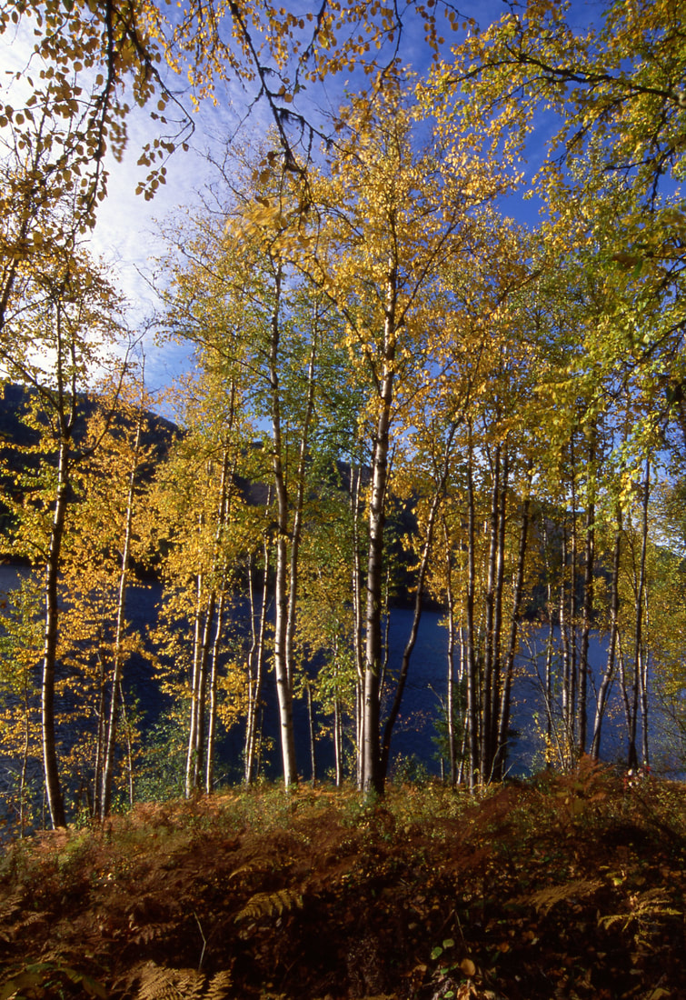

---
tags:
- Lakes
- Easy
- Day Hiking
- Paddling
stats:
- label: Event Type
  icon: hiking
  value: Day hiking, paddling
- label: Distance
  icon: map-marker-distance
  value: 9.2 miles RT
- label: Elevation
  icon: terrain
  value: "650\u2019"
- label: Difficulty
  icon: speedometer
  value: easy
- label: Maps
  icon: map
  value: Colville N. F., Metaline Falls Topo
- label: GPS
  icon: crosshairs-gps
  value: "North shore beach 48\xB050\u2019 14\" N 117\xB016\u201934\" W"
- label: Pend Orielle County Sheriff
  icon: shield-account
  value: 509.447.3151
notes:
- label: 'M,ANGING AGENCY: C.N.F. & Sullivan Lake R.D. 509.446.7500'
  url: '#'
---

# Sullivan Lake Shore Line

## Description

This wonderful hike starts at either end of the lake. So read it backwards if you start on the south end at
Noisy Creek Campground. The hike is on the east side of the lake and undulates about 70' all the way. There
is a bench that offers views of the lake and the mountain across the lake. There are several small beaches
along the shore line for swimming and sun bathing. Look for a nature trail near the start of the north end.

## Option #1

If you take your kayaks with you and chain them up in the Noisy Creek boat launch, then you can paddle back
to the north trailhead.

## Directions

From Newport, Wa, drive north on US 20 to Ione. In IONE turn right (east) on FR 33. Cross a very cool bridge
over the Pend Orielle River to Sullivan Lake. Noisy Creek Campground is about 8.4 miles from Ione. The north
trailhead is about 4.5 miles north. Enter the Sullivan Lake Ranger Station and drive less than 1/2 a mile to
the East Sullivan Campground. The trailhead is about 1/3 mile, next to the dirt landing strip.

## Cool things close by

Fall colors in late September, early October are not to be missed. Elk Creek Falls are just north of the
ranger station, very cool falls, Hall Mountain dominates the east shore line. In Ione, look for the
Sweetwater Rest Area & Falls.

## Hazards

The east shore water line on Sullivan Lake drops off sharply.

## R & P

NA

### Picture (Image missing)

## Photo gallery

### Picture (Image missing) Details

## The east shoreline of sullivan lake

## The eastern shoreline fall colors are a great attraction

## No images yet. to contribute, contact chic
