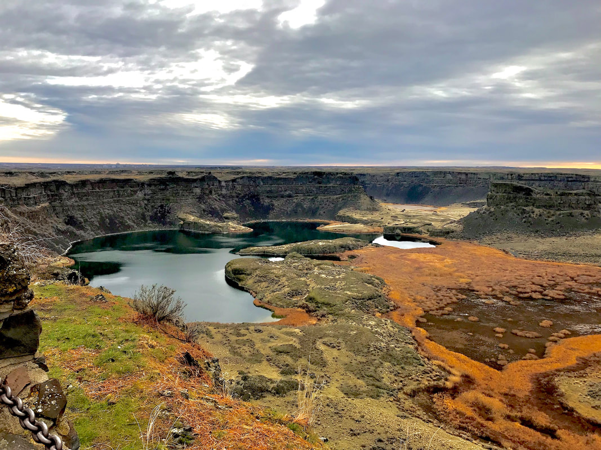
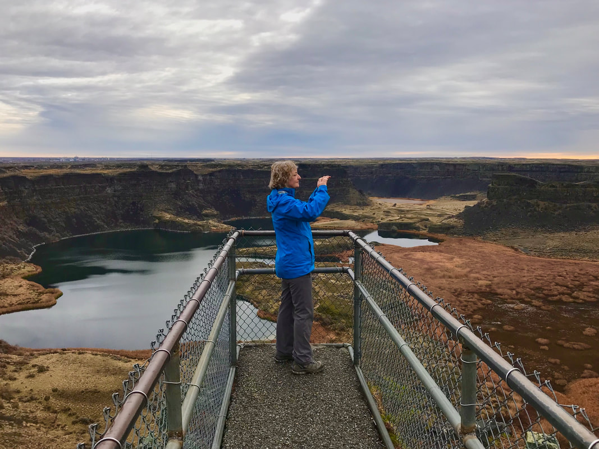
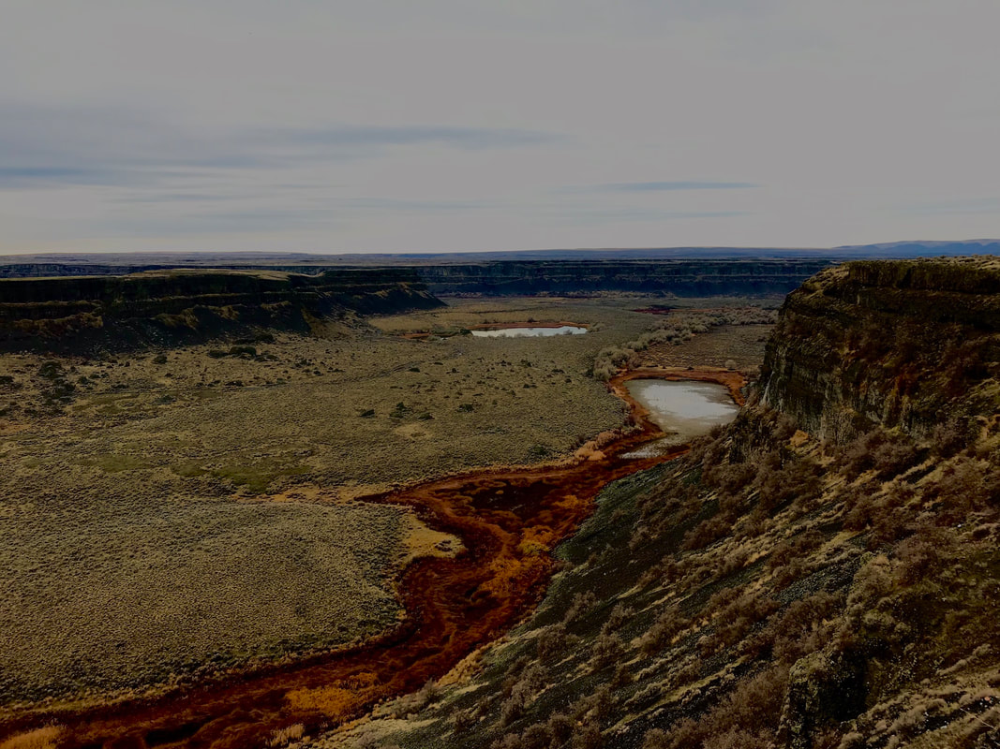

---
tags:
- Lakes
- Easy
- Camping
- Day Hiking
- Equestrian
- Golf
- Mt Biking
- Paddling

stats:
- label: Event Type
  icon: hiking
  value: Camping, day hiking, equestrian, golf, mt biking, paddling, fishing, and
    relaxation.
- label: Distance
  icon: map-marker-distance
  value: varies depending on your route.
- label: Elevation
  icon: terrain
  value: varies depending on where you go. Except for hiking the rim, elevation change
    is minimal
- label: Difficulty
  icon: speedometer
  value: easy
- label: Maps
  icon: map
  value: Sun Lakes-Dry Falls State Park brochure and website
- label: GPS
  icon: crosshairs-gps
  value: 47°35’21" n 119°23’ 28" w
- label: Managing Agency
  icon: domain
  value: w.s.p. & r. 509.632.5583
- label: Grant County Sheriff
  icon: shield-account
  value: CALL 911 FIRST or 509.754.2011
---

# Sun Lakes S P Dry Falls Area

*Sun lakes-dry falls state park*

## Description

I be sure to read "hazards" below.
Sun Lakes is a very diverse park, with golf, hiking, Mt biking, swimming, bird watching, play grounds, fishing, and boating.
As you drive down into the main body of the park, you will be in awe of the desert-steepe terrain. And in the middle of all this, are a number of lakes, Sun Lake being the largest attraction.
However, having said that, Dry Falls is so spectacular, it may over shadow the rest of the park.
Many times, 12,000 years ago and back, Glacier Lake Missoula formed behind ice dams crossing the valley at Clark Fork, Idaho.
When the dams bursts, the equivalent of Lakes Erie and Superior, raced down thru Sandpoint, CDA, Spokane, and beyond to the Columbia River and the Pacific Ocean.
Imagine a wall of water 1,000+ feet tall and moving at 65 miles per hour, thru what is now known as the Washington’s Channeled Scablands.

You can hike down to, or paddle to what was at one time the largest waterfall on earth. Some 400+ foot cliffs, and about 3.5 miles wide.

Be sure to plan some time to visit the Visitors Center, perched on the west rim.
Within the park are 8 lakes to explore. Some you do not want to get wet in.

A word of caution....on opening day of fishing season, there is not a square inch of land on Park Lake to stand. Because it has an early opening season, the hordes flock to its shores.

## Option #1

Dry falls observation area
From the Dry Falls observation deck, the plungepool to the floods listed above, are before you. There is a faint trail to the north, that drops down to the lake level. Or you can launch your canoe or kayak, and paddle up next to the big wall.

In 1993, Chic organized a Clubwide Spokane Mountaineers clean up of the 400’ cliffs below the Visitors Center. Around 60 Spokane Mountaineers, clean over 50 Grass bags with litter and other trash.
Five climbers were lowered over the cliffs, to pick up trash on the massive cliffs.
Five rope lines were strung down the cliffs, to allow the full bags of trash to slide down rope to waiting mountaineers for collection.
Dozens of tires, and loads of beer cans were cleaned up also.
While you are at the overlook, notice the ranger house across Hwy 17, behind you.
It’s an ancient rock house, that demands a closer look. But be aware, rangers live there. Please do not disturb the family living there.
The Visitors Center, is a great place to learn more about the Glacier Lake Missoula’s Ice Age Floods.

## Option #2

Monument coulee
Along side the Umatilla Rock, lies Monument Coulee. It isn’t a big area, but it is very unusual. The basalt rock columns are strung out over the area, some standing, some leaning, and a lot lying on their sides. As you walk thru this area, the landscape seems out of this world.
Spend some time here, but always have an eye out for snakes.
Rattlesnakes, like all others are cold blooded. In the morning, they are out in the open, or partially under rocks, warming themselves. Do not step over rocks without looking for snakes.

## Option #3

Green lake & red alkali lake
Off to the SW of Dry Falls Lake, are two lakes to visit, but don’t get wet here.
The first is Green Lake, and the second is Red Alkali Lake.
They are interesting to visit, but offer no recreational possibilities

## Directions

From Spokane, head west on Hwy 2 for about two hours. At Banks Lake South, you will come to Hwy 155.
Turn left (south), staying on Hwy 2, past Coulee City to Hwy 17.
Sun Lakes State Park is south on Hwy 17 about 4 miles.

## Hazards

RATTLESNAKES. If you are interested in hiking the Scabs, and are worried about rattlesnakes, there are plastic shin wraps to protect you.
The scablands are very hot in the summer, so be prepared.
Discover Passes may be required in some places.

## Cool things close by

Banks Lake, Northrup Canyon, Steamboat Rock, Coulee Dam, Moses Lake and the Potholes, Quincy Lake, Frenchman’s Coulee, Columbia River, to name a few.

## R & P

Lenny’s in Cheney

---

## Plan your trip

Click for Current NOAA Weather Conditions

## Photo gallery

---

## Julia photographing the area from the point

## Two ponds on the way to sun lakes state park

---

---

---

---

---

---
