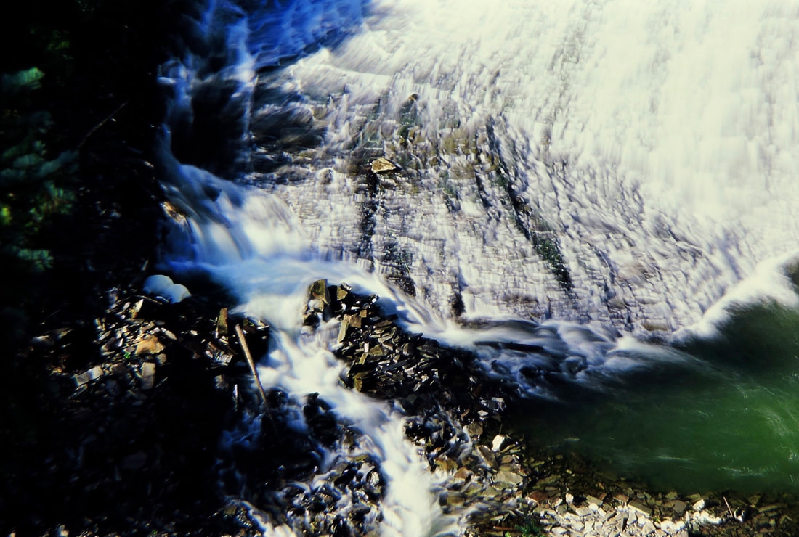
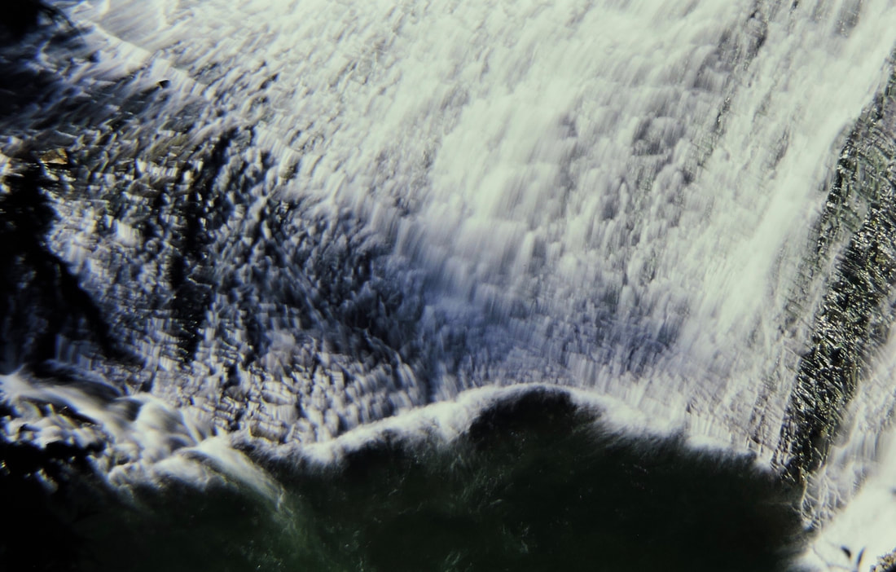
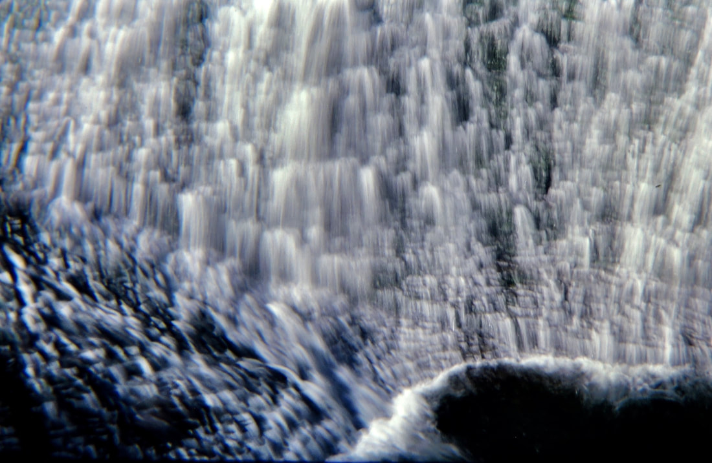

---
tags:
- Waterfalls
stats:
- label: Waterfall
  icon: waterfall
  value: Sweet Creek Falls
- label: Drop
  icon: arrow-collapse-down
  value: About 30'
- label: Waterfall Type
  icon: waterfall
  value: Cascade to a bowl plunge
- label: Distance Car to Falls
  icon: map-marker-distance
  value: .5 miles
- label: Maps
  icon: map
  value: Colville N.F., Sullivan Lake Ranger District 509.447.7300
- label: GPS
  icon: crosshairs-gps
  value: 48°49’46" n 117°23’84" w
---

# Sweet Creek Falls

*Sweet creek falls, ione, washington*

## Description

As you drive up to Boundary Dam, Pewee Falls, Metaline Falls, stop by the Sweet Creek Rest Area.
At the rest stop, the trail is a paved and ADA accessible to the Sweet Creek Falls. Its only .5 miles and you will not regret the time spent to see it.
The actual falls cascades down a gentle slope, before it plunges off the rim. At the bottom, the falls is a large bowl that the creek circles and falls into.

## Option #1

On your way up to the falls, notice a path above the creek. This path will take you up to an incredible view of the bowl from above.

## Directions

From Newport, WA., head north on Hwy 20 to Tiger, WA. At Tiger, turn right (N) up Hwy 31. When you pass the Selkirk High School, in less then 1/2 a mile stop act the Sweet Creek Rest Area. From the rest area is the Sweet Creek Falls Trail. Its a very cool set of falls

---

## Cool things close by

Tiger, Ione, Boundary Dam, Pewee Falls, Gardner Cave at Crawford State Park, Sullivan Lake, Elk Creek Falls, the Columbia River, and the Salmo-Priest Wilderness.

## Hazards

All waterfalls are a hazard, due to their slippery nature. always be extra careful near any waterfall.
​The path above the paved trail can be slippery. Please do not go beyond the railing.

## R & p

NA

---

## Plan your trip

Click for Current NOAA Weather Conditions

## Photo gallery

---

## Below are some images of sweet creek falls

