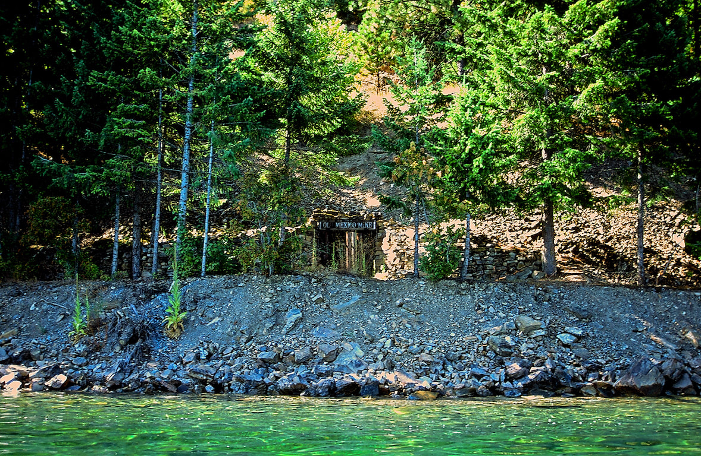
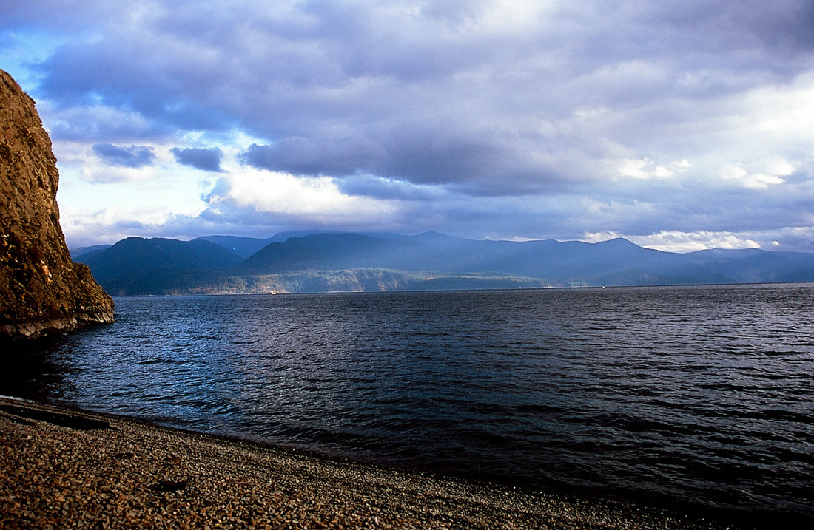
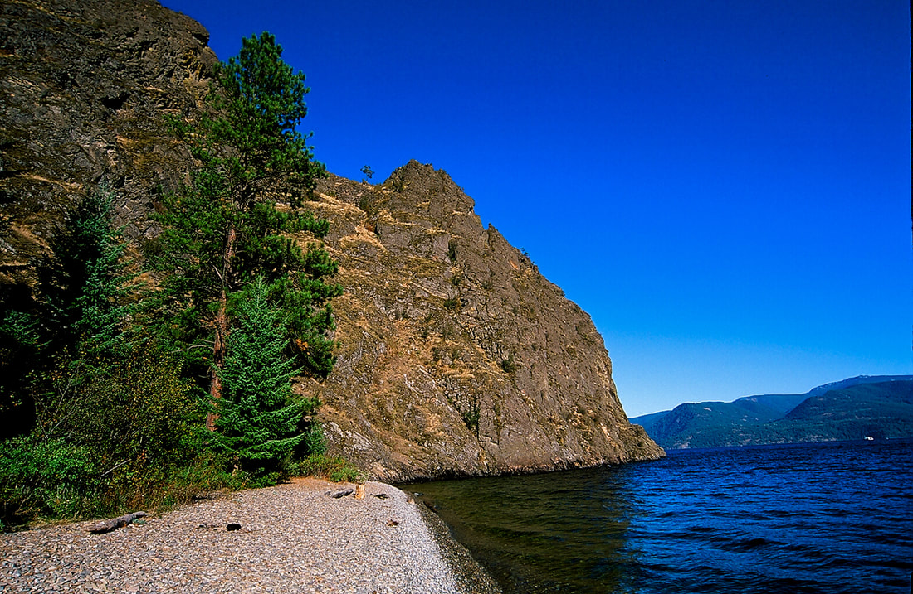

---
tags:
- Trails & Scrambles stats:
- label: Paddle Distance icon: map-marker-distance value: varies
- label: Elevation icon: terrain value: 2067’
- label: Length and Acreage icon: vector-square value: 65 miles long, 125 miles if shore line, 148 square
  miles or 88,008 acres and 1150’ deep
- label: Maps icon: map value: Packsaddle Mountain Topo
- label: Launch GPS icon: crosshairs-gps
## value: 48°07’43" n 116°28’ 4" w
## Talache Landing
## Description
Talache Landing is located on the west side of P.O. Lake east of a Sagle, Idaho. The beach is about 200 feet
long and offers swimming and non trailer boat launching. The launch area is located past some houses, so
please be quiet and respectful. All property around the beach are privately owned, so please be respectful.
there are no restrooms, so please bring pee bottles and blue bags for everyone.
## Attractions
Swimming and launch beach.
## Directions
From CDA, drive north on 95, past Algoma for .5 miles, and turn right (east) onto Sagle Road. There is a
Conoco gas station on the left side of the highway. This is your last chance for goodies. Once on Sagle Road
continue east to the RR tracks. From the RR tracks, stay on Sagle Road for less then .5 miles, and bear
right onto Talache Road. In about .4 miles bear left past Shepherd Lake and Mirror Lake. The Talache Road is
also F.R. 2233. Talache Road drops down hill to a hairpin turn to the left. Then down hill past the houses
to the launch beach. This beach is not fancy, and does not have a restroom. Please plan ahead. Bring pee
bottles and blue bags for each beach goer. Please, do not litter or leave any human waste. and please be
resectful.
## Cool things close by
To the north is Umbrella Point and Garfield Bay. To the south is Maiden Rock Boat Camp, and Evans Landing.
Evans Landingbis foot and boat access only, no roads.
## R & P
In Sandpoint is Mr. Sub, Eichardt’s, Jalapeños, and Burger Express in Dover.
---

# Talache Landing

## Plan your trip

[Click for Current NOAA Weather Conditions](https://www.nws.noaa.gov/wtf/udaf/MapClick.php?lel=4000&uel=9000&polygon=49.016%2C-114.180%2C48.994%2C-114.381%2C48.890%2C-114.341%2C48.924%2C-114.151%2C&area=63)

## Photo gallery

## Ol' mexico mine along the wset shore to maiden rock

## Maiden rock boat camp beach along the west side of prnd orielle lake

## Maiden rock stands out next to the beach Its over 800' deep 50' off the point

### Picture (Image missing)

Kayaking isn't the only way to get here You can hike dwon from the blacktail trailhead, but its steep

### Picture (Image missing) Details

## Looking s.e. from maiden rock
