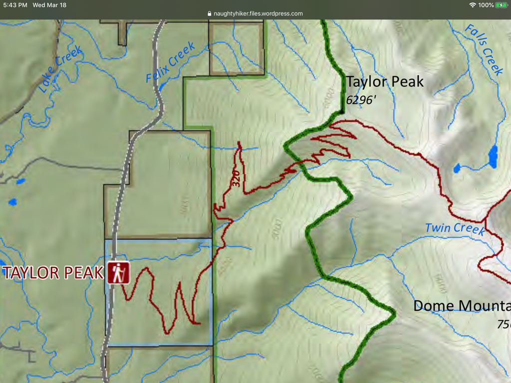

---
tags:
- Peaks & Mountains
- Strenuous
- Day Hiking
- Backpacking
stats:
- label: Event Type
  icon: hiking
  value: Day hiking, backpacking
- label: Distance
  icon: map-marker-distance
  value: 16 miles RT
- label: Elevation
  icon: terrain
  value: 4000’
- label: Difficulty
  icon: speedometer
  value: Strenuous
- label: Maps
  icon: map
  value: Kootenai N.F., Crowell Creek topo
- label: GPS
  icon: crosshairs-gps
  value: 48°23’11" n 115°47’28" w
- label: Lincoln County Sheriff
  icon: shield-account
  value: CALL 911 FIRST or 406.293.4112
notes:
- Libby ranger district. 406.293.7773
- Kootenai national forest/alerts<https://www.fs.usda.gov/alerts/kootenai/alerts-notices>
---

# Taylor Peak

*Taylor peak 6307’ trial #320*

## Description

This trail is yet another steep and seemingly endless ascent. There are about 26 switchbacks before a short
rock hop to the summit. As you near Taylor Peak, a short off trail route will take you to Taylor’s summit.
The views all around are spectacular, with the Bulk of the CMW laid out to the south.

## Directions

Near milepost 30 along Hwy 56, look for the Taylor Peak Road #4621 off to the east. Drive about 1.5 miles to
the trailhead. Parking is below the trailhead at a switchback.

## Hazards

Another 4000’ gain in 8 miles. No water near the summit.

## Cool things close by

Ross Creek Cedars, Cedar Lakes, Dome Mountain, Kootenai Falls, and the Proposed Scotchman Peaks Wilderness.

## R & P

Henry’s in Libby, Pizza Hut, Rosauers, Clark Fork Pantry & Squeeze Inn in Clark Fork. Eicharts, Mr Sub &
Jalapeños in Sandpoint

## Plan your trip

Click for Current NOAA Weather Conditions

## Photo gallery

## No images. to contribute, contact chic

---

---

---

---

---

---

---
