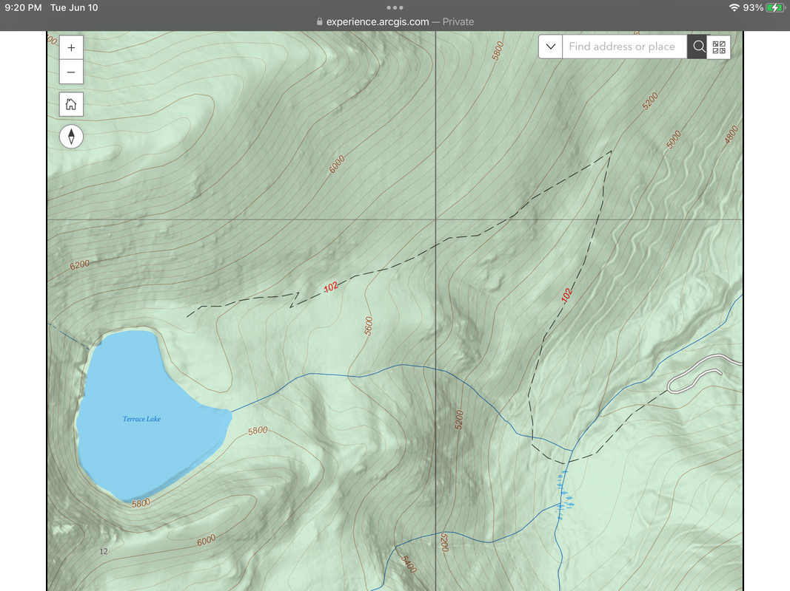
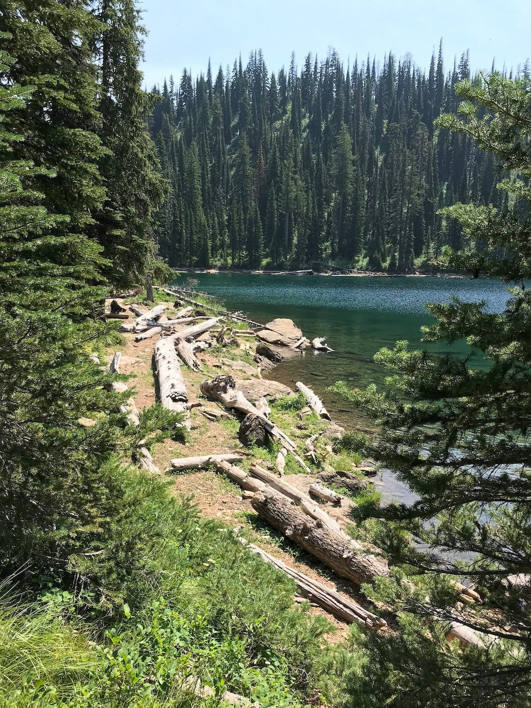
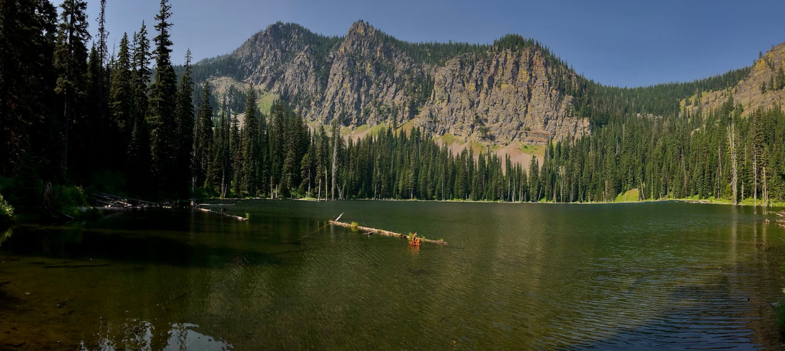

---
tags:

- Lakes

- Easy, With Challenges

- Day Hiking

stats:

- label: Event Type
  icon: hiking
  value: Day hiking

- label: Distance
  icon: map-marker-distance
  value: Under 4 miles RT

- label: Elevation
  icon: terrain
  value: slightly over 1100verts

- label: Difficulty
  icon: speedometer
  value: Easy, with challenges

- label: Maps
  icon: map
  value: Lolo National Forest, Vermillion Peak top

- label: GPS
  icon: crosshairs-gps
  value: n47°77'00" w-115°25'71"

- label: Ranger District
  icon: pine-tree
  value: thompson falls ranger district 406.826.3821

- label: Sanders County Sheriff
  icon: shield-account
  value: call 911 first
notes:

- Lolo national forest/alertS

- https[://www.fs.usda.gov/alerts/lolo/alerts-notices](https://www.fs.usda.gov/alerts/lolo/alerts-notices)
---

# Terrace Lake

*Terrace lake   Stoney lake fishtrap lake & campground*

## Description

After driving to the trailhead, the hike heads SW  first, and makes a large u-turn, for about .6 of a mile to the first switchback.
In a short distance, the trail switchbacks twice, before it meanders to the lake.
This section of the trail is the longest, but is a great trail to hike.
There are places to have lunch and enjoy this spectacular, peaceful lake.
We looked for routes to climb to the summits, and as the trail nears the lake, the ridge to the west looks easiest.
For a short hike, this little lake offers some great views and most importantly solitude.

## Option #1

Stoney lake
Altho this option is not at Terrace Lake, it is close by, and holds a prestigious title of being the highest alpine lake, in Montana that you can drive to.
It is a bit smaller then Terrace Lake, but it offers great views, with large peaks across the lake.

Fortunately the road is in great shape.

## Option #2

Fishtrap lake & campground
As you drive up to Terrace or Stoney Lakes, you turn left onto FR #7609.

At this junction, DO NOT TURN LEFT, BUT CONTINUE up past the West Fork Fishtrap Creek Campground to FR #7593-2. Turn left for a short distance to Fishtrap Lake and Campground.

There is a spectacular campground on the south end of the lake.
Fishtrap Lake offers a 3.5 mile hiking trail around it, and some pleasurable paddling.
Fishtrap Lake is shaped like a boomerang. and is a quiet place to paddle

---

## Directions

Terrace lake
The first thing you will notice is the extreme quality of the road. It was smoother than Hwy 200, a paved road.
From Thompson Falls, drive south on Hwy200 for 4 miles and turn left (NE) up the Thompson River Road FR 56 for about 15 miles to the Fishtrap Creek Road 516 and turn left.
Stay on FR 7609 to the trailhead.

Stoney lake
Follow the directions to Terrace Lake, but while on FR 7609, bear right onto FR #7685 to StonybLake.

Fishtrap lake
From the town of Thompson Falls, travel 5 miles east on state highway 200. Turn left (north) onto the paved Thompson River Road (do not take the graveled road). Travel 15 miles north on the Thompson River Road. Turn left (west) on Fishtrap Creek Road #516 for 14 miles. Then turn left (west) on Forest Service Road #7593 for 2 miles; road is narrow. Campground is 200 feet beyond the lake access.

General Notes: A picnic table and fire ring is available at each campsite. RV pull-throughs available.

---

## Cool things close by

Stoney Lake, Mount Headley, Mount Vermillion & falls, Cabin Creek and Glacier National Park

## Hazards

Finding your way from Hwy 200 to the lake.

## R & p

NA

## Photo gallery

---

*Picture (Image missing)*

## Chris on the terrace lake trail, near the lake

---

## Lunch spot on terrace lake

*Picture (Image missing)*

## The cliffs across terrace lake from the lunch spot

---

## Stony lake

## A pano of stony lake

*Picture (Image missing)*

## First view of stony lake

*Picture (Image missing)*

## A spectacular lake, and no one around

---

---

---
