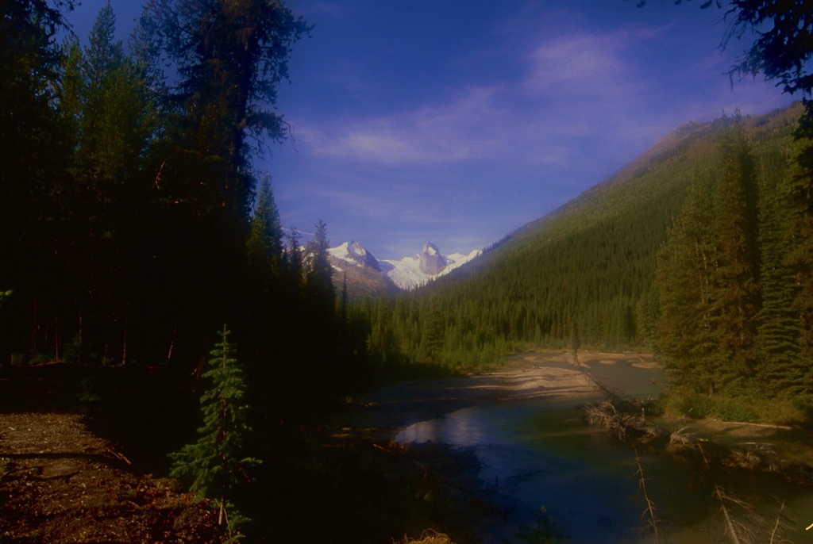
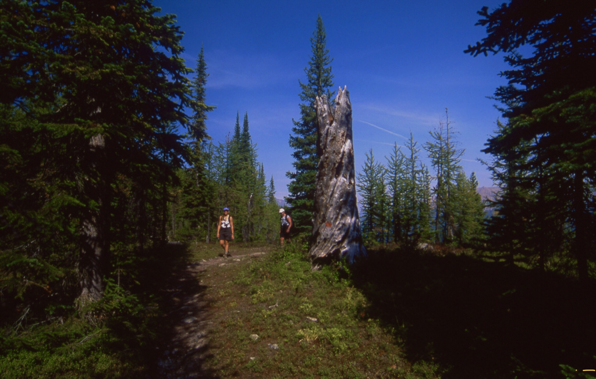
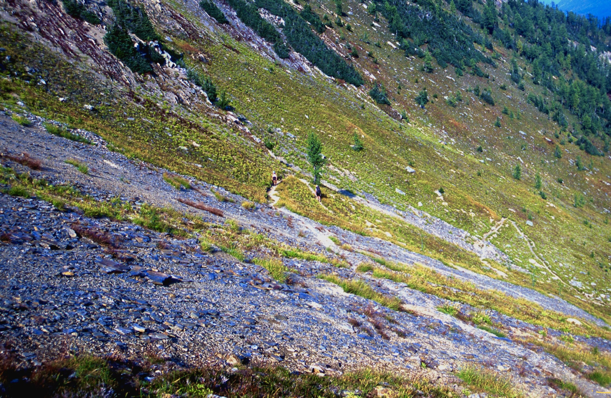
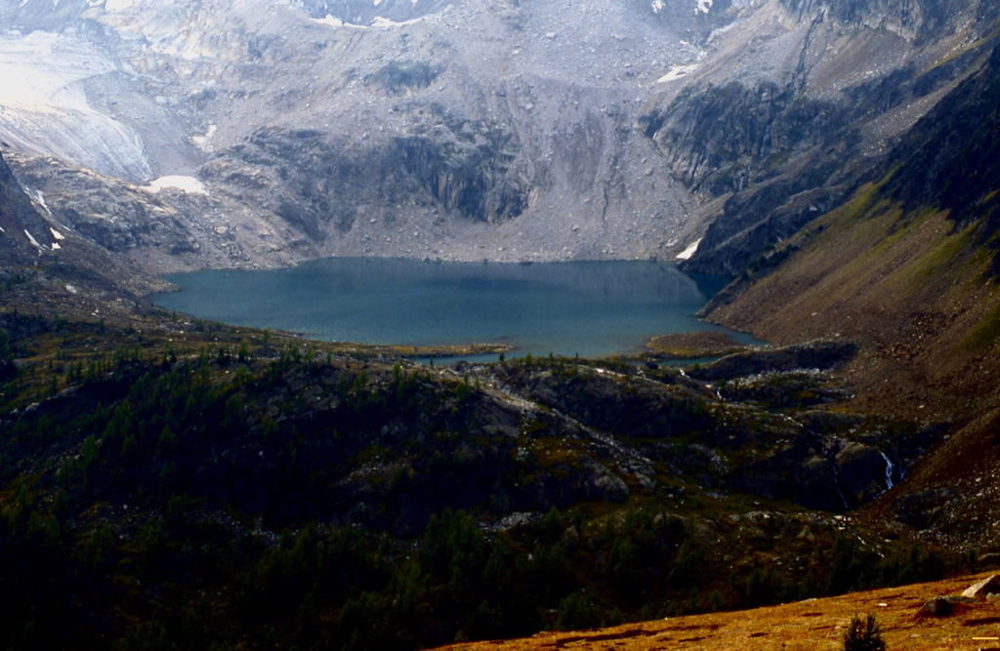
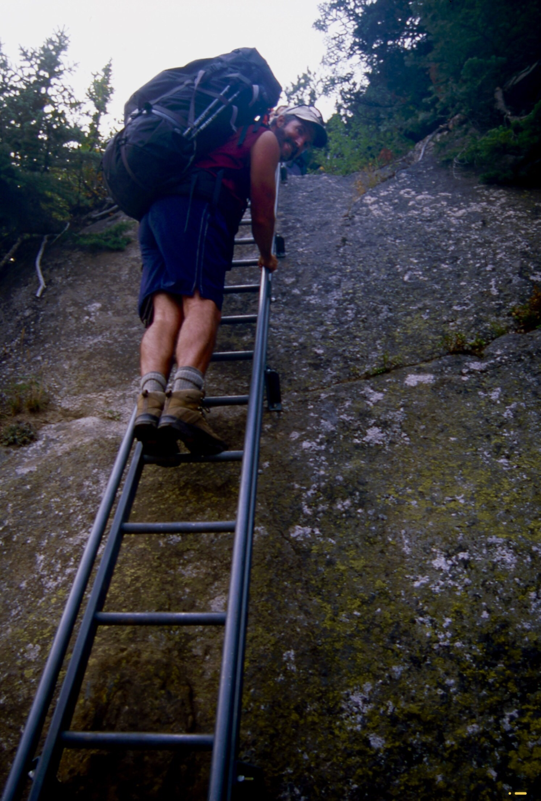
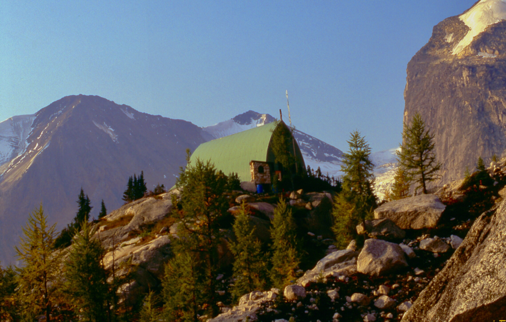
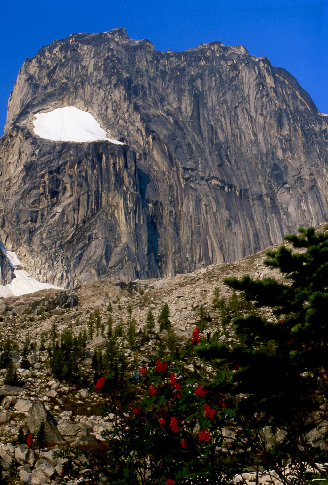
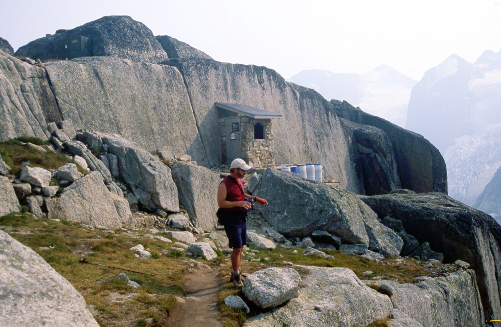

---
tags:
- Trails & Scrambles
- Day Hiking
- Backpacking
- Hut Stays
stats:
- label: Event Type
  icon: hiking
  value: Day hiking, backpacking, hut stays, world class rock climbing.
- label: Distance
  icon: map-marker-distance
  value: About 10.5 miles RT to Cobalt Lake. Conrad Kain Hut about 6.2 miles RT, but
    it takes most of a day, and is very scenic.
- label: Elevation Gain
  icon: elevation-rise
  value: Cobalt Lake, 2297’. Conrad Kain Hut, 2640’
- label: Difficulty
  icon: speedometer
  value: Moderately Difficult and complicated to the hut
- label: Maps
  icon: map
  value: Howser Creek. 82K/10 topo
- label: GPS
  icon: crosshairs-gps
  value: Conrad Kain Hut 50°44’15" N 116°45’458" W
---

# The Bugaboos

*The bugaboo*

## Description

T he Conrad Kain Hut sits on a shelf below the Snowpatch Spire.
To the Conrad Kain Hut...This trail starts in the parking lot, that follows the northern lateral moraine of
Bugaboo
Glacier. The trail is very steep and strenuous , with exposure to steep drop offs as it climbs through granite
bluffs.
But it’s only 3.1 miles, so take your time and enjoy.
Extreme caution should be use along this route.
Strong reliable footwear is essential.
After a short distance, you will become enamored with this trail. As stated above this trail has some
exposure. You will
edge along the side of a cliff, protected by chains to use as hand holds. At one point the trail comes to a
very sturdy
metal ladder drilled into the cliff face. The ladder is so stout, you could put a hiker on each rung, and it
would not
distort.
Further up this trail the views become spectacular. Each creek crossing has some sort of a bridge to make
crossings
safer.
Once you get up towards the hut, you will wonder thru beautiful meadows, filled with small streams and an
abundance of
wildflowers.
Just below the hut, you get your first view of the hut, which sets on the edge of a cliff. Up behind the hut
is the
Snowpatch Spire.

## Option #1

While staying at the Conrad Kan Hut, I asked the hut manager about hiking within the park. He suggested that
we hike the
area up to the Eastport Spire, where there is a campsite and one of the most beautiful outhouses you will see
in the
mountains.

## Option #2

Another hike we did, was to hike west towards the glacier next to and below the Snowpatch Spire. After
dropping down as
far as we could, we turn up hill and walked along the stream coming out of the glacier. The photography was
incredible.
The stream falls rapidly down the scoured rock to the valley below. The stream bounces and splashes on its
path, and
creates water features you can only see in nature.
We walked up along side the stream as it tumbled past us, all the way to the Snowpatch Spire, enjoying lunch
along the
way. Once at the spire, we hiked a climbers trail back down to the hut.
If you go to hike in the Bugs, don’t miss the glacier stream hike.

## Option #3

Another hike you should do while at the Bugs, is the Cobalt Lake Hike.
The trial to Cobalt Lake starts across the road from the Canadian Mountain Holiday’s Lodge.
The trail will enter an Alpine Larch forest that holds many switchbacks, until it wonders thru an open high
meadows.
After many more switchbacks, the Bugaboo Spires come into view. You are now on the Cobalt Ridge, about 2 miles
from the
lake.
We stopped here for lunch with a view. The next day we were hiking into the Conrad Kain Hut, and one of our
hiking
partners was pregnant.
Even if you only go to the Cobalt Ridge for the views, the hike is well worth the effort.

## Directions

From Radium Hot Springs, drive 17 miles north on Hwy 95 to Brisco. From Brisco, drive .3 miles on the Brisco
Road, and
turn right at the Brisco Wood Preserver for .2 of a mile where the road turns left, still on Brisco Road. Stay
on Brisco
Road for 1.4 miles and turn right to Brisco Mountain Road, where you will come to a T where you turn right
again,
staying on Brisco Road to the Westside Road, where you turn left onto Westside Road.
Drive about almost 2 miles to a right hairpin turn, where you turn onto Bugaboo Creek Road. Drive until you
come to the
Leadqueen Francis Road, where you stay on Bugaboo Creeek Road to the right. Follow the Bugaboo Creek Road to
the
trailhead. After about 30 miles from Brisco, look for the Bugaboo Creek Forest Road, where you will find the
Bagaboo-Septet Recreational Site, and campground just down this road a ways. The trailhead is back on Bugaboo
Creek Road
about 2.5 miles from camp.

## Hazards

THE ROAD TO THE BUGS PARKING AREA IS THE CRUZ OF THIS OUTING. PLEASE USE CAUTION. High clearance vehicles are
recommended.
drive slow and carefully.
Be aware that this short 3.5 mile trail is steep, rugged and incredible beautiful. Please pay close attention
when you
are hiking this trail.

## Cool things close by

Yoho N.P., Kootenay N.P., Radium Hot Springs, Golden B.C., Lake Louise, Banff, Glacier N.P. Of Canada, and Mt.
Assiniboine.

## R & P

NA

---

## Plan your trip

Click for Current NOAA Weather Conditions

## Photo gallery

---

## Snowpatch spire from septet campgrounds

## Shea, tia & chris hiking towards cobalt lake

## The trail to the view of the bugaboo

## Cobalt lake with the bugs in the background

## From here on is the hike to the conrad kain hut

*Picture (Image missing)*

The bugs from the septet campground. be sure to place the provided wire mesh around your car, so the rodents

don’t eat

your wiring

## Chris climbing the ladder where there is no other option

---

## The conrad kain hut

---

## Walking up to the snowpatch spire

---

Up high on the eastport spire, sits an unusual outhouse near a campsite. the blue barrels are helicoptered out
in
september. a poop with a view

---

## Additional information about the bugs

Bugaboo is a first-class mountaineering region, situated in the rugged Purcell Mountains in the BC Rockies
region of
British Columbia.
This 13,646-hectare park encompasses extensive ice fields, the largest glaciers in the Purcells, and
spectacular granite
spires, some of which exceed 3,000 metres in elevation. Its challenging peaks in the northern extremity of the
Purcell
Mountain Range have attracted climbers from around the world since the late 1880s.
Particularly popular are the North Howser Tower and the South Ridge of Bugaboo Spire, which are considered to
be very
difficult. The landscape is certainly breathtaking, but you shouldn’t attempt to hike or climb this region
unless you
are experienced, well-equipped and in good physical condition.
The Purcells, bounded by the Rocky Mountain Trench in the east, are actually ancient compared to the much
younger Rocky
Mountains, dating back 1,500 million years when the only form of life on the planet was algae. It was not
until the
dinosaurs era that the Rocky Mountains were born, some 70 million years ago. Heavy snowfall of the ‘Columbia
Wet Belt’
continues to support large remnants of the vast alpine glaciers that shaped the rugged Purcell Mountains.
This rugged landscape was first explored between 1857 to 1860, when the Palliser Expedition conquered and
named the
mountains after Goodwin Purcell, the expedition sponsor. Since that time, the mountains have attracted miners,
loggers
and some of North America’s top mountaineers. Harmon, Longstaff, A. O. Wheeler and the renowned guide Conrad
Kain
visited the Bugaboo area in 1910. Kain returned with the MacCarthys in 1916 and climbed the North Howser
‘Tower’ and the
South Ridge of Bugaboo Spire, which he considered his most difficult Canadian ascent. Thorington mapped the
area and
climbed with Kain in 1933 on Crescent Spire. In 1938 and 1939 Northpost, Eastpost and Brenta Spires were
conquered.
Snowpatch, beyond the techniques used in Kain’s time, was finally conquered by Arnold and Bedayn in 1940.

Climbers including Fred Beckey, Ed Cooper and Layton Kor in the late 1950s blazed the first face routes on
Snowpatch,
Bugaboo and Pidgeon Spires. Chouinard traversed the Howsers in 1965 and Chris Jones pioneered the 600-metre
West Face in

1970. Free climbing techniques enable faster ascents, with reduced exposure to the frequent lightning storms.
      It also
continually opens up new lines in areas where the elements of glaciers, major routes on firm rock, significant
altitude
and violent weather combine to create world-class challenges.
Bugaboo Provincial Park is, by its very nature, extremely isolated. People contemplating a visit here must
realize that
it is pure wilderness without supplies or equipment of any kind. Visitors must be prepared for true outdoor
living.
Weather conditions can change suddenly in this area and lightning storms with hail and snow are common in
summer. Only
experienced climbers trained in crevasse rescue and properly roped, should venture onto the snowfields and
glaciers. Ice
axes, sunglasses, prusiks or ascenders with foot slings are essential. Climbers should check with park rangers
before
departure. A registry is kept in the Conrad Kain Hut for this purpose – and visitors convenience. The rangers
will be
pleased to offer assistance or any other information required.
Wilderness, backcountry or walk-in camping is allowed, but no facilities are provided. Camping in Bugaboo Park
in the
Crescent Glacier area is restricted to tent pads situated below the Conrad Kain Hut, at Boulder Camp, and on
Mount
Applebee. The Conrad Kain Hut is available for overnight accommodation for a maximum of 35 persons.
Reservations can be
made through the [Alpine Club of Canada](http://www.alpineclubofcanada.ca/facility/reservations.html). Propane
stoves
and eating utensils are provided. Visitors must bring all other necessary equipment. A nightly, per-person fee
is levied
during the period June 1 to September 30. Hut accommodation is not available in winter due to avalanche
dangers. The
Malloy Igloo is a hut that can accommodate a maximum of six persons. No facilities are provided. Climbers are
responsible for their own safety, as rescue services are not readily available.
Bugaboo Glacier Provincial Park is in a class of its own. Although much of the attraction of the Bugaboos is
for
hard-core climbers, there are a few hiking trails that cover a variety of distances and terrains, and don’t
demand
technical mountaineering skills. The Conrad Kain Hut Trailbegins in the parking lot and follows the northern
lateral
moraine of Bugaboo Glacier. The trail is very steep and strenuous. Cobalt Lake Trail leads up a steep grade to
an open
ridge and views of Cobalt Lake. A marked route then descends to the lake itself. Malloy Igloo Trail begins at
the Conrad
Kain Hut and terminates at the Malloy Igloo. Only roped parties should attempt this hike because several
glaciers have
to be crossed. Alternatively, access to the Malloy Igloo via Malloy Creek is also possible.
Bugaboo Provincial Park is located 28 miles (45 km) west of Highway 95 at Brisco, between Golden and Radium
Hot Springs.
There’s good gravel road access to the park, but the roads are used by logging trucks, so check with BC Parks
regarding
road use and condition before embarking on the trip.
