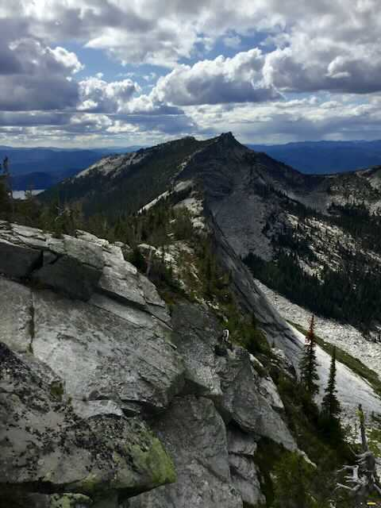
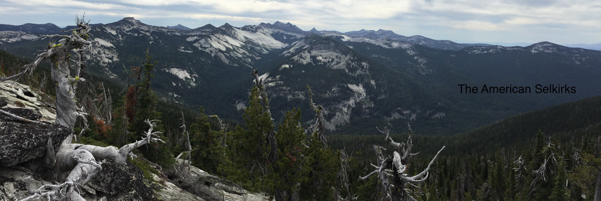
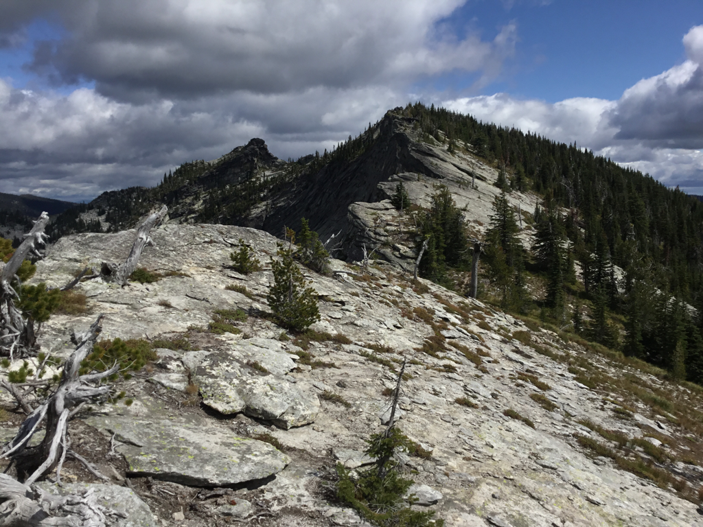
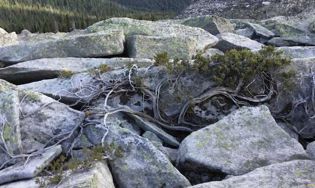
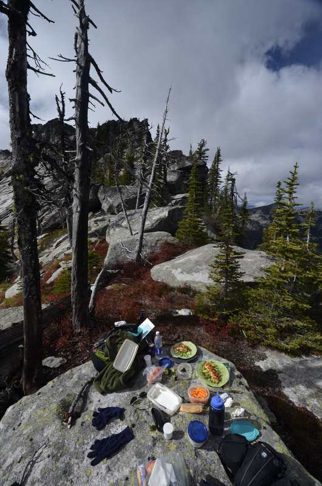
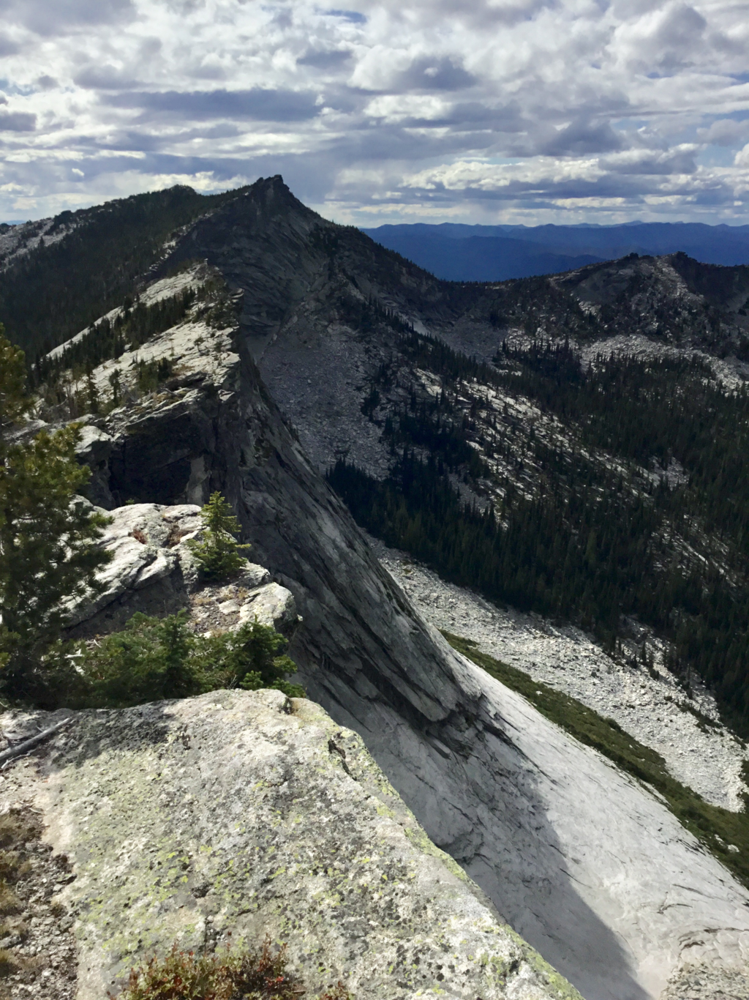
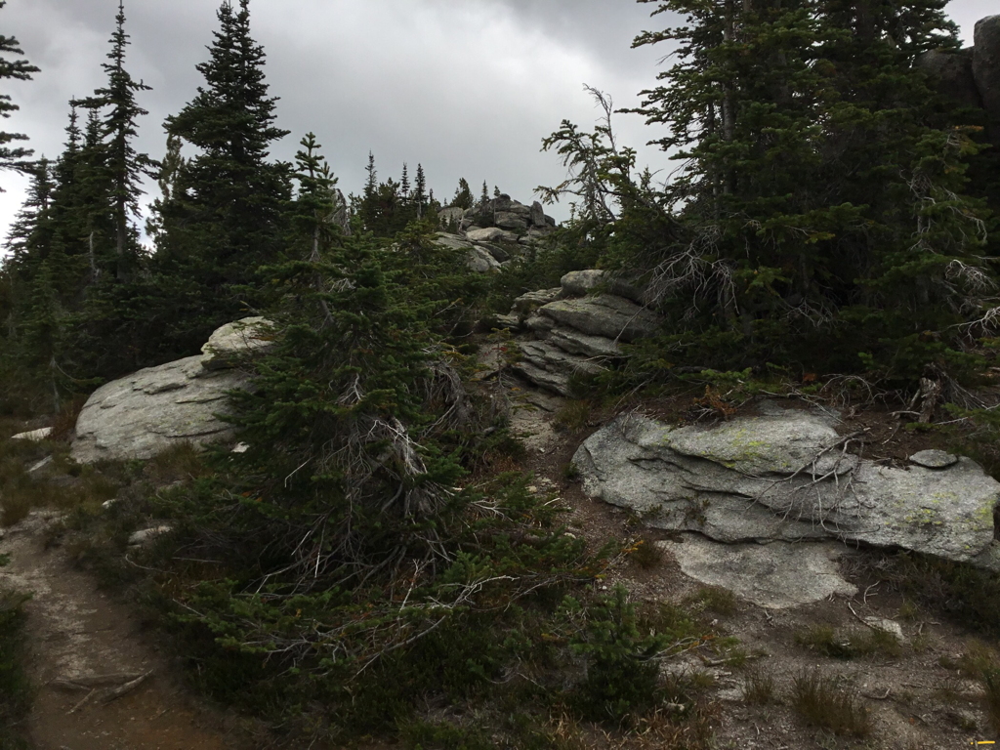

---
tags:
- Trails & Scrambles
- Hike
- Scrambling
- Backpack
- Climb
stats:
- label: Event Type
  icon: hiking
  value: Hike, scrambling, backpack, and climb.
- label: Distance
  icon: map-marker-distance
  value: 4 miles RT + 2 miles to the high ridge with views of the Two Mouth Lakes
    area.
- label: Elevation Gain
  icon: elevation-rise
  value: 950' gain +
- label: Difficulty
  icon: speedometer
  value: The trail to the Wigs is easy, but beyond is difficult +
- label: Maps
  icon: map
  value: IPNF, Kaniksu N.F., The Wigwams
- label: GPS
  icon: crosshairs-gps
  value: 48°42’49" n -116°44’49" w
- label: Ranger District
  icon: pine-tree
  value: Bonners Ferry R.D. 208.267.5561
- label: Boundary County Sheriff
  icon: shield-account
  value: 911 or 208.267.3151
notes:
- Idaho panhandle national forest/alerts
- url: https://www.fs.usda.gov/alerts/ipnf/alerts-notices
---

# The Wigwams 7033

## Description

Be aware, the last mile of this road to The Wigwams trailhead is a difficult road that all should use
caution on. NO low clearance cars. It's only about .5 miles to walk, to avoid the rough road. This trail
ascends thru a forest of Spruce and Subalpine Fir as it makes its way thru a broad basin with a ridge of
granite spires. At about 1.5 miles in, the trail crosses the South Fork Lions Head Creek. In a short while,
the trail starts to ascend 18 switchbacks. Here there is an opportunity to look into the South Fork Lions
Creek basin, with Kent Peak 7243, in the background. The trail leaves the edge of the trees ridge and heads
a short distance to The Wigwams summit via a notch. The small level area NE of the summit, has been used as
a heliport in the past. On top notice the ridge running to the south then west is very photogenic. To the
east, the jagged rocks along the ridge above Kent Creek are spectacular to say the least. The views all
around are worth the hike, but it is the view south, down the spine of the American Selkirks that are
unbelievable. All seven summits of the Seven Sisters are visible like teeth on a saw. As you hike north,
look around and retrace your steps on the way back. but stay up near the edge. As you walk northish on the
rocky ridge, stay near, but not too near the edge until it requires you to go around the gigantic blocks of
rock. If at any time you don’t want to ascend a summit on the ridge, go around to your right, but go back up
to the edge if the trail fades, or when you get around the blocks. The forest is tough going. The views are
from the ridge. The last summit above a wide gap in the extended ridge is the farthest you should go. Find a
spot out of the wind, and enjoy the incredible 360° view. To the north is Lion Head, 2 Unnamed peaks, and
Smith Peak that dominate the sky line. Turn around and all the Seven Sisters, Chimney Rock, Mount Roothaan,
Gunsight Peak, with Roman Nose on the East ridge, and line up for your view . Look SE as far as possible.
Snowshoe Peak with its very close A Peak, in the Cabinet Mountain Wilderness, stand together.

## Directions

As I stated before, the road is really bad for the last mile to the trailhead. You could park and walk, but
it adds two miles RT. No lower clearance. Drive 23 miles past Priest River on SH #57 and turn east towards
Coolin. In about 5 1/4 miles turn east on the Cavanaugh Bay Road for 3.3 miles to the East Side Road. Its
about 15 miles to the Two Mouth Lakes Road. On the Two Mouth Road, drive about 1/2 a mile and go left at the
fork, crossing a creek and continue about 2 1/2 miles and go right. At about 2.9 miles near an Idaho
Endowment Land sign go left and continue on FR #32 on a road with numerous switchbacks towards Klootch Mt..
In about 4.4 miles stay right onto Road 324 (not 325) and go up steeply to the trailhead.

The last 1.2 mile require a four wheel vehicle with high clearance and good tires. Don’t ruin your car. Walk
it instead. The "Trails of the Wild Selkirks" directions are wrong. Follow these.

## Cool things close by

Priest Lake, Hunt Creek Falls, Lion Head Campground, Lions Creek Slides, Kent Lake's south ridge, and the
incomparable view south to the American Selkirks Seven Sisters.

## Hazards

My opinion: Because the Idaho Dept. of Lands don't want us on "their" land, they sabotage the roads so only
large 4 wheel drive trucks with high clearance can access the trailheads in the area. Extremely rough roads
with car swallowing Kelly Humps.

## R & P

Jalapeños, Mr. Sub, Burger Express, Eichardt’s in Sandpoint. Burger Express in Priest River.

---

### Picture (Image missing)

## Photo gallery

## The wigwams (close top center), american selkirks, idaho

## An ancient hiker admiring the view of the selkirk crest

### Picture (Image missing) Details

## Lookout mountain in the distance

## A view of our ridge route in center

## Sometimes the trees steal the picture. do you see the heart?

## A gourmet lunch in the wigs.   image by chris herath

### Picture (Image missing) Details (2)

## A hole in the wall with the wigs

## Nearing the wigwams on the way out

## The trail to the s.w. wigwam

One of the joys of wandering along the high ridges, is the ancient twisted snags. Some look like
chandeliers, while others look like they were frozen as they meander thru time. chic. 9.14.11
