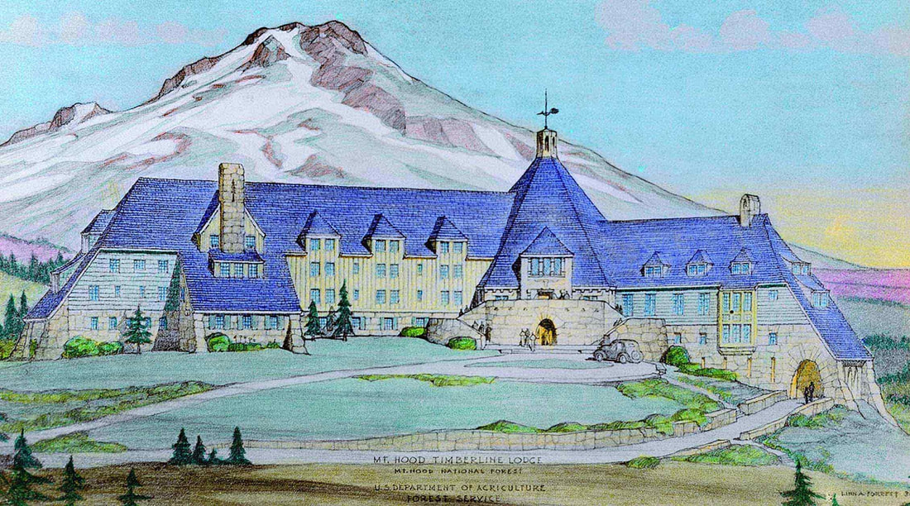
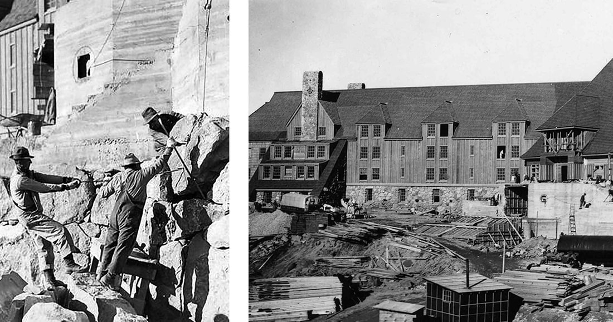
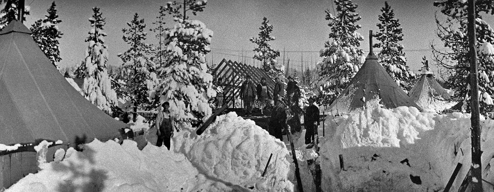
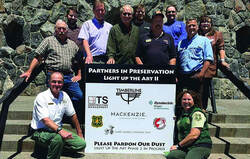
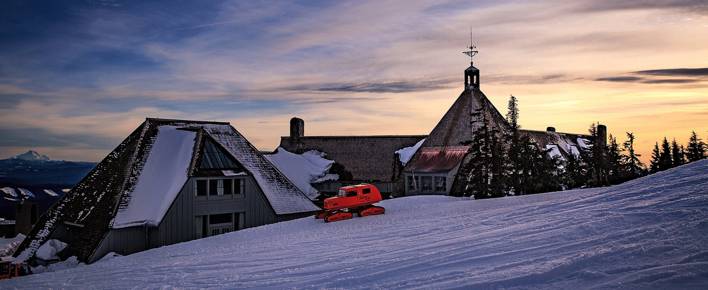

---
tags:
- Winter & Skiing
stats:
- label: Phone
  icon: phone
  value: 503.272.3311
- label: Acres
  icon: vector-square
  value: '1685'
- label: Average Snow Fall
  icon: weather-snowy-heavy
  value: 190"
- label: Summit Elevation
  icon: terrain
  value: 8540'
- label: Base Elevation
  icon: terrain
  value: 4000'
- label: Verts
  icon: arrow-expand-vertical
  value: 4540 +2616
notes:
- Timberlinelodge.com
---

# Timberline Lodge Ski Area

*Timberline lodge ski area    government camp, or*

## of named runs: 36

## of lifts: 9

Miles from spokane: 325
Other amenities: ???

---

## Description

Timberline is the only ski area in U.S. open ten months of the year. We have 4,540 vertical feet, more than anybody else in the United States. We’re located near the top of an 11,245-foot volcano, Mt. Hood, the tallest mountain in Oregon.

---

## Timberline lodge

## Photo gallery

---

The history of timberline lodge

Constructed in 1937, Timberline Lodge stands on the south slope of Mt. Hood at an elevation of 6,000 feet. This beautiful 55,000 square foot structure rises out of a pristine alpine landscape and is still being used for its original intent – a magnificent ski lodge and mountain retreat for everyone to enjoy. Legendary and awe-inspiring, it's a tribute to the rugged spirit of the Pacific Northwest. Declared a National Historic Landmark in 1977, Timberline Lodge is one of Oregon’s most popular tourist attractions, drawing nearly two million visitors every year.

the great depression & new deal
In 1929, the stock market crash sent the United States into the Great Depression until 1939. Workers in the country were desperate for jobs due to a high unemployment rate coupled with a poor economy. President Franklin D. Roosevelt created The New Deal, which consisted of several social and economic programs such as the Works Progress Administration (WPA) and Civilian Conservation Corps (CCC). These programs provided relief through public employment.

---

*Picture (Image missing)*

recreation planning on mt. hood

In 1889, Cloud Cap Inn was constructed on the east side of the forest, providing lodging to those early recreation enthusiasts. Over the next 30 years, as Portland’s population increased, so did recreation on the mountain. In 1925 the Mt. Hood Loop Highway was opened, giving the public greater access to the area. The need for a lodge on the south side of the mountain was identified.
Emerson J. Griffith became Oregon’s WPA administrator and obtained funding from the WPA for $246,893 (approximately $4.3 million by today’s standards) with additional funding from the Mt. Hood Development Association and road improvement and building from the U.S. Forest Service.

*Picture (Image missing)*

creating a lodge design

Gilbert Stanley Underwood, referred to as the "Parkitect," is famously well known for designing several prominent National Park Service Lodges including Bryce Canyon Lodge, Zion Lodge, and Yosemite’s Ahwahnee Lodge. Described as "the standard for architecture on public lands,"
his rustic style was characterized by natural local materials and a design that blended into the landscape. His original design for the lodge focused on a central headhouse, which holds the 800,000 pound great stone chimney. The headhouse is flanked by two uneven wings where the dining room, guestrooms, and other facilities are located.

cascadian architecture
William I. Turner, Forest Service architect, used this term to describe the design of Timberline Lodge because the roofline, with the steep pitch of the headhouse roof, mimicked the nearby peak of Mt. Hood. The overall design combined with the use of regional native materials created Cascadian Architecture.

Turner and Linn Forrest, U.S. Forest Service architect, took Underwood’s original design and changed the headhouse from an octagon to a hexagon which opened up the wings.

construction
The first phase of the lodge was to frame and roof the lodge in four months’ time. Considering the altitude of 6,000 feet, the short summer season, and harsh alpine climate, this project was a challenge. Daily, there could be between 100 and 470 workers onsite at a time. The WPA program aimed to employ and train as many people as possible. As a Federal Arts Project and a Master/Apprentice program, an additional purpose of the Lodge project was to purposely pair skilled artists and craftspeople with unskilled workers so as to teach them traditional skills in arts, crafts, and construction trades. Wages were 90 cents an hour for building trade laborers, 75 cents an hour for common laborers, and 55 cents an hour for unskilled laborers. By today’s standards, that would be $15.36, $13.00, and $9.54 an hour, respectively.

wpa camp life
The WPA workers’ camp was located outside the town of Government Camp in what today is called Summit Meadows. The camp included numerous eight-man canvas tents, a mess hall, and infrastructure for up to 500 workers. Each worker paid $1.00 a day for room and board while staying at Summit Meadows Camp. Enrollees often sent their savings to struggling unemployed family members. A caravan of trucks would take the workers to the construction site every morning.

*Picture (Image missing)*

the shining

The 1980 movie "The Shining" was based on the Stephen King novel of the same name, which was inspired by The Stanley Hotel in Colorado. Several of the exterior shots in the film which purport to show the lodge, such as those of the hedge maze and loading dock, were taken at Elstree Studios in England, using a mock-up of the south face of the lodge. There is no hedge maze (and hardly any level ground) at the Timberline Lodge. All interior scenes were shot at Elstree Studios as well, and not at Timberline Lodge.

Kubrick was asked not to depict Room 217 (featured in the book) in The Shining, because future guests at the Lodge might be afraid to stay there. So a nonexistent room, Room 237, was substituted in the film. Curiously, and somewhat ironically, Room 217 is requested more often than any other room at Timberline.

STEWARDSHIP OF THE LODGER.L.K. and Company, the U.S. Forest Service, Friends of Timberline, and the State Historic Preservation Office provides collaborative stewardship of this special place, and so does your patronage. Timberline Lodge is rare in that it is one of the few National Historic Landmarks that is still operated for the same purpose for which it was originally built. It is not a museum, but rather a mountain lodge; a place for the business of hospitality to provide comfortable accommodations and amenities while you enjoy recreating in the great outdoors close to nature, skiing, snowboarding, hiking, climbing, and more. Therefore, while you may get the red carpet treatment here, you’ll never get the velvet rope treatment. Look around, explore our public spaces, view the artworks, and enjoy your visit. That’s what we call "preservation through use" and together, we are proud to be your host.

---

historic hotels of america
Timberline Lodge is a member of [Historic Hotels of America®](https://www.historichotels.org/hotels-resorts/timberline-lodge/?from=search), the official program of the National Trust for Historic Preservation for recognizing and celebrating the finest historic hotels across America.
Historic Hotels of America was founded in 1989 by the National Trust for Historic Preservation with 32 charter members. Today, Historic Hotels of America has more than 300 historic hotels. These historic hotels have all faithfully maintained their authenticity, sense of place, and architectural integrity in the United States of America, including 46 states, the District of Columbia, the U.S. Virgin Islands, and Puerto Rico.
Historic Hotels of America is comprised of mostly independently owned and operated historic hotels. To be nominated and selected for membership into this prestigious program, a hotel must be at least 50 years old; has been designated by the U.S. Secretary of the Interior as a National Historic Landmark or listed in or eligible for listing in the National Register of Historic Places; and recognized as having historic significance.
