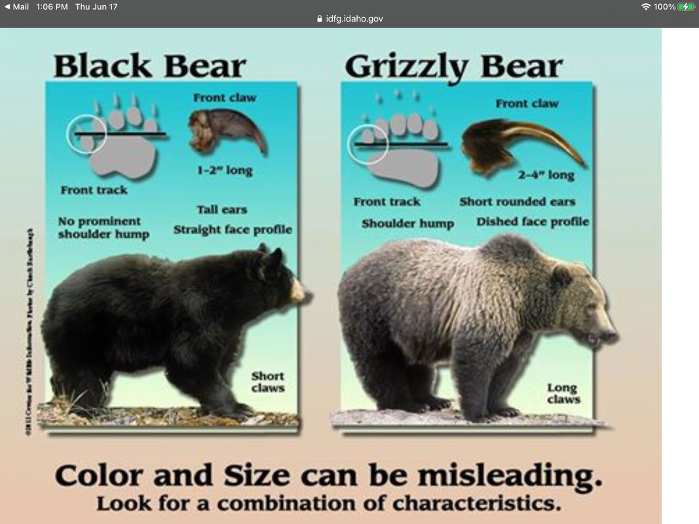
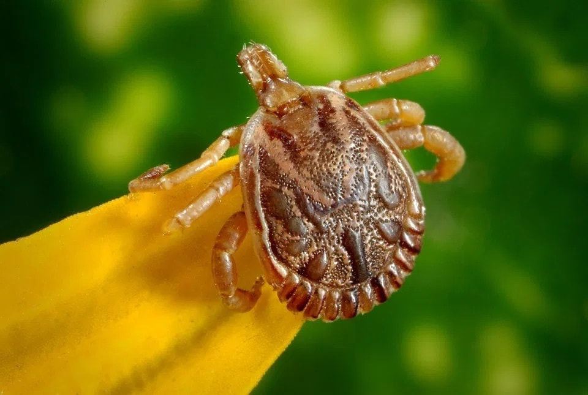
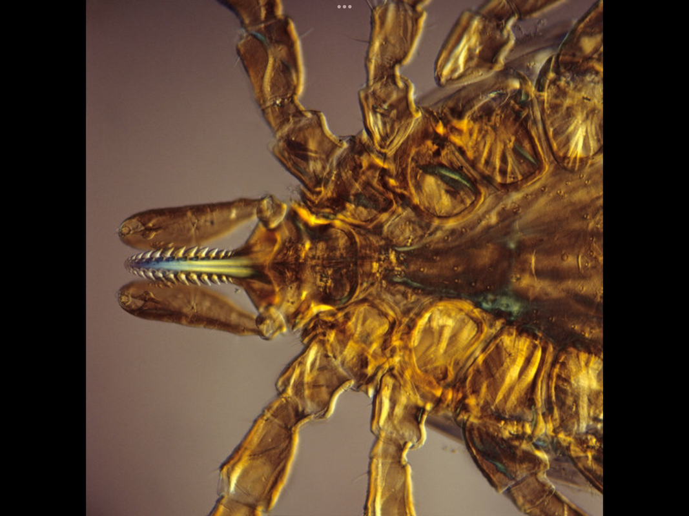
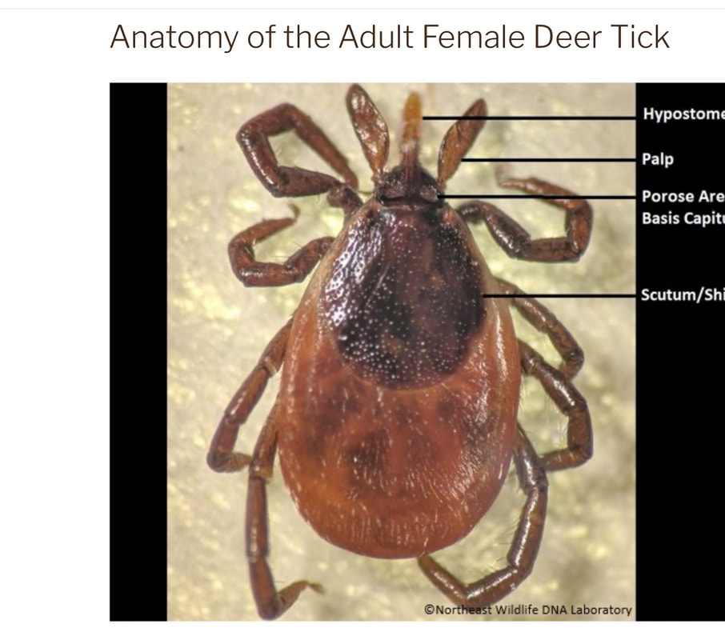
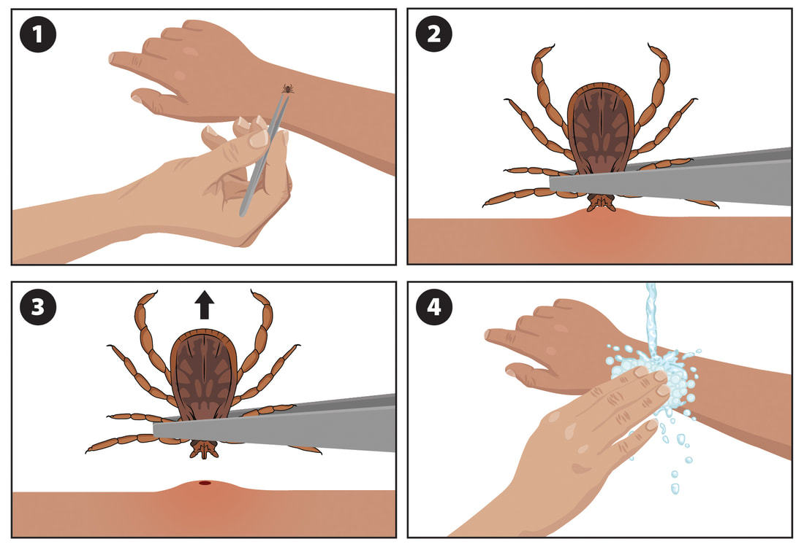
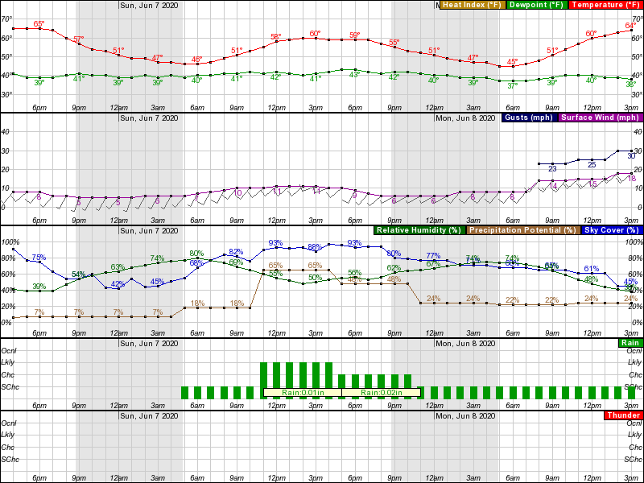
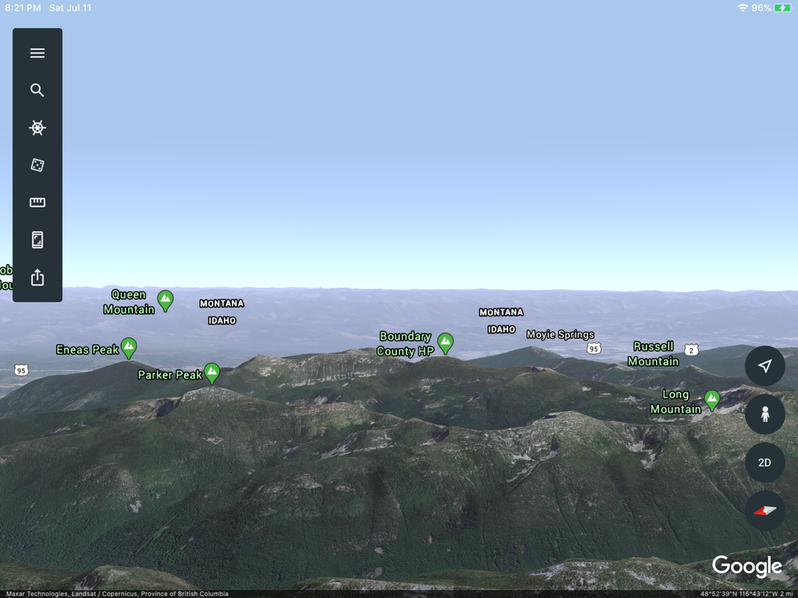

# Trail Etiquette And Skills

As you read this section, please understand that it is designed to inform you. But more importantly,
all these topics are things you should do your own research on to further your knowledge. The most
important thing you can take with you on your outing is... knowledge.

For further reading, check out the [MRA backcountry safety
guide](https://mra.org/wp-content/uploads/2016/05/backcountrysafety.pdf). Go to "hints" on that site
to learn more ideas on gear, fire starting, hot and cold injuries, and much more. And check out our
new blog for more detailed info.

## Route Finding

Routes can mean different things to different people. Below is what a route means to me — your
definition may be different than mine.

### Route-Finding Tools

In your 14 Essentials kit, you should have a compass, topo map, and USFS Forest map, and the
knowledge to use them. Know your intended route before you leave home, and leave this information
with a responsible person, in case you don't return at a specific time.

### Google Earth Images

Take Google Earth images of your intended route. I take a vertical and horizontal image of the route
for reference as I walk. (On Google Earth, you can use two fingers to lower your viewpoint — this
lets you see the hike in horizontal relief.)

### Surveyor's Tape

The way I tie surveyor's tape to a branch is to fold the tape in half, loop it over the branch, and
pass the loose ends back through the loop. This secures the tape from wind, and lets you retrieve it
by simply pulling the loop end. Like all surveyor's tape use: **please do not leave tape on
branches.**

### USFS Forest Map

These maps cover a very large area, but can be used to triangulate your approximate location by
using visible prominences.

### USGS Topo Maps

These maps show a smaller area in detail. You can identify features and, with a compass, find where
you are and where you want to go. From here, you can plot your route.

### Compass

A compass is the most useful tool you can take with you. It does not run out of battery power, and
can save your life. Along with the proper maps, your compass is often your best choice for survival —
the catch is knowing how to properly use it. Take an orientation class, then practice, practice,
practice. I carry a baggie with instructions for all my technical gear. There are times when you are
cold, thirsty, or confused about where you are; without a map and compass, you can find yourself
lost. Always err toward caution.

### Personal Locating Beacons

There are basically two types of PLB. Some require subscriptions to services, while others do not.
Subscription services on some units let you text or communicate with rescuers; others simply send a
signal to rescuers, and you wait for people to show up. But be aware: if you press the button and
it isn't a life-or-death circumstance, you can be charged for the rescue, and possibly face criminal
charges. Check out our blog #81 for additional information on why GPS units aren't as accurate as
you'd hope.

### 14 Essentials

The 14 Essentials need to be carried by every individual in your hiking party. If your spouse gets
separated from you and the party, and you are carrying all the food, water, and essentials, how are
they going to survive? Refer to our drop-down menu for what's in your 14 Essentials. Be sure to
replace any used items as soon as you get home, and replace items as needed due to age or sterility.

### Route-Finding Skill

Route finding is an acquired skill — it takes years of practice to become skilled. As you follow a
hike leader, watch their route, and if needed, speak up if you are not comfortable, or if you have a
question about their choice.

### Mountain Routes

Mountain routes can be trails, off-trail routes, and routes you can't imagine doing. The catch is to
remember them for your return hike, and/or for future hikes or telling friends about routes.

### Off-Trail Routes

These routes can be simple walks across terrain that makes your hike easier, faster, more scenic, and
for sure sometimes harder. The main catch is to remember them in detail, so if you have to walk them
again, they are familiar. At key junctions, you might take an image or mark the direction you need to
walk to get back to your trail or cars. As you come down from a summit, maybe in a storm or in the
dark, the more info you have the more helpful it will be.

### Other Routes

Sometimes you have to, or want to, go a particular direction to get where you want to go. When
starting such a route, communicate with your hiking partners so you all know the starting point, then
talk about your route as you wander about. If a route becomes too hard or impassable, backtrack and
look for an easier, safer route. Examine all your options — since you have a topo map with you, take
the time to mark it for future reference. I carry a ziplock bag of surveyor's tape to mark a
route/trail, but only if I'm returning the same way; as I pass the tape, I retrieve it, so as not to
litter or cause other hikers to think that's the trail.

Always communicate your thoughts on the route you're doing. If it becomes too difficult or
dangerous, you know your way back — and as you retreat, discuss other route possibilities. If you
vary the route, mark your junction; it makes it easier to find if you have to backtrack.

Use good judgment when wandering in the mountains. If a route becomes dangerous, stop and discuss
your options with fellow hikers. Do not push on if anyone in your group is uncomfortable with the
chosen route, trail, terrain, or conditions.

As you approach a face you want to go up, over, or around, examine all the possibilities and make
wise group decisions — and if needed, make changes to keep you and your party safe.

> Please remember, your safety is in your hands.
>
> — Benjamin Franklin once said: "You fail to plan, you are planning to fail."

## Wildlife & Trail Hazards

### Poison Ivy

On each branch, there tend to be three leaves that droop. Do not touch them. But if you do, do not
touch yourself anywhere — if you have to pee, do not touch yourself.

Poison ivy grows along the base of cliffs and rocks and can extend out from them. Its stems grow to
about 12–16 inches, with three leaves that droop down around the stem. The only sure way to tell it's
dangerous to touch is to touch one — you will never forget it after that. If you touch it and later
have to pee, you will regret it for a long time.

Poison ivy rash often appears in a straight line, from the way the plant brushes against your skin,
but if you develop a rash after touching clothing or pet fur carrying urushiol (the plant's oil), the
rash may be more spread out — you can also transfer the oil to other parts of your body with your
fingers. The reaction usually develops 12 to 48 hours after exposure and lasts two to three weeks; its
severity depends on how much urushiol got on your skin. Signs and symptoms include redness, itching,
swelling, and blisters. If you've inhaled smoke from burning poison ivy and are having difficulty
breathing, go to your doctor or the ER. For more information, see
[mayoclinic.org](https://www.mayoclinic.org/).

### Bears

*This section is from [offtracktravel.ca](https://offtracktravel.ca/), published with permission.
Although it was written about bears in Canada, it surely applies to bears and other critters in our
area. Bears in the forests are always a concern — a friend in McCall sent me this link, and I feel
it's important for everyone to know before heading out into nature. Even though it was written by a
group in Canada, I feel the info also applies to outdoor travel in Idaho, Washington, and Montana. At
the bottom, I've added my own method of letting bears and other critters know I'm around.*

#### Bear Safety in Canada & U.S.A.: What You Need to Know

Canada's untamed natural beauty is (rightfully) world famous, and so are the majestic bears that call
it home. Learning some basic bear safety is essential for anyone planning to explore beyond the city
streets. While bear attacks remain incredibly rare — you're actually more likely to be hit by
lightning — it's crucial to know how to avoid a negative encounter, and what to do in the very
unlikely event it does happen. This guide covers essential bear safety tips to help you feel confident
exploring the outdoors, whether visiting Canada for the first time or venturing out of the city as a
longtime resident. *(Published November 2020.)*

**Bear safety basics.** It's totally normal to be frightened at the prospect of encountering a bear,

especially if you're new to Canada or outdoor activities — the author grew up somewhere the most
dangerous creature was a rarely seen snake, and it took a long time to get over late-night tent
paranoia, where every rustle sounds like a bear. Now, having become fascinated by bears and hoping to
see one from a safe distance, the author still does everything possible to minimize the odds of a
close encounter. Some fear of bears is healthy — these animals deserve respect — but it shouldn't stop
you from exploring the outdoors, and the best way to reduce the fear is to learn the basics.

**Knowledge is power.** Facts worth knowing:

- Bears prefer to avoid people.

- Humans are not on the menu — bears are actually mostly vegetarian.

- The vast majority of bear encounters are a positive experience.

- There are ways to proactively avoid encountering a bear.

- When used properly, bear spray is extremely effective.

**Identifying bears.** Black bears are the most commonly seen bear in Canada, living in every province

and territory. Grizzly bears (brown bears) are found in northwestern Canada, mostly in the coastal and
mountain regions of British Columbia, Alberta, and the Yukon. The Kermode, or "spirit," bear is a
famous subspecies of black bear with white fur, living around the northern and central coast of
British Columbia. About two-thirds (around 16,000) of the world's polar bear population is found in
Canada's northern ice-covered regions. This guide concentrates on black and grizzly bears, the two
most commonly encountered.

**How to tell black and grizzly bears apart.** Black and grizzly bears differ in diet, habitat,

physical features, and — most important for safety — behavior and defensive technique, but telling
them apart isn't always easy. Size isn't reliable: an adult grizzly averages heavier than an adult
black bear, but an adult black bear can look larger than an adolescent grizzly (under 5 years old).
Color isn't clear-cut either — bears aren't always black, and both species range from blonde to very
dark brown/black.

- *Black bears:* usually found in forested and coastal habitat; excellent climbers, more likely to
  climb a tree to escape a threat; natural response to threats is to retreat; flatter, fairly straight
  face profile with prominent ears; no shoulder hump; shorter, dark-colored claws; front toes form an
  arc.

- *Grizzly bears:* prefer open habitat such as meadows, alpine forest, coast; less adapted for
  climbing (but will); more likely to defend themselves; dish-shaped snout and face profile, rounded
  ears; shoulder hump; longer, lighter-colored claws; front toes in a straighter line.

The primary diet of both is plants, berries and insects, though both are opportunistic and will eat
carrion; coastal bears feast on salmon in autumn, and grizzlies are more likely to hunt small mammals.
[BearSmart](http://www.bearsmart.com/about-bears/know-the-difference/test-your-bear-smarts/) has a
quiz testing you on the visual differences.

**How to avoid a negative bear encounter.** The best way to stay safe is to proactively avoid negative

encounters:

- Research your destination first — find out about local wildlife, restrictions, and recommended
  precautions.

- Read and follow all trailhead signage; respect trail closures and wildlife warnings.

- Make noise in the backcountry (more below).

- Remain alert at all times; watch for fresh bear signs like tracks, diggings, and scat.

- Stay on the trail and travel in daylight — bears are most active at dawn and dusk.

- Avoid animal carcasses; wildlife, bears included, are attracted to dead animals.

- Keep pets on a leash — dogs can provoke defensive behavior in bears.

- Pack out everything you bring, including garbage and "biodegradable" items like apple cores and
  banana peels.

- Travel in a group — the larger the group, the fewer recorded attacks.

- Store food safely when camping; bears are curious and will inspect odors to see if they're edible.

- Learn about bear behavior — being able to [interpret their
  postures](http://www.bearsmart.com/about-bears/behaviour/) and vocalizations helps a lot.

- Know how to respond during an encounter or attack.

- Carry bear spray.

**Making noise on the trail.** Just as you may not want to meet a bear on a trail, bears don't

particularly want to encounter humans either — they have good hearing and are thought to associate
voices with humans, so if they hear you, they'll usually avoid you.

- The easiest way to alert a potential bear of your presence is to call, sing, clap, or talk loudly.

- Talking or singing loudly may feel a little silly at first, but it's a tried-and-tested method for
  avoiding bear encounters.

- Increase the volume when it may be harder to hear — on windy days or near streams and dense
  vegetation.

- Be especially vocal in areas with low visibility; don't surprise a bear coming around a blind
  corner.

- It's a myth that [bears see poorly](http://www.bearsmart.com/about-bears/dispelling-myths/) — they
  don't.

**Bear spray** is an aerosol deterrent made with chili pepper oil, designed to be deployed at close

range (under 10 m) toward the face of an aggressive or charging bear. It swells the bear's eyes, nose
and lungs, restricting breathing and sight, and in most cases the bear will retreat, letting the user
leave safely. It's a "last resort" tool, used only when other methods have failed. When deploying it,
you use the entire 225 g canister, which empties in around 7–9 seconds. Some studies suggest bear
spray is [more effective than shooting a bear with a
gun](https://www.outsideonline.com/1899301/shoot-or-spray-best-way-stop-charging-bear), though there's
been [further debate](https://www.outsideonline.com/2401248/does-bear-spray-work) — regardless, it
remains one of the best defenses an average person can have against an aggressive bear. Keep it
stored somewhere with convenient access, and [know how to use
it](https://www.pc.gc.ca/en/pn-np/mtn/ours-bears/securite-safety/gaz-spray) so you can deploy it fast
if needed.

**What to do if you see a bear.** In the event you see one: stop; stay calm; have your bear spray

ready (safety off); if in a group, stay together. Never: run; drop your bag; scream; make sudden
movements; turn your back on the bear; block its escape route. Bears are stronger and faster than you,
see well (especially at night), and have hearing twice as good as ours — but they generally do not
want to attack you.

**If the bear is in the distance:** do not approach — give it plenty of space. If it's moving, wait at

a safe distance; if you can, make a wide detour around it. Move slowly away without getting its
attention, and be prepared to turn around and go back the way you came if necessary.

**If the bear is close:** if it was surprised, or has cubs or food, it's likely to react defensively —

it may appear stressed or agitated (swatting the ground, blowing, snorting); a defensive reaction is
most common. A non-defensive bear could be curious, looking for human food, testing dominance, or in
very rare cases predatory — its attention will be clearly directed at you, head and ears up. Standing
on its hind legs is a sign of curiosity, not aggression — it's using its senses to identify you.

**How to respond to a defensive bear:** remain still and calm; talk in a soothing voice; start backing

away; avoid eye contact. If it approaches, stand your ground and prepare to use bear spray. If it
makes contact, drop to the ground and play dead, covering your neck and the back of your head with
your hands. Most defensive attacks last two minutes or less — remain still afterward and wait for the
bear to leave. If the attack doesn't stop, fight back.

**How to respond to a non-defensive bear:** remain calm; talk in a firm voice; move out of the bear's

way. If it follows, stand your ground and switch to aggressive behavior — look it in the eyes, shout,
stamp your feet, make yourself look bigger, hit it with whatever you have, take a step toward it. If
it still approaches, use bear spray and fight back, concentrating your attack on its face (nose and
eyes specifically).

**How to camp safely.** Anything with an odor can attract wildlife — avoid inviting a bear or other

animal to your campsite.

- *Frontcountry camping* (accessible by vehicle, usually with allocated sites, water, outhouses or
  flush toilets, trash bins, and sometimes showers): think
["bare"](https://www.pc.gc.ca/en/pn-np/mtn/ours-bears/securite-safety/camping-propre-bare-camp)
  — your site should look almost empty when you're not there, with only camping furniture left.
  Research the campground first for wildlife restrictions or recommendations. Store all food,
  food-related items, and toiletries (cooking equipment, garbage, dishes, coolers, drink containers,
  etc.) in a hard-sided vehicle when not in use; campers without one, such as cyclists, should be
  prepared to hang their food (see backcountry camping, below). Do not leave pets unattended — they can
  attract coyotes and wolves as well as bears, and their food should be stored securely too. Keep your
  campsite clean: wash dishes soon after eating, wipe up spills, pick up food scraps, and dispose of
  garbage in the provided bins.

- *Backcountry camping* (situated in wilderness, accessed only by foot, bike, horse, boat, or plane,
  with limited facilities): research the area first for restrictions or recommendations, and whether
  food storage is provided. If you're not at an established backcountry site, pick your tent spot
  carefully — avoid berry patches, game trails, thick brush, and areas near animal carcasses. Don't
  cook or eat where you sleep; use a designated cooking area if there is one, or head at least 50 m
  (preferably 100 m) downwind of your tent otherwise. Disperse graywater properly — strain food
  particles into your garbage and use a disposal pit (if provided) or bury/scatter the water away from
  water sources. Clean up thoroughly after cooking, including crumbs, and never burn garbage or food in
  a campfire — the smell lingers and attracts bears. Keep your sleeping bag, tent, and sleeping clothes
  away from the food preparation area; clothes with spilled food on them should be stored with other
  smelly items.

- *Storing food in the backcountry:* when not in use, food, toiletries, cooking equipment and garbage
  should be stored securely away from your tent. Some established sites have a food cache (a metal
  bear-proof container) or bear pole system. If none is provided or usable, be prepared to [make a
  bear hang](https://www.wta.org/go-outside/trail-smarts/how-to/hang-bear-bag-secure-food) — you'll
  need a carabiner, a dry/stuff sack, and at least 15 m (50 ft) of nylon cord. Alternatives include an
  Ursack (a lightweight, collapsible, puncture-resistant bear bag) or a bear barrel/canister (a thick
  plastic container with a bear-resistant lid).

**Safe roadside bear viewing.** The most common way to see a bear in Canada is from your vehicle — always

exciting, but potentially hazardous for both you and the bear.

- Consider not stopping at all — undisturbed bears forage more successfully, building up needed fat
  reserves.

- Driving by slowly (when safe) is the next best way to minimize your impact.

- If you decide to stop, pull off the road safely without blocking other traffic.

- Stay a respectful distance away and make sure the bear has an escape route.

- Do not leave your vehicle.

- Remain aware of other vehicles — move on if the situation becomes crowded.

- Keep your observation time short.

**Bear safety essentials.** Bear spray, unsurprisingly, is an absolute given — some hikers carry one

canister each as a backup. Store it somewhere with convenient access, such as a hip holster on a belt.
Outdoor gear stores reliably carry it; when purchased in Canada, you'll need to sign a waiver assuming
all risk when using it. The propellant loses potency over time — new bear spray typically expires
after 2 to 2.5 years — and you cannot bring it onto a plane, so international visitors can't bring it
with them or take it home (some outdoor stores, especially around Banff, rent it). A mini air horn is
another option some hikers bring: it delivers a shockingly loud sound that would startle any nearby
bear, and could also be used to signal distress if needed.

**Bear encounters: my experience.** A common question is "how many bears do you see?" — the honest

answer is not many, and that's fine; bears are beautiful, extraordinary creatures, and it's incredible
to see one from an appropriate distance. Hiking around 500–700 km a year in Western Canada, the author
saw only one bear on a trail — just the back end of a black bear running away, on the Della Falls
Trail in Strathcona Park, Vancouver Island, in 2016. In October 2019, there were three separate
close-contact encounters: a black bear standing about 20 m from the vehicle at the Cape Scott parking
lot after an overnight 34 km backpacking trip; two black bears sitting in a tree near a
salmon-filled river while walking a friend's dog in a Courtenay park; and a black bear walking toward
the author on the path, about 600 m from the parking spot, while returning from an oyster-harvesting
attempt at Nanoose Bay. All of these happened in "developed" areas of parks that anyone with a vehicle
could access, not deep wilderness — which is exactly why bear awareness matters. Bear encounters are
uncommon, and dangerous ones even rarer, but bears live and travel closer to humans than you might
expect. Preparation, proactive avoidance, and knowledge are key — never be complacent.

#### Chic's Comments

Some things I do when I'm hiking in Idaho, Montana, or Washington: I call out "HEY BEAR" or "OIYA
OSO" (Spanish for "hey bear"). Some people get freaked out when you yell "hey bear" — saying it in
Spanish makes it feel less intimidating. If you carry hiking poles, smack them together; that loud
noise will alert bears of your presence. Avoiding encounters is your best option — make lots of noise.
We know you love your dogs, but if you let them run wild and they encounter a bear, the consequences
can get ugly — please leash your dogs. When I yell "OIYA OSO," I also whistle; if you can't whistle
naturally, use a plastic whistle. Be loud and aggressive long before you encounter a bear — as you
walk over a ridge, or into a creek bed with water flowing, yell loud. Don't be shy; yell as if you're
trying to communicate with someone 100 feet away over creek noise. Make loud noises all day long.

**Make a noise instrument out of wood.** From your 14 Essentials, take out a knife. Find a branch you

can use as a hammer to split the blade through wood lengthwise — it should be about 12–15 inches long,
2 inches wide, ¼ inch thick. Carve one end into a point. Drill a hole in the other end, lace it with
an 8-foot cord, and tie the ends. Turn the wood blade to twist the cord until it starts to
double-twist. Have it handy, and swing it in circles over your head when you suspect a bear's
presence — this device can be heard by bears several miles away.

### Ticks

Do not be afraid of wood ticks — they move too slowly and take a long time to attach themselves to
you. Always wear light-colored clothing, and tuck your pant legs into your socks so they can't get to
your skin. Most often, ticks are in low vegetation, crawling up onto leaves and grasses, waiting to
snag a deer's hairy legs — or our clothes — and they can snag moving objects easily. You cannot kill a
wood tick with your bare hands.

If you find one attached to your skin, don't panic. Get a pair of tweezers, work them down the tick's
body to where it enters your skin (see illustrations below on how to extract ticks properly), and
grasp it firmly — don't over-squeeze — and pull straight up. Because ticks use a cement-like substance
to stay anchored, the extraction will tug on your skin as you pull them out. Do not throw the tick
away: if you get target-shaped rings around the bite, you may be infected. It takes 24 to 36 hours to
attach; after that you could become infected. Take a close look at the tick's head — if the head,
mouth, or leg parts are intact, you lucked out; if a leg or mouth part is missing, clean the bite
wound out thoroughly and make sure no body parts are left in your skin (if you can't get them out, see
your doctor as soon as possible). Put the tick in a ziplock bag or secure container and freeze it when
you get home. If your bite site shows a red, target-shaped mark after a few days or weeks, take the
tick to your doctor so they can analyze it for disease. I keep ticks in my freezer, and if nothing
shows in a year, I toss them out.

As a tick climbs up your skin, it can't get past your belt, underwear, waistbands, or other
restrictions, so it will climb toward your hair — they do this because, on deer, they can't easily be
scratched off there. All day long, check your hiking partners' clothing to see if they picked one up.
It's normal to be a little freaked out finding one on you, but take a closer look — they're remarkably
well adapted to what they do. Remember, they can take 15–20 minutes to find a vein, and up to 36 hours
to embed themselves — don't panic, they are very slow-moving critters.

Ticks are scientifically classified as arachnids (the same class as spiders), with 8 legs, and the
fossil record suggests they've been around for at least 90 million years. Most tick bites do not
transmit harmful microbes, though there are a variety of tick-borne diseases with symptoms that
usually develop days to weeks after the bite, depending on the microbe transmitted. For all tick
bites, local cleansing and antibiotic cream may be applied. Some immediate symptoms that infrequently
develop during or right after a tick bite can be flu-like — fever, shortness of breath, weakness or
achiness, vomiting, swelling at the bite site or lymph nodes, weakness or paralysis, headache,
confusion, or palpitations.

**Tick prevention starts with covering up.** Ticks tend to latch on in grassy areas above the cuff of

your pant leg and move upward, looking for dark places to burrow.

- Wear pants and long sleeves — no shorts. Convertible pants with a flap over the zippered legs are an
  excellent tick trap and a good choice.

- Tuck your shirt into your pants, and your pants into your socks.

- Wear light colors so you can spot ticks more easily as they climb.

- Wear a cap with a flap behind the neck, if you have one.

- DEET works great for mosquitoes but not so well for ticks; permethrin is a better choice — some
  clothing brands use permethrin-infused fabric, or you can buy a spray (these are pesticides, so
  consider thoughtfully how and whether you want to use them).

**During and after your hike.** Sticking to an established trail is good prevention (ticks like

shaded, grassy areas) but not foolproof — one more good reason to keep tick-magnet dogs on leash. Do
regular tick checks throughout the day; brush ticks off or crush them with a fingernail, without
worrying that they'll burrow in immediately, since they tend to cruise around for a while first. After
your hike, do a thorough check — one hiker we know changes into a full set of clean clothes at the
trailhead, seals the hiking clothes in a garbage bag, then does a full body check, paying special
attention to the scalp, waist, and other dark hiding spots. Back home, take a shower, or fill a
bathtub or washbasin and toss in your hiking clothes — ticks float to the surface, and can be crushed
or flushed (note they can survive a wash-and-rinse cycle). Give your backpack a full check too, and
leave it outside rather than bringing it in.

**Tick first aid: five steps to remove a tick.** If a tick has burrowed in, don't panic — while it's

possible it carries Lyme disease or Rocky Mountain spotted fever, the Pacific Northwest is a "low
risk" area for Lyme disease and spotted fever is extremely rare. Still, get the tick out completely as
soon as possible:

1. Use an antiseptic or alcohol wipe to clean the area around the tick.

2. Grasp the tick with tweezers (or fingers) as close to the skin as possible.

3. Pull straight and steady — do not twist or yank. You don't want to leave the head and legs under
   the skin.

4. If parts do remain under the skin, pinch the skin up and try to scrape the remains away, using a
   sterilized needle if you have to dig anything out.

5. Clean the area again with another antiseptic or alcohol wipe.

If you're concerned about disease, save the tick for testing and note the date you found it, in case
you get sick — watch for a rash or fever, and see your doctor if you have concerns. You can send ticks
to the Washington Department of Health for study, and the Spokane Regional Health District has a good
one-pager covering most of this. If you hike with a dog in tick country, talk to your vet about
preventative medications and make tick checks a regular part of your routine.

**Tick facts.** For more, see [identify.us.com's tick

images](https://identify.us.com/idmybug/ticks/tick-images/index.html).

### Rattlesnakes

First, know that they are not aggressive — however, if you get in their face, they will react. I've
hiked in the Washington Scablands for decades and saw my first one a few years ago, on a hike with
Tyler and Galen: we came to a fence we had to climb over, and I threw my pack over the fence, onto a
rattler (my pack died a slow death — just kidding). When you're walking in the Scablands and you hear
tails rattling, they're telling you to get away; if you don't heed their warning and you're close
enough, they will strike. If they're far enough away, just observe them — they're incredible critters
too. All snakes are cold-blooded, meaning they don't produce their own heat like we do, so every
morning they come out in the sun to warm up — look for them on the south face of rocks, logs, and
brush. When walking, don't blindly step over objects; look first.

If you're still nervous about hiking in the Scablands, there's an aid to prevent getting bitten:
plastic leg wraps that snakes can't penetrate. Rattlers don't strike very high, so the wraps fit below
the knee. The Washington Scablands hold so many cool places to hike, you shouldn't miss out on them.

## Trail Etiquette

While on the trails, please flick off sticks and pinecones that could cause others to twist an ankle.
I've done this for decades, because once, while hiking in the North Cascades, I didn't — and later
landed on my rear from that stick.

### Leave No Trace

This idea first surfaced in 1976, but didn't become one of the USFS idioms until 1986. An adage arose
after it was first used: *"If you can carry it in full, you can carry it out empty."* Another

suggestion in this idea is to clean up after yourself, and others. And please, please remember: tin
cans, aluminum foil, plastic and glass do not burn — carry them out when you leave.

### Pack It In, Pack It Out

Please remember: *"If you can carry it in full, you can carry it out empty."* If you leave trash or

food containers in the mountains, especially around camp, someone else will have to carry them out
for you. Please be considerate of others' desire to recreate in a clean environment.

### Coming Across An Injured Person

It's your responsibility to come to the aid of others injured along the trail. I've hiked since 1969,
and have abandoned five destinations when I've come across injured hikers — and I've been aided by
others four times myself. At the very least, do all you can to help.

### Don't Be Boisterous In Nature

No one wants to hear you talk on your phone, brag to others, or be boisterous. Please do not play
music so loud that anyone else can hear it. But do make noise to alert critters of your presence.

### Trail Breaks

We all get winded or tired while hiking. Please step off the trail, so as not to block or hinder
other hikers.

### Yours And Others' Trash

Please do not litter — your trash becomes someone else's disappointment, and less courteous hikers
will ruin a hike for those who follow. Please pick up others' trash; it really will make you feel
good. And please remember, plastic, glass, aluminum foil, and tin cans do not burn. Remember the old
adage — if you can carry it in full, you can certainly carry it out empty.

### Uphill/Downhill Trail Hiking

When you come across other hikers, uphill hikers have the right of way — let them pass. The three
exceptions: always give the right of way to trail runners, mountain bikers, and horses.

### Forest Service Signs

Please obey all Forest Service signs you find in the mountains, or in your planning stage.

### Vandalism In The Mountains

When I come across vandalism in the mountains, I first try to clean up or repair the damage, then get
mad at the people who caused it. If I can't repair it, I notify the managing agency of where the
damage was done.

### Snoring

If you're a snorer, find a spot to pitch your tent well away from others, so as not to disturb them.
Once in Canada, I was asked to leave the campsite due to snoring — I complied gracefully.

### Trail Registration

As you pass registration boxes along the trail, please fill out the cards usually provided. They're
used to determine usage and funding for projects on that specific trail.

### Dogs

If you take your pets on a hike, please keep them on a leash. Not only will fellow hikers appreciate
you controlling your dog, wildlife will not be stressed by being chased. And always carry blue bags to
pack out your dog's waste.

### Do Not Feed Any Forest Animals

Feeding wildlife may disrupt their normal foraging habits and digestion.

### Human And Dog Waste (Including Feminine Hygiene Products)

A few rules to follow in nature: first, and foremost, do not relieve yourself within 200 feet of *any*
trail, campsite, or water source. Second, bury your waste at least 6 inches (some sources say 8

inches) underground, and cover it with a rock if one's available. Third, in some areas — like national
parks — you may be required by law to carry your waste out in blue bags. If there are large rocks
nearby, cover your hole with dirt after filling it in.

### Cairns

Cairns are built by the USFS to show hikers the correct path or route to a destination. Building your
own may throw off less savvy hikers and cause the trail to become braided.

### Trail Maintenance

Although clubs and organizations help maintain our trails, the Forest Service may only be able to
tend to trails when catastrophic events happen. Flip branches, rocks, and other debris off the trail —
it will aid others, and make you feel like you contributed. If you feel the need to help our trails,
these organizations need your assistance:

- [spokanemountaineers.org](http://spokanemountaineers.org/)

- [wta.org](http://wta.org/)

- [Idaho Trails Association](http://idahotrailsassociation.org/)

I know all these organizations are making our hiking experience more enjoyable — join them, and feel
the pleasure of helping Mother Nature be happy.

### Firewood And Other Destructive Activities

Please, please, please do not chop down trees for a fire — it scars campsites and ruins others'
enjoyment. Scavenging for down wood is acceptable; I've spent enough time in the mountains to know I
could always find enough wood to stay warm or cook a meal.

### Hikers, Mountain Bikers, Equestrians

Being a hiker, I always yield to all other trail users. When encountering horses on the trail, always
go downhill, off the trail — talk softly to the riders as soon as you see them coming, so the horses
have time to recognize you're human and not a danger. Mountain bikers are usually silent until they're
right behind you — please get off the trail safely. When coming upon other hikers, yield to uphill
hikers, groups, and groups with dogs or children. Courtesy goes a long way in nature.

### Use Of Headlights In The Mountains

When you come across hikers or a camp at night, or in low light, please aim your headlight away from
others — night vision is destroyed when white light strikes the eyes. Red lights do not affect night
vision unless pointed directly in the eyes.

### Noise In Camp

Please keep your activities around camp to a low volume — your noise shouldn't be heard outside your
campsite, and nobody wants to hear you partying in the mountains. Some hikers make alpine starts part
of their routine; I've witnessed people making loud, obnoxious noise at 3 and 4 a.m., waking sleeping
campers the next morning — not a wise idea. If need be, go over politely and ask others to hold down
the noise. I've actually gotten up and moved my camp because of others.

### Parking Your Cars And Trucks At Trailheads

Some trailheads are very popular and can get congested. Please park carefully, so as not to block
roadways and parking spots, and always follow USFS parking guidelines.

### Spare Car Keys

Most of us hike with friends, relatives, or groups — here's a tip on how to help fellow hiking
partners who may get back to the cars ahead of you. Modern cars have chip keys, which are expensive,
and losing one — or forgetting to get your spare back from a hiking partner — is a real concern. A few
years ago I lost my keys on a hike and had no way into my van; I spent 6 hours hiking back up and down
to find them. At an Ace Hardware store, I discovered that some chip keys can be duplicated into an
old-school key that unlocks the doors (but can't start the car) to give to hiking partners. These
spare keys are thin and can be kept in a wallet in case of emergency — locking your keys in the car,
or losing them up under the Twins in the Selkirks — and they run about $3.

Case in point: the Spokane Mountaineers hold a weekend Snow Practice at Stevens Lakes each spring.
Many students and instructors carpool to the trailhead, and some get back to the cars before their
drivers. Giving them a spare door key lets them dump their gear, get a drink of water, change clothes,
or get out of the rain while they wait. At the 2022 Mountain School's Snow Practice, many members got
back as much as an hour ahead of their driver and stood around chatting while waiting — if it had been
raining, they'd have gotten soaked. A spare door key is cheap insurance against needing a locksmith.
Not all chip keys can be made into a door key — check with your local hardware store. I carry five
door keys in my car for those I hike with (getting them back after a hike is the trick), and I keep my
spare chip key in my van so passengers can use it if necessary — just be sure to tell your riders
where it is.

### Managing Agencies

Our "Resources" section, in the drop-down menu, lists which agencies manage our public lands,
including the appropriate agency and sheriff's phone numbers for hikes, so you don't have to dig
through another section to find them. Refer to that list for road and trail information. It's a drag
to drive over to the C.M.W., or up to the American Selkirks, only to find the road or trail closed for
whatever reason — please call the ranger district or supervisor's office for road, fire, and closure
alerts a few days before your outing. It's a drag not to make it to a trailhead because you didn't
plan ahead.

### Responsible Party Notification

Always tell a responsible person where you're going and when you'll return, and when to call the
local county sheriff — we list the sheriff's phone number for each trip write-up, and if you need to
call, do so. Weather conditions may mean you should alert the sheriff sooner than planned. Be very
specific, and be sure to update your responsible person if your plans change; it would be a drag for
emergency personnel to search the wrong area. Call as soon as you're out, to stop any rescue in motion
if you're overdue, and to let loved ones know you're safe.

If you're overdue, leave specific details with your responsible person on what to do — and don't
wander out of the area you described to them. See the Managing Agencies resources, and each write-up,
for who to call; we've gone through the site and added each trip's area sheriff's phone number. If you
change your plans, call or text your responsible person and make sure they've received the update — or
know you're out safe — since not doing so may delay a rescue response. If you don't have cell
coverage, write a note on the trailhead sign alerting search and rescue where you changed your hike
to.

### Staying On The Trail

Always stay on the trail in sensitive areas; if the ground is wet, walk elsewhere. Walking on others'
tracks, especially off-trail, can cause braiding of the paths, which lets others cause even more
damage to the area. Never cut switchbacks — it erodes the land, damages the trail, and harms sensitive
plants. Pile up local debris to block any trail cut you come across.

### Washing Dishes

Do not wash dishes in a lake or stream — instead, boil water and clean them, then bury your wastewater
just like human waste.

### Smoking

If you smoke, please be respectful of others and smoke away from people — check the wind direction to
find a proper spot. Do not throw your butts on the ground or in the fire pit; police them and carry
out the filters.

### Fires

If you have a campfire in the mountains, please do not leave it unattended, and when you leave the
area, make 100% sure it's out. I always carry plastic grocery bags — not only to pick up others'
trash, but to transport about a gallon of water to extinguish a fire (they'll usually leak; use the
leaks to spread the water and douse the flames). Once at Stevens Lakes, our trail work party came
across a fire that hadn't even been attempted to be put out — left by a church group being taught
about camping (the instructors failed the course). It took four bags of water to extinguish the whole
campfire.

### Saving A Fire For The Next Day

If you're lost or in peril, you can save a fire for the next day. If you have a cotton T-shirt or any
cotton fabric, throw a foot-long, 2-inch-wide strip into the fire and let it burn until the edges char,
then immediately cover it with dirt — the charred edges won't go out, they'll just smolder. The next
day, dig the cotton up and use it as fire starter in a ready-made teepee of kindling. A really good,
easy fire starter is beard lichen — the light green or black, crumbly stuff hanging loosely from tree
limbs — which also acts as a sponge to soak up water.

## Hiking Technique

### Pressure Breathing (Steep Uphill)

If you find yourself struggling up a steep section, try pressure breathing: breathe deeply through
your nose, filling your lungs from the bottom up, then exhale by pursing your lips — like blowing out
a birthday candle — and slowly blowing out your breath (open your lips more on easier terrain). This
lets more oxygen into the bloodstream, and more oxygen lets your muscles perform better; after 5–10
minutes you'll notice a difference, and you can adjust your breathing depth for a lower or higher angle
of ascent. Cross-country skiers use this method too — you'll also feel warmer.

### Hiking Steep Trails Downhill

Fellow Spokane Mountaineer Miles Breneman has taught us: stand up straight before your first step,
then unlock your knees, bend them slightly, and take your first steps. Walking a steep section with
knees slightly bent takes the pain away from your knee bones. When walking downhill on steep slopes,
don't let your heel touch the ground first — instead, place your whole foot down; the more of your
boot's lugs touch the ground, the less chance of a slip. As you step this way, avoid long strides —
don't let your heel go past the toes of your other foot. This method takes longer to get down, but
saves your knees and ankles for future hikes. Turning your toes slightly outward can also relieve pain
by taking pressure off your tendons; and if you feel pain in one foot, put your good foot on a higher
part of the trail and let the bad foot point downhill, reducing stress on it. Over decades of hiking,
I've found that altering my foot placement can relieve the pain I'm feeling — it takes some time to
find your sweet spot, so move your foot around until you feel relief. Check out our blog on sprained
ankles.

### Water Consumption

In ideal cases you'll have all the water you need, but if your supply gets low, take only small sips
and swish them around your mouth before swallowing. On really hot days, dip your water bottle and
holder into a creek — as you walk, the breeze cools the holder and keeps your water cooler. I carry a
5-ounce Sawyer Mini Squeeze water filter on every hike, so I don't necessarily have to carry two or
three bottles. Refill as needed, and plan ahead — a good rule of thumb is to drink all day so you never
feel thirst. If you feel thirsty, it's already too late. Hydrate, hydrate, hydrate, hydrate.

## Weather

Check out our section on weather and more at our [weather
page](https://www.weebly.com/editor/main.php#/).

It's the responsibility of a hiker, hiking leader, or outing leader to know what to expect
weather-wise, then let participants know what to expect, what measures need to be taken, and supply
them with a copy of NOAA's Hourly Weather Forecast for the chosen area (located below the 7-day
weather pictures).

By logging onto NOAA, you can learn hour by hour what to expect — on the Hourly Weather Forecast page,
you can tap the map to get a report for the spot you're hiking in. Don't only go by the words below
the weather icons; scroll down NOAA's home page for the "Hourly Weather Forecast," a graph that spells
out all the weather conditions in detail. Two buttons at the top right of the graph move the forecast
ahead two days at a time.

## Using Your Phone For Navigation

When you come to trail intersections, junctions, Y's, and so on, take a picture of what the junction
looks like on the return hike — this gives you some proof not to take a wrong turn.

When hiking in the Washington Scablands, the terrain is very different from the mountains, and
features can look confusingly similar. Take images of high mesas, creek flows, valleys, and so on; if
you find yourself misplaced, refer to the images to gain a perspective on where you are relative to
the feature you shot. I also shoot images on Google Earth to plot my route — it lets me see where I
should go, and how to follow my route back.

While on Google Earth, you can use two fingers to make the view horizontal instead of overhead — that
way you can see, for instance, the undulation of a ridgeline you'll be walking.

### Horizontal Image Of Parker Peak's Ridge

