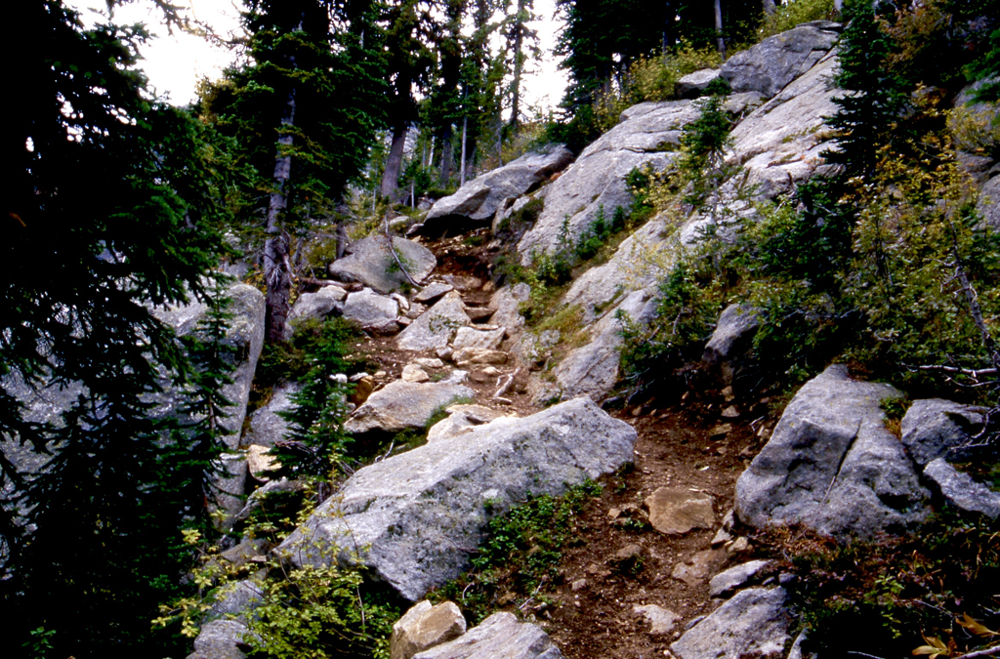
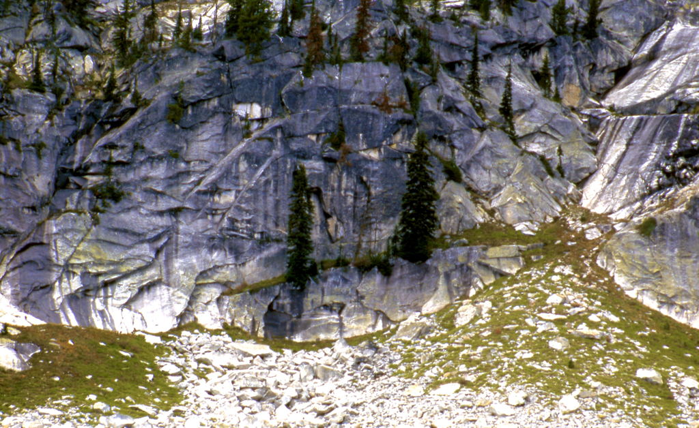
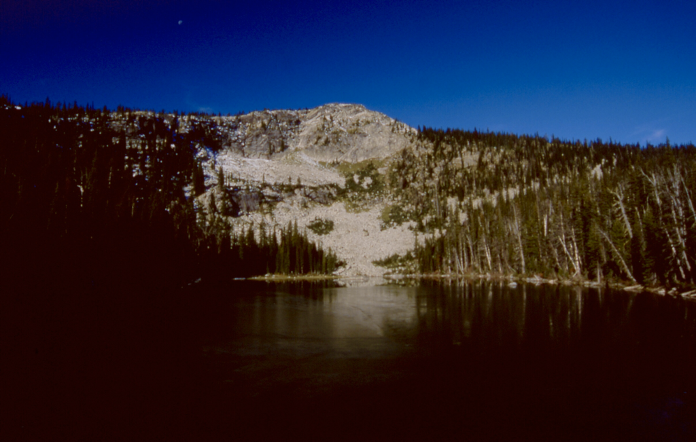
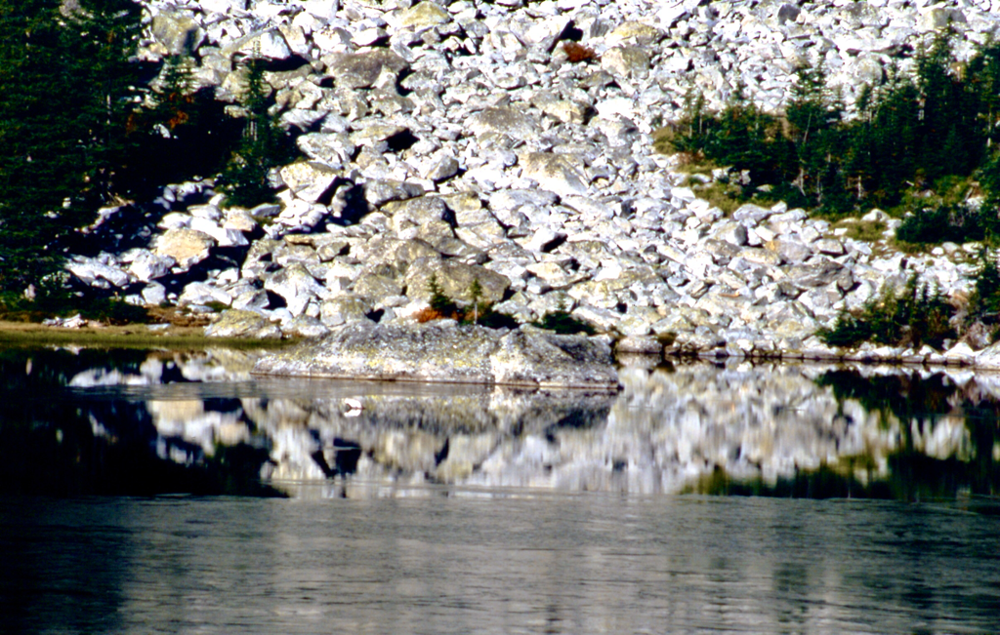
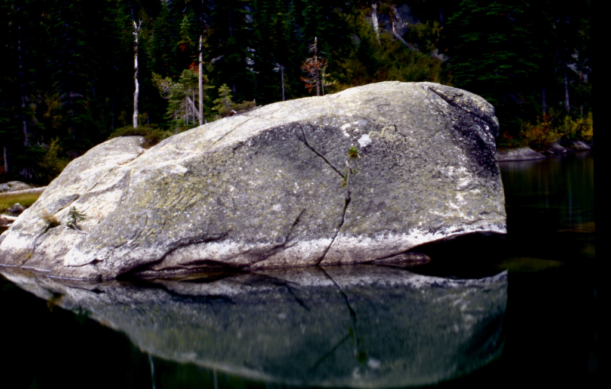
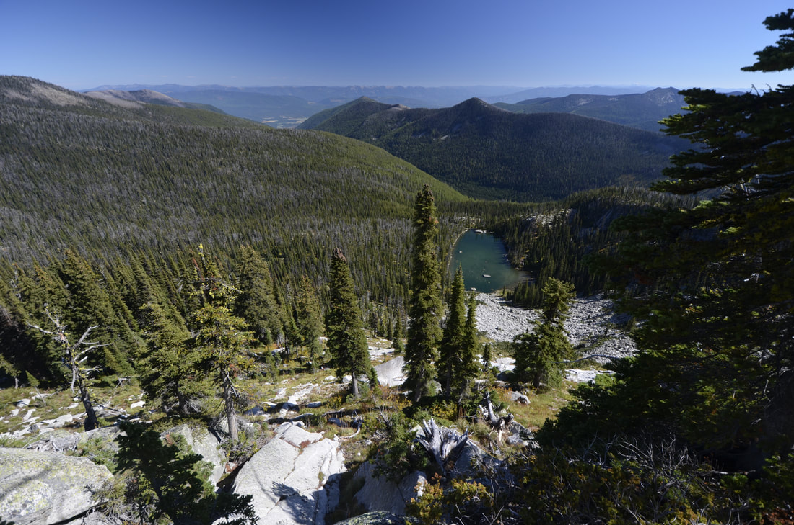
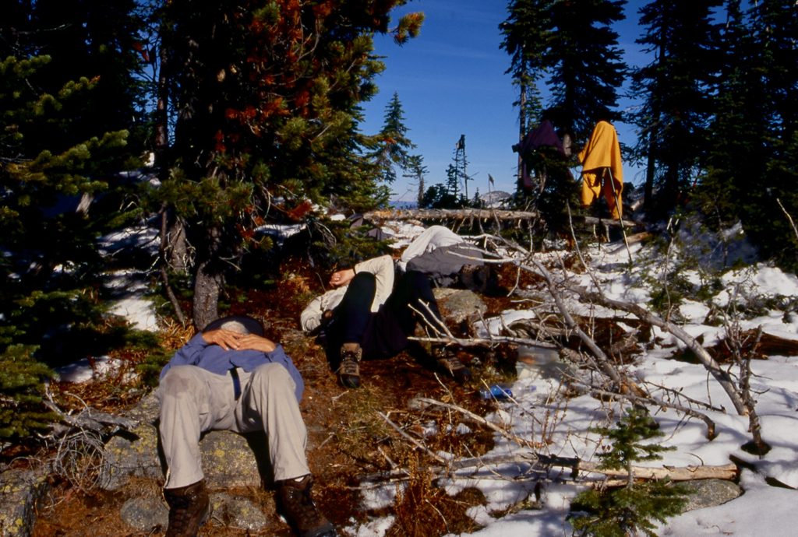
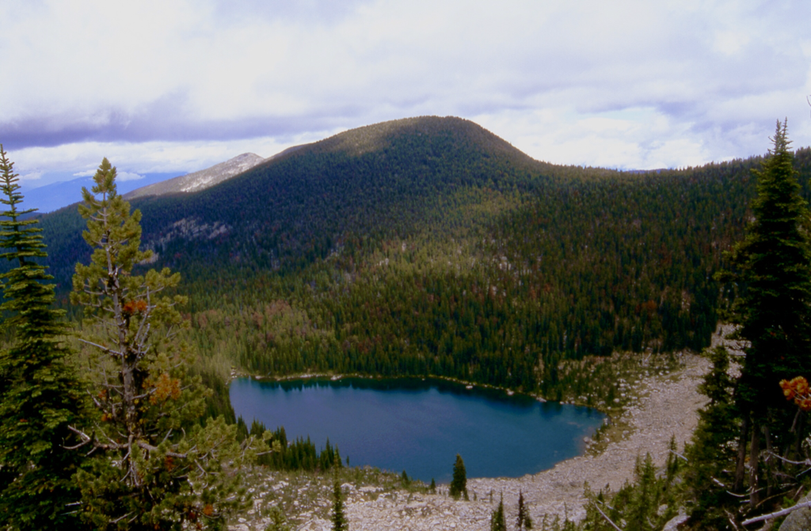

---
tags:
- Lakes
- Easy to Moderate
- Hiking
- Backpacking
stats:
- label: Event Type
  icon: hiking
  value: Hiking and Backpacking
- label: Distance
  icon: map-marker-distance
  value: Trout 7 miles RT, Big Fisher 12 miles RT
- label: Elevation
  icon: terrain
  value: 2343' gain 1032' loss
- label: Acres
  icon: vector-square
  value: '6.1'
- label: Difficulty
  icon: speedometer
  value: Easy to Moderate
- label: Maps
  icon: map
  value: IPNF - Kaniksu N.F., USGS - Pyramid Peak, ID
- label: GPS
  icon: crosshairs-gps
  value: 48° 48’ 19.7"n 116° 35’ 57.7"w
- label: Ranger District
  icon: pine-tree
  value: Bonners Ferry R.D. 208.267.5561
- label: Boundary County Sheriff
  icon: shield-account
  value: 911 or 208.267.3151
notes:
- Idaho panhandle national forest/alerts
- <https://www.fs.usda.gov/alerts/ipnf/alerts-notices>
---

# Trout 6352  Big Fisher 6732 Lakes Trail 13  41

## Description

From the Pyramid Lakes trailhead, take Trail # 13 for about 1/2 a mile to the trail sign in box, and take Trail #41 on the right towards Pyramid Pass. In about 2.75 miles the trail will come over a high point, and out in front of you is the Purcell Trench. From here the trail wonders thru a gigantic boulder field that you get to walk down the trail thru. At the lake there is a house size rock to sit on and enjoy the lake and Trout Peak behind it.

The trail to Big Fisher Lake continues NE from the lake for 2.5 miles and drops 654'.
Because the lake is shaded by a lesser peak at 7530', I stayed on the ridge and explored the area. Creston,B.C. can be seen to the north. Retrace your steps out.
We tried to scramble Trout Peak from the SE, but couldn't find a way. From the trail to Trout, scramble the scree slope before the boulders down to the lake.

## Hazards

None of note

## Directions

Pass the Kootenai National Wildlife Refuge, NW of Bonners Ferry, on FR 417, also called West Side Road, for 10 miles to the Trout Creek Road #634. Turn left (west) and drive 9 miles to the trailhead.

## Cool things close by

Pyramid Pass & Peak, Long Mountain Lake & Peak, Kootenai National Wildlife Refuge, Sandpoint and Pend Orielle Lake.

## R & P

Jalapeños, Mr. Sub, Burger Express, Eichardt’s in Sandpoint

---

## Plan your trip

[Click for Current NOAA Weather Conditions](https://www.nws.noaa.gov/wtf/udaf/MapClick.php?lel=4500&uel=8000&polygon=48.753%2C-116.673%2C48.853%2C-116.666%2C48.853%2C-116.495%2C48.761%2C-116.488%2C&area=54)

*Picture (Image missing)*

*Picture (Image missing)*

## Photo gallery

## Along the rocky trail to trout lake

---

## Cliffs above the trail to trout lake

---

*Picture (Image missing)*

## Trout lake & peak from the south east.  image by chris herath

## Trout lake

---

## Trout lake in late fall, with ice on the lake

---

## The whale breaching the surface of trout lake

---

## Trout lake from trout peak

Taking a nap, after lunch in the sun above big fisher lake. this was the only dry spot to take a nap

---

## Big fisher lake, with the selkirk’s highest point 7709’ above

Today we hiked a spectacular trail to Trout Lake. It wasn't nessecarily  steep or long. But it was especially beautiful. Along the trail were large granite boulders, ancient stands of trees, and fall colors. As we approached Trout Lake, the boulders became the size of mansions. The trail descends steeply and winds around boulders, until the lake below, comes into view. As we walked to the lake , we climbed onto a large, nearly flat boulder for a platform for photography. Three quarters of the lake was frozen over,  while the remainder was mirror smooth. High behind the lake, Peak 7500' stands proud. With many cliffs making up the face , and an occasional  patch of sub-alpine fir, this peak is majestic. The trail continues on past the lake, and slowly climbs  a remarkable ridge to a saddle above Big Fisher Lake. Just before the saddle we encounter 6 inches of snow. We continue on to Peak 7484' for views and a place to enjoy our lunch. North of the summit and about 20 vertical feet below, I found the only non snowy spot.  After a few pictures, we settle down to ham and cream cheese sandwiches.  It wasn't long before we all found our spot for a nap. I don't know how long we slept, but the warm sun and still air acted like a sleep aid. When I woke, I set my camera on my tripod, used the 10 second delay, and laid  down in my spot for the image. Soon it was time to head down.  Before we left Peak 7484'  I shot a long distant photo of Fisher Peak in the Canadian Rockies west of Cranbrook, and the many peaks of the American Selkirks all around us. This 11 mile round trip hike soon became my favorite trail. On the way out we had views of the Seven Sisters in line, with Chimney Rock off to the west.                                              chic  10.18.11
