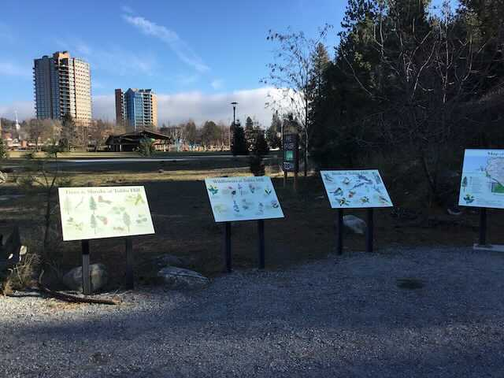
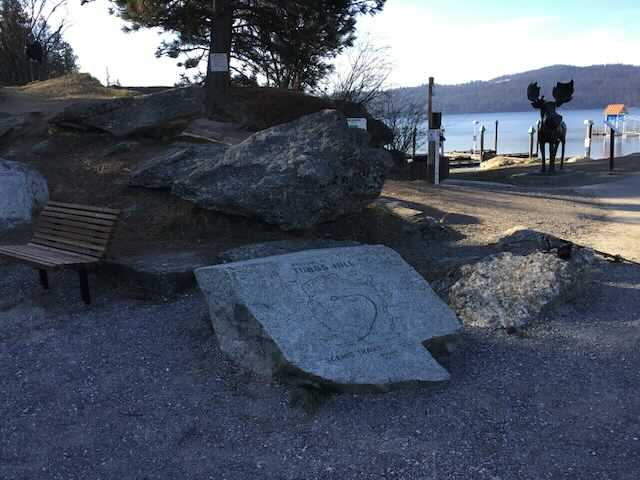
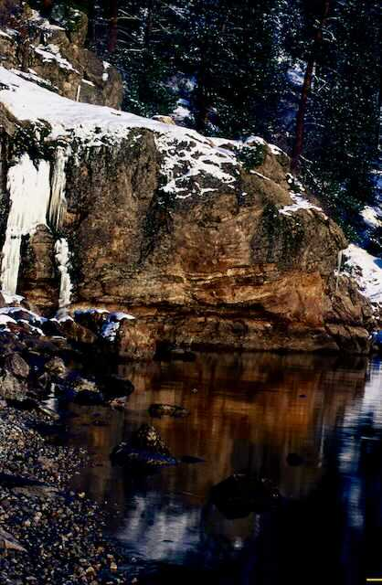
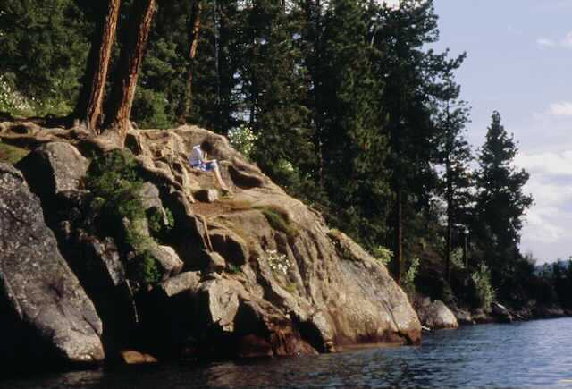
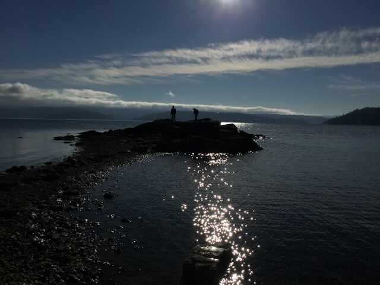
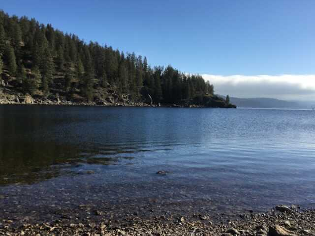
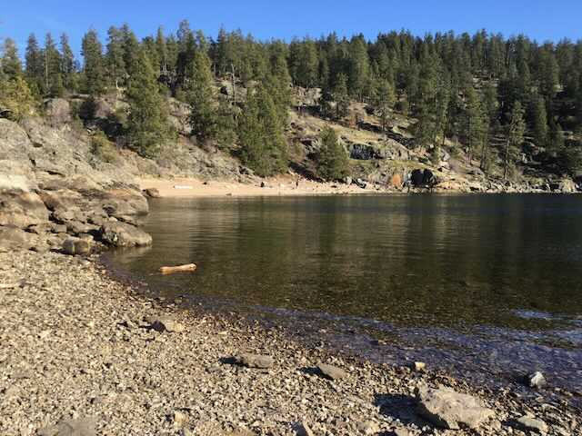

---
tags:

- Trails & Scrambles

- Easy

- Day Hiking

- Scrambling

- Climbing

- Rock Diving

- Kayaking

- Sun Bathing

stats:

- label: Event Type
  icon: hiking
  value: day hiking, scrambling, climbing, rock diving, kayaking, sun bathing, and
    good old fashion loafing.

- label: Distance
  icon: map-marker-distance
  value: up to 2.4 miles

- label: Elevation
  icon: terrain
  value: up to 300/verts

- label: Difficulty
  icon: speedometer
  value: easy

- label: Maps
  icon: map
  value: INNF, Tubbs Hill Foundation Guided map, CDA Topo

- label: GPS
  icon: crosshairs-gps
  value: West trailhead 47°40’ 13" N 116°46’54"/W East trailhead 47°40’01" N 116°46’19"
    W

- label: Kootenai County Sheriff
  icon: shield-account
  value: 911 or 208.446.1300
notes:

- RANGER DISTRICT. CDA River R.D. 208.769.3000
---

# Tubbs Hill

## Description

We have added the areas sheriff’s emergency phone numbers for each trip write up under the ranger district info. if an emergency ocurrs, evaluate your circumstances and call only if needed.Idaho is a vast state of forests and cities. Coeur d'Alene Idaho is a medium sized city with over 43,000 residents living there year round. Visitors to this region have the option of taking hikes up the Tubbs Hill Nature Trails. The trails were named for Tony A. Tubbs. He was an immigrant from Germany who came to the Coeur d'Alene region in 1882. Tubbs became the first Justice of the Peace and built the first hotel of the city. Publicly he owned 135 acres of land. During his life he left most of the land untouched, allowing it to be accessible only on foot. Later on Coeur d'Alene city bought acres from the Tubbs family in four purchases. The first purchase was for 33 acres in 1936. Eventually by 1977 the city had bought four plots of land of 33 and 34 acres. The acres bought were incorporated into a state park system, with Tubbs Hill being the main focus. The most popular trail on the Tubbs Hill Nature Trails map is a two mile loop. The two mile loop takes hikers up the hill around to some of the best scenic viewpoints, woodland habitats, and historical focal points. There are markers throughout the trail that will help visitors learn about the flora and fauna of the area. The trail head begins at the parking lot between McEuen Park and Coeur d'Alene Resort. The trail markers are 8 inches by 10 inches and posted about 8 feet above the ground. At the beginning of the trail is a map and informational brochure that offers information corresponding to these markers. The information could be about the scenic view, the tree type, an animal that hangs around the area, or anything else. Anyone going on the hiking loop should plan for at least two hours. Visitors should wear comfortable shoes, bring plenty of drinking water, and perhaps a camera. Visitors can also bring food for a picnic to certain areas, but they should be aware of the local animals and keep the food in appropriate containers. Some areas of the trail will be rocky and steep. Visitors are allowed to bring their leashed dogs to the trail as long as they bring along the scooper bags. Any visitor to the park trails should be hiking with a buddy, stay off the trails at night, and avoid wearing headphones in order to stay fully aware. No hiker should step off the designated trail, especially in areas that are rocky and steep. Safety is the hiker's responsibility and using proper caution is important. Tubbs Hill overlooks Lake Coeur d'Alene. Boaters can bring their crafts to a small sandy stretch to hike the trails of the park. The overall park at Tubbs Hill is 120 acres, with trails branching off the loop for hikers who want a longer journey. There is no entrance fee for the park, but contributions are welcome to keep the park maintained and available for visitors.

Read more: <http://www.city-data.com/articles/Tubbs-Hill-Nature-Trails-Coeur-dAlene.html>

## Option 1

One of my favorite things to do on Tubbs Hill, is to scramble the shore line in the winter and spring while the water level is down sometimes by 8 feet.
This route can be dangerous because of slippery rocks, and Poison Ivy that grow next to the cliffs.

## Ootion #2

Mostly on the south face of Tubbs Hill are several nice climbing/bouldering rocks. They can be scrambled or technically climbed.

---

## Directions

From Spokane, drive on I-90 past Post Falls to Exit 11, the Northwest Blvd. Head SE on Nw Blvd, to the city center.
Tubbs Hill is located east of the CDA Resort.
From the 4th Street Exit #13 turn right (south) down 4th to the McEuen Park, and Tubbs Hill.

## Cool things close by

Canfield Butte, Marie Creek Trail, Wallace L. Forest Conservation Area, Mineral Ridge, Mount CDA’s Trail #257 & Trail #79, Chilco Mountain, Heyburn State Park, the Idaho Chain Lakes, English Point, and Cougar Bay a Nature Concervancy.

## Hazards

The trail on Tubbs Hill are rocky and have many tree roots to trip on. PLEASE USE CAUTION.

## R & P

Moon Time, Franklins Hoagies, the Mexican Food Factory, and the Trails End Brewery.

## Please everyone...heed this health alert

## Photo gallery

---

## From the start of this trail, signs will guide you and educate you

## THE 3rd STREET ENTERANCE TO TUBBS HILL

## Winter walks on tubbs hill can be very rewarding

---

---

## Tubbs hill isn’t just for diving, hiking, swimming, and climbing

---

## Marge & mike a. on the tubbs hill's beacon point

---

## The east shore of the southern bay, from tubbs hill point

---

## The bay on the south shore of tubbs hill

---
