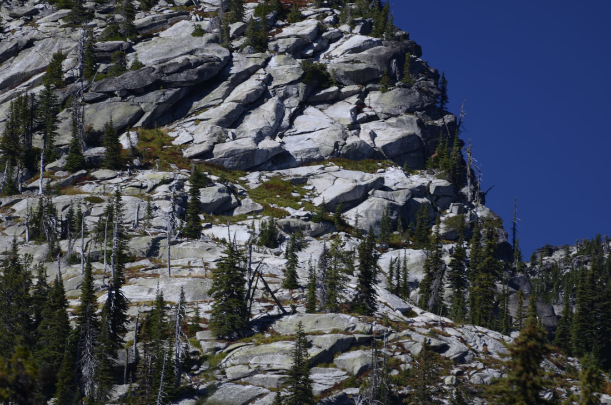
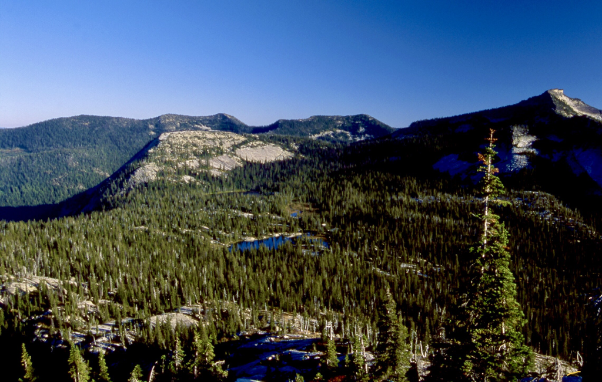
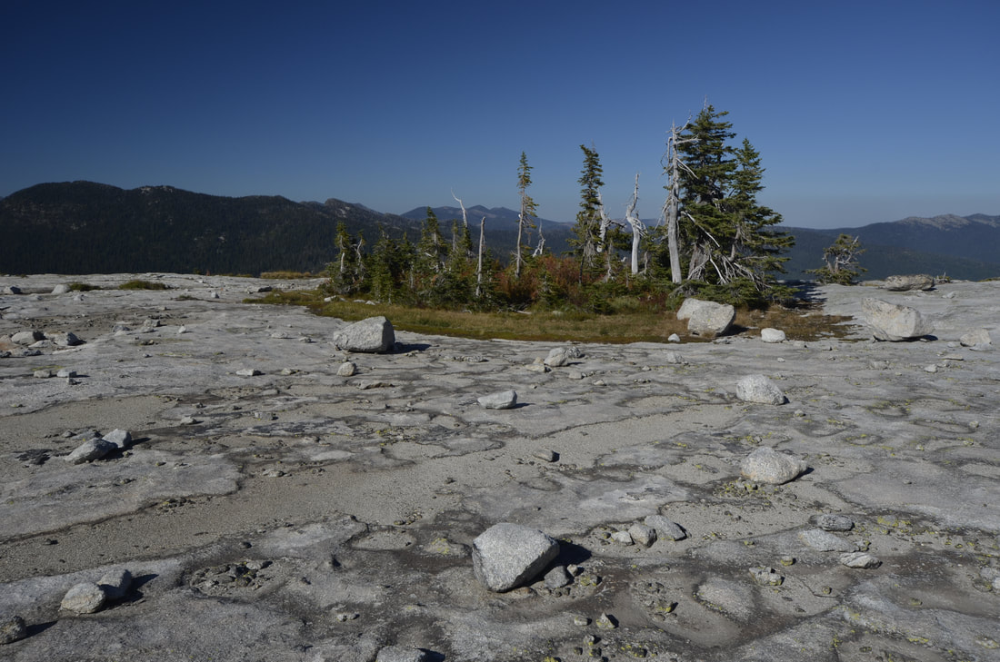
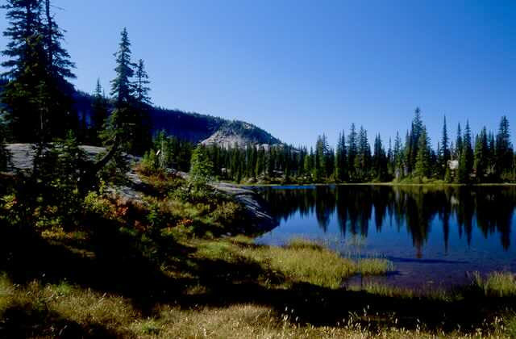
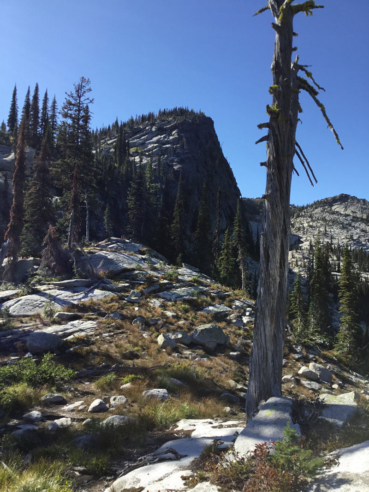
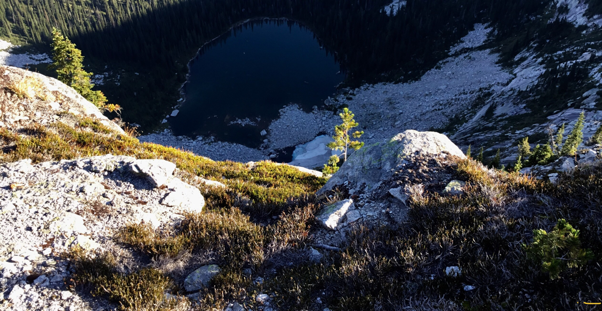
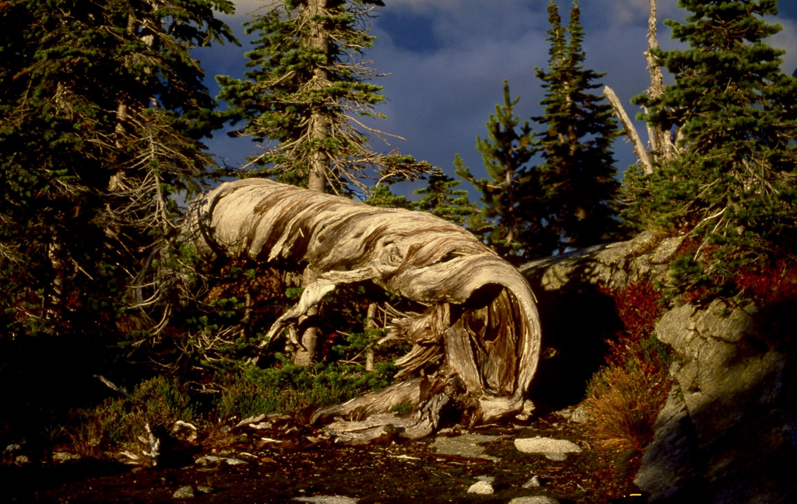
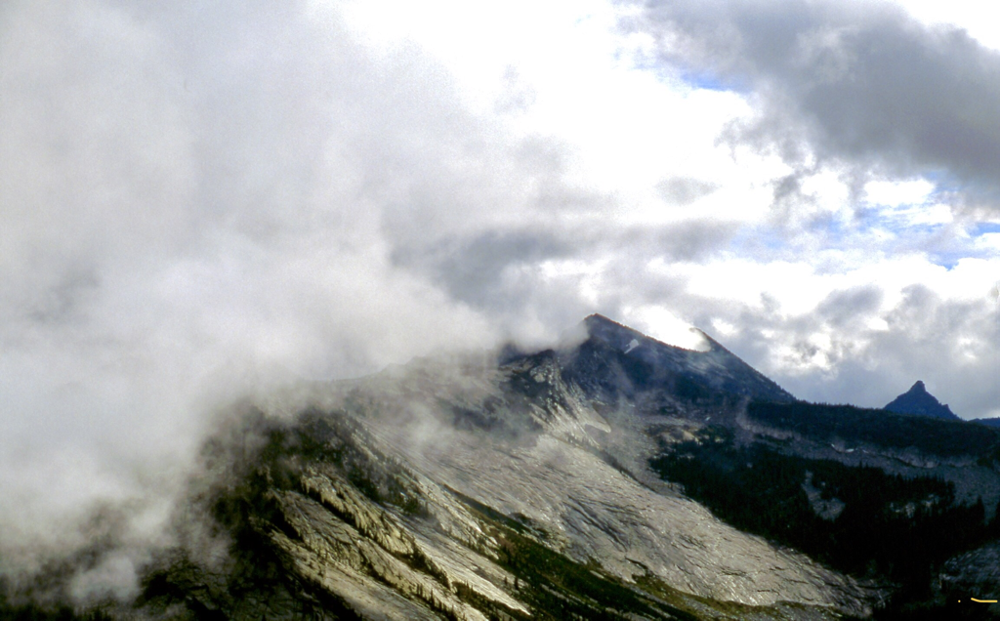

---
tags:
- Lakes
- Easy to Moderate
- Day Hiking
- Backpacking
- Scrambling
stats:
- label: Event Type
  icon: hiking
  value: Day hiking, backpacking, scrambling
- label: Distance
  icon: map-marker-distance
  value: 9 miles RT to Upper Two Mouth Lake
- label: Elevation
  icon: terrain
  value: 1790 verts
- label: Difficulty
  icon: speedometer
  value: Easy to moderate
- label: Maps
  icon: map
  value: I.P.N.F., Kaniksu N.F., The Wigwams topo
- label: GPS
  icon: crosshairs-gps
  value: 48°42’36" n 116°39’13" w
- label: Ranger District
  icon: pine-tree
  value: Bonners Ferry R.D. 208.267.5561
- label: Boundary County Sheriff
  icon: shield-account
  value: 911 or 208.267.3151
notes:
- Idaho panhandle national forest/alerts
- <https://www.fs.usda.gov/alerts/ipnf/alerts-notices>
---

# Two Mouth Lakes 5785

!!! warning "Before you go"

    A friend told me that this hike has a new trailhead,  .25 miles beyond the old trailhead

*Two mouth lakes 5785'.  trail #268*

## Description

The trail skirts over towards the Peak Creek drainage and does a switchback to the SE. Once back in the Slide
Creek
drainage, the trail follows Slide Creek all the way to the lakes basin. Many times along this trail, the USFS
has built
walkways to protect the many small streams and marsh areas. At about 3.75 miles in, the trail reaches the high
point at
6150'.
As the trail drops down into the Two Mouth Lakes Basin, you know you are in a special place. Its only 1/2 a
mile to the
lower lake, so bear right at the "Y". The Two Mouth's basin is huge, with towering peaks, rolling granite
fields, and
the sense of seclusion. Lower Two Mouth is unique in that it has several bays that jut away from the main
body, and hold
many photo ops. Please take care to not disturb the shore line and vegetation. At some time you will get a
glimpse of a
towering peak with a vertical north face to the NNE. This is a peak along a long ridge that runs NW to The
Wigwams. Plan
on scrambling this peak. The ridge line skirts the Kent Lake basin high above.
Back at the lakes basin, the upper lake is a nearly round lake that, is bigger and deeper than the lower lake.
If you
remember the view of the Beehive Dome from the parking area, you can stand on it with little effort. But its
the granite
field towards Harrison Peak that will require your presence. This nearly level field is one of two in the
Selkirks. Its
about the size of two football fields, but much prettier. Scattered around the field are VW size boulders and
every once
in a while, a small Sub-Alpine Fir is circled by a mat of greenery that will amaze you. This granite field is
unique and
should not be missed.
Harrison Peak stands to the south, and the hook nose is very obvious.

## Option #1

Kent Ridge
If you decide to scramble this peak, look for the second "gully" from the cliffs edge. Its safer. As you
summit the
ridge at 7001', the views intensify beyond expectations. Kent Lake lies 1358' below, while Kent Peak 7243'
lies NW of
the lake. Now the real fun starts. Continue along this ridge due west as far as desired. Along the trail
there's an old
snag lying on the ground. Its twisted and hollow, and one can imagine it being an a giant's esophagus that's
been ripped
out and discarded. But lets continue west on this ridge. You will come to an open area on the ridge that
sports one of
the most spectacular views in the American Selkirks. You will be looking due south down the Selkirk Crest. All
the major
peak are lined up like zipper teeth. Don't miss this view.
In 2019 a hiking buddy and I did a rare backpack from Two Mouth to The Wigwams. I got to tell you...this was
the most
spectacular hike I’ve ever done in the American Selkirks. It’s about 8 miles one way. DO NOT TAKE CHILDREN ON
THE HIKE
ABOVE TWO MOUTH LAKES.

## Directions

From the Kootenai National Wildlife Refuge NW of Bonners Ferry, drive 1.5 miles north on West Side Road (417)
to the
Myrtle Creek Road #633. Turn left (west) for 10 miles bearing left to the trailhead.

## Hazards

The trail has several boggy areas. Please stay on boardwalks to protect these sensitive areas.
The trail can be rough and uneven, so use caution.
Once at the lakes, please treat the shore line with great care, and practice good food handling and storage.

---

## Cool things close by

The Kootenai National Wildlife Refuge, the Purcell Trench,Myrtle Peak, Harrison Lake & Peak, Kent Lake ridge,
The
Wigwams, and the Two Mouth Lakes basin.

The Kootenai National Wildlife Refuge, the Purcell Trench, Myrtle Peak, Harrison Lake & Peak, Kent Lake Ridge,
The
Wigwams, and the Two Mouth Lakes Basin.

## R & P

Jalapeños, Eichardt's, Burger Express, Mr. Sub in Sandpoint

---

## Photo gallery

*Picture (Image missing)*

---

*Picture (Image missing)*

## The peak above kent lake from lower teo mouth lake. image by chris herath

---

The unnamed peak to the ne of first two mouth lake The ascent of this face is left of center of the image
Image by chris
herath

*Picture (Image missing)*

## Myrtle's turtle from the trailhead

*Picture (Image missing)*

## Above the unnamed peak on the way to the wigwams image by chris herath

Two mouth lakes basin with myrtle’s turtle in background On top of myrtles turtle is a lunar landscape

---

*Picture (Image missing)*

## 0ne of three lunar landscape. it sits atop myrtle's turtle

## The lunar landscape atop myrtle's turtle image by chris herath

*Picture (Image missing)*

## Another image of the lunar landscape above myrtle's turtle. image by chris herath

## Lower two mouth lake and its beautiful shore line

---

*Picture (Image missing)*

## One of the deep bays west of the main body of the lake

## Unnamed peak above kent lake

## Kent lake below the summit ridge

## Use your imagination. two giants fighting, one ripped this esophagus out and discarded it

## A clearing storm along the selkirk crest from above two mouth lakes
