---
tags:
- Lakes
- Moderate
- Day Hiking
- Backpacking
- Scrambling
stats:
- label: Event Type
  icon: hiking
  value: Hike, Backpack and Scramble
- label: Distance
  icon: map-marker-distance
  value: 9 miles one way, or 14 RT to Two Mouth Lakes.
- label: Elevation
  icon: terrain
  value: Trail high point 1770' gain. High point to Lower Lake 365' loss.
- label: Acres
  icon: vector-square
  value: '3.4'
- label: Difficulty
  icon: speedometer
  value: Moderate
- label: Maps
  icon: map
  value: IPNF - Kaniksu N.F., USGS - Roman Nose, ID
- label: GPS
  icon: crosshairs-gps
  value: 48° 43’ 13.3"n 116° 37’ 30.3"w
- label: Ranger District
  icon: pine-tree
  value: Bonners Ferry R.D. 208.267.5561
- label: Boundary County Sheriff
  icon: shield-account
  value: 911 or 208.267.3151
notes:
- label: Idaho panhandle national forest/alerts
  url: '#'
- url: https://www.fs.usda.gov/alerts/ipnf/alerts-notices
---

# Two Mouth Lakes To The Wigwams High Traverse

## Two mouth lakes to the wigwams high traverse trails 286

## Description

The trail skirts over towards the Peak Creek drainage and does a switchback to the SE. Once back in the
Slide Creek drainage, the trail follows Slide Creek all the way to the lakes basin. Many times along this
trail, the USFS has built walkways to protect the many small streams and marsh areas. At about 3.75 miles
in, the trail reaches the high point at 6150'. As the trail drops down into the Two Mouth Lakes Basin, you
know you are in a special place. Its only 1/2 a mile to the lower lake, so bear right at the "Y". The Two
Mouth's basin is huge, with towering peaks, rolling granite fields, and the sense of seclusion. Lower Two
Mouth is unique in that it has several bays that jut away from the main body, and hold many photo ops.
Please take care to not disturb the shore line and vegetation. At some time you will get a glimpse of a
towering peak with a vertical north face to the NNE. This is a peak along a long ridge that runs NW to The
Wigwams. Plan on scrambling this peak. Back at the lakes basin, the upper lake is a nearly round lake that
is bigger and deeper than the lower lake. If you remember the view of the Beehive Dome from the parking
area, you can stand on it with little effort. But its the granite field towards Harrison Peak that will
require your presence. This nearly level field is unique in the Selkirks. Its about the size of two football
fields, but much prettier. Scattered around the field are VW size boulders and every once in a while, a
small Sub-Alpine Fir is circled by a mat of greenery that will amaze you. This granite field is unique and
should not be missed. My life long friend, Chris Herath, named these features "Lunar Landscape" Harrison
Peak stands to the south, and the hook nose is very obvious.

## Directions

From the Kootenai National Wildlife Refuge NW of Bonners Ferry, drive 1.5 miles north on West Side Road
(417) to the Myrtle Creek Road #633. Turn left (west) for 10 miles bearing left to the trailhead.

---

## Option #1

***Kent Ridge*** If you decide to the scramble this peak, look for a "gully" to the left about 200', from
the cliffs edge. Its

safer.

As you summit the ridge at 7001', the views intensify beyond expectations. Kent Lake lies about 1300' below,
while Kent Peak 7243' rises NW of the lake. Now the real fun starts. Continue along this ridge due west as
far as desired. Along the trail there's an old snag lying on the ground. Its twisted and hollow, and one can
imagine it being a giant's esophagus that's been ripped out and discarded But lets continue west on this
ridge. You will come to an open area on the ridge that sports one of the most spectacular views in the
American Selkirks. You will be looking due south down the Selkirk Crest. All the major peaks are lined up
like saw teeth. Don't miss this view.

## Hazards

Some parts of the trail are soggy, so use care not to damage these sensitive areas. An alternative trail has
been created. follow the arrow. Along the shore line be extra careful of this sensitive area. When you walk
the ridge out to or from The Wigwams, BE SURE TO NOT WALK CLOSER THEN 10’ FROM THE EDGE. If you want to look
down over the edge, lay down and creep towards the edge. PLEASE BE SAFE.

---

## Cool things close by

The Kootenai National Wildlife Refuge, the Purcell Trench, Myrtle Peak, Harrison Lake & Peak, Kent Lake
Ridge, The Wigwams, and the Two Mouth Lakes Basin.

## R & P

Jalapeños, Mr. Sub, Burger ExpressEichardt’s in Sandpoint

### Picture (Image missing)

## Photo gallery

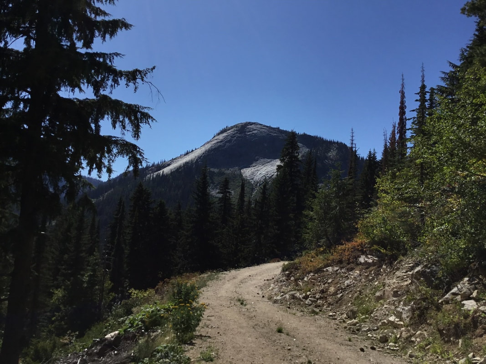

Because of logging, the actual trail starts up this logging road. the granite dome is called myrtle’s turtle

---

### Picture (Image missing) Details

## Harrison peak from along the trail to two mouth lakes area

---

### Picture (Image missing) Details (2)

## A high prominence above kent lake that you get to scramble

---

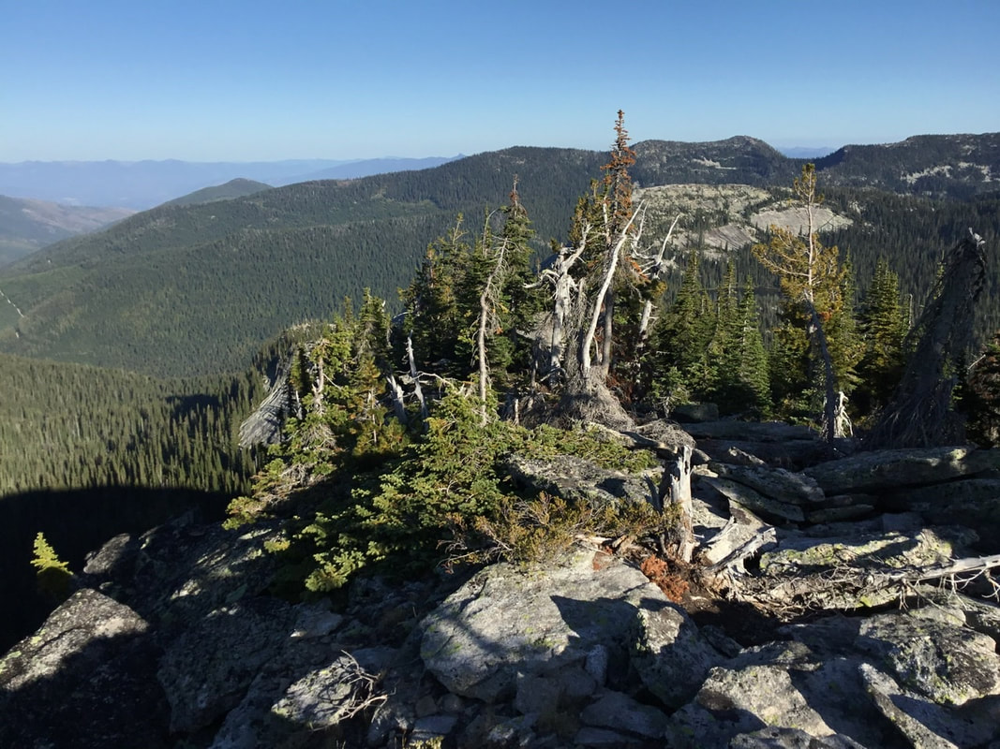

## Along the east to west ridge line to the wigs

---

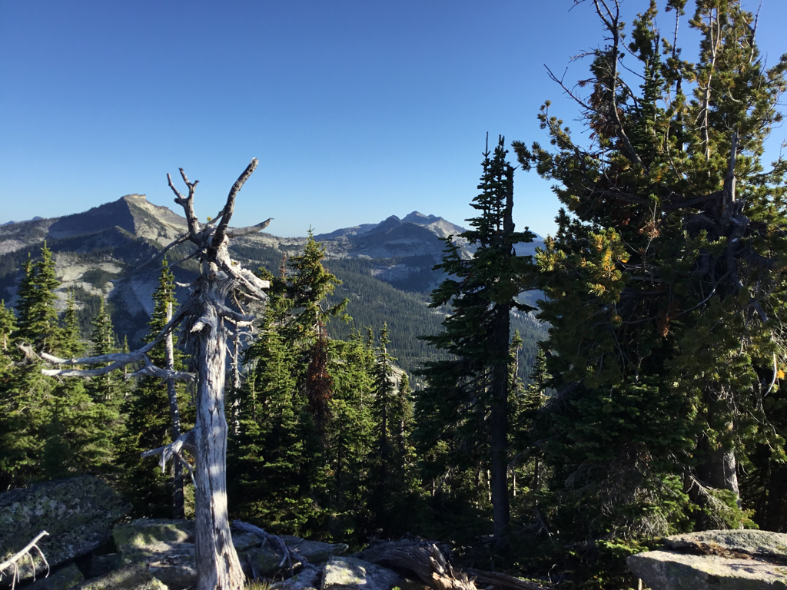

## Harrison peak and other peaks including the twins of the seven sisters

### Picture (Image missing) Details (3)

## The approach to near the camp site

### Picture (Image missing) Details (4)

## A side ridge along the east to west ridge

---

### Picture (Image missing) Details (5)

The previous image ridge on the left In the center is the first lunar landscape on top of myrtles turtle

---

### Picture (Image missing) Details (6)

## Near the camp site with harrison peak & some of the seven sisters

---

### Picture (Image missing) Details (7)

## Chris coming up the last section to the camp site

---

## Our dinner site with a sunset, above kent lake 7.23-24.2022 Image by vanette leighty

### Picture (Image missing) Details (8)

### Picture (Image missing) Details (9)

## The wigwams at sunset from the camp site

---

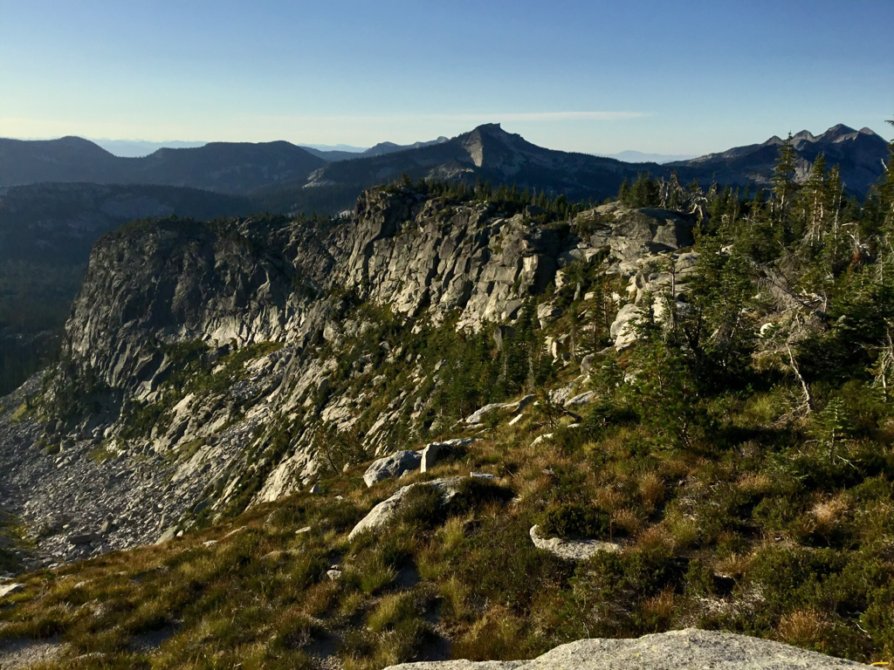

## The morning sunrise near camp site with some of the seven sisters in back

---

### Picture (Image missing) Details (10)

## A south to north ridge along the east to north route

---

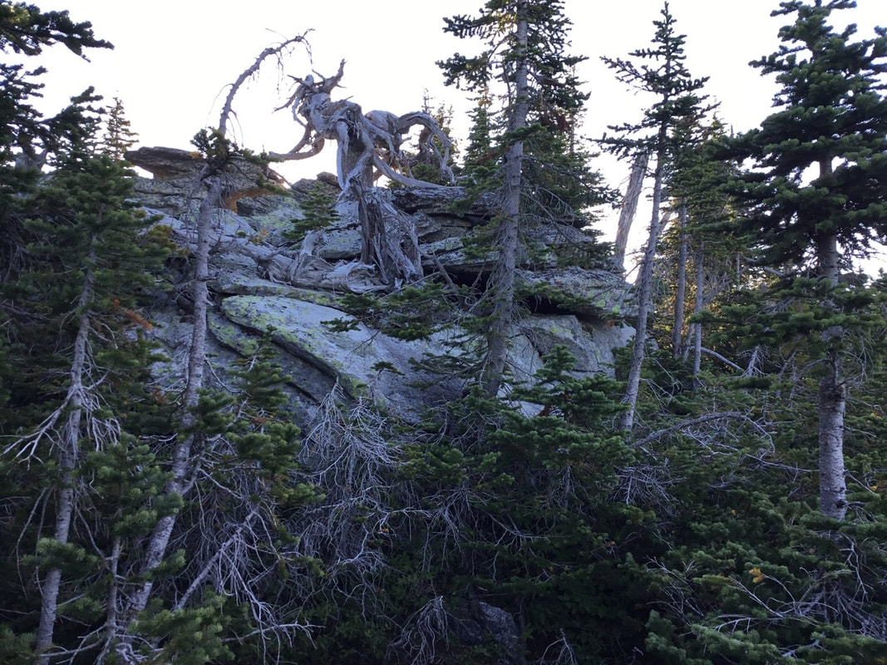

## As you come to these trees, descend around them, re-ascend and continue

---

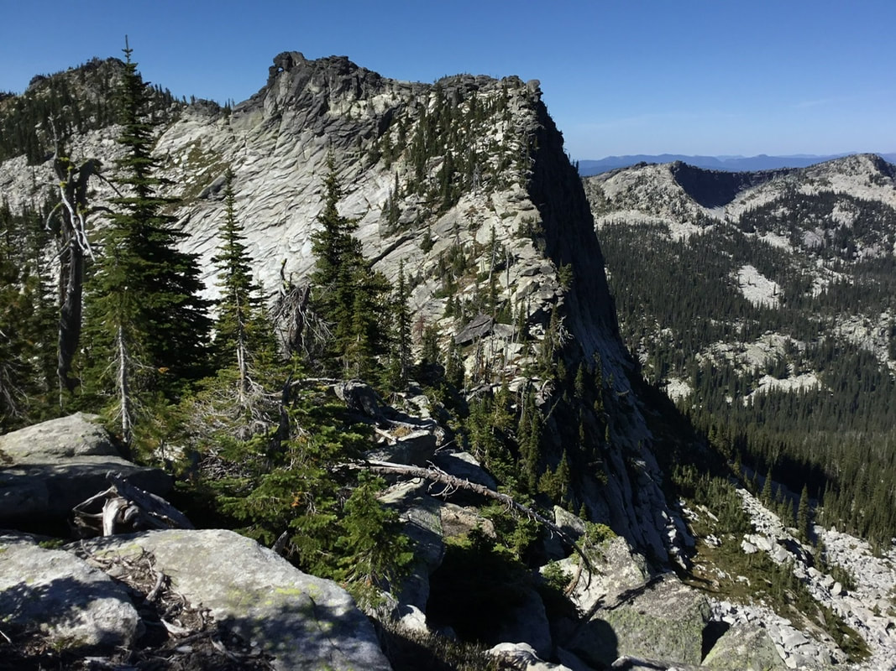

## Large prominences that we avoided by dropping below

---

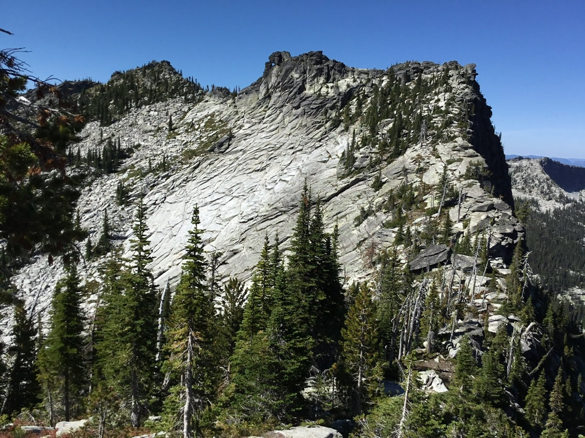

## Walk down to this wall and drop down around it,  to the left

---

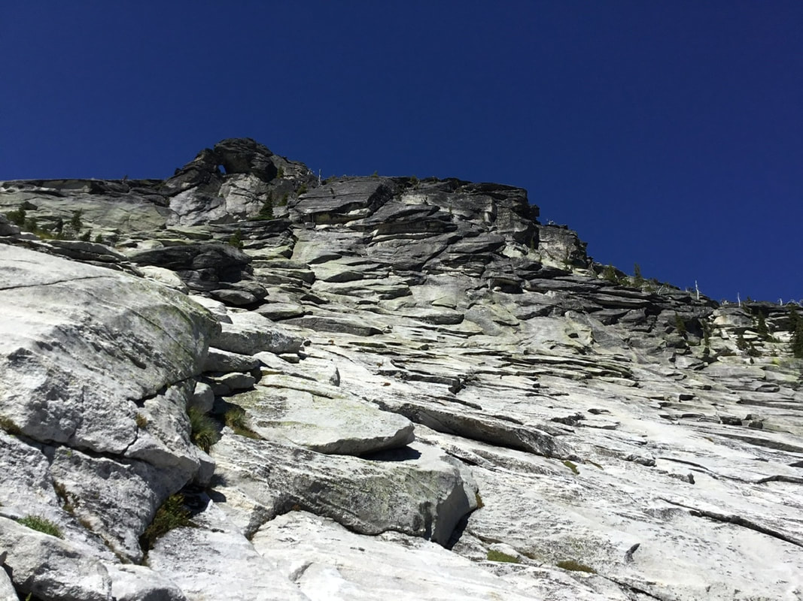

## The wall, last two images, from below

---

### Picture (Image missing) Details (11)

## The route is along the rock face on left in the grass

---

### Picture (Image missing) Details (12)

## A hole in the summit block

---

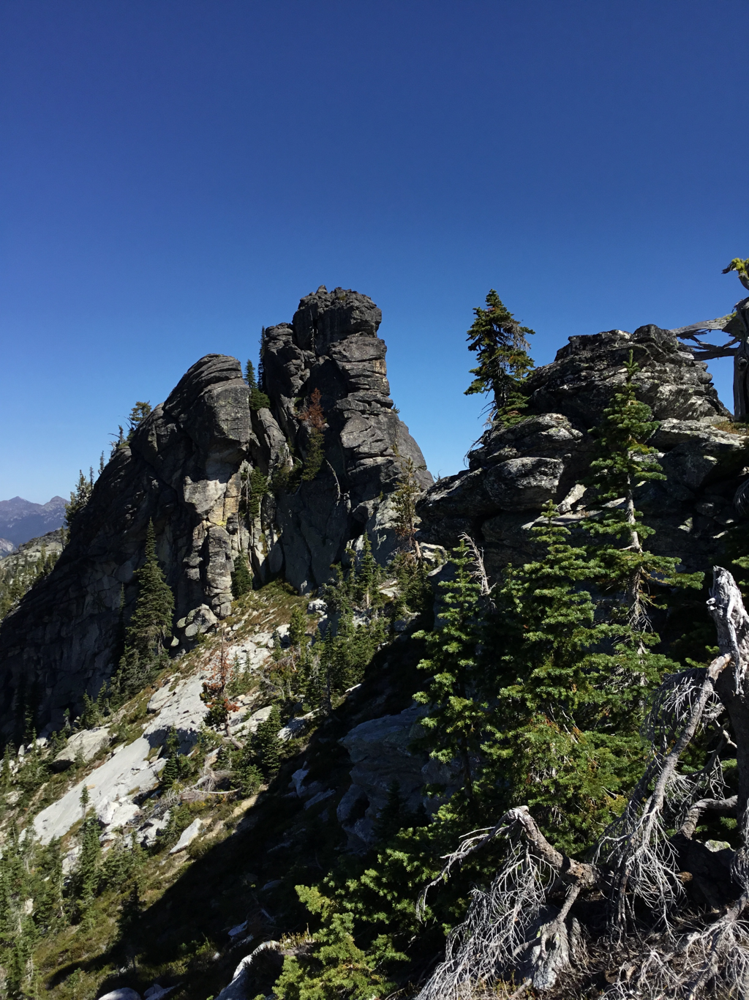

## Cool rocks just past the wall

---

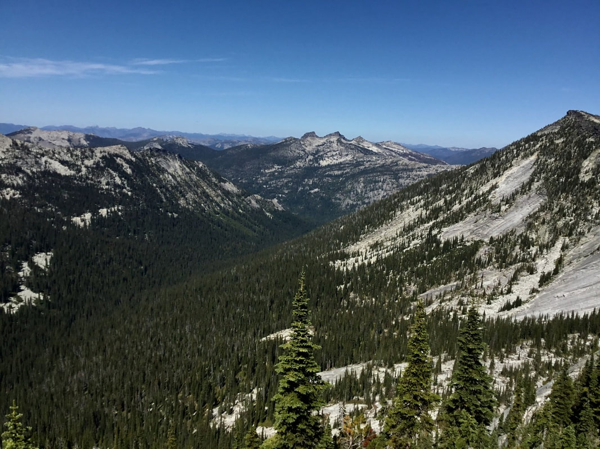

## Lion head and its nearby peaks, looking nne

### Picture (Image missing) Details (13)

## Along the wigs route, with the wall back left

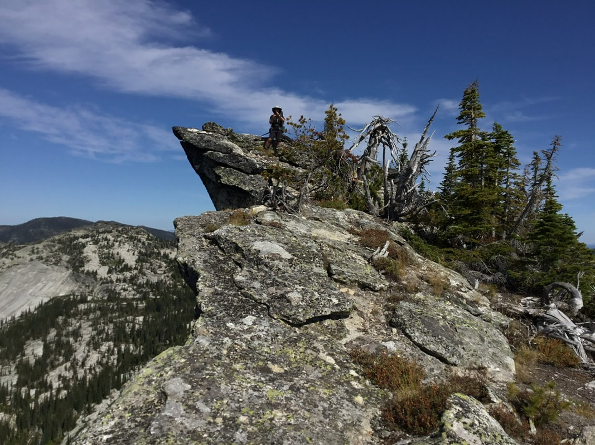

## The edge, from here to the wigs is along this route

---

### Picture (Image missing) Details (14)

## The wigs are at the end of this ridge line

---

### Picture (Image missing) Details (15)

## Chris walking up to the wigwams

A path sometimes goes somewhere, sometimes nowhere. But always a path leads one to enlightenment to peace to
better health. chic. 9.13.11
