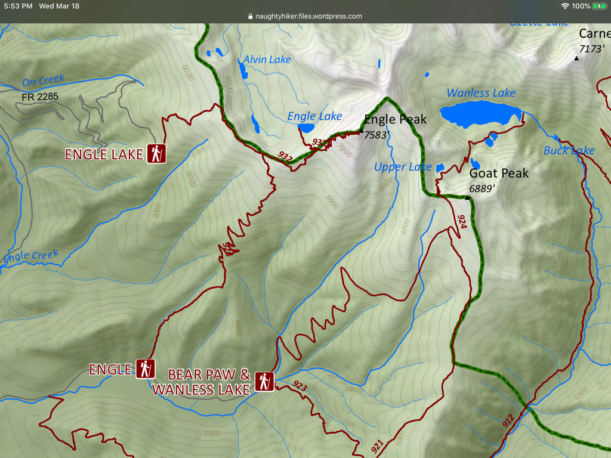

---
tags:
- Lakes
- Strenuous
- Backpacking
- Camping
stats:
- label: Event Type
  icon: hiking
  value: Backpacking, camping, mountain lakes
- label: Distance
  icon: map-marker-distance
  value: 12.0 miles RT via Trail
- label: Elevation Gain
  icon: elevation-rise
  value: 2,800' gain
- label: Difficulty
  icon: speedometer
  value: Strenuous
- label: Maps
  icon: map
  value: Kootenai N.F. - Cabinet Mountain Wilderness USGS topo
notes:
- label: Kootenai National Forest Alerts
  url: https://www.fs.usda.gov/alerts/kootenai/alerts-notices
---

# Wanless Lake (Trail #912)

## Description

Wanless Lake is the largest mountain lake in the Cabinet Mountain Wilderness, spanning over 1.5 miles in
length and reaching depths exceeding 150 feet. Tucked beneath the sheer granite walls of Elephant Peak
(7,938') and Wanless Peak, the lake basin features old-growth western red cedars, crystal-clear water, and
primitive shoreline campsites.

## Route Description

The primary approach via Trail #912 begins along Swamp Creek and climbs steadily through mature pine and fir
timber before reaching the outlet spillway of Lower Wanless Lake. Continuing along the northern shore brings
hikers to the main body of Upper Wanless Lake.

## Photo Gallery

_Wanless Lake outlet stream and timber._

_Granite peaks reflecting across Wanless Lake._
