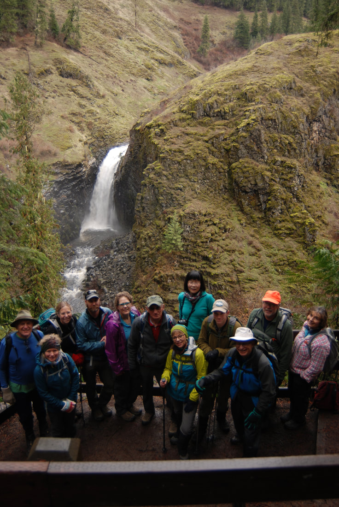
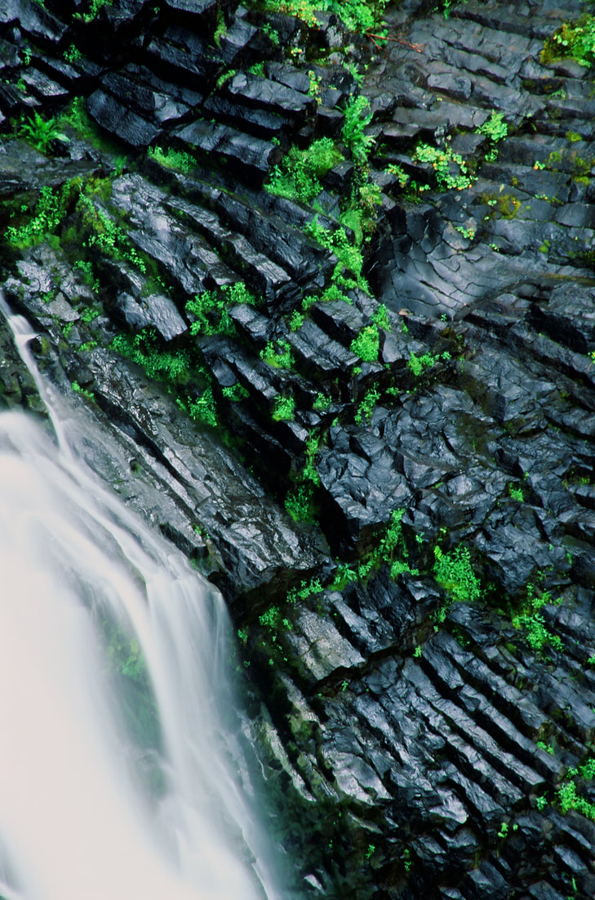
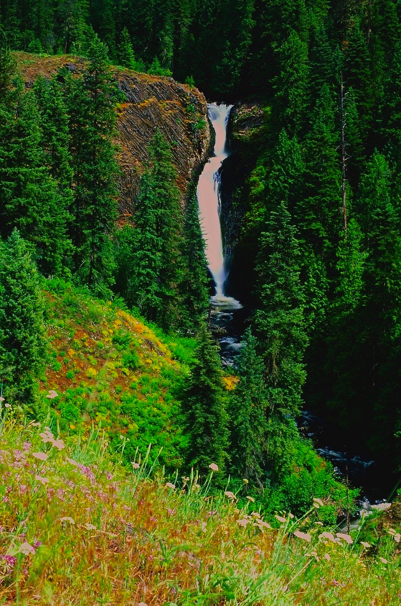
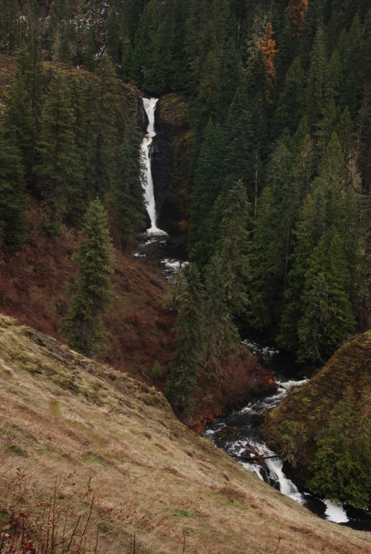
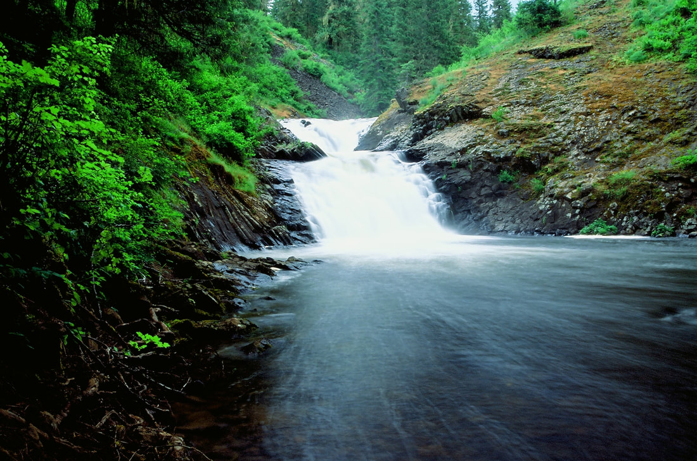
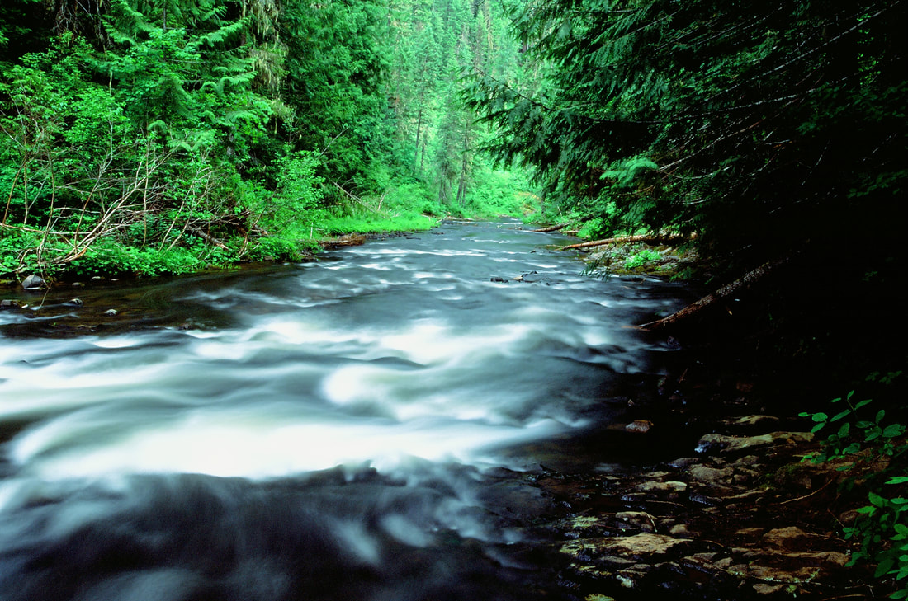
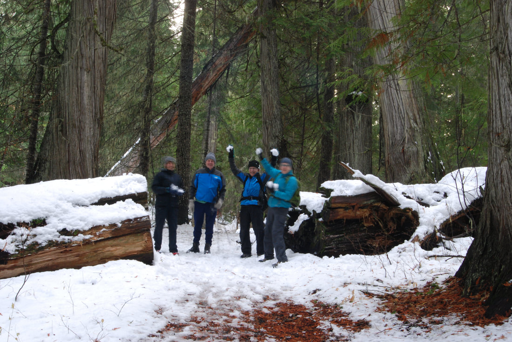
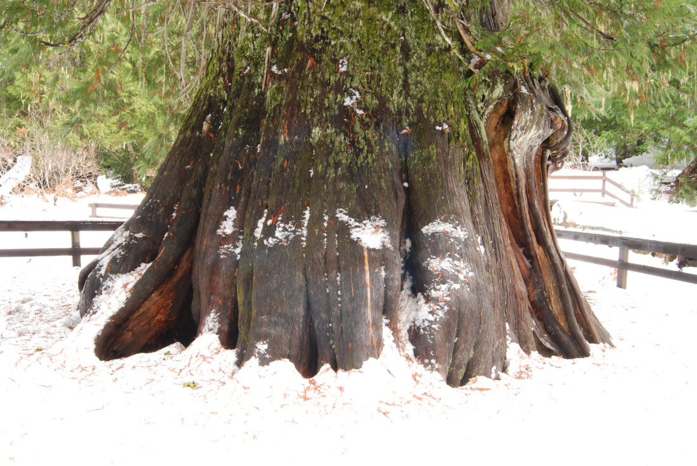
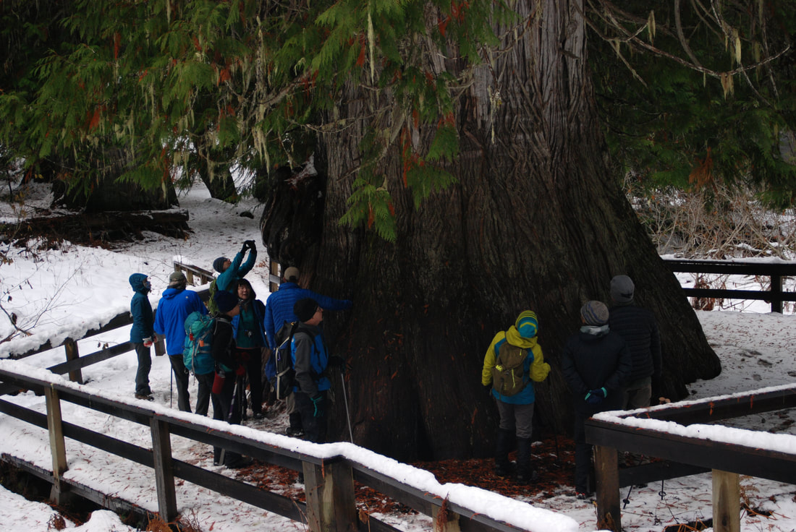
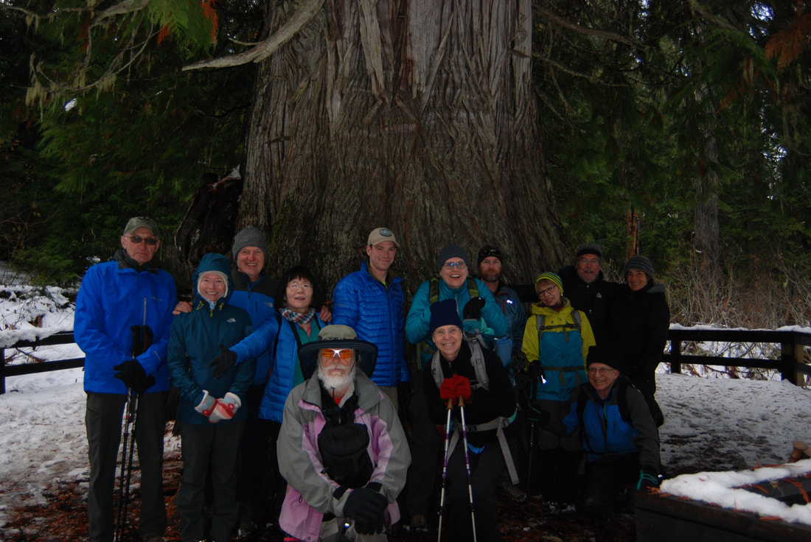

---
tags:
- Waterfalls stats:
- label: Waterfall icon: waterfall value: 'elk creek falls national recreation area trail #740'
- label: Drop icon: arrow-collapse-down value: VARIES FROM 20' TO ABOUT 70', with a total of 140 '
- label: Waterfall Type icon: waterfall value: Slide, tiered, plunge
- label: Distance Car to Falls icon: map-marker-distance value: Lower 4 Falls are about a mile. Middle Falls
  is about .3 of a mile, and the upper falls is about .4 miles
- label: Maps icon: map value: Clearwater National Forest, and the Palouse Ranger District. 208.875.1131
- label: GPS icon: crosshairs-gps
## value: 46°76’62" n 116°182′0″ w
## Elk Creek Falls Recreation Area
## Elk creek falls national recreation area trail #740, 745, 742, & 740a
## Description
Before i start this write up, you need to know that when its rainy or wet, this area can be very dangerous.
Please use extreme caution even in dry conditions. Keep a very close eye on your children in any season. do
not allow you or them to get too close to the edges.
From the parking area, head down Trail#740 to the info sign. Bear right on Trail #745 to the Lower Falls and
its overlook.
When you continue on, look for Trails#742, and turn right (NW) to a spur trail to a view point for the
Middle Falls.
Hike #742, past Trail #740, and look for another view point for the Upper Falls.
Along the way, you will notice several small falls well worth the effort to photograph.Then head north on
Trail 740A. If its a warm summer day, you can go for a swim below the Upper Falls. BUT IF YOU DO, TAKE
TENNIS SHOES, BECAUSE THE CREEK BED IS ROUGH.
## Option #1
Drive north past the town of Elk River on F.R 382 to the Old Growth Cedar Grove also named there Morris
Creek Cedar Grove. Some of the trees are 500 years old. The walk is short, but offers views of cool Cedar
trees.
## Option #2
Once done here, continue north to the Upper Basin Interpretive Trail.
## Option #3
But the big draw here is just a ways further on 382 to F.R. #4763. Turn right (SE) for a short distance, and
turn left (NE) onto F.R. #748 to the Giant Western Redcedar.
Do n0t miss this short walk. its as big a draw as the elk creek falls. Follow the trail thru some very large
cedars to one that will blow you away.. The U.S.F.S. built a deck around the base of this monster, because
people were climbing on it lower trunk and damaging it. Please do not allow your children to walk on the
tree.
---

# Elk Creek Falls Recreation Area

## Directions

From St.Maries, drive south on Hwy 3 past Wayland and turn left (E) staying on Hwy 3 thru Santa , Fernwood,
Emerald Creek and Bovil. At Bovil , turn onto Hwy #8 for about a mile west of Elk River, turn right at the
signs. From Hwy 8 drive south to the Elk Creek Falls parking area.

---

## Cool things close by

There is another falls wettish from Elk Creek called Bull Run Falls, bit I have never been there.

## Hazards

All waterfalls are a hazard, due to their slippery nature. always be extra careful near any waterfall. I
can't steress enough. keep your children away from the edges of these waterfalls view points.

## R & P

NA

---

## Plan your trip

Click for Current NOAA Weather Conditions

## Photo gallery

---

Tyler & shuwen's spokane mountaineers hike to elk creek in the background is lower elk creek falls

## Basalt sides of the lower elk creek falls

## The 70' middle falls in the spring

## The middle falls from the waters edge trail in the fall

## Upper elk creek falls and swimming hole

## Looking down stream from the upper elk creek falls

## A snowball fight broke out along the trail in

The giant redcedar. It is 3,000 years old, stands 177' tall and is 18' in diameter It wasn't found until
1979

## The gang was amazed at this natural wonder

## Of course, i had to take a group shot of the gang
